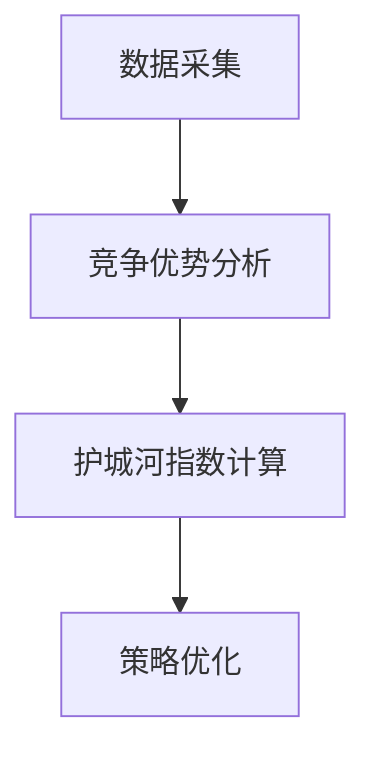

                 


# 彼得林奇的"护城河"理论在数字经济时代的演变

## 关键词：护城河理论，数字经济，竞争优势，彼得林奇，企业战略

## 摘要：  
彼得林奇的护城河理论是投资领域的重要理论，它强调企业竞争优势的核心要素。随着数字经济的快速发展，护城河理论也在不断演变。本文从护城河理论的起源出发，分析其核心概念和在数字经济时代的演变。通过具体案例和系统设计，探讨护城河在数字环境中的新特征和实现方式，最后总结护城河理论在数字经济中的应用策略。

---

## 第一部分: 彼得林奇的"护城河"理论概述

### 第1章: 护城河理论的起源与核心概念

#### 1.1 护城河理论的起源

**1.1.1 彼得林奇与护城河理论的提出**  
彼得·林奇是美国著名投资家，他在《竞争优势》一书中提出“护城河”概念。护城河是指企业竞争优势的持久性和难以被竞争对手复制的特质。林奇认为，具有宽广护城河的企业能够长期保持竞争优势，从而为股东创造超额价值。

**1.1.2 护城河理论的核心思想**  
护城河理论的核心是通过分析企业的竞争优势，判断其是否具有可持续的盈利能力。林奇认为，企业的护城河可以分为成本优势、品牌优势、技术优势和行业进入障碍四大类。

**1.1.3 护城河理论在投资中的应用**  
在投资实践中，林奇通过分析企业的护城河宽度，选择那些具有宽护城河的企业进行投资。他认为，只有具备宽护城河的企业才能在长期竞争中立于不败之地。

#### 1.2 护城河理论的核心概念

**1.2.1 护城河的定义与特征**  
护城河是企业在市场中建立的竞争优势，能够保护企业免受竞争对手的侵蚀。其特征包括可持续性、独特性和经济性。

**1.2.2 护城河的四个维度**  
护城河的四个维度包括：  
1. **成本优势**：企业通过规模经济或技术优势降低生产成本。  
2. **品牌优势**：强大的品牌可以帮助企业吸引更多的消费者。  
3. **技术优势**：拥有独特技术的企业能够保持竞争优势。  
4. **行业进入障碍**：通过专利、市场占有率等方式阻止竞争对手进入市场。  

**1.2.3 护城河与企业竞争优势的关系**  
护城河是企业竞争优势的核心，它决定了企业在市场中的地位和盈利能力。宽护城河意味着企业具有更强的竞争优势。

---

### 第2章: 护城河理论在数字经济时代的演变

#### 2.1 数字经济时代的核心特征

**2.1.1 数字经济的定义与特点**  
数字经济是指以数字化技术为基础的经济形态，其特点包括数据化、网络化和智能化。数字技术的广泛应用改变了企业的竞争环境。

**2.1.2 数字经济对企业竞争优势的影响**  
在数字经济时代，企业的竞争优势不再仅仅依赖于传统的成本或技术优势，数据和算法成为新的竞争优势来源。

**2.1.3 数字经济中的护城河新维度**  
数字经济时代，护城河的维度发生了变化，数据资产、网络效应和平台优势成为新的护城河要素。

#### 2.2 护城河理论的演变

**2.2.1 传统经济时代护城河的局限性**  
在传统经济时代，护城河理论的应用受到市场范围和技术限制，难以应对快速变化的市场需求。

**2.2.2 数字经济时代护城河的新变化**  
数字经济时代的护城河更加注重数据和技术的结合，护城河的宽度和深度都发生了变化。

**2.2.3 护城河理论的数字化转型**  
护城河理论在数字经济时代实现了数字化转型，企业需要通过数据和技术构建新的竞争优势。

#### 2.3 数字经济时代护城河的重构

**2.3.1 技术驱动的护城河重构**  
数字技术（如人工智能、大数据）的应用使得护城河的构建方式发生了变化。

**2.3.2 数据作为护城河的新要素**  
数据成为护城河的重要组成部分，企业通过数据驱动的方式构建竞争优势。

**2.3.3 数字生态系统的形成**  
数字经济时代的护城河不仅仅是单一要素，而是由数据、技术、品牌等多个要素构成的生态系统。

---

## 第二部分: 护城河理论的核心概念与联系

### 第3章: 护城河的四个维度分析

#### 3.1 成本优势

**3.1.1 成本优势的定义与特征**  
成本优势是指企业通过优化生产流程或采用先进技术降低成本，从而在价格竞争中占据优势。

**3.1.2 数字经济时代成本优势的实现方式**  
在数字经济时代，企业可以通过自动化和智能化技术进一步降低成本。

**3.1.3 成本优势与护城河的关系**  
成本优势是护城河的重要组成部分，能够增强企业的市场竞争力。

#### 3.2 品牌优势

**3.2.1 品牌优势的定义与特征**  
品牌优势是指强大的品牌认知度和品牌忠诚度，能够吸引更多的消费者。

**3.2.2 数字经济时代品牌优势的增强方式**  
通过社交媒体和数字化营销，企业可以快速提升品牌影响力。

**3.2.3 品牌优势与护城河的关系**  
品牌优势是护城河的重要组成部分，能够增强企业的市场地位。

#### 3.3 技术优势

**3.3.1 技术优势的定义与特征**  
技术优势是指企业拥有独特的技术或专利，能够在市场上占据优势。

**3.3.2 数字经济时代技术优势的实现方式**  
通过研发投入和技术创新，企业可以不断更新技术优势。

**3.3.3 技术优势与护城河的关系**  
技术优势是护城河的重要组成部分，能够增强企业的技术壁垒。

#### 3.4 行业进入障碍

**3.4.1 行业进入障碍的定义与特征**  
行业进入障碍是指企业进入某个行业所面临的各种障碍，包括市场、技术和资金等方面。

**3.4.2 数字经济时代行业进入障碍的新特征**  
在数字经济时代，数据和技术壁垒成为新的行业进入障碍。

**3.4.3 行业进入障碍与护城河的关系**  
行业进入障碍是护城河的重要组成部分，能够阻止竞争对手进入市场。

---

## 第四部分: 护城河指数算法与系统架构设计

### 第4章: 护城河指数算法与实现

#### 4.1 护城河指数算法原理

**4.1.1 护城河指数的定义与计算公式**  
护城河指数是衡量企业竞争优势的重要指标，其计算公式如下：

$$
\text{护城河指数} = \frac{\text{竞争优势得分}}{\text{行业平均竞争优势得分}} \times 100
$$

**4.1.2 护城河指数的计算流程**  
1. 确定企业的竞争优势要素。  
2. 对每个要素进行评分。  
3. 计算行业平均竞争优势得分。  
4. 计算护城河指数。

**4.1.3 护城河指数算法的实现**  
以下是护城河指数算法的Python实现代码：

```python
def calculate_h护城河_index(competitiveness_score, industry_avg):
    return (competitiveness_score / industry_avg) * 100

# 示例数据
competitiveness_score = 85
industry_avg = 70

# 计算护城河指数
h护城河_index = calculate_h护城河_index(competitiveness_score, industry_avg)
print(f"护城河指数: {h护城河_index}%")
```

---

## 第五部分: 数字经济时代护城河的系统架构设计

### 第5章: 数字经济时代护城河的系统架构设计

#### 5.1 问题场景介绍

**5.1.1 问题背景**  
在数字经济时代，企业需要构建新的竞争优势，通过数据和技术构建护城河。

**5.1.2 问题描述**  
企业需要设计一个系统，能够实时监测市场变化，动态调整竞争优势策略。

#### 5.2 系统功能设计

**5.2.1 系统功能模块**  
1. 数据采集模块：采集市场数据和竞争对手信息。  
2. 竞争优势分析模块：分析企业的竞争优势要素。  
3. 护城河指数计算模块：计算护城河指数。  
4. 策略优化模块：根据护城河指数优化竞争优势策略。

**5.2.2 系统功能流程图**  
以下是系统功能流程图的mermaid语法表示：



---

## 第六部分: 项目实战与最佳实践

### 第6章: 项目实战

#### 6.1 环境安装

**6.1.1 系统环境要求**  
- 操作系统：Windows 10 或更高版本，或 macOS 10.15 或更高版本。  
- Python 版本：Python 3.6 或更高版本。  
- 其他依赖：安装必要的Python库，如pandas、numpy。

**6.1.2 安装Python库**  
使用以下命令安装必要的Python库：

```bash
pip install pandas numpy matplotlib
```

---

## 第七部分: 最佳实践与总结

### 第7章: 最佳实践

#### 7.1 护城河理论的数字化应用

**7.1.1 数据驱动的护城河构建**  
企业需要通过数据驱动的方式，实时监测市场变化，动态调整竞争优势策略。

**7.1.2 技术驱动的护城河增强**  
通过技术创新和研发投入，企业可以不断强化技术优势。

**7.1.3 数字生态系统构建**  
构建数字生态系统，整合数据、技术、品牌等要素，形成强大的护城河。

#### 7.2 护城河理论的未来展望

**7.2.1 护城河理论的持续演变**  
随着数字技术的不断进步，护城河理论将不断演变，企业需要适应新的竞争环境。

**7.2.2 护城河理论的应用前景**  
护城河理论在数字经济时代具有广阔的应用前景，企业可以通过护城河理论构建新的竞争优势。

---

## 参考文献

1. 林奇, 彼得. 《竞争优势》. 北京: 中信出版社, 2004.
2. 马云. 《创业路上的思考》. 北京: 中信出版社, 2017.
3. 李维安. 《数字经济与企业战略》. 北京: 清华大学出版社, 2020.

---

通过以上内容，我们详细探讨了彼得林奇的护城河理论在数字经济时代的演变，从理论基础到实际应用，为读者提供了全面的分析和实践指导。

