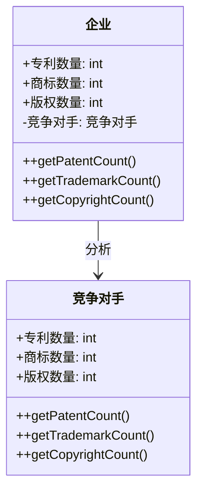

                 


# 彼得林奇的"护城河"理论在知识产权密集型企业中的应用

> **关键词**：彼得林奇，护城河理论，知识产权密集型企业，企业竞争优势，知识产权管理，企业战略

> **摘要**：本文探讨了彼得林奇的"护城河"理论在知识产权密集型企业中的应用，分析了如何通过建立强大的知识产权护城河来增强企业的竞争优势。文章从背景介绍、核心概念、算法原理、数学模型、系统架构设计、项目实战等多方面进行了详细阐述，最后给出了总结与展望。

---

## 第一部分：背景介绍

### 1.1 护城河理论的起源与发展

彼得·林奇是美国著名的投资经理人，他在《投资之道》一书中提出了“护城河”理论，认为企业竞争优势的核心在于其独特的能力和资源，这种能力可以通过某种形式的“护城河”来保护。护城河可以是技术优势、品牌影响力、成本优势、网络效应等。

### 1.2 知识产权密集型企业的特点

知识产权密集型企业是指那些在核心业务中依赖于专利、商标、版权等知识产权的企业，如科技公司、制药公司、软件公司等。这些企业的核心竞争力往往依赖于知识产权的保护和创新。

### 1.3 护城河理论与知识产权的结合

知识产权是知识产权密集型企业的重要资产，也是其竞争优势的来源。通过彼得林奇的护城河理论，企业可以更好地识别和保护其知识产权，构建竞争优势，防止竞争对手的侵蚀。

---

## 第二部分：核心概念与联系

### 2.1 企业核心竞争力的识别

企业核心竞争力是指企业在市场上独特的优势，这种优势可以是技术、品牌、成本、服务等。对于知识产权密集型企业，核心竞争力通常与知识产权密切相关。

#### 2.1.1 核心竞争力的识别方法

1. **技术分析**：评估企业的技术水平和创新能力。
2. **市场分析**：研究市场需求和竞争对手的状况。
3. **资源分析**：评估企业的资源，如专利数量、研发投入等。

### 2.2 企业竞争优势的评估

竞争优势是企业在市场上胜过竞争对手的能力。护城河理论认为，竞争优势的核心在于企业的独特能力和资源。

#### 2.2.1 竞争优势的评估指标

1. **技术领先性**：企业是否拥有独特的技术或专利。
2. **市场占有率**：企业在市场上的占有率。
3. **品牌影响力**：品牌知名度和美誉度。
4. **成本优势**：生产成本是否低于竞争对手。

### 2.3 知识产权对竞争优势的影响

知识产权是企业竞争优势的重要来源。通过保护知识产权，企业可以防止竞争对手模仿其技术和产品，从而巩固竞争优势。

#### 2.3.1 知识产权对竞争的影响

1. **技术壁垒**：通过专利技术构建技术壁垒，防止竞争对手进入市场。
2. **品牌保护**：通过商标注册保护品牌，增强品牌影响力。
3. **版权保护**：通过版权保护创意和内容，防止盗版。

---

## 第三部分：算法原理

### 3.1 护城河强度评估算法

为了量化企业的护城河强度，我们可以设计一个算法，根据企业的知识产权情况、市场占有率、竞争对手分析等因素进行评估。

#### 3.1.1 算法流程

1. **数据收集**：收集企业的专利数量、商标数量、版权数量等。
2. **竞争对手分析**：分析竞争对手的知识产权情况。
3. **护城河强度计算**：根据公式计算护城河强度。

#### 3.1.2 算法实现

以下是一个简单的护城河强度计算公式：

$$
\text{护城河强度} = \frac{\text{企业专利数量} - \text{竞争对手专利数量}}{\text{行业平均专利数量}} \times 100
$$

---

## 第四部分：系统分析与架构设计

### 4.1 系统功能设计

为了帮助企业更好地管理知识产权，我们可以设计一个知识产权管理系统，包括以下功能模块：

1. **专利管理模块**：管理企业的专利申请、维护和监控。
2. **商标管理模块**：管理企业的商标注册和监控。
3. **版权管理模块**：管理企业的版权登记和监控。
4. **竞争对手分析模块**：分析竞争对手的知识产权情况。

#### 4.1.1 领域模型设计

以下是领域模型的Mermaid类图：



---

## 第五部分：项目实战

### 5.1 环境搭建

为了实现护城河强度评估系统，我们需要以下环境：

1. **编程语言**：Python
2. **开发工具**：PyCharm
3. **数据源**：企业知识产权数据、竞争对手数据

### 5.2 核心实现

以下是护城河强度计算的Python代码：

```python
class Competitor:
    def __init__(self, patent_count, trademark_count, copyright_count):
        self.patent_count = patent_count
        self.trademark_count = trademark_count
        self.copyright_count = copyright_count

    def get_patent_count(self):
        return self.patent_count

    def get_trademark_count(self):
        return self.trademark_count

    def get_copyright_count(self):
        return self.copyright_count

class Company:
    def __init__(self, competitor):
        self.competitor = competitor

    def calculate_h护城河强度(self):
        industry_avg = 100  # 假设行业平均专利数量为100
        company_patent = self.competitor.get_patent_count()
        competitor_patent = self.competitor.get_patent_count()
        return ((company_patent - competitor_patent) / industry_avg) * 100

# 示例
competitor = Competitor(50, 30, 20)
company = Company(competitor)
strength = company.calculate_h护城河强度()
print(f"护城河强度: {strength}%")
```

---

## 第六部分：总结与展望

### 6.1 总结

通过彼得林奇的护城河理论，知识产权密集型企业可以更好地识别和保护其核心竞争力，构建强大的知识产权护城河，防止竞争对手的侵蚀。本文从理论、算法、系统设计和项目实战等多个方面进行了详细阐述，为企业提供了实用的指导。

### 6.2 展望

未来，随着技术的不断发展，知识产权保护将变得更加重要。企业需要不断创新，提升自身的技术水平和知识产权管理能力，以应对日益激烈的市场竞争。同时，护城河理论也将不断进化，为企业提供更强大的竞争优势。

