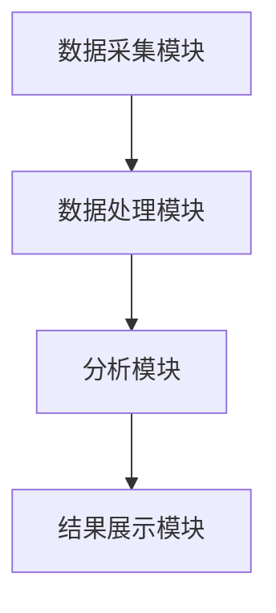

                 


# 彼得林奇的"未来增长潜力"分析法

## 关键词：投资分析，增长潜力，彼得林奇，财务指标，竞争优势，系统架构，数学模型

## 摘要：本文详细阐述了彼得林奇的“未来增长潜力”分析法，从核心概念到数学模型，再到系统架构，系统地分析了该方法的理论基础和实际应用。通过实例分析和代码实现，深入探讨了如何利用这种方法进行投资决策，为读者提供了从理论到实践的完整指南。

---

# 第一部分: 彼得林奇的"未来增长潜力"分析法概述

## 第1章: 彼得林奇分析法的背景与核心理念

### 1.1 投资分析的演变历程

#### 1.1.1 传统投资分析方法的局限性

传统的投资分析方法主要依赖于历史数据和简单的财务指标，这种方法在一定程度上能够反映企业的过去表现，但无法有效预测未来的增长潜力。例如，市盈率（P/E）和市净率（P/B）等指标只能衡量企业的当前估值，而无法反映企业的成长性和竞争优势。

#### 1.1.2 彼得林奇投资理念的形成背景

彼得·林奇（Peter Lynch）是美国著名的职业基金经理人，他的投资理念基于对企业的深入研究和长期跟踪。他在20世纪80年代管理富达麦哲伦基金期间，创造了年均29%的复合回报率。他的分析法强调对企业基本面的深入研究，特别是对企业的未来增长潜力的评估。

#### 1.1.3 彼得林奇分析法的核心思想

彼得林奇认为，投资成功的关键在于找到那些具有持续增长潜力的企业，并在市场低估时买入，高估时卖出。他的分析法强调以下几点：
- 企业的财务健康状况
- 企业的竞争优势
- 行业的未来发展前景

---

## 第2章: 未来增长潜力的核心概念

### 2.1 未来增长潜力的定义与特征

#### 2.1.1 未来增长潜力的定义

未来增长潜力是指企业在未来一段时间内，通过自身发展和外部环境变化，实现收入和利润持续增长的可能性。这种潜力不仅取决于企业的当前状况，还与企业的管理能力、行业趋势和市场环境密切相关。

#### 2.1.2 核心要素对比分析

为了评估企业的未来增长潜力，我们需要从以下几个方面进行分析：
- **财务指标**：收入、利润、现金流等
- **竞争优势**：市场占有率、品牌影响力、技术优势等
- **市场前景**：行业增长率、市场规模、政策影响等

#### 2.1.3 增长潜力的边界与外延

未来增长潜力的评估需要考虑企业的内部资源和外部环境的双重影响。内部资源包括企业的财务状况、管理团队和创新能力，外部环境包括宏观经济、行业竞争和政策法规等。这些因素共同构成了企业未来增长的边界和外延。

---

## 第3章: 彼得林奇分析法的核心要素

### 3.1 财务指标分析

#### 3.1.1 营业收入与利润增长

营业收入是企业核心业务的收入来源，利润则是企业盈利能力的直接体现。我们需要分析企业的收入增长是否可持续，利润增长是否健康。

- **收入增长**：关注收入的同比增长率和环比增长率。
- **利润增长**：关注净利润率的变化，分析成本控制能力。

#### 3.1.2 资产负债表分析

资产负债表反映了企业的资产、负债和所有者权益状况。我们需要关注以下几个方面：
- **资产结构**：流动资产与非流动资产的比例。
- **负债结构**：短期负债与长期负债的比例。
- **所有者权益**：反映企业的净资产状况。

#### 3.1.3 现金流量表解读

现金流量表反映了企业在一定时期内的现金流入和流出情况。我们需要关注企业的现金流健康状况：
- **经营活动现金流**：企业的主营业务是否能够产生稳定的现金流。
- **投资活动现金流**：企业的资本支出是否合理。
- **筹资活动现金流**：企业的融资能力。

---

### 3.2 企业竞争优势分析

#### 3.2.1 核心竞争力的定义

企业的核心竞争力是指企业在市场上能够持续提供具有竞争力的产品或服务的能力。这种竞争力可能来源于技术优势、成本优势、品牌优势或商业模式创新。

#### 3.2.2 与竞争对手的对比分析

为了评估企业的竞争优势，我们需要将其与同行业的主要竞争对手进行对比：
- **市场份额**：企业的市场占有率。
- **产品差异**：企业的核心产品或服务是否具有独特性。
- **成本结构**：企业的成本是否具有竞争优势。

#### 3.2.3 市场地位与品牌价值

企业的市场地位和品牌价值是其竞争优势的重要组成部分。强大的品牌影响力和市场地位可以帮助企业在竞争中占据优势。

---

### 3.3 市场前景与行业趋势

#### 3.3.1 行业周期分析

行业的生命周期对企业的未来增长潜力有重要影响。我们需要分析行业所处的周期阶段：
- **导入期**：行业刚刚起步，增长潜力大。
- **成长期**：行业快速增长，企业竞争加剧。
- **成熟期**：行业增长放缓，企业需要通过创新维持增长。
- **衰退期**：行业需求下降，企业面临转型压力。

#### 3.3.2 市场容量预测

市场容量是企业在未来一段时间内的潜在市场规模。我们需要结合行业增长率和市场渗透率进行预测。

#### 3.3.3 宏观经济影响

宏观经济环境对企业的发展有重要影响。我们需要关注以下因素：
- **经济周期**：经济增长率、失业率等。
- **政策法规**：行业政策、税收政策等。
- **技术进步**：技术革新对企业的影响。

---

## 第4章: 彼得林奇分析法的数学模型与公式

### 4.1 增长潜力的量化指标

#### 4.1.1 增长率的计算公式

增长率是衡量企业未来增长潜力的重要指标。增长率可以通过以下公式计算：

$$ 增长率 = \frac{收入增长}{基期收入} $$

其中，收入增长是指报告期收入与基期收入的差额，基期收入是指之前的收入。

#### 4.1.2 市盈率与市净率的对比

市盈率（P/E）和市净率（P/B）是衡量企业估值的重要指标。市盈率反映了企业每股收益的估值，市净率反映了企业每股净资产的估值。

- 市盈率公式：
$$ 市盈率 = \frac{股价}{每股收益} $$

- 市净率公式：
$$ 市净率 = \frac{股价}{每股净资产} $$

#### 4.1.3 未来增长率预测

未来增长率的预测可以通过以下步骤进行：
1. 分析企业的历史增长率。
2. 结合行业趋势和市场容量进行调整。
3. 考虑企业的竞争优势和管理能力。

---

### 4.2 彼得林奇PEG指标

#### 4.2.1 PEG指标的定义

PEG指标是彼得林奇提出的一个重要指标，用于衡量企业的估值是否合理。PEG指标的定义如下：

$$ PEG = \frac{市盈率}{预期增长率} $$

其中，市盈率是股价除以每股收益，预期增长率是未来几年的年均增长率。

#### 4.2.2 PEG指标的计算步骤

1. 计算企业的市盈率。
2. 预测企业的未来增长率。
3. 计算PEG值。

---

## 第5章: 系统分析与架构设计方案

### 5.1 系统分析框架

#### 5.1.1 系统分析的流程

- 数据采集：收集企业的财务数据、行业数据等。
- 数据处理：清洗和整理数据。
- 数据分析：应用彼得林奇分析法进行评估。
- 结果输出：生成分析报告。

#### 5.1.2 系统分析的工具选择

- 数据采集工具：Excel、数据库等。
- 数据分析工具：Python（Pandas、NumPy）、R等。
- 可视化工具：Matplotlib、Tableau等。

---

### 5.2 系统架构设计

#### 5.2.1 系统架构的模块划分

- 数据采集模块：负责数据的采集和存储。
- 数据处理模块：负责数据的清洗和预处理。
- 分析模块：负责应用彼得林奇分析法进行评估。
- 结果展示模块：负责生成报告和可视化结果。

#### 5.2.2 系统架构的流程图



---

## 第6章: 项目实战

### 6.1 环境安装

- 安装Python和必要的库（Pandas、NumPy、Matplotlib）。
- 安装数据分析工具（Excel、数据库等）。

### 6.2 系统核心实现源代码

以下是使用Python实现彼得林奇分析法的代码示例：

```python
import pandas as pd

# 数据采集
df = pd.read_csv('company_data.csv')

# 数据处理
df['增长率'] = (df['收入'] - df['基期收入']) / df['基期收入']

# 计算PEG指标
df['PEG'] = df['市盈率'] / df['预期增长率']

# 数据可视化
import matplotlib.pyplot as plt
plt.plot(df['公司名称'], df['PEG'], 'ro')
plt.xlabel('公司名称')
plt.ylabel('PEG值')
plt.show()
```

### 6.3 代码应用解读与分析

- 数据采集：从CSV文件中读取公司数据。
- 数据处理：计算增长率和PEG指标。
- 数据可视化：绘制PEG值的折线图。

---

## 第7章: 总结与展望

### 7.1 总结

彼得林奇的“未来增长潜力”分析法是一种基于对企业基本面和行业趋势的深入研究的投资分析方法。通过量化指标和数学模型，我们可以有效评估企业的未来增长潜力，为投资决策提供科学依据。

### 7.2 投资建议

- **长期投资**：选择具有持续增长潜力的企业进行长期投资。
- **分散投资**：通过分散投资降低风险。
- **定期调整**：根据市场变化和企业情况及时调整投资组合。

### 7.3 注意事项

- **数据质量**：确保数据的准确性和完整性。
- **模型局限**：彼得林奇分析法是一种参考工具，实际投资需要结合其他因素。
- **市场风险**：市场波动和经济环境的变化可能影响投资结果。

---

## 第8章: 拓展阅读

- 彼得林奇的其他分析方法。
- 其他投资分析模型（如巴菲特的护城河理论）。
- 机器学习在投资分析中的应用。

---

通过以上分析，我们可以看到，彼得林奇的“未来增长潜力”分析法是一种系统化、科学化的企业评估方法，能够帮助投资者更好地识别具有长期增长潜力的企业。希望本文能够为读者提供有价值的参考和启示。

