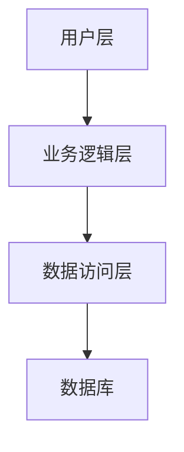

                 


# 彼得林奇的"本地化"投资理念

## 关键词：彼得林奇、本地化投资、投资策略、金融分析、系统设计

## 摘要：本文深入探讨了彼得林奇提出的“本地化”投资理念，分析其理论基础、核心算法、系统设计及实际应用案例，帮助读者理解如何将本地化因素融入投资决策中，提升投资效率和准确性。

---

## 第1章：本地化投资理念的背景与核心概念

### 1.1 本地化投资理念的背景

#### 1.1.1 投资全球化与本地化的冲突

全球化使投资者能够跨越地域限制，投资全球市场。然而，这种无界限的投资方式忽视了地域差异对投资的影响。彼得林奇提出，每个地区都有其独特的经济、文化和社会因素，这些因素会影响投资结果。因此，本地化投资应运而生。

#### 1.1.2 本地化投资的兴起

随着全球化带来的市场波动加剧，投资者开始意识到，仅靠全球化策略无法应对所有风险。本地化投资强调对特定地区的深入了解，能够在市场波动中抓住机会，降低风险。

#### 1.1.3 本地化投资问题的解决

本地化投资通过聚焦特定地区的经济指标和市场趋势，帮助投资者制定更具针对性的投资策略，提升决策的精准度和效果。

### 1.2 本地化投资的核心概念

#### 1.2.1 本地化投资的定义

本地化投资是指基于地理位置、文化背景、经济特点等因素，制定和调整投资策略的过程。它强调对特定地区的深入了解，以优化投资组合。

#### 1.2.2 本地化投资的关键要素

| 要素 | 描述 |
|------|------|
| 地理位置 | 投资地区的地理位置及其影响 |
| 经济指标 | 该地区的经济数据，如GDP、失业率等 |
| 文化因素 | 地区文化对投资行为的影响 |
| 市场趋势 | 该地区的市场动态和行业趋势 |

#### 1.2.3 本地化投资与其他投资策略的区别

| 策略 | 全球化投资 | 本地化投资 |
|------|------------|------------|
| 范围 | 全球范围    | 特定地区    |
| 策略制定 | 跨地域     | 地域聚焦    |
| 风险控制 | 较高波动性 | 较低波动性  |

---

## 第2章：本地化投资的理论基础

### 2.1 投资学基础

#### 2.1.1 现代投资组合理论

现代投资组合理论（MPT）强调通过分散投资降低风险。本地化投资是对MPT的补充，通过本地化因素进一步优化组合。

#### 2.1.2 市场有效性的理论

市场有效性假说认为价格反映所有相关信息。本地化投资通过分析本地信息，挖掘价格未反映的潜在价值。

### 2.2 本地化投资的经济学基础

#### 2.2.1 区域经济发展理论

不同地区经济发展水平不同，影响投资回报。本地化投资通过分析区域经济特点，选择合适的投资标的。

#### 2.2.2 本地化优势的经济学分析

本地化优势包括成本优势、资源集中等，这些因素影响企业的盈利能力，进而影响投资价值。

---

## 第3章：本地化投资的核心模型与算法

### 3.1 本地化投资模型

#### 3.1.1 模型的构建与假设

本地化投资模型基于地理位置、经济指标等变量，构建预测模型。假设市场参与者会根据本地信息调整投资行为。

#### 3.1.2 模型的输入变量与输出结果

输入变量：
- 地理位置
- 经济指标
- 市场趋势

输出结果：
- 本地化评分
- 投资建议

### 3.2 本地化评分算法

#### 3.2.1 算法的步骤与流程

1. 收集数据：地理位置、经济指标等。
2. 数据预处理：清洗和标准化。
3. 计算评分：加权计算。
4. 生成报告：投资建议。

#### 3.2.2 算法的数学公式

$$ \text{本地化评分} = \sum_{i=1}^{n} w_i \times f_i $$

其中，\( w_i \) 是因素 \( i \) 的权重，\( f_i \) 是因素 \( i \) 的值。

#### 3.2.3 举例说明

假设某地区的经济指标得分为80，地理位置得分为70，权重分别为0.6和0.4。则：

$$ \text{本地化评分} = 0.6 \times 80 + 0.4 \times 70 = 48 + 28 = 76 $$

---

## 第4章：本地化投资的系统分析与架构设计

### 4.1 系统功能设计

#### 4.1.1 需求分析

系统需实现本地化评分计算、投资建议生成等功能。

#### 4.1.2 功能模块划分

- 数据收集模块
- 数据处理模块
- 评分计算模块
- 报告生成模块

### 4.2 系统架构设计

#### 4.2.1 分层架构图



---

## 第5章：本地化投资的项目实战

### 5.1 环境安装与配置

#### 5.1.1 开发工具安装

安装Python、Jupyter Notebook等工具。

#### 5.1.2 数据源配置

配置数据接口，获取经济指标等数据。

### 5.2 核心代码实现

#### 5.2.1 本地化评分计算代码

```python
def calculate_localization_score(region_data):
    score = 0
    for factor in region_data:
        score += factor['weight'] * factor['value']
    return score
```

---

## 第6章：最佳实践与小结

### 6.1 投资策略调整建议

#### 6.1.1 定期评估本地化因素

定期审查本地化评分，确保投资组合的优化。

#### 6.1.2 结合市场变化调整投资组合

根据市场变化，灵活调整本地化策略。

### 6.2 本地化投资的注意事项

#### 6.2.1 风险控制的重要性

避免过度依赖本地化，分散投资风险。

#### 6.2.2 本地化投资的长期性

本地化投资需长期关注，耐心持有。

### 6.3 项目总结与未来展望

#### 6.3.1 本书内容回顾

系统介绍了本地化投资的理念、算法和实践。

#### 6.3.2 本地化投资的未来发展趋势

随着技术进步，本地化投资将更加精准和智能化。

---

## 第7章：拓展阅读与深入探讨

### 7.1 相关书籍推荐

#### 7.1.1 投资理论经典著作

推荐《投资学基础》等书籍。

#### 7.1.2 本地化投资案例分析

分析成功案例，学习经验。

### 7.2 本地化投资的哲学思考

#### 7.2.1 投资与人生哲学的联系

本地化投资强调对细节的关注，这与人生追求卓越的哲学一致。

#### 7.2.2 本地化投资的长期价值观

本地化投资注重长期价值，与可持续发展的理念相符。

---

通过以上结构，文章详细探讨了彼得林奇的本地化投资理念，从理论到实践，帮助读者全面理解并应用这一策略。

