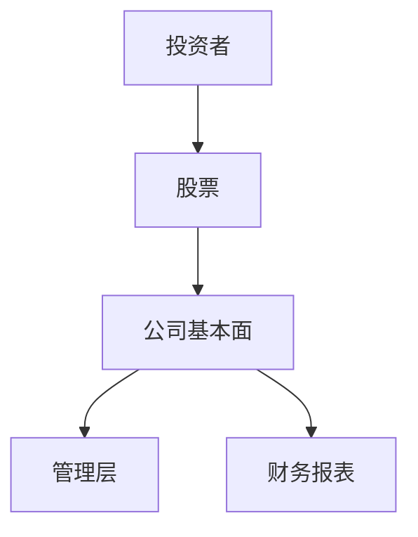
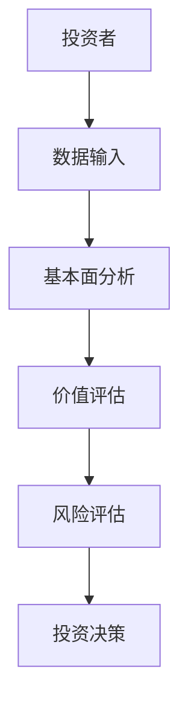

                 

# 彼得林奇的"知道你在买什么"原则

## 关键词：彼得林奇，投资原则，价值投资，基本面分析，风险管理，投资决策

## 摘要：彼得林奇的投资原则强调投资者必须深入理解所投资的股票，掌握公司的基本面和管理层情况，通过价值评估和风险分析，做出明智的投资决策。本文详细阐述了彼得林奇的投资理念，分析方法，数学模型，并通过实际案例展示其应用，帮助读者掌握这一投资原则。

---

## 目录大纲

### # 第一部分：彼得林奇投资原则的背景与核心概念

#### ## 第1章：彼得林奇投资原则的背景介绍

##### ### 1.1 投资的基本问题与彼得林奇原则的提出
- 投资的基本问题
- 彼得林奇原则的提出背景
- 与其他投资策略的对比

##### ### 1.2 彼得林奇原则的核心概念
- 价值投资的核心概念
- 投资者的角色与责任
- 投资中的边界与外延

#### ## 第2章：彼得林奇原则的核心概念与联系

##### ### 2.1 投资的基本原理
- 价值投资的基本原理
- 彼得林奇原则的理论基础
- 投资中的关键因素分析

##### ### 2.2 核心概念原理
- 价值评估的核心原理
- 风险评估的核心原理
- 投资组合优化的基本原理

##### ### 2.3 实体关系图

### # 第二部分：彼得林奇原则的分析方法与数学模型

#### ## 第3章：彼得林奇原则的分析方法

##### ### 3.1 基本面分析方法
- 公司财务报表分析
- 管理层评估方法
- 行业分析与竞争地位

##### ### 3.2 投资决策模型
- 价值评估模型
- 风险评估模型
- 投资组合优化方法

##### ### 3.3 实例分析
- 某公司案例分析
- 投资决策过程演示

#### ## 第4章：数学模型与公式

##### ### 4.1 价值评估公式
$$ P = \frac{E}{P/E} $$
其中，P为股票的内在价值，E为公司的净利润，P/E为市盈率。

##### ### 4.2 风险评估公式
$$ R = \frac{V}{P} $$
其中，R为风险系数，V为股票的市场价值，P为股票的内在价值。

##### ### 4.3 投资组合优化
$$ \text{收益} = \sum w_i \times r_i $$
$$ \text{风险} = \sum w_i^2 \times \sigma_i^2 $$
其中，\( w_i \)为投资比例，\( r_i \)为收益，\( \sigma_i \)为收益的标准差。

### # 第三部分：系统分析与架构设计方案

#### ## 第5章：系统分析与架构设计

##### ### 5.1 问题场景介绍
- 投资者面临的挑战
- 彼得林奇原则的应用场景

##### ### 5.2 系统功能设计
- 基本面分析模块
- 价值评估模块
- 风险评估模块

##### ### 5.3 系统架构设计

### # 第四部分：项目实战

#### ## 第6章：项目实战

##### ### 6.1 环境安装
- 数据收集工具安装
- 分析工具安装

##### ### 6.2 核心实现源代码
- 基本面分析代码
- 价值评估代码
- 风险评估代码

##### ### 6.3 代码应用解读与分析
- 代码功能解读
- 应用案例分析

##### ### 6.4 项目小结
- 项目成果总结
- 经验与教训

### # 第五部分：总结与最佳实践

#### ## 第7章：总结与最佳实践

##### ### 7.1 核心要点回顾
- 彼得林奇原则的核心要点
- 投资中的关键注意事项

##### ### 7.2 最佳实践 tips
- 投资前的准备工作
- 风险管理策略
- 持续学习与改进

##### ### 7.3 小结
- 彼得林奇原则的实践意义
- 未来投资的趋势与挑战

##### ### 7.4 拓展阅读建议
- 相关书籍推荐
- 进一步学习的方向

---

这个大纲确保了文章内容的完整性和逻辑性，从背景介绍到实际应用，结合理论与实践，帮助读者深入理解并掌握彼得林奇的投资原则。

