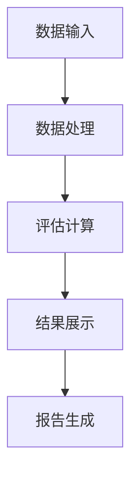

                 


# 彼得林奇的"竞争优势"评估体系

> 关键词：彼得林奇，竞争优势，评估体系，投资分析，系统架构，项目实战

> 摘要：本文系统地介绍了彼得林奇提出的"竞争优势"评估体系，从理论基础到实践应用，详细阐述了竞争优势的核心概念、评估维度、数学模型、系统架构以及实际案例分析。通过本文，读者可以全面理解如何利用竞争优势评估体系进行投资分析和决策，并掌握实际应用的方法和技巧。

---

# 第一部分：引言

## 第1章：彼得林奇与竞争优势评估体系

### 1.1 彼得林奇与竞争优势评估体系的背景

#### 1.1.1 彼得林奇的生平与投资理念

彼得·林奇（Peter Lynch）是美国著名的投资专家，曾任富达投资集团（Fidelity Investments）的基金经理。他以卓越的投资业绩和独特的投资理念闻名，尤其是在挑选具有竞争优势的公司方面表现突出。彼得林奇认为，投资者应关注那些在市场上具有独特竞争优势的公司，这些公司能够通过持续的创新和高效运营，在行业中占据领先地位。

#### 1.1.2 竞争优势评估体系的提出背景

在20世纪80年代，彼得林奇提出了一套基于竞争优势的评估体系，旨在帮助投资者识别那些在行业中具有可持续竞争优势的公司。这一体系的核心在于分析公司的财务表现、市场地位、运营效率以及技术创新能力等多方面因素，从而判断其是否能够在长期内获得超额收益。

#### 1.1.3 该体系在投资分析中的重要性

竞争优势评估体系为投资者提供了一个系统化的分析框架，帮助他们在众多企业中筛选出具有长期增长潜力的优秀公司。通过这一体系，投资者可以更科学地评估企业的核心竞争力，从而做出更明智的投资决策。

### 1.2 本书的目的与结构安排

#### 1.2.1 本书的核心目标

本文旨在详细阐述彼得林奇提出的竞争优势评估体系，从理论基础到实践应用，帮助读者全面理解和掌握这一评估方法。

#### 1.2.2 目录结构与内容概览

本文分为七个部分：引言、竞争优势评估体系的基础、竞争优势评估体系的构建、竞争优势评估体系的系统分析与架构设计、竞争优势评估体系的项目实战、竞争优势评估体系的总结与展望，以及附录。

#### 1.2.3 预习建议与学习方法

为了更好地理解本文内容，建议读者在阅读前具备一定的投资分析和企业评估的基础知识。同时，建议结合实际案例进行分析，以便更好地掌握竞争优势评估体系的应用方法。

---

# 第二部分：竞争优势评估体系的基础

## 第2章：竞争优势的核心概念与评估维度

### 2.1 竞争优势的基本定义

#### 2.1.1 竞争优势的定义与内涵

竞争优势是指企业在市场中相对于竞争对手所具有的独特优势。这些优势可以是企业的核心竞争力、成本优势、技术优势、品牌优势等，能够使企业在市场中获得更高的市场份额和盈利能力。

#### 2.1.2 竞争优势的类型与分类

竞争优势可以分为以下几种类型：

1. **成本优势**：企业通过高效的生产流程或采购策略，降低产品成本，从而在价格竞争中占据优势。
2. **技术优势**：企业拥有的先进技术或专利，使其在产品创新和质量上优于竞争对手。
3. **品牌优势**：强大的品牌形象和客户忠诚度，使企业在市场竞争中更具影响力。
4. **市场优势**：企业占据较大的市场份额，具有更强的市场影响力和定价权。

#### 2.1.3 竞争优势的生命周期

竞争优势并非一成不变，会随着市场环境的变化而变化。企业需要不断调整和优化自身的竞争优势，以保持其在市场中的领先地位。

### 2.2 竞争优势的评估维度

#### 2.2.1 财务指标：盈利能力、成长性与估值

盈利能力是衡量企业竞争优势的重要指标之一，包括净利润率、ROE（净资产收益率）等。成长性则体现在销售收入增长率和净利润增长率等方面。估值指标如市盈率、市净率等，可以帮助投资者判断企业是否被市场低估或高估。

#### 2.2.2 市场指标：市场份额与竞争格局

市场份额是企业在市场中所占的销售比例，反映了企业的市场影响力。竞争格局则分析了行业内的主要竞争对手及其市场地位，帮助企业识别潜在的竞争威胁和机会。

#### 2.2.3 运营指标：效率与成本控制

运营效率体现在企业的生产流程、库存管理和供应链管理等方面。成本控制是通过优化资源配置和减少浪费，降低生产成本，从而提高企业的盈利能力。

#### 2.2.4 技术指标：创新与研发能力

企业的技术创新能力和研发能力是其核心竞争力的重要组成部分。通过不断推出新产品或改进现有产品，企业可以保持市场领先地位。

### 2.3 竞争优势的评估标准

#### 2.3.1 评估标准的制定原则

竞争优势的评估标准应基于企业的实际情况，结合行业特点和市场环境制定。同时，评估标准应具有可操作性和可量化性，以便于实际应用。

#### 2.3.2 各维度的权重分配

在评估体系中，不同维度的权重应根据其对竞争优势的影响力进行合理分配。例如，对于技术密集型行业，技术指标的权重可能更大；而对于传统制造业，成本和运营效率的权重可能更高。

#### 2.3.3 评估标准的动态调整

随着市场环境和企业战略的变化，竞争优势的评估标准也需要进行动态调整。企业应定期 reassess其竞争优势，并根据新的情况优化评估体系。

---

# 第三部分：竞争优势评估体系的构建

## 第3章：竞争优势评估模型的构建

### 3.1 模型构建的基本原则

#### 3.1.1 模型的科学性与实用性

竞争优势评估模型应基于科学的理论和实践，具有较强的实用价值，能够为投资者提供有效的决策支持。

#### 3.1.2 模型的可操作性与可扩展性

模型应具有清晰的操作步骤和灵活的扩展性，以便根据实际情况进行调整和优化。

#### 3.1.3 模型的验证与优化

通过实际案例验证模型的有效性，并根据反馈不断优化模型，以提高其准确性和适用性。

### 3.2 评估模型的算法原理

#### 3.2.1 竞争优势评分算法

竞争优势评分算法通过对多个维度进行加权计算，得出企业的综合竞争优势评分。公式如下：

$$
\text{竞争优势评分} = \sum_{i=1}^{n} w_i \times f_i
$$

其中，$w_i$ 为第 $i$ 个评估维度的权重，$f_i$ 为第 $i$ 个评估维度的评分。

#### 3.2.2 数据预处理与特征提取

在实际应用中，需要对数据进行清洗和特征提取，以确保模型的输入数据具有较高的准确性和完整性。

#### 3.2.3 综合评分的计算公式

综合评分是通过将各维度的评分加权求和得到的，公式如下：

$$
\text{综合评分} = \sum_{i=1}^{n} w_i \times f_i
$$

其中，$w_i$ 是第 $i$ 个维度的权重，$f_i$ 是第 $i$ 个维度的评分。

### 3.3 竞争优势评估模型的数学模型

#### 3.3.1 竞争优势评分公式

竞争优势评分公式通过加权计算多个维度的评分，得出企业的综合竞争优势评分。公式如下：

$$
\text{竞争优势评分} = \sum_{i=1}^{n} w_i \times f_i
$$

其中，$w_i$ 是第 $i$ 个维度的权重，$f_i$ 是第 $i$ 个维度的评分。

#### 3.3.2 竞争优势评估模型的数学模型

竞争优势评估模型的数学模型可以表示为：

$$
\text{综合评分} = \sum_{i=1}^{n} w_i \times f_i
$$

其中，$w_i$ 是第 $i$ 个维度的权重，$f_i$ 是第 $i$ 个维度的评分。

### 3.4 竞争优势评估模型的系统架构设计

#### 3.4.1 系统功能设计

竞争优势评估系统的功能模块包括数据输入、评估计算、结果展示和报告生成等。

#### 3.4.2 系统架构设计

系统架构采用分层设计，包括数据层、计算层、展示层和用户层。各层之间通过接口进行交互，确保系统的高效运行。

#### 3.4.3 系统接口设计

系统接口设计包括数据输入接口、计算接口和结果输出接口。各接口之间通过标准化协议进行通信，确保系统的兼容性和可扩展性。

#### 3.4.4 系统交互设计

系统交互设计采用用户友好的界面，用户可以通过输入企业数据，获得综合竞争优势评分和详细评估报告。

---

# 第四部分：竞争优势评估体系的系统分析与架构设计方案

## 第4章：竞争优势评估体系的系统分析

### 4.1 竞争优势评估体系的系统功能设计

竞争优势评估体系的功能模块包括数据输入、评估计算、结果展示和报告生成等。

### 4.2 竞争优势评估体系的系统架构设计

系统架构采用分层设计，包括数据层、计算层、展示层和用户层。各层之间通过接口进行交互，确保系统的高效运行。

### 4.3 竞争优势评估体系的系统接口设计

系统接口设计包括数据输入接口、计算接口和结果输出接口。各接口之间通过标准化协议进行通信，确保系统的兼容性和可扩展性。

### 4.4 竞争优势评估体系的系统交互设计

系统交互设计采用用户友好的界面，用户可以通过输入企业数据，获得综合竞争优势评分和详细评估报告。

---

# 第五部分：竞争优势评估体系的项目实战

## 第5章：竞争优势评估体系的项目实战

### 5.1 竞争优势评估体系的环境配置

在实际应用中，需要对竞争优势评估体系进行环境配置，包括硬件配置、软件安装和数据准备等。

### 5.2 竞争优势评估体系的代码实现

以下是竞争优势评估体系的核心代码实现：

```python
def calculate_competitive_edge(finance_scores, market_scores, operation_scores, technology_scores, finance_weight=0.4, market_weight=0.3, operation_weight=0.2, technology_weight=0.1):
    total_score = (finance_weight * finance_scores) + (market_weight * market_scores) + (operation_weight * operation_scores) + (technology_weight * technology_scores)
    return total_score

# 示例数据
finance_scores = 85
market_scores = 75
operation_scores = 80
technology_scores = 65

# 计算综合竞争优势评分
total_score = calculate_competitive_edge(finance_scores, market_scores, operation_scores, technology_scores)
print(f"综合竞争优势评分：{total_score}")
```

### 5.3 竞争优势评估体系的代码应用解读与分析

通过上述代码，我们可以计算出企业的综合竞争优势评分。根据不同的权重分配，可以调整各维度的重要性，以适应不同的行业和市场环境。

### 5.4 竞争优势评估体系的项目小结

通过实际案例分析，我们可以看到竞争优势评估体系在实际应用中的有效性和实用性。企业可以根据自身的实际情况，灵活调整评估模型，以更好地识别和利用竞争优势。

---

# 第六部分：竞争优势评估体系的总结与展望

## 第6章：竞争优势评估体系的总结与展望

### 6.1 竞争优势评估体系的核心优势

竞争优势评估体系通过系统化的分析方法，帮助投资者识别和评估企业的核心竞争力，从而做出更明智的投资决策。

### 6.2 竞争优势评估体系的应用前景

随着市场竞争的加剧，竞争优势评估体系将在企业战略制定和投资决策中发挥越来越重要的作用。未来，随着人工智能和大数据技术的发展，竞争优势评估体系将更加智能化和精准化。

### 6.3 竞争优势评估体系的未来发展趋势

未来，竞争优势评估体系将更加注重动态调整和实时监控，通过大数据和人工智能技术，实现对企业竞争优势的实时评估和优化。

---

# 第七部分：附录

## 第7章：附录

### 7.1 附录A：竞争优势评估体系的数学公式

竞争优势评分公式：

$$
\text{综合评分} = \sum_{i=1}^{n} w_i \times f_i
$$

### 7.2 附录B：竞争优势评估体系的系统架构图



### 7.3 附录C：竞争优势评估体系的代码示例

```python
def calculate_competitive_edge(finance_scores, market_scores, operation_scores, technology_scores, finance_weight=0.4, market_weight=0.3, operation_weight=0.2, technology_weight=0.1):
    total_score = (finance_weight * finance_scores) + (market_weight * market_scores) + (operation_weight * operation_scores) + (technology_weight * technology_scores)
    return total_score

# 示例数据
finance_scores = 85
market_scores = 75
operation_scores = 80
technology_scores = 65

# 计算综合竞争优势评分
total_score = calculate_competitive_edge(finance_scores, market_scores, operation_scores, technology_scores)
print(f"综合竞争优势评分：{total_score}")
```

---

# 结语

通过本文的详细阐述，读者可以全面了解彼得林奇提出的竞争优势评估体系，并掌握其在实际投资分析中的应用方法。未来，随着技术的不断进步和市场的变化，竞争优势评估体系将不断发展和完善，为投资者提供更强大的决策支持工具。

