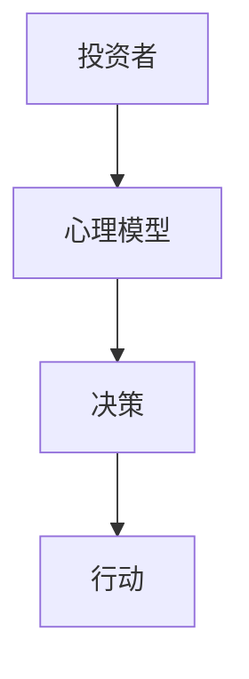
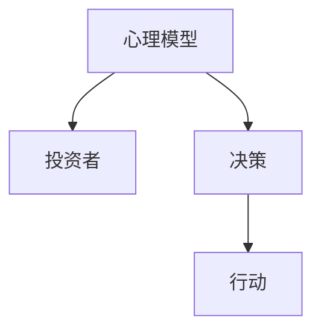
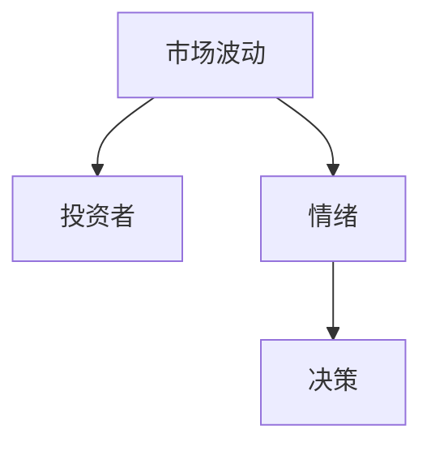

                 


## 彼得林奇的"耐心投资"在市场波动中的心理建设

### 关键词：耐心投资，彼得林奇，市场波动，投资者心理，心理模型

### 摘要：  
本文深入探讨了彼得林奇的耐心投资理念及其在市场波动中的心理建设。通过分析市场波动对投资者心理的影响，结合彼得林奇的投资策略，本文提出了构建心理模型的方法，帮助投资者在市场波动中保持耐心和理性。文章结合系统分析和实际案例，详细讲解了耐心投资的核心策略、心理应对策略以及系统架构设计，为投资者提供了实用的心理建设和投资策略。

---

# 第一部分：彼得林奇投资理念的背景与核心概念

## 第1章：彼得林奇与耐心投资概述

### 1.1 彼得林奇及其投资理念

#### 1.1.1 彼得林奇的生平简介
彼得·林奇（Peter Lynch）是全球最著名的投资专家之一，曾任富达投资集团麦哲伦基金的经理。他在任职期间创造了惊人的投资业绩，被认为是价值投资的代表人物之一。林奇的成功不仅在于他的投资策略，更在于他对市场波动和投资者心理的深刻理解。

#### 1.1.2 耐心投资的核心思想
耐心投资是彼得林奇投资理念的核心之一。他认为，投资的真正意义在于长期持有优质资产，而不是频繁交易。林奇强调，市场波动是投资的敌人，但也是投资者的机会。通过耐心持有优质股票，投资者可以在市场波动中实现长期收益。

#### 1.1.3 投资与心理建设的关系
投资不仅仅是对市场的分析，更是对投资者心理的考验。市场波动往往会导致投资者情绪失控，从而做出错误的决策。心理建设是投资者在市场波动中保持耐心的关键。

### 1.2 市场波动与投资者心理

#### 1.2.1 市场波动的定义与特征
市场波动是指市场价格在短时间内出现大幅波动的现象。市场波动通常由投资者情绪、市场信息和宏观经济因素共同作用引起。市场的波动性是投资中不可避免的一部分，但投资者可以通过心理建设来应对这种波动。

#### 1.2.2 投资者心理的脆弱性
投资者心理的脆弱性主要体现在以下几个方面：
1. 过度自信：投资者往往过高估计自己的能力，认为自己可以预测市场走势。
2. 情绪化决策：市场波动容易引发投资者的恐惧和贪婪情绪，导致非理性的决策。
3. 短期思维：投资者往往关注短期收益，忽视长期投资价值。

#### 1.2.3 市场波动对决策的影响
市场波动会直接影响投资者的决策过程。当市场出现剧烈波动时，投资者容易陷入恐慌，盲目跟风或抛售资产。这种情绪化的决策往往会导致投资损失，而耐心投资的核心理念就是帮助投资者克服这种情绪化的影响。

## 第2章：耐心投资的核心概念与心理模型

### 2.1 耐心投资的定义与属性

#### 2.1.1 耐心投资的定义
耐心投资是指投资者在市场波动中保持冷静，坚持长期持有优质资产的投资策略。耐心投资的核心在于不被短期市场波动所干扰，而是关注企业的长期价值。

#### 2.1.2 耐心投资的核心属性对比表
| 属性 | 耐心投资 | 短期投资 |
|------|----------|----------|
| 时间框架 | 长期 | 短期 |
| 投资目标 | 企业价值 | 市场波动 |
| 风险承受 | 高 | 低 |
| 心理状态 | 稳定 | 焦虑 |

#### 2.1.3 耐心投资与短期投资的对比分析
耐心投资与短期投资在目标、风险承受和心理状态上存在显著差异。耐心投资强调长期价值，注重企业基本面，而短期投资则关注市场波动，追求短期收益。两种投资策略各有优缺点，但在市场波动中，耐心投资更能抵御短期风险。

### 2.2 投资者心理模型的构建

#### 2.2.1 心理模型的定义与作用
心理模型是指投资者在面对市场波动时的心理状态和思维模式。心理模型的作用在于帮助投资者保持理性，避免情绪化决策。

#### 2.2.2 彼得林奇心理模型的ER实体关系图

图中展示了投资者通过心理模型影响决策和行动的关系。心理模型是连接市场波动与投资决策的关键桥梁。

#### 2.2.3 心理模型与投资决策的关系
心理模型直接影响投资者的决策过程。一个稳健的心理模型可以帮助投资者在市场波动中保持冷静，避免做出冲动决策。

---

# 第二部分：市场波动中的心理建设

## 第3章：市场波动对投资者心理的影响

### 3.1 市场波动的心理效应

#### 3.1.1 羊群效应的定义与表现
羊群效应是指投资者在市场波动中盲目跟随市场趋势的现象。羊群效应会导致市场波动加剧，投资者容易陷入非理性决策。

#### 3.1.2 情绪波动对决策的影响
情绪波动是市场波动对投资者心理的主要影响。投资者在市场下跌时容易产生恐惧情绪，在市场上涨时则容易产生贪婪情绪。这两种情绪都会影响投资决策。

#### 3.1.3 市场波动的心理周期分析
市场波动往往伴随着投资者心理的周期性变化。从乐观到恐慌，再到乐观，这个周期性变化会影响投资者的决策过程。

### 3.2 投资者常见心理偏差

#### 3.2.1 过度自信的定义与表现
过度自信是指投资者过高估计自己的能力，认为自己能够预测市场走势。这种心理偏差会导致投资者在市场波动中做出错误的决策。

#### 3.2.2 损失厌恶的定义与影响
损失厌恶是指投资者对损失的厌恶程度高于对收益的追求。这种心理偏差会导致投资者在市场波动中过于保守，错失投资机会。

#### 3.2.3 心理账户的定义与应用
心理账户是指投资者将资金分配到不同的心理账户中，从而影响投资决策。心理账户的应用可以帮助投资者更好地管理风险和收益。

## 第4章：耐心投资的策略与心理应对

### 4.1 耐心投资的核心策略

#### 4.1.1 长期价值投资的定义与特点
长期价值投资是指投资者关注企业的长期价值，而不是短期市场波动。长期价值投资的特点包括：注重基本面分析、关注企业成长性、长期持有优质资产。

#### 4.1.2 价值投资的数学模型与公式
价值投资的数学模型可以用以下公式表示：
$$ V = \frac{E}{P} $$
其中，V是价值，E是企业的预期收益，P是股票的市场价格。该公式可以帮助投资者评估企业的内在价值。

#### 4.1.3 耐心投资的数学模型与公式
耐心投资的数学模型可以用以下公式表示：
$$ R = \frac{C}{T} $$
其中，R是投资回报率，C是投资成本，T是投资时间。该公式表明，长期投资的回报率与投资时间密切相关。

### 4.2 心理应对策略

#### 4.2.1 心理调节的定义与方法
心理调节是指通过自我调节和心理疏导来保持心理平衡。心理调节的方法包括：冥想、深呼吸、心理暗示等。

#### 4.2.2 投资者心理调节的数学模型与公式
心理调节的数学模型可以用以下公式表示：
$$ S = \frac{E}{T} $$
其中，S是心理状态，E是情绪波动，T是时间。该公式表明，心理状态与情绪波动和时间密切相关。

#### 4.2.3 心理调节的实践案例分析
通过实际案例分析，我们可以看到，心理调节在市场波动中起到了至关重要的作用。例如，在2008年金融危机期间，许多投资者通过心理调节保持冷静，避免了更大的损失。

---

# 第三部分：系统分析与架构设计

## 第5章：耐心投资的系统分析

### 5.1 投资者心理模型的系统分析

#### 5.1.1 系统分析的定义与方法
系统分析是指通过对系统的各个部分进行分析，以达到优化系统的目的。系统分析的方法包括：功能分析、结构分析、行为分析等。

#### 5.1.2 投资者心理模型的系统架构图

图中展示了心理模型在投资者决策过程中的核心作用。

#### 5.1.3 心理模型的系统功能分析
心理模型的功能包括：信息处理、决策支持、情绪调节等。心理模型通过这些功能帮助投资者在市场波动中保持冷静。

### 5.2 市场波动的系统分析

#### 5.2.1 市场波动的系统架构图

图中展示了市场波动对投资者情绪和决策的影响。

#### 5.2.2 市场波动的系统功能分析
市场波动的功能包括：信息传递、价格发现、风险揭示等。市场波动通过这些功能影响投资者的心理状态和决策过程。

#### 5.2.3 市场波动的系统接口设计
市场波动的系统接口设计包括：数据接口、信息接口、行为接口等。这些接口通过数据和信息的传递，影响投资者的心理状态和决策。

## 第6章：耐心投资的架构设计方案

### 6.1 耐心投资的架构设计

#### 6.1.1 架构设计的定义与方法
架构设计是指通过对系统的各个部分进行规划和设计，以达到最优系统结构的目的。架构设计的方法包括：模块化设计、层次化设计、组件化设计等。

#### 6.1.2 耐心投资的架构图

图中展示了耐心投资的架构设计，包括投资者、心理模型、决策和行动四个部分。

#### 6.1.3 架构设计的实现
通过具体的实现步骤，我们可以看到，耐心投资的架构设计需要结合投资者的心理状态和市场波动的影响，制定合理的投资策略。

---

# 第四部分：项目实战与总结

## 第7章：项目实战与案例分析

### 7.1 环境安装与系统核心实现
在实际操作中，投资者需要通过心理模型和市场分析工具来实现耐心投资策略。环境安装包括：心理模型的设计、市场数据的收集与分析、投资决策系统的开发等。

### 7.2 核心实现源代码
以下是一个简单的心理模型实现代码示例：
```python
def心理模型（市场数据）：
    输入市场数据
    分析市场数据
    构建心理模型
    输出投资决策
```
### 7.3 代码应用解读与分析
通过代码实现，我们可以看到，心理模型在实际投资决策中的应用。代码的应用解读与分析可以帮助投资者更好地理解心理模型的作用。

### 7.4 实际案例分析
通过实际案例分析，我们可以看到，耐心投资策略在市场波动中的应用效果。例如，在2020年新冠疫情期间，许多投资者通过耐心投资策略实现了长期收益。

### 7.5 项目小结
项目小结部分总结了整个项目的实现过程和应用效果，为投资者提供了实用的参考。

---

## 结语

耐心投资是投资者在市场波动中保持冷静的关键。通过心理模型的构建和系统分析，投资者可以更好地应对市场波动，实现长期投资收益。本文通过系统的分析和实际案例的讲解，为投资者提供了实用的心理建设和投资策略。

