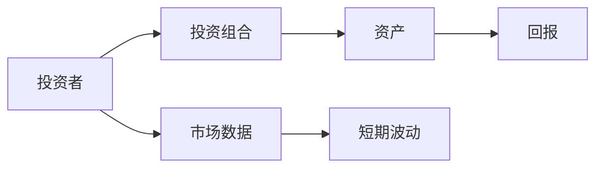

                 

# 彼得林奇的"耐心投资"在市场短期主义盛行时的价值

## 关键词
- 耐心投资
- 短期主义
- 彼得·林奇
- 投资策略
- 市场分析

## 摘要
本文深入探讨彼得·林奇的耐心投资理念在当前市场环境下的重要性。通过分析耐心投资与短期主义的对比，揭示耐心投资的优势和价值，结合算法和系统设计，提供实际应用的指导，帮助投资者在波动的市场中实现长期收益。

---

## 目录大纲

### 第一章：耐心投资与短期主义概述

#### 1.1 耐心投资的核心概念
- 1.1.1 什么是耐心投资
- 1.1.2 耐心投资的特点与优势
- 1.1.3 耐心投资的边界与外延

#### 1.2 短期主义的现状与问题
- 1.2.1 短期主义的定义
- 1.2.2 短期主义对市场的负面影响
- 1.2.3 短期主义与耐心投资的对比

### 第二章：耐心投资的核心要素

#### 2.1 投资组合管理
- 2.1.1 投资组合的构建原则
- 2.1.2 资产配置的策略
- 2.1.3 风险管理的技巧

#### 2.2 耐心投资的决策框架
- 2.2.1 投资决策的逻辑
- 2.2.2 耐心投资的决策流程
- 2.2.3 耐心投资的决策工具

#### 2.3 耐心投资的长期回报分析
- 2.3.1 长期投资的回报特征
- 2.3.2 短期波动对长期回报的影响
- 2.3.3 耐心投资的回报预测模型

### 第三章：耐心投资的核心原理

#### 3.1 耐心投资的数学模型
- 3.1.1 投资回报的数学表达
- 3.1.2 资产配置的优化模型
- 3.1.3 风险调整后的回报计算

#### 3.2 耐心投资与短期投资的对比
- 3.2.1 投资目标的对比
- 3.2.2 投资策略的对比
- 3.2.3 投资结果的对比

#### 3.3 耐心投资的实体关系图

### 第四章：耐心投资的算法原理

#### 4.1 投资组合优化算法
- 4.1.1 现代投资组合理论（MPT）简介
- 4.1.2 均值-方差优化模型
- 4.1.3 Python代码实现

#### 4.2 风险与回报的平衡
- 4.2.1 风险调整后的回报计算
- 4.2.2 马科维茨的有效前沿
- 4.2.3 代码实现与案例分析

### 第五章：系统分析与架构设计

#### 5.1 投资管理系统介绍
- 5.1.1 系统功能概述
- 5.1.2 用户需求分析
- 5.1.3 系统架构设计

#### 5.2 系统架构图

### 第六章：项目实战

#### 6.1 环境搭建
- 6.1.1 安装Python
- 6.1.2 安装必要的库（如numpy, pandas）

#### 6.2 核心代码实现
- 6.2.1 数据处理代码
- 6.2.2 投资组合优化算法实现

#### 6.3 案例分析
- 6.3.1 数据分析与可视化
- 6.3.2 投资组合优化结果展示

### 第七章：最佳实践与小结

#### 7.1 最佳投资实践
- 7.1.1 耐心投资的注意事项
- 7.1.2 系统优化建议

#### 7.2 小结
- 7.2.1 耐心投资的优势
- 7.2.2 短期主义的局限性

#### 7.3 注意事项
- 7.3.1 市场波动的应对策略
- 7.3.2 投资组合的风险控制

#### 7.4 拓展阅读
- 7.4.1 推荐书籍与资源
- 7.4.2 进一步学习的方向

---

**摘要：** 本文系统地探讨了彼得·林奇的耐心投资理念在当前市场环境中的价值，结合数学模型和系统设计，为投资者提供了实际的应用指导。通过深入分析耐心投资的核心原理和系统架构，帮助投资者在短期主义盛行的市场中实现长期稳定的收益。

