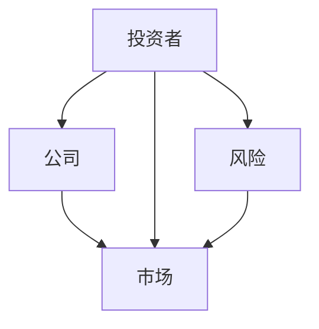
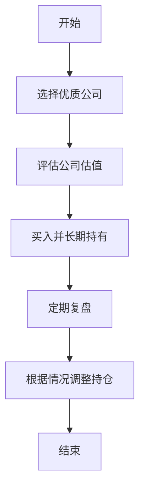
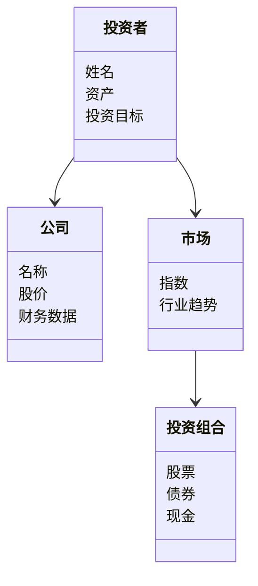
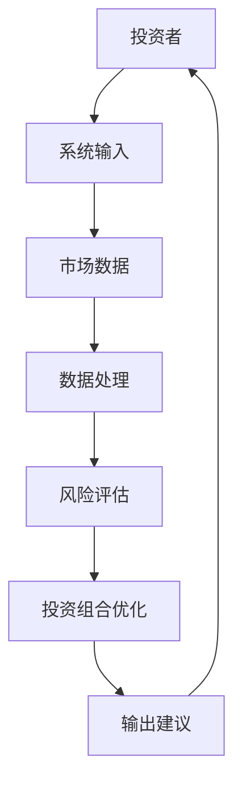
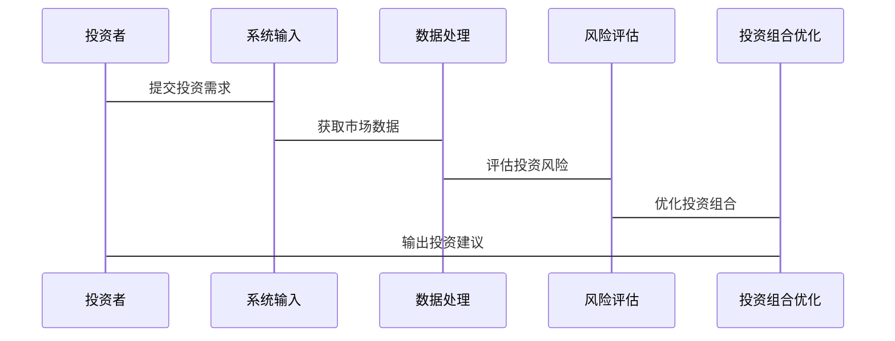

                 


```markdown
# 彼得林奇的"耐心投资"理念探讨

> 关键词：耐心投资、彼得林奇、价值投资、长期持有、风险管理

> 摘要：本文深入探讨了彼得林奇的耐心投资理念，分析其核心概念、算法原理、系统架构，并结合实际案例进行详细讲解，最后总结了最佳实践和注意事项。

---

## 第一部分: 背景介绍

### 第1章: 耐心投资的背景与概念

#### 1.1 投资的基本问题
##### 1.1.1 什么是投资
投资是将资源（资金、时间、精力）投入到某个项目或资产中，期望在未来获得更大的收益。投资的基本问题是如何在不确定的市场中做出最优决策，以实现最大化的收益。

##### 1.1.2 投资的基本问题与挑战
- 市场波动性：股票、债券等资产价格受多种因素影响，难以预测。
- 风险与收益的平衡：高风险可能带来高收益，但也可能导致重大损失。
- 时间因素：投资的回报通常需要时间积累，短期内可能看不到收益。

##### 1.1.3 投资的核心目标与策略
- 核心目标：实现资产增值，保值或超过通货膨胀率。
- 常见策略：价值投资、成长投资、股息投资、指数投资等。

#### 1.2 彼得林奇的生平与投资理念
##### 1.2.1 彼得林奇的生平简介
彼得·林奇（Peter Lynch）是美国著名的投资经理人，曾任富达投资集团麦哲伦基金经理。他以卓越的投资业绩和对普通投资者的深刻理解而闻名。

##### 1.2.2 彼得林奇的投资哲学
- **长期持有**：林奇认为，频繁交易会增加成本并降低收益，长期持有优质资产更能获得稳定回报。
- **价值投资**：寻找那些被市场低估的优质公司，长期关注其基本面变化。
- **分散投资**：通过投资不同行业和公司的股票来降低风险。

##### 1.2.3 彼得林奇的成功案例
- 麦哲伦基金在他的管理下取得了年均29%的回报率，远超市场平均水平。
- 成功投资于多个行业龙头公司，如强生公司、可口可乐等。

#### 1.3 耐心投资的核心观点
##### 1.3.1 长期持有与价值投资
耐心投资强调长期持有优质资产，等待其价值逐步体现。与短期交易不同，耐心投资更关注公司的基本面和长期增长潜力。

##### 1.3.2 耐心投资的定义与特征
- **定义**：一种以长期持有优质资产为核心策略的投资方法，强调对公司基本面的深入研究和市场趋势的把握。
- **特征**：低周转率、低交易成本、注重公司质量、长期收益稳定。

##### 1.3.3 耐心投资与其他投资理念的区别
- 与短线交易的区别：耐心投资注重长期持有，而短线交易频繁买卖，追求短期收益。
- 与趋势投资的区别：耐心投资关注基本面，趋势投资依赖技术分析和市场趋势。
- 与指数投资的区别：耐心投资通过精选个股实现超额收益，而指数投资通过分散投资降低风险。

---

## 第二部分: 核心概念与联系

### 第2章: 耐心投资的核心概念与联系

#### 2.1 核心概念原理
##### 2.1.1 耐心投资的基本原理
耐心投资的核心在于长期持有优质资产，通过时间和复利效应实现财富增长。这种策略要求投资者对公司基本面有深入理解，并具备长期持有的耐心。

##### 2.1.2 耐心投资的三个核心要素
- **优质公司**：选择财务健康、管理优秀、行业地位稳固的公司。
- **合理估值**：买入价格低于公司内在价值，避免高位套牢。
- **长期持有**：保持耐心，等待公司价值的实现。

##### 2.1.3 耐心投资与其他投资策略的关系
- 与价值投资：耐心投资是价值投资的一种实现方式，强调长期持有低估资产。
- 与成长投资：耐心投资也适用于成长型企业，通过长期持有分享企业增长的收益。
- 与股息投资：耐心投资可以通过投资高股息率股票实现稳定的现金流。

#### 2.2 核心概念对比表
##### 2.2.1 耐心投资与短线交易的对比
| 对比维度 | 耐心投资 | 短线交易 |
|----------|----------|----------|
| 投资期限 | 长期     | 短期     |
| 交易频率 | 低       | 高       |
| 风险承受 | 中低     | 高       |
| 成本     | 低       | 高       |

##### 2.2.2 耐心投资与价值投资的对比
| 对比维度 | 耐心投资 | 价值投资 |
|----------|----------|----------|
| 核心理念 | 长期持有低估资产 | 买入低于内在价值的资产 |
| 交易策略 | 长期持有，避免频繁交易 | 精选个股，分散投资 |
| 风险控制 | 通过长期持有降低短期波动风险 | 通过分散投资降低整体风险 |

##### 2.2.3 耐心投资与成长投资的对比
| 对比维度 | 耐心投资 | 成长投资 |
|----------|----------|----------|
| 投资目标 | 稳定收益和资本增值 | 高成长企业 |
| 选股标准 | 估值合理、基本面良好 | 高成长性 |
| 投资期限 | 长期     | 长期     |

#### 2.3 ER实体关系图


---

## 第三部分: 算法原理

### 第3章: 耐心投资的算法原理

#### 3.1 算法原理概述
##### 3.1.1 耐心投资的决策流程
1. **选股标准**：选择基本面良好、估值合理的公司。
2. **买入策略**：以合理价格买入并长期持有。
3. **卖出策略**：当公司基本面发生变化或估值过高时，逐步卖出。

##### 3.1.2 耐心投资的数学模型
- **价值评估模型**：DCF模型（ discounted cash flow model）用于评估公司内在价值。
- **风险评估模型**：通过波动率和贝塔系数评估投资风险。

##### 3.1.3 耐心投资的优化算法
- **动态调整**：根据市场变化和公司基本面调整持仓。
- **分散投资**：通过投资不同行业和公司降低风险。

#### 3.2 算法流程图


---

## 第四部分: 数学模型与公式

### 第4章: 耐心投资的数学模型与公式

#### 4.1 耐心投资的核心公式
##### 4.1.1 耐心投资的收益计算公式
$$ \text{收益} = \frac{\text{卖出价} - \text{买入价}}{\text{买入价}} \times 100\% $$

##### 4.1.2 耐心投资的风险评估公式
$$ \text{波动率} = \sqrt{\text{方差}} $$

##### 4.1.3 耐心投资的资产配置公式
$$ \text{资产配置} = \sum_{i=1}^{n} w_i \times a_i $$

#### 4.2 数学模型的详细讲解
##### 4.2.1 耐心投资的收益模型
通过DCF模型计算公司内在价值：
$$ \text{内在价值} = \frac{\text{自由现金流}}{\text{折现率}} $$

##### 4.2.2 耐心投资的风险模型
使用CAPM模型评估预期收益：
$$ \text{预期收益} = r_f + \beta (r_m - r_f) $$

##### 4.2.3 耐心投资的资产配置模型
通过现代投资组合理论优化资产配置：
$$ \text{最优配置} = \arg \min \sigma^2 \quad \text{在} \quad \sum w_i = 1 $$

---

## 第五部分: 系统分析与架构设计

### 第5章: 耐心投资的系统分析与架构设计

#### 5.1 系统分析
##### 5.1.1 问题场景介绍
- **目标**：构建一个投资决策支持系统，辅助投资者进行耐心投资。
- **用户需求**：提供公司基本面分析、市场趋势预测、投资组合优化等功能。

##### 5.1.2 项目介绍
- **项目名称**：耐心投资决策支持系统
- **项目目标**：帮助投资者实现长期持有的投资策略。

#### 5.2 系统功能设计
##### 5.2.1 领域模型


##### 5.2.2 系统架构设计


##### 5.2.3 系统接口设计
- **输入接口**：投资者输入投资目标和资金。
- **输出接口**：系统输出投资组合建议和市场分析报告。

##### 5.2.4 系统交互流程


---

## 第六部分: 项目实战

### 第6章: 耐心投资的项目实战

#### 6.1 项目环境安装
- **工具安装**：安装Python、Pandas、Matplotlib等数据分析工具。
- **数据获取**：通过Yahoo Finance获取股票数据。

#### 6.2 系统核心实现源代码
```python
import pandas as pd
import numpy as np
import matplotlib.pyplot as plt

# 示例代码：计算股票的内在价值
def calculate_intrinsic_value(stock_data, required_rate):
    cash_flow = stock_data['free_cash_flow'].iloc[-1]
    intrinsic_value = cash_flow / (1 + required_rate)
    return intrinsic_value

# 示例代码：评估投资组合风险
def calculate_portfolio_risk(portfolio):
    returns = portfolio.returns
    variance = returns.var()
    std_deviation = np.sqrt(variance)
    return std_deviation

# 示例代码：绘制股价走势
def plot_stock_price(stock_data):
    plt.figure(figsize=(10, 6))
    plt.plot(stock_data['close'], label='Stock Price')
    plt.xlabel('Date')
    plt.ylabel('Price')
    plt.legend()
    plt.show()
```

#### 6.3 代码应用解读与分析
- **代码功能**：
  - `calculate_intrinsic_value`：计算股票的内在价值，帮助判断是否低估。
  - `calculate_portfolio_risk`：评估投资组合的风险，帮助优化资产配置。
  - `plot_stock_price`：绘制股价走势，辅助分析市场趋势。

#### 6.4 实际案例分析
- **案例1**：分析苹果公司的内在价值。
- **案例2**：优化一个包含多只股票的投资组合。

#### 6.5 项目小结
通过实际案例分析，验证耐心投资策略的有效性，并总结经验教训。

---

## 第七部分: 总结与展望

### 第7章: 总结与展望

#### 7.1 最佳实践
- **长期持有优质资产**：选择基本面良好、估值合理的公司长期持有。
- **分散投资**：通过投资不同行业和公司降低风险。
- **定期复盘**：定期检查投资组合，根据市场变化调整策略。

#### 7.2 小结
耐心投资是一种简单有效的投资策略，通过长期持有优质资产实现财富增长。本文从背景、核心概念、算法原理、系统设计、项目实战等多个方面进行了详细探讨。

#### 7.3 注意事项
- **市场风险**：市场波动可能影响投资收益。
- **选股风险**：选择错误的公司可能导致亏损。
- **交易成本**：频繁交易会增加成本，影响收益。

#### 7.4 拓展阅读
- 彼得·林奇的书籍《彼得林奇的成功投资》。
- 《价值投资入门》。

---

通过以上目录大纲，我们可以清晰地看到《彼得林奇的"耐心投资"理念探讨》的结构和内容。每一章都详细讲解了相关知识点，并结合实际案例和系统设计，帮助读者更好地理解和应用耐心投资的理念。
```

