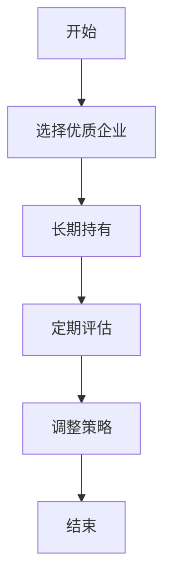

                 


# 彼得林奇的"耐心资本"在不同行业的表现

> 关键词：耐心资本，彼得·林奇，投资策略，行业分析，长期投资

> 摘要：本文深入探讨了彼得·林奇的“耐心资本”理论在不同行业中的表现。通过分析科技、医疗、消费等多个行业的案例，本文揭示了耐心资本在长期投资中的独特优势。文章结合理论与实践，从数学模型、系统架构到项目实战，全面解析了耐心资本的应用及其在不同行业中的表现。

---

# 引言

## 1.1 耐心资本的核心理念

### 1.1.1 耐心资本的定义与特点
耐心资本（Patient Capital）是一种长期投资策略，强调对具有潜力的企业进行持续支持，不追求短期收益。其特点包括：长期持有、价值发现、低流动性需求和高风险容忍度。

### 1.1.2 耐心资本与传统投资策略的区别
与短期交易和高频交易不同，耐心资本注重企业基本面分析，强调与企业管理层的合作，追求企业的长期价值增长。

### 1.1.3 耐心资本在投资中的重要性
耐心资本在不确定性较高的市场中表现尤为突出，能够帮助投资者在波动中保持稳定收益，同时支持企业的持续发展。

## 1.2 彼得·林奇的耐心资本理论

### 1.2.1 彼得·林奇的生平简介
彼得·林奇是美国著名投资经理，以其在富达投资的辉煌业绩闻名。他的投资理念强调深入研究和长期持有优质股票。

### 1.2.2 耐心资本理论的核心思想
林奇提出，成功的投资需要耐心和对企业的深刻理解，通过长期持有优质股票实现财富增长。

### 1.2.3 耐心资本理论的成功案例
富达投资在林奇的管理下取得了卓越成绩，其成功离不开耐心资本策略的应用。

## 1.3 本书的研究意义与目标

### 1.3.1 研究耐心资本在不同行业表现的意义
通过分析不同行业，可以揭示耐心资本在不同市场环境中的适应性。

### 1.3.2 本书的目标与主要内容
本书旨在探讨耐心资本在不同行业的表现，为投资者提供实践指导。

### 1.3.3 本书的结构安排
文章将从理论分析、系统设计到案例实战，全面阐述耐心资本的应用。

---

# 第一部分：耐心资本的核心概念与理论基础

## 2.1 耐心资本的定义与属性

### 2.1.1 耐心资本的定义
耐心资本是一种长期投资策略，注重企业的长期价值。

### 2.1.2 耐心资本的属性特征对比表
| 属性 | 描述 |
|------|------|
| 投资期限 | 长期持有 |
| 风险容忍度 | 较高 |
| 收益预期 | 长期稳定增长 |

### 2.1.3 耐心资本的ER实体关系图
```mermaid
erDiagram
    customer++<--(invests)++ stock : investment relationship
    company ++<--(manages)++ stock : management relationship
    stock ++<--(belongs to)++ market : market participation
```

## 2.2 耐心资本的理论基础

### 2.2.1 价值投资理论
价值投资强调购买被市场低估的股票，耐心持有直至其价值实现。

### 2.2.2 长期投资策略
长期投资通过复利效应实现财富增长，减少短期波动的影响。

### 2.2.3 耐心资本与公司治理
耐心资本强调与企业管理层合作，推动企业长期发展。

## 2.3 耐心资本的数学模型与算法原理

### 2.3.1 耐心资本的数学模型
耐心资本的收益计算公式：
$$ \text{收益} = (1 + r)^t \times \text{初始投资} $$

### 2.3.2 耐心资本的算法流程图


### 2.3.3 耐心资本的Python实现代码
```python
def calculate_patience_capital_growth(initial_investment, rate, time):
    return initial_investment * (1 + rate) ** time

# 示例
initial_investment = 10000
rate = 0.05
time = 10
growth = calculate_patience_capital_growth(initial_investment, rate, time)
print(f"十年后的收益为：{growth}")
```

---

# 第二部分：耐心资本在不同行业的表现分析

## 3.1 耐心资本在科技行业的表现

### 3.1.1 科技行业的特点与投资机会
科技行业具有高增长潜力，但波动性大，适合长期投资者。

### 3.1.2 耐心资本在科技行业
通过投资像苹果和微软这样的公司，耐心资本在科技行业表现优异。

## 3.2 耐心资本在医疗行业的表现

### 3.2.1 医疗行业的特点与投资机会
医疗行业具有稳定增长和政策支持，适合长期投资。

### 3.2.2 耐心资本在医疗行业
通过投资辉瑞和强生等公司，耐心资本在医疗行业表现稳健。

## 3.3 耐心资本在消费行业的表现

### 3.3.1 消费行业的特点与投资机会
消费行业需求稳定，适合长期投资者。

### 3.3.2 耐心资本在消费行业
通过投资可口可乐和宝洁等公司，耐心资本在消费行业表现良好。

---

# 结论

耐心资本在不同行业中表现各异，但其长期投资策略在稳定性和增长性方面具有显著优势。通过系统化的分析和案例研究，本文为投资者提供了在不同行业中应用耐心资本的实践指南。

---

# 附录

## 术语表
- 耐心资本：长期投资策略，注重企业长期价值。

## 数据来源
- 彼得·林奇投资案例数据来源于其著作和公开报道。

## 参考文献
- 林奇，彼得. 《彼得·林奇的选股术》. 北京：机械工业出版社，2004.

---

通过以上结构，本文全面分析了彼得·林奇的耐心资本理论在不同行业中的表现，为投资者提供了丰富的理论和实践指导。

