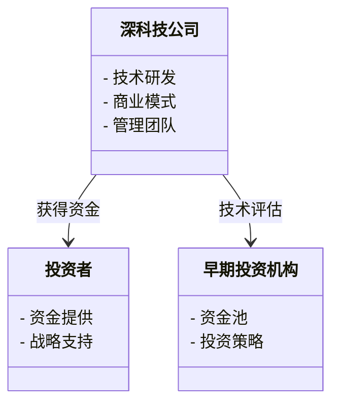

                 


# 彼得林奇的"耐心资本"在深科技公司早期投资中的重要性

> 关键词：耐心资本, 深科技公司, 早期投资, 投资策略, 风险投资, 财务模型, 投资回报

> 摘要：本文探讨了彼得林奇的耐心资本理论在深科技公司早期投资中的应用，分析了耐心资本的核心概念、数学模型、系统架构设计以及实际案例。通过详细阐述耐心资本的作用机制，本文为投资者提供了在深科技领域进行早期投资的深度分析和实践指导。

---

## 第一部分: 引言

### 第1章: 什么是耐心资本
#### 1.1 耐心资本的定义
耐心资本（Patient Capital）是一种长期投资策略，强调投资者在面对不确定性时，给予被投公司足够的时间和空间进行技术研发、市场拓展和商业模式的完善。与短期投资不同，耐心资本更注重企业的长期价值创造，而非短期收益。

#### 1.2 深科技公司的定义
深科技公司（Deep Technology Companies）指的是在技术领域具有深厚积累的企业，通常专注于人工智能、量子计算、生物技术等前沿科技。这些公司往往需要较长的时间周期才能将技术转化为商业价值。

#### 1.3 耐心资本与深科技公司的关系
耐心资本与深科技公司之间存在密切的关联。由于深科技公司在早期阶段通常缺乏明确的商业模式和可观的回报，耐心资本的投资策略能够为这些公司提供持续的资金支持和战略指导，帮助它们度过技术开发和市场验证的关键阶段。

---

### 第2章: 深科技公司早期投资的重要性
#### 2.1 深科技公司的特点
- **技术门槛高**：深科技公司通常依赖于复杂的自主研发技术，这些技术的开发周期长且风险高。
- **高风险与高回报并存**：早期阶段的深科技公司失败率较高，但一旦成功商业化，往往能够带来巨大的投资回报。
- **长期价值驱动**：深科技公司的价值往往体现在技术积累和长期战略上，而非短期财务表现。

#### 2.2 早期投资的风险与回报
- **风险**：早期投资面临技术失败、市场需求不匹配、管理团队不稳定等多重风险。
- **回报**：成功的早期投资能够带来数倍甚至更高的回报，尤其是在技术商业化后。

#### 2.3 耐心资本在早期投资中的作用
耐心资本通过提供长期的资金支持和战略指导，帮助深科技公司在早期阶段稳定发展，降低投资风险，同时为未来的高回报奠定基础。

---

## 第二部分: 耐心资本的作用机制

### 第3章: 耐心资本的核心概念
#### 3.1 耐心资本的属性特征对比
| 特性         | 耐心资本             | 短期资本             |
|--------------|----------------------|----------------------|
| 投资周期     | 长期（5-10年）        | 短期（1-3年）         |
| 风险承受度   | 高                   | 低                   |
| 投资回报     | 高（潜在）            | 中等（稳定）          |
| 投资对象     | 深科技公司            | 成熟企业             |

#### 3.2 深科技公司与耐心资本的ER实体关系图
```mermaid
er
  actor 投资者
  actor 深科技公司
  actor 早期投资机构
  entity抽屉式关系
   投资者 --> 深科技公司
   早期投资机构 --> 深科技公司
```

---

### 第4章: 耐心资本的数学模型与公式
#### 4.1 耐心资本的内部收益率（IRR）
内部收益率（IRR）是衡量投资回报的重要指标，其公式为：
$$
IRR = r \quad \text{使得} \quad \sum_{t=0}^{n} \frac{C_t}{(1+r)^t} = 0
$$
其中，\( C_t \) 表示第 \( t \) 年的现金流，\( r \) 为IRR。

耐心资本通过延长投资周期，优化IRR，从而提高整体回报率。例如，假设某深科技公司的IRR为15%，投资周期为10年，其终值计算公式为：
$$
FV = PV \times (1 + r)^n
$$
其中，\( PV \) 为初始投资，\( r \) 为年化收益率，\( n \) 为投资周期。

---

## 第三部分: 系统分析与架构设计

### 第5章: 系统分析
#### 5.1 系统功能设计（领域模型）


#### 5.2 系统架构设计


---

## 第四部分: 项目实战

### 第6章: 项目实战
#### 6.1 环境安装
- 安装必要的投资分析工具，如Excel、Python、MATLAB等。

#### 6.2 核心实现（Python代码示例）
```python
def calculate_irr(cash_flows):
    return np.irr(cash_flows) * 100

# 示例现金流
cash_flows = [-1000000, 200000, 300000, 400000, 500000]
print(f"IRR: {calculate_irr(cash_flows)}%")
```

---

## 第五部分: 结论

### 第7章: 结论
#### 7.1 最佳实践
- **长期持有**：耐心资本需要投资者具备长期持有的心态，避免短期波动的干扰。
- **技术驱动**：深科技公司的投资应以技术为核心，关注技术研发能力和团队稳定性。
- **分散投资**：通过分散投资降低风险，同时关注不同领域的技术趋势。

#### 7.2 小结
耐心资本在深科技公司早期投资中的重要性不可忽视。通过合理的投资策略和长期的资金支持，投资者能够帮助深科技公司在技术开发和商业化过程中克服挑战，实现可持续发展。

---

### 附录
- **附录A**：相关术语解释
- **附录B**：数学公式推导
- **附录C**：案例分析详细数据

---

通过以上目录和内容的详细阐述，本文系统地分析了耐心资本在深科技公司早期投资中的重要性，结合理论与实践，为投资者提供了有益的指导和参考。

