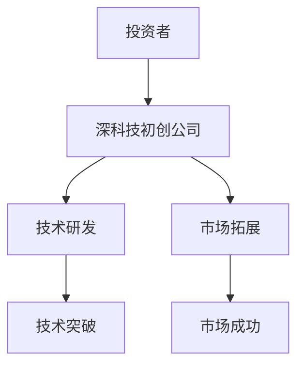
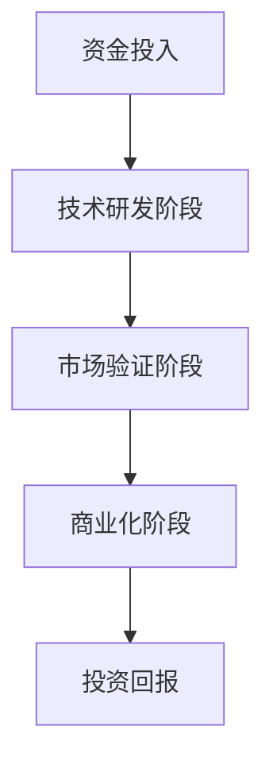
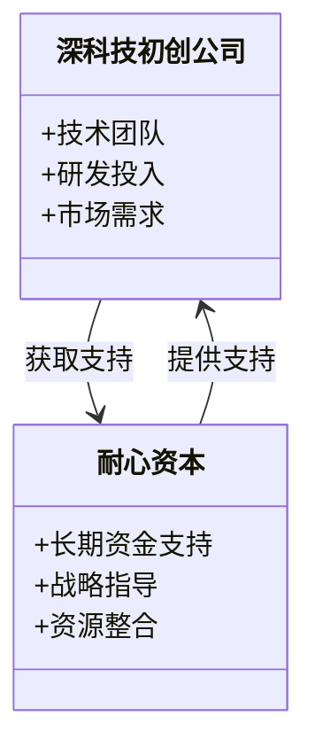
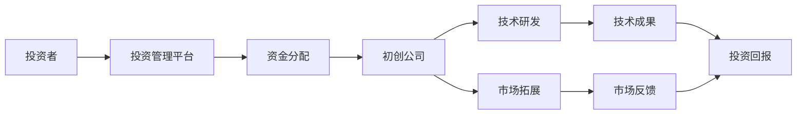

                 


# 彼得林奇的"耐心资本"在深科技初创公司中的角色

## 关键词：彼得林奇、耐心资本、深科技、初创公司、投资策略、长期价值

## 摘要：本文探讨了彼得·林奇提出的“耐心资本”理念在深科技初创公司中的应用。通过分析耐心资本的核心原理、其与深科技初创公司的关系，以及如何通过系统架构和数学模型实现长期价值，本文旨在为投资者和科技创业者提供有价值的见解。

---

## 第1章: 深科技初创公司的定义与特点

### 1.1 深科技的定义与特征
#### 1.1.1 深科技的定义
深科技是指基于前沿科学技术（如人工智能、量子计算、生物技术等）的创新，具有高技术门槛和较长研发周期的科技领域。

#### 1.1.2 深科技与浅科技的区别
- **浅科技**：技术门槛较低，开发周期短，如移动应用、电商平台等。
- **深科技**：技术门槛高，开发周期长，涉及复杂的技术研发和创新。

#### 1.1.3 深科技初创公司的典型特征
- 高研发投入
- 长期价值潜力
- 高风险与高回报并存
- 对专业技术和人才的高度依赖

---

### 1.2 耐心资本的起源与发展

#### 1.2.1 耐心资本的定义
耐心资本是一种长期投资策略，强调在不干预企业日常运营的情况下，为初创公司提供持续的资金支持，以实现长期价值。

#### 1.2.2 耐心资本与传统风险投资的区别
| 特性 | 耐心资本 | 传统风险投资 |
|------|-----------|---------------|
| 投资周期 | 长期（5-10年+） | 短期（3-5年） |
| 投资策略 | 支持企业长期发展 | 追求短期回报 |
| 干预程度 | 少干预或无干预 | 高度干预 |

#### 1.2.3 耐心资本在科技投资中的重要性
- 适用于高风险、高回报的深科技领域。
- 为初创公司提供稳定资金，降低短期压力。
- 通过长期支持，实现投资标的的长期增值。

---

### 1.3 耐心资本与深科技初创公司的结合

#### 1.3.1 耐心资本在深科技领域的独特价值
- 适合深科技初创公司的高研发投入和长回报周期。
- 通过长期支持，帮助公司在技术上实现突破。

#### 1.3.2 深科技初创公司对耐心资本的需求特点
- 需要长期稳定的资金支持。
- 对投资者的耐心和信任度要求较高。

---

## 第2章: 耐心资本与深科技初创公司的关系分析

### 2.1 耐心资本对深科技初创公司的支持机制

#### 2.1.1 资金支持
- 提供长期稳定的资金，支持公司技术研发和市场拓展。
- 减少公司因短期资金压力而做出的非理性决策。

#### 2.1.2 战略支持
- 为公司提供战略指导，帮助其在技术路线和市场拓展上做出正确决策。
- 帮助公司建立行业网络和合作伙伴关系。

#### 2.1.3 资源整合
- 通过投资者的资源网络，帮助公司获取技术、人才和市场资源。
- 为公司提供行业内的最佳实践和经验分享。

---

### 2.2 深科技初创公司对耐心资本的需求特点

#### 2.2.1 高风险与高回报的平衡
- 深科技初创公司通常面临技术失败或市场失败的风险。
- 耐心资本通过长期支持，平衡了高风险与高回报的关系。

#### 2.2.2 长期资金需求
- 深科技初创公司需要大量资金用于技术研发和产品迭代。
- 耐心资本的长期支持能够满足公司的资金需求。

#### 2.2.3 股权结构与控制权问题
- 耐心资本通常采用少量股权、长期持有的方式，避免对公司控制权的过度干预。
- 这种模式有助于保持公司的创新活力和管理灵活性。

---

## 第3章: 耐心资本的核心原理与数学模型

### 3.1 耐心资本的核心原理

#### 3.1.1 长期投资理念
耐心资本的核心理念是通过长期投资，分享公司成长的成果。这种理念强调投资的长期性，而不是短期收益。

#### 3.1.2 风险分担机制
耐心资本通过长期投资，将风险分担到公司的整个生命周期中。投资者和公司共同承担技术和市场的不确定性。

#### 3.1.3 价值创造过程
耐心资本通过支持公司技术研发和市场拓展，帮助公司实现技术突破和商业化，从而创造长期价值。

---

### 3.2 耐心资本与深科技初创公司的关系模型

#### 3.2.1 互动关系模型


#### 3.2.2 投资回报周期模型


---

### 3.3 数学模型与公式

#### 3.3.1 投资回报率公式
$$ ROI = \frac{（最终价值 - 初始投资）}{初始投资} \times 100\% $$

#### 3.3.2 风险评估公式
$$ 风险系数 = \frac{（失败概率 × 损失金额）}{投资金额} $$

---

## 第4章: 系统分析与架构设计

### 4.1 系统功能设计

#### 4.1.1 领域模型


#### 4.1.2 系统架构设计


---

## 第5章: 项目实战

### 5.1 环境安装

#### 5.1.1 投资分析工具
- 使用Excel或Python进行投资回报率分析。

#### 5.1.2 数据分析工具
- 使用Python的Pandas和Matplotlib进行数据分析和可视化。

---

### 5.2 系统核心实现源代码

#### 5.2.1 投资回报率计算代码
```python
def calculate_return(initial_investment, final_value):
    return ((final_value - initial_investment) / initial_investment) * 100

# 示例
initial_investment = 1000000  # 初始投资100万
final_value = 5000000        # 最终价值500万
return_on_investment = calculate_return(initial_investment, final_value)
print(f"投资回报率: {return_on_investment}%")
```

#### 5.2.2 风险评估代码
```python
def risk_assessment(probability, loss_amount, investment):
    risk_coefficient = (probability * loss_amount) / investment
    return risk_coefficient

# 示例
probability = 0.2  # 失败概率20%
loss_amount = 1000000  # 损失金额100万
investment = 5000000  # 投资金额500万
risk = risk_assessment(probability, loss_amount, investment)
print(f"风险系数: {risk}")
```

---

## 第6章: 总结与展望

### 6.1 最佳实践 tips
- **投资者**：选择具有长期发展潜力的深科技初创公司，坚持长期投资理念。
- **初创公司**：充分利用耐心资本的支持，专注于技术研发和市场拓展。

### 6.2 小结
耐心资本通过长期支持，帮助深科技初创公司实现技术突破和商业化，为投资者创造长期价值。

### 6.3 注意事项
- 风险评估是耐心资本投资的重要环节。
- 初创公司需要保持与投资者的良好沟通，确保双方目标一致。

### 6.4 拓展阅读
- 彼得·林奇的《投资之道》
- 深科技领域的相关书籍和研究论文。

---

通过本文的分析，我们可以看出，耐心资本在深科技初创公司中的角色至关重要。它不仅为公司提供了长期的资金支持，还为投资者创造了长期价值。未来，随着深科技领域的不断发展，耐心资本的投资模式将更加重要。

