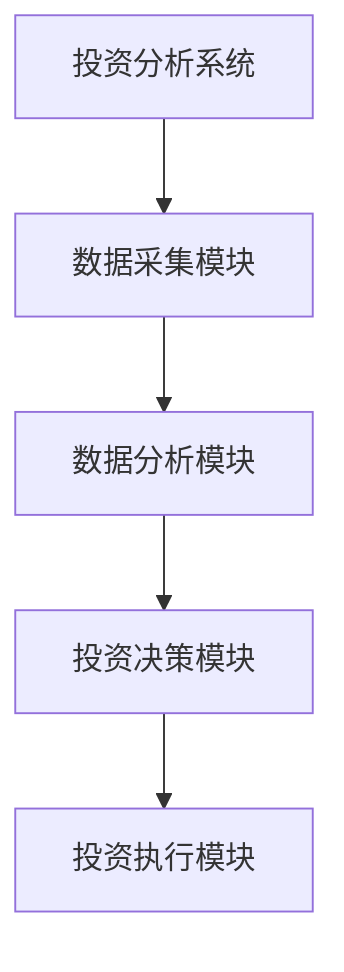

                 


# 彼得林奇的"耐心资本"在深科技投资中的重要性

> 关键词：彼得林奇，耐心资本，深科技投资，投资策略，长期持有

> 摘要：本文探讨了彼得林奇提出的"耐心资本"概念在深科技投资中的重要性。通过分析耐心资本的核心要素、深科技投资的特点以及两者结合的策略，本文旨在揭示耐心资本在深科技领域的独特价值和应用。结合实际案例和系统设计，本文为投资者提供了在深科技领域长期持有的有效方法和最佳实践。

---

## 第一部分：耐心资本与深科技投资的背景

### 第1章：耐心资本的概念与核心要素

#### 1.1 耐心资本的定义与特点
耐心资本（Patient Capital）是一种长期投资策略，强调投资者需要持有优质资产或企业股权足够长的时间，以实现资产的增值。其核心在于“耐心”，即不因短期市场波动而改变投资决策，而是关注企业的长期价值创造。

- **定义**：耐心资本是一种投资理念，强调通过长期持有优质资产，获得稳定的复利收益。
- **特点**：
  - 长期性：投资期限通常为数年甚至数十年。
  - 稳定性：注重企业的长期价值，而非短期收益。
  - 风险承受能力：能够容忍较高的短期波动，追求长期回报。

#### 1.2 深科技投资的定义与特点
深科技投资是指对具有深厚技术壁垒、创新能力强的科技企业的投资。其特点包括高风险、高回报、技术驱动等。

- **定义**：深科技投资是针对那些在核心技术领域具有领先地位的企业进行的投资。
- **特点**：
  - 高风险：技术开发周期长，失败率高。
  - 高回报：技术创新带来的超额收益。
  - 技术驱动：企业的核心竞争力依赖于技术创新。

#### 1.3 耐心资本与深科技投资的关联
耐心资本的核心理念与深科技投资的需求高度契合。深科技企业在技术研发、市场拓展等方面需要长期的资金支持，而耐心资本的长期持有特性正好满足了这一需求。

---

### 第2章：彼得林奇投资理念的核心要素

#### 2.1 彼得林奇的投资哲学
彼得林奇是美国著名的投资经理人，以其长期投资策略和对基本面分析的重视而闻名。他的投资哲学主要包括以下几点：

- **长期投资**：相信市场短期波动不可预测，长期趋势才是关键。
- **价值投资**：寻找那些被市场低估的企业，关注企业的内在价值。
- **分散投资**：通过分散投资降低风险，避免过度集中在单一资产。

#### 2.2 彼得林奇的选股标准
彼得林奇在选股时注重企业的基本面，包括财务状况、行业地位、管理团队等因素。以下是他的选股标准：

- **财务健康**：关注企业的盈利能力、资产负债情况、现金流等。
- **行业地位**：选择行业领先或具有竞争优势的企业。
- **管理团队**：重视管理层的能力和诚信。

#### 2.3 彼得林奇的投资策略
彼得林奇的投资策略以长期持有和分散投资为核心，具体包括：

- **长期持有**：避免频繁交易，减少交易成本。
- **分批投资**：在市场波动时，分批买入以降低风险。
- **风险控制**：通过分散投资降低单一资产的风险。

---

## 第二部分：耐心资本与深科技投资的结合

### 第3章：耐心资本在深科技投资中的策略

#### 3.1 深科技投资的长期性
深科技投资的高风险和高回报特性决定了其需要长期的资金支持。耐心资本的长期性与深科技投资的需求高度契合。

- **长期性**：深科技企业需要数年甚至更长时间的技术研发和市场验证。
- **高风险**：技术失败、市场变化等因素可能导致投资失败。
- **高回报**：技术创新带来的市场垄断地位和高利润率。

#### 3.2 耐心资本在深科技投资中的应用
耐心资本在深科技投资中的应用主要体现在以下方面：

- **长期资金支持**：为深科技企业提供持续的资金支持，帮助企业度过技术研发和市场开拓的难关。
- **风险分担**：通过长期投资分散风险，降低因短期市场波动带来的损失。
- **价值创造**：通过长期持有，分享企业成长的成果。

---

### 第4章：彼得林奇理念与深科技投资的结合

#### 4.1 深科技投资中的耐心资本策略
在深科技投资中，耐心资本的策略可以具体表现为以下几点：

- **长期持有**：投资者需要耐心等待深科技企业的成长，避免因短期波动而放弃。
- **分批投资**：在市场低谷时分批买入，降低投资成本。
- **价值发现**：关注被低估的深科技企业，挖掘其长期价值。

#### 4.2 耐心资本对深科技投资的影响
耐心资本的引入对深科技投资产生了深远的影响：

- **技术创新的支持**：长期资金支持有助于深科技企业专注于技术研发。
- **投资环境的改善**：耐心资本的长期性有助于减少市场的短期波动。
- **投资回报的提升**：通过长期持有，投资者能够分享深科技企业的成长成果。

---

## 第三部分：系统分析与投资实战

### 第5章：系统分析与架构设计

#### 5.1 投资分析系统的功能设计
为了更好地实施耐心资本策略，我们需要构建一个投资分析系统，包括以下几个模块：

- **数据采集模块**：收集深科技企业的基本面数据。
- **数据分析模块**：对企业的财务状况、行业地位等进行分析。
- **投资决策模块**：根据分析结果制定投资策略。

#### 5.2 系统架构设计
以下是投资分析系统的架构设计图：



---

### 第6章：项目实战与代码实现

#### 6.1 投资实战案例
以某家深科技企业为例，我们可以通过以下步骤实施耐心资本策略：

1. **企业基本面分析**：评估企业的财务状况、行业地位等。
2. **长期持有**：决定长期持有该企业的股票。
3. **风险控制**：通过分批投资降低风险。

#### 6.2 代码实现
以下是投资分析系统的部分代码示例：

```python
import pandas as pd
import numpy as np

# 示例数据：深科技企业的财务数据
data = {
    '公司': ['公司A', '公司B', '公司C'],
    '收入': [100, 200, 150],
    '利润': [20, 30, 25]
}

df = pd.DataFrame(data)

# 计算市盈率
df['市盈率'] = df['利润'] / df['收入'] * 100

print(df)
```

---

## 第四部分：总结与展望

### 第7章：总结与展望

#### 7.1 总结
耐心资本在深科技投资中的重要性不言而喻。通过长期持有优质资产，投资者能够分享深科技企业的成长成果，同时降低短期波动带来的风险。

#### 7.2 展望
未来，随着科技的不断进步，耐心资本在深科技投资中的应用将更加广泛。投资者需要更加注重长期价值，选择那些具有强大技术壁垒的企业进行投资。

---

通过本文的分析，我们可以看到，耐心资本不仅是深科技投资的核心理念，也是实现长期价值的重要策略。投资者在实践中需要结合彼得林奇的投资理念，制定合理的投资策略，以实现长期的财富增长。

