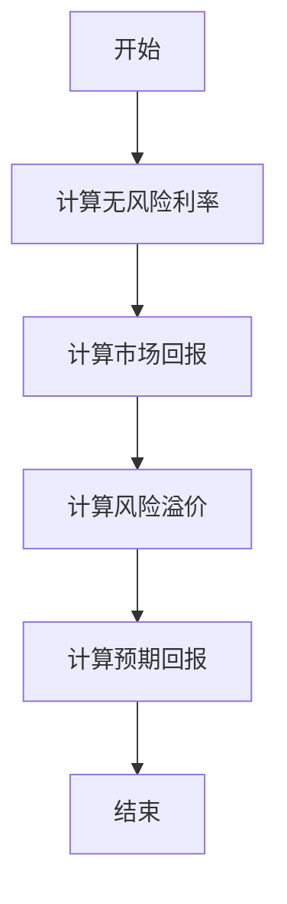
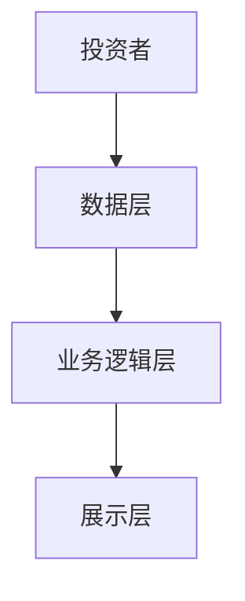

                 


# 彼得林奇的"耐心资本"在颠覆性创新中的角色

## 关键词
- 彼得·林奇
- 耐心资本
- 颠覆性创新
- 长期投资
- 创新策略

## 摘要
本文探讨了彼得·林奇提出的“耐心资本”理念在颠覆性创新中的角色。通过分析耐心资本的定义、特点及其在长期投资中的作用，结合颠覆性创新的典型案例，阐述了耐心资本如何支持颠覆性创新，并为投资者创造长期价值。文章还从数学模型、系统架构等角度深入分析了耐心资本与颠覆性创新的内在联系，最后总结了在实际投资中的应用策略。

---

## 第一部分: 背景介绍

### 第1章: 耐心资本与颠覆性创新的背景

#### 1.1 耐心资本的定义与特点
耐心资本是一种长期投资策略，强调对创新企业的长期支持，不追求短期收益。其特点包括：  
1. **长期性**：投资周期长，通常超过5年。  
2. **低流动性**：资金不易变现，适合需要长期资金支持的企业。  
3. **高风险承受能力**：能够容忍短期亏损，关注长期价值。  

#### 1.2 颠覆性创新的定义与特点
颠覆性创新是指通过新技术或商业模式，破坏现有市场格局的创新行为。其特点包括：  
1. **技术驱动**：依赖技术创新实现突破。  
2. **市场颠覆**：以更低的价格或更好的用户体验进入市场。  
3. **非线性增长**：初期增长缓慢，后期爆发式增长。  

#### 1.3 耐心资本与颠覆性创新的关系
耐心资本为颠覆性创新提供资金支持，而颠覆性创新为耐心资本创造超额回报。两者结合能够降低创新风险，加速创新进程。

### 第2章: 彼得·林奇与耐心资本

#### 2.1 彼得·林奇的生平与投资理念
彼得·林奇是富达投资的传奇基金经理，主张长期投资和价值发现。他认为，成功的投资需要耐心和对企业的深入了解。

#### 2.2 林奇投资理念中的耐心资本
林奇强调，耐心资本是投资成功的关键，尤其是对于颠覆性创新企业。他通过长期持有优质股票，实现超额回报。

### 第3章: 颠覆性创新的案例分析

#### 3.1 颠覆性创新的经典案例
- **苹果公司**：通过创新产品颠覆了消费电子市场。  
- **特斯拉**：通过电动汽车和太阳能技术，改变了汽车行业的格局。  

#### 3.2 耐心资本在创新中的作用
耐心资本为创新企业提供长期资金支持，帮助其度过早期亏损阶段，最终实现爆发式增长。

---

## 第二部分: 核心概念与联系

### 第4章: 耐心资本与颠覆性创新的核心概念

#### 4.1 耐心资本的核心要素
- **长期投资视角**：关注企业的长期价值。  
- **风险承受能力**：能够容忍短期波动。  
- **超额回报预期**：通过长期持有实现收益。  

#### 4.2 颠覆性创新的核心要素
- **技术创新**：核心技术是颠覆的关键。  
- **市场颠覆**：通过创新进入新市场。  
- **创新周期**：从萌芽到成熟的过程。  

#### 4.3 耐心资本与颠覆性创新的联系
耐心资本为创新提供资金支持，而创新为资本创造超额回报。

### 第5章: 核心概念的对比与分析

#### 5.1 耐心资本与风险投资的对比
| 特性             | 耐心资本       | 风险投资       |
|------------------|----------------|----------------|
| 投资期限         | 长期           | 短期           |
| 风险承受能力     | 高             | 中等           |
| 投资目标         | 长期价值       | 短期回报       |

#### 5.2 颠覆性创新与渐进式创新的对比
- **创新速度**：颠覆性创新快，渐进式创新慢。  
- **技术复杂度**：颠覆性创新技术复杂，渐进式创新技术简单。  

---

## 第三部分: 算法原理与数学模型

### 第6章: 算法原理讲解

#### 6.1 预测颠覆性创新成功的算法
使用CAPM模型预测投资回报，公式为：
$$
R = R_f + \beta (R_m - R_f)
$$
其中，$R$ 是预期回报，$R_f$ 是无风险利率，$\beta$ 是风险溢价，$R_m$ 是市场回报。

#### 6.2 算法流程图


### 第7章: 数学模型

#### 7.1 CAPM模型
$$
R = R_f + \beta (R_m - R_f)
$$
- $R$：预期回报  
- $R_f$：无风险利率  
- $\beta$：风险系数  
- $R_m$：市场回报  

---

## 第四部分: 系统分析与架构设计

### 第8章: 系统分析与架构设计方案

#### 8.1 问题场景介绍
设计一个投资决策系统，用于评估耐心资本在颠覆性创新中的应用。

#### 8.2 系统功能设计
- **数据收集**：收集企业创新数据。  
- **模型计算**：使用CAPM模型计算回报。  
- **决策支持**：提供投资建议。  

#### 8.3 系统架构图


---

## 第五部分: 项目实战

### 第9章: 项目实战

#### 9.1 环境安装
- 安装Python和相关库。  

#### 9.2 核心代码实现
```python
import numpy as np

def calculate_return(risk_free_rate, beta, market_return):
    return risk_free_rate + beta * (market_return - risk_free_rate)

# 示例数据
risk_free_rate = 0.05
beta = 1.5
market_return = 0.1

# 计算预期回报
expected_return = calculate_return(risk_free_rate, beta, market_return)
print(f"预期回报: {expected_return}")
```

#### 9.3 实际案例分析
以苹果公司为例，计算其预期回报。

---

## 第六部分: 最佳实践与总结

### 第10章: 最佳实践

#### 10.1 小结
耐心资本在颠覆性创新中起到关键作用，长期投资能够创造超额回报。

#### 10.2 注意事项
- **风险控制**：避免过度集中投资。  
- **持续学习**：关注市场动态。  

#### 10.3 拓展阅读
推荐阅读《彼得·林奇的投资哲学》和《创新者的窘境》。

---

通过以上分析，本文全面探讨了耐心资本在颠覆性创新中的角色，并结合实际案例和数学模型，为投资者提供了有价值的参考。

