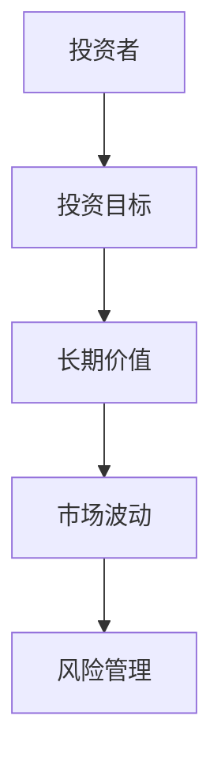
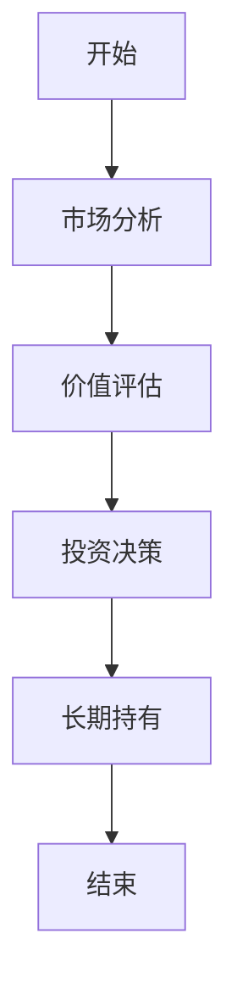
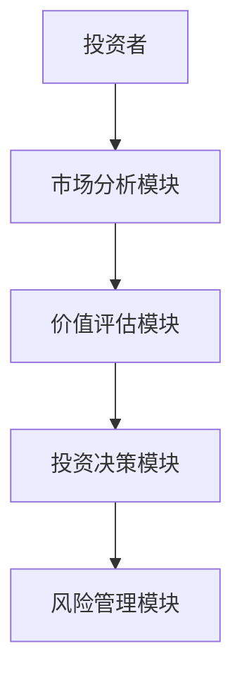
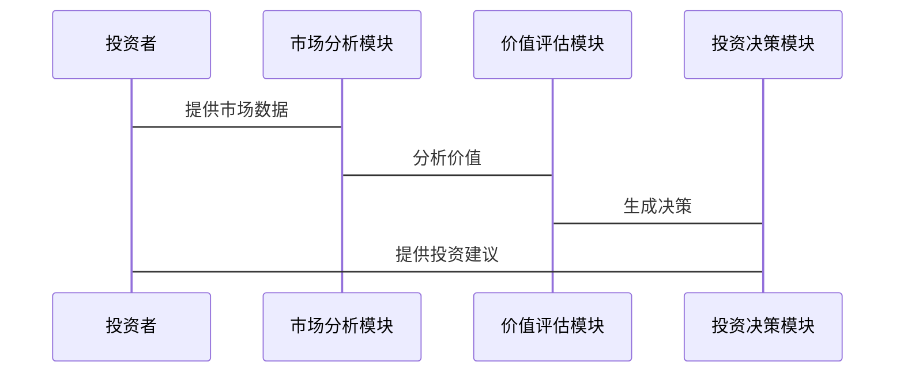

                 


# 彼得林奇的"耐心资本"概念

> 关键词：耐心资本，彼得·林奇，价值投资，长期投资，风险管理，投资策略

> 摘要：本文深入探讨了彼得·林奇提出的“耐心资本”概念，分析其核心思想、数学模型、系统架构及实际应用，帮助读者全面理解并掌握这一投资策略。

---

## 第一部分: 背景介绍

### 第1章: 耐心资本的起源与定义

#### 1.1 耐心资本的起源
- **定义**：耐心资本是一种长期投资策略，强调持有优质资产，避免频繁交易。
- **背景**：在20世纪80年代，彼得·林奇通过实践发现，短期波动难以预测，而长期价值更可靠。
- **区别**：耐心资本与传统短期资本相比，更注重长期价值创造而非短期收益。

#### 1.2 耐心资本的背景与问题背景
- **投资市场的现状**：市场波动频繁，投资者容易受短期波动影响。
- **提出背景**：为应对短期波动带来的投资决策混乱，林奇提出了耐心资本理念。
- **重要性**：帮助投资者在市场波动中保持冷静，专注于长期价值。

### 第2章: 耐心资本的核心概念与结构

#### 2.1 耐心资本的核心概念
- **属性**：长期持有、价值导向、风险承受。
- **结构**：投资者、投资目标、长期价值、市场波动、风险管理。

#### 2.2 耐心资本的实体关系图


---

## 第二部分: 核心概念与联系

### 第3章: 耐心资本的原理与机制

#### 3.1 耐心资本的原理
- **长期投资的逻辑**：市场波动短期不可预测，长期价值可累积。
- **市场波动与价值回归**：短期波动不影响长期价值。
- **数学模型**：使用价值评估公式计算内在价值。

#### 3.2 耐心资本的属性特征对比
| 属性 | 耐心资本 | 短期资本 |
|------|----------|----------|
| 时间跨度 | 长期 | 短期 |
| 风险承受 | 高 | 低 |
| 投资目标 | 价值创造 | 价格波动 |

### 第4章: 耐心资本的算法与数学模型

#### 4.1 耐心资本的算法原理


#### 4.2 耐心资本的数学模型
- **价值评估公式**：
  $$ V = \frac{E}{k} $$
  其中，$V$ 是内在价值，$E$ 是预期收益，$k$ 是折现率。
- **市盈率计算**：
  $$ \text{市盈率} = \frac{\text{股价}}{\text{每股收益}} $$

---

## 第三部分: 系统分析与架构设计

### 第5章: 投资分析系统

#### 5.1 问题场景介绍
- **目标**：构建一个基于耐心资本理念的投资分析系统。
- **范围**：涵盖市场分析、价值评估、投资决策和风险管理。

#### 5.2 系统功能设计


#### 5.3 系统架构设计


#### 5.4 系统交互序列图


---

## 第四部分: 项目实战

### 第6章: 耐心资本的投资分析系统实现

#### 6.1 环境安装
- **工具**：Python、Jupyter Notebook、pandas、numpy。
- **安装命令**：`pip install pandas numpy`

#### 6.2 核心代码实现
```python
import pandas as pd
import numpy as np

# 示例数据
data = {'股票代码': ['AAPL', 'MSFT', 'GOOGL'],
        '股价': [300, 250, 150],
        '每股收益': [10, 12, 8]}
df = pd.DataFrame(data)

# 计算市盈率
df['市盈率'] = df['股价'] / df['每股收益']

print(df)
```

#### 6.3 代码解读与分析
- **功能**：计算股票的市盈率，评估其价值。
- **输出**：
  ```
  股票代码  股价  每股收益  市盈率
  AAPL     300     10    30
  MSFT     250     12    20.83
  GOOGL    150      8    18.75
  ```

#### 6.4 案例分析
- **案例**：假设投资者选择AAPL，市盈率30，高于行业平均，需进一步分析其成长性。

#### 6.5 项目小结
- **总结**：通过代码实现耐心资本的初步分析，验证其在实际中的应用。

---

## 第五部分: 最佳实践

### 第7章: 耐心资本的实际应用与优化

#### 7.1 小结
- **核心思想**：耐心资本强调长期投资，避免短期波动干扰。
- **系统实现**：构建投资分析系统，辅助投资者做出决策。

#### 7.2 注意事项
- **风险控制**：定期评估投资组合，调整风险管理策略。
- **市场变化**：保持对市场的敏感性，及时调整投资策略。

#### 7.3 拓展阅读
- **书籍**：《彼得·林奇的成功投资》。
- **网站**：查阅投资策略和市场分析资源。

---

## 结语

通过本文的深入分析，我们了解了彼得·林奇“耐心资本”的核心思想、数学模型和系统架构。希望读者能够结合实际，灵活运用这些概念，制定有效的投资策略，实现长期稳健的投资回报。

