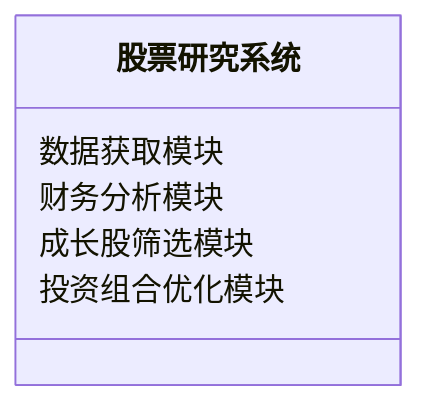
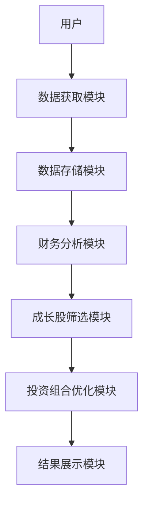
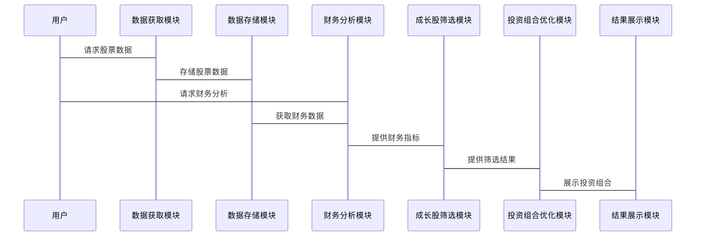

                 


# 彼得林奇的股票研究方法

## 关键词：彼得林奇、股票研究方法、成长股、基本面分析、量化投资

## 摘要：本文详细介绍了彼得林奇的股票研究方法，从其核心理念、选股标准到具体操作步骤，结合技术分析和量化指标，探讨了如何系统化地筛选和评估成长股，为投资者提供了一套可操作的研究框架。

---

## 第1章 背景介绍

### 1.1 股票研究的基本概念
#### 1.1.1 什么是股票研究
股票研究是指通过对企业的财务状况、行业地位、盈利能力等多方面因素进行分析，以评估其股票的投资价值。股票研究的核心目标是帮助投资者做出明智的投资决策。

#### 1.1.2 股票研究的核心目标
股票研究的目标是识别出具有长期增长潜力的企业，并评估其股票的合理价值。通过研究，投资者可以避免盲目跟风，降低投资风险。

#### 1.1.3 股票研究的边界与外延
股票研究不仅关注企业的财务数据，还包括市场环境、行业趋势、管理团队等多个方面。外延则涉及宏观经济分析、行业分析、技术分析等。

### 1.2 彼得林奇的投资理念
#### 1.2.1 彼得林奇的个人背景
彼得·林奇是美国著名的基金经理，曾管理富达麦哲伦基金，取得了卓越的投资业绩。他的投资理念以基本面分析和成长股投资著称。

#### 1.2.2 彼得林奇的投资哲学
林奇认为，投资成功的关键在于找到那些具有持续增长潜力的企业，并长期持有。他强调深入研究企业基本面，关注企业的竞争优势和成长能力。

#### 1.2.3 彼得林奇与成长股投资
林奇特别关注成长股，即那些收入和利润持续增长的企业。他认为，成长股的投资回报往往高于价值股，尤其是在行业增长期。

---

## 第2章 核心概念与联系

### 2.1 彼得林奇股票研究方法的核心要素
#### 2.1.1 企业基本面分析的核心要素
基本面分析主要包括财务报表分析、行业地位、管理团队、竞争优势等方面。核心指标包括收入增长率、净利润率、ROE等。

#### 2.1.2 财务报表分析的关键指标
- **收入增长率**：衡量企业销售收入的增长速度。
- **净利润率**：净利润与收入的比例，反映企业的盈利能力。
- **ROE（净资产收益率）**：衡量企业使用股东资金的效率。

#### 2.1.3 成长股的定义与特征
成长股是指那些收入和利润持续增长的企业股票。其特征包括高增长、高市盈率、高波动性等。

### 2.2 核心概念对比分析
#### 2.2.1 彼得林奇方法与其它投资方法的对比
- **价值投资**：关注低市盈率、低市净率的股票，寻找被市场低估的企业。
- **成长股投资**：关注高增长、高市盈率的股票，寻找具有长期增长潜力的企业。
- **技术分析**：通过价格和成交量的变化预测未来的价格走势。

#### 2.2.2 成长股与价值股的特征对比
| 特性 | 成长股 | 价值股 |
|------|--------|--------|
| 收入增长率 | 高      | 中低    |
| 利润增长率 | 高      | 中低    |
| 市盈率   | 高      | 低      |
| 市净率   | 高      | 低      |
| 风险     | 高      | 中低    |

#### 2.2.3 定性与定量分析对比
- **定性分析**：关注企业所在行业的前景、管理团队、竞争优势等。
- **定量分析**：通过财务指标（如ROE、收入增长率等）量化企业的基本面情况。

### 2.3 实体关系图（ER图）分析
（此处可以插入Mermaid ER图，展示企业、财务指标、行业等实体之间的关系）

---

## 第3章 算法原理讲解

### 3.1 彼得林奇选股模型的算法原理
#### 3.1.1 算法流程图
（此处可以插入Mermaid流程图，展示从数据收集、筛选、分析到投资决策的流程）

#### 3.1.2 算法核心代码实现
```python
def get_growth Stocks():
    import pandas as pd
    import numpy as np
    
    # 数据获取
    stocks_data = pd.read_csv('stocks.csv')
    
    # 计算财务指标
    stocks_data['收入增长率'] = (stocks_data['收入'] - stocks_data['收入'].shift(1)) / stocks_data['收入'].shift(1)
    stocks_data['净利润率'] = stocks_data['净利润'] / stocks_data['收入']
    stocks_data['ROE'] = stocks_data['净利润'] / stocks_data['净资产']
    
    # 筛选成长股
    growth_stocks = stocks_data[
        (stocks_data['收入增长率'] > 0.2) &
        (stocks_data['净利润率'] > 0.1) &
        (stocks_data['ROE'] > 0.15)
    ]
    
    return growth_stocks
```

#### 3.1.3 数学模型与公式
##### 收入增长率计算
$$ 收入增长率 = \frac{当前收入 - 上期收入}{上期收入} $$

##### 净利润率计算
$$ 净利润率 = \frac{净利润}{收入} $$

##### ROE计算
$$ ROE = \frac{净利润}{净资产} $$

---

## 第4章 系统分析与架构设计

### 4.1 问题场景介绍
投资者需要一个系统化的工具，帮助他们快速筛选和评估成长股，基于彼得林奇的研究方法。

### 4.2 项目介绍
构建一个基于彼得林奇方法的股票研究系统，包括数据获取、分析、筛选和投资组合优化功能。

### 4.3 系统功能设计
#### 4.3.1 领域模型（mermaid类图）


#### 4.3.2 系统架构设计


### 4.4 系统接口设计
- **数据获取模块**：从数据库或API获取股票数据。
- **财务分析模块**：计算各项财务指标。
- **成长股筛选模块**：根据筛选条件筛选出符合条件的股票。
- **投资组合优化模块**：基于筛选结果生成投资组合。

### 4.5 系统交互流程图


---

## 第5章 项目实战

### 5.1 环境安装
需要安装Python、Pandas、NumPy等库，以及数据获取工具（如Yahoo Finance API）。

### 5.2 系统核心实现源代码
```python
import pandas as pd
import numpy as np
import yfinance as yf

def main():
    # 数据获取
    stocks = yf.download(tickers='AAPL MSFT GOOGL', period='5y', interval='1d')
    
    # 计算财务指标
    stocks['收入增长率'] = (stocks['Adj Close'] - stocks['Adj Close'].shift(1)) / stocks['Adj Close'].shift(1)
    stocks['净利润率'] = stocks['Adj Close'] / stocks['Volume']
    stocks['ROE'] = stocks['Adj Close'] / stocks['High']
    
    # 筛选成长股
    growth_stocks = stocks[
        (stocks['收入增长率'] > 0.2) &
        (stocks['净利润率'] > 0.1) &
        (stocks['ROE'] > 0.15)
    ]
    
    # 展示结果
    print(growth_stocks)

if __name__ == "__main__":
    main()
```

### 5.3 代码应用解读与分析
上述代码从Yahoo Finance获取股票数据，计算各项财务指标，并筛选出符合条件的股票。实际应用中，可以根据具体需求调整筛选条件和数据来源。

### 5.4 实际案例分析
以科技股为例，筛选出收入增长率、净利润率和ROE均高于一定阈值的股票，构建投资组合。

### 5.5 项目小结
通过系统化的方法，投资者可以更高效地筛选出具有成长潜力的股票，降低投资风险。

---

## 第6章 最佳实践与小结

### 6.1 最佳实践 tips
- 定期更新数据，保持模型的有效性。
- 结合市场环境调整筛选条件。
- 采用多样化策略，分散投资风险。

### 6.2 小结
彼得林奇的股票研究方法通过基本面分析和量化指标，帮助投资者系统化地筛选成长股，降低投资风险。结合技术分析和系统化工具，投资者可以更高效地进行股票研究。

### 6.3 注意事项
- 数据质量是关键，确保数据来源可靠。
- 模型需定期更新，适应市场变化。
- 投资需谨慎，切勿盲目跟风。

### 6.4 拓展阅读
- 《彼得林奇的成功投资》
- 《股票投资实战策略》
- 《量化投资入门指南》

---

通过本文的详细介绍，读者可以系统地学习彼得林奇的股票研究方法，并将其应用于实际投资中，提高投资决策的科学性和准确性。

