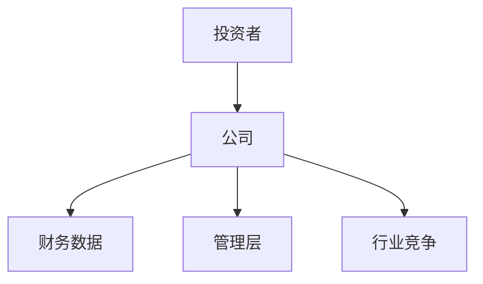
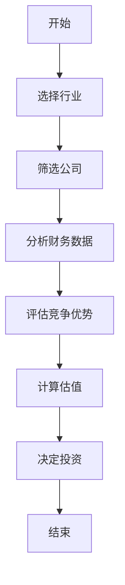
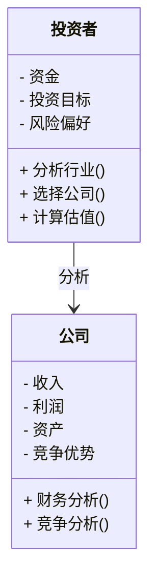
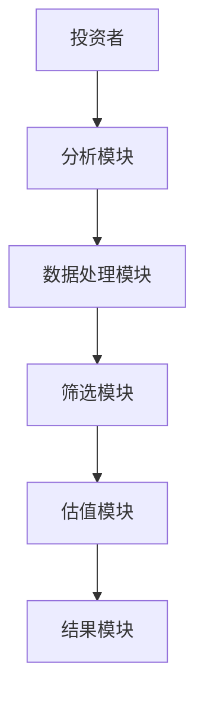
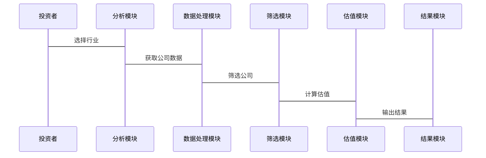

                 


# 彼得林奇的"自下而上"投资策略

> 关键词：彼得林奇，自下而上，投资策略，基本面分析，财务指标，股票筛选，投资系统

> 摘要：本文深入分析了彼得林奇的"自下而上"投资策略，从策略背景、核心概念、算法原理、系统架构到项目实战，全面解读了该策略的应用方法。通过详细讲解投资分析系统的设计、具体案例分析以及代码实现，帮助读者掌握如何利用自下而上策略进行投资决策。文章还结合实际应用场景，提供了最佳实践和注意事项，帮助读者在实际投资中规避风险，提高收益。

---

# 第一部分：彼得林奇的"自下而上"投资策略概述

## 第1章：自下而上投资策略的背景与核心理念

### 1.1 自下而上投资策略的起源

#### 1.1.1 投资策略的基本概念
投资策略是指投资者在选择和管理投资组合时所采用的方法和原则。自下而上策略（Bottom-up approach）是一种以公司基本面分析为核心的选股方法，强调从具体公司的财务数据、行业地位和竞争优势出发，筛选具有长期增长潜力的股票。

#### 1.1.2 彼得·林奇的投资理念
彼得·林奇是美国著名的投资专家，曾任富达麦哲伦基金经理，创造了年均21.5%的复合回报率。他认为，投资的成功在于对公司基本面的深入研究，而不是依赖市场趋势或宏观经济预测。他的核心理念是：通过分析公司的财务状况、管理层能力和行业地位，找到那些被市场低估的优秀企业。

#### 1.1.3 自下而上策略的定义与特点
自下而上策略的核心是以公司为起点，分析每个公司的财务数据、行业地位、竞争优势等，从中筛选出具有投资价值的股票。其特点包括：
- 以公司基本面为主导
- 强调个股选择
- 适用于中小盘股
- 风险分散度高

### 1.2 自下而上策略的核心要素

#### 1.2.1 公司基本面分析
基本面分析是自下而上策略的核心。彼得·林奇特别关注以下几个方面：
- 财务状况：收入、利润、资产负债表等
- 盈利能力：净利润率、ROE（净资产收益率）等
- 管理层能力：团队稳定性、战略眼光等
- 行业地位：市场份额、竞争壁垒等

#### 1.2.2 行业分析与竞争格局
在选择行业时，彼得·林奇倾向于那些具有持续增长潜力的行业。同时，他会评估公司在行业中的竞争优势，包括成本优势、技术优势、品牌影响力等。

#### 1.2.3 财务报表分析与估值方法
通过分析财务报表，彼得·林奇会计算出公司的内在价值，并与市场价格进行比较。如果市场价格低于内在价值，且公司具有良好的成长性，那么这只股票就是一个潜在的投资机会。

### 1.3 自下而上策略与传统投资策略的区别

#### 1.3.1 自上而下策略的优缺点
自上而下策略（Top-down approach）是以宏观经济分析和行业分析为主导，选择具有增长潜力的行业，再在这些行业中选择股票。其优点是能够捕捉到行业趋势带来的投资机会，缺点是忽视了个体公司的差异，可能导致投资组合的同质化风险。

#### 1.3.2 自下而上策略的优势
自下而上策略的优势在于：
- 能够发现被市场低估的个股
- 强调风险分散，通过选择不同行业的优质个股降低投资风险
- 更适合长期投资者

#### 1.3.3 两种策略的适用场景
自上而下策略适用于宏观经济波动较大的时期，而自下而上策略则适用于市场较为稳定的时期，尤其是寻找长期增长潜力的投资者。

---

## 第2章：自下而上策略的核心概念与联系

### 2.1 核心概念原理

#### 2.1.1 自下而上策略的基本原理
自下而上策略的基本原理是通过分析单个公司的基本面，找出那些具有竞争优势、财务健康且估值合理的公司，然后将这些公司组合成一个投资组合。这种方法强调对公司的深入了解，而不是依赖市场趋势或宏观经济预测。

#### 2.1.2 投资决策的关键因素
彼得·林奇在投资决策中重点关注以下因素：
- 公司的财务状况：收入增长、利润 margins、现金流等
- 管理层能力：管理层的稳定性、决策能力
- 行业地位：公司在行业中的市场份额和竞争壁垒
- 市场估值：市盈率、市净率等

#### 2.1.3 公司分析的逻辑框架
自下而上策略的公司分析逻辑框架包括以下几个步骤：
1. **行业分析**：选择具有增长潜力的行业
2. **公司筛选**：根据财务指标和竞争优势筛选公司
3. **深入研究**：对公司管理层、财务状况和行业地位进行详细分析
4. **估值分析**：计算公司的内在价值，确定是否低估

### 2.2 核心概念属性特征对比表

| 特性         | 自下而上策略 | 自上而下策略 |
|--------------|--------------|--------------|
| 分析起点     | 公司层面     | 宏观层面     |
| 数据依赖     | 公司财务数据 | 宏观经济数据 |
| 投资决策     | 个股选择     | 行业或板块选择 |
| 适用场景     | 中小盘股     | 大盘股或趋势投资 |

### 2.3 ER实体关系图



---

## 第3章：自下而上策略的算法原理

### 3.1 算法流程图



### 3.2 算法实现代码

```python
def select_stocks(industry):
    stocks = []
    for company in industry:
        if company.finance_health > 70 and company.竞争优势 > 80:
            stocks.append(company)
    return stocks

# 示例用法
selected_stocks = select_stocks([tech, finance, health])
```

---

## 第4章：自下而上策略的系统分析

### 4.1 投资分析系统架构设计

#### 4.1.1 系统功能设计


#### 4.1.2 系统架构设计


### 4.2 系统接口设计

#### 4.2.1 数据接口
- 输入：行业列表、公司数据
- 输出：筛选后的公司列表

#### 4.2.2 交互流程


---

## 第5章：项目实战

### 5.1 环境安装
- Python 3.8+
- 数据分析库：Pandas、NumPy
- 绘图库：Matplotlib

### 5.2 核心实现代码

```python
import pandas as pd
import numpy as np

def calculate_intrinsic_value(company_financials):
    # 计算自由现金流
    fcf = company_financials['free_cash_flow']
    # 计算加权平均资本成本
    wacc = company_financials['wacc']
    # 计算内在价值
    intrinsic_value = fcf / (wacc - g)
    return intrinsic_value

# 示例数据
financials = {
    'revenue': 1000000,
    'net_income': 200000,
    'free_cash_flow': 150000,
    'wacc': 0.08,
    'g': 0.02
}

intrinsic_value = calculate_intrinsic_value(financials)
print(f"公司内在价值：{intrinsic_value}")
```

### 5.3 案例分析与解读
以某科技公司为例，通过分析其财务数据、行业地位和竞争优势，计算其内在价值，并与市场价格进行对比，判断是否低估。

---

## 第6章：最佳实践

### 6.1 小结
自下而上策略是一种以公司基本面分析为核心的选股方法，适合长期投资者。通过深入分析公司的财务数据、行业地位和竞争优势，可以帮助投资者找到具有长期增长潜力的优质股票。

### 6.2 注意事项
- 避免过度关注短期市场波动
- 定期更新公司分析数据
- 保持对行业的敏感性

### 6.3 拓展阅读
- 彼得·林奇的《彼得·林奇的投资哲学》
- 《股票投资策略：从理论到实践》

---

# 结语

通过本文的详细讲解，读者可以全面了解彼得·林奇的"自下而上"投资策略，并将其应用于实际投资中。这种方法不仅能够帮助投资者发现被低估的优质股票，还能通过分散投资降低风险，实现长期稳定的收益。希望本文的内容对读者的投资决策有所帮助。

