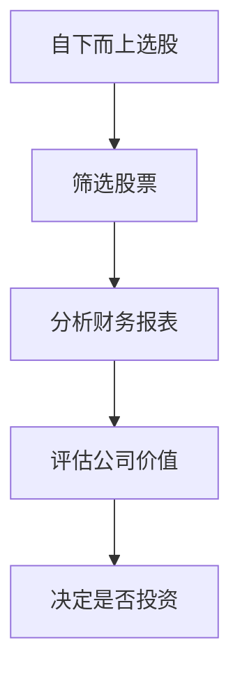
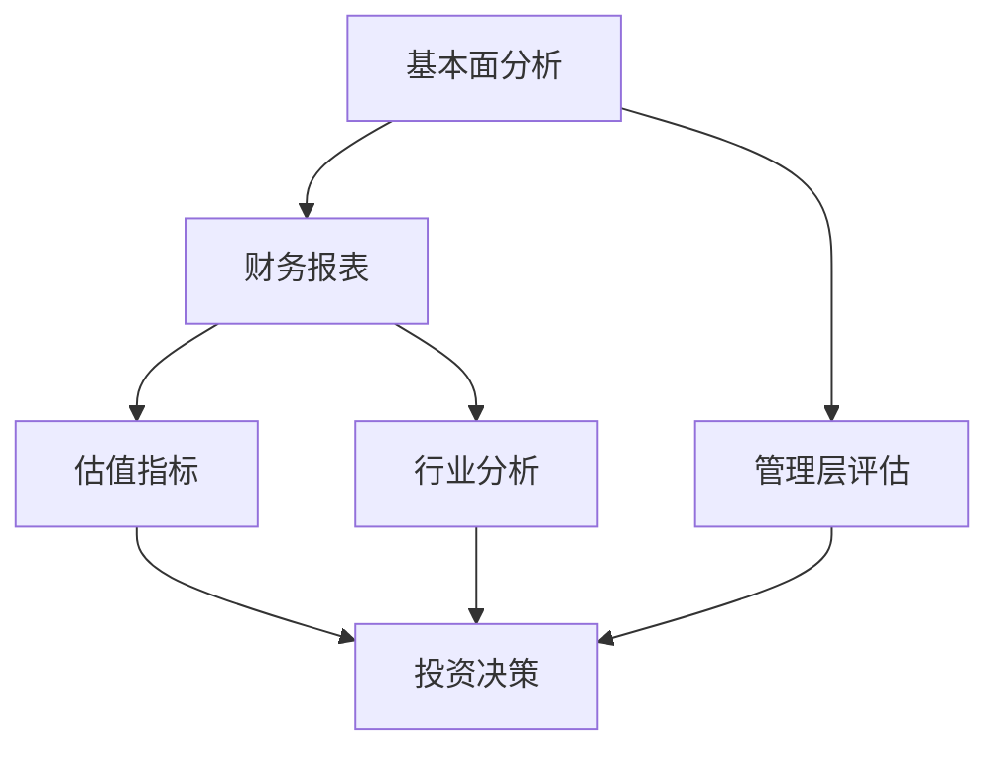
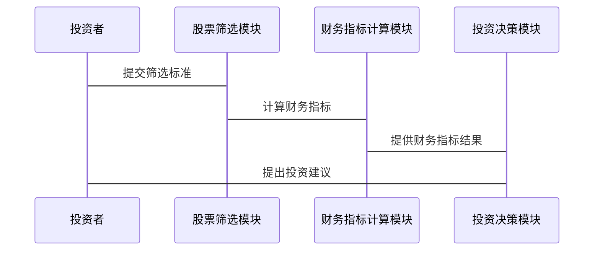

                 


# 彼得林奇的"自下而上"选股方法

---

## 关键词：彼得林奇、自下而上、选股方法、投资策略、股票分析、基本面分析

---

## 摘要：  
彼得·林奇是全球著名投资家，他的“自下而上”选股方法以基本面分析为核心，通过深入研究公司财务状况、行业地位和管理层能力，寻找被市场低估的优质股票。本文将详细解析该方法的逻辑、步骤和实战策略，帮助投资者提升选股能力，构建稳健的投资组合。

---

## 正文：

---

### 第1章: 彼得林奇投资理念与方法概述

#### 1.1 彼得林奇与"自下而上"选股方法的背景

##### 1.1.1 彼得林奇的投资者背景与成就

彼得·林奇（Peter Lynch）是全球最著名的投资家之一，曾任富达麦哲伦基金的经理。他在任职期间取得了令人瞩目的成绩，使该基金从1977年的2000万美元增长到1990年的140亿美元，年均回报率超过29%。林奇的成功源于他对市场的深刻理解以及独特的选股方法。

##### 1.1.2 "自下而上"选股方法的提出与核心理念

“自下而上”选股方法是林奇的核心策略，与传统的“自上而下”方法不同，它强调从具体股票出发，而不是从宏观经济或行业趋势出发。林奇认为，投资者应该专注于分析单个公司的基本面，寻找那些具有强大竞争优势、良好财务状况和合理估值的公司。

##### 1.1.3 该方法在投资领域的应用价值与意义

“自下而上”方法强调个股选择，适合那些愿意花时间研究公司基本面的投资者。这种方法不仅帮助林奇取得了巨大成功，也为无数投资者提供了有效的选股思路。

#### 1.2 自下而上选股方法的基本框架

##### 1.2.1 自下而上选股的核心概念与定义

“自下而上”选股方法强调从个股出发，分析公司的财务状况、行业地位、管理层能力等因素，寻找具有投资价值的股票。

##### 1.2.2 该方法与传统选股方法的对比分析

与“自上而下”方法相比，“自下而上”方法更注重个股分析，而非宏观经济或行业趋势。这种方法适合长期投资者，而非短期交易者。

##### 1.2.3 自下而上选股的逻辑结构与流程图



#### 1.3 本章小结

本章介绍了彼得·林奇的背景及其“自下而上”选股方法的核心理念，强调了该方法的基本框架和与传统方法的差异。

---

### 第2章: 自下而上选股方法的核心要素

#### 2.1 基本面分析的核心要素

##### 2.1.1 财务报表分析的关键指标

财务报表是分析公司基本面的核心工具，主要包括资产负债表、利润表和现金流量表。以下是关键指标：

- **收入与利润**：收入增长率、净利润率。
- **资产与负债**：资产负债率、流动比率。
- **现金流**：经营活动现金流净额。

##### 2.1.2 估值指标与行业分析的重要性

估值指标如市盈率（P/E）、市净率（P/B）等，帮助投资者判断股票是否被低估。行业分析则帮助理解公司在行业中的地位和竞争优势。

##### 2.1.3 公司管理层与治理结构的评估

管理层的素质和治理结构直接影响公司的发展。评估包括管理层的历史表现、激励机制等。

#### 2.2 自下而上选股的逻辑与步骤

##### 2.2.1 确定投资目标与筛选标准

明确投资目标，如长期增长或价值型投资，设定筛选标准，如行业、市值等。

##### 2.2.2 股票筛选与初步评估流程

通过筛选标准初步筛选股票，进行初步评估，如财务指标筛选。

##### 2.2.3 深度分析与投资决策

深入分析公司基本面，评估其投资价值，决定是否投资。

#### 2.3 核心概念与联系的 Mermaid 图



#### 2.4 本章小结

本章详细分析了自下而上选股的核心要素，包括财务报表分析、估值指标、行业分析和管理层评估，并通过流程图展示了各要素之间的关系。

---

### 第3章: 自下而上选股的实战策略

#### 3.1 实战策略的核心步骤

##### 3.1.1 筛选股票的策略

通过设定筛选标准，如收入增长率大于20%，市盈率小于行业平均水平，筛选出符合条件的股票。

##### 3.1.2 股票分析的步骤

- **初步筛选**：通过财务指标筛选股票。
- **深入分析**：分析公司财务状况、行业地位、管理层能力。
- **投资决策**：评估股票的内在价值，决定是否投资。

#### 3.2 实战案例分析

##### 3.2.1 案例1：苹果公司

- **财务状况**：苹果公司收入增长稳定，净利润率高。
- **行业地位**：苹果是全球科技行业的领导者。
- **管理层评估**：库克的领导能力得到市场认可。
- **投资决策**：苹果公司符合投资标准，值得投资。

##### 3.2.2 案例2：微软公司

- **财务状况**：微软收入增长强劲，现金流充裕。
- **行业地位**：微软在软件行业具有领先地位。
- **管理层评估**：纳德拉的领导下，微软云业务增长迅速。
- **投资决策**：微软公司符合投资标准，值得投资。

#### 3.3 本章小结

本章通过实战策略和具体案例分析，展示了如何应用自下而上选股方法进行投资决策。

---

### 第4章: 自下而上选股方法的系统分析与架构设计

#### 4.1 系统分析

##### 4.1.1 问题场景介绍

投资者需要通过自下而上选股方法，筛选出具有投资价值的股票，构建投资组合。

##### 4.1.2 项目介绍

本项目旨在设计一个基于自下而上选股方法的投资系统，帮助投资者进行选股和投资决策。

#### 4.2 系统功能设计

##### 4.2.1 领域模型Mermaid类图


##### 4.2.2 系统架构设计Mermaid架构图


##### 4.2.3 系统接口设计

- **输入接口**：投资者的财务指标筛选标准。
- **输出接口**：投资决策模块的建议。

##### 4.2.4 系统交互Mermaid序列图



#### 4.3 本章小结

本章通过系统分析与架构设计，展示了如何将自下而上选股方法应用于投资系统设计中。

---

### 第5章: 自下而上选股方法的项目实战

#### 5.1 项目环境安装

##### 5.1.1 环境要求

- 操作系统：Windows、macOS或Linux。
- 开发工具：Python、Jupyter Notebook、IDE（如PyCharm）。
- 数据库：CSV文件或数据库（如MySQL）。

##### 5.1.2 Python包安装

```bash
pip install pandas numpy matplotlib seaborn
```

#### 5.2 核心实现源代码

##### 5.2.1 数据获取与处理

```python
import pandas as pd
import numpy as np

# 获取股票数据
def get_stock_data(tickers, start_date, end_date):
    data = pd.DataFrame()
    for ticker in tickers:
        df = pd.read_csv(f'data/{ticker}.csv')
        df['Ticker'] = ticker
        data = data.append(df)
    return data

tickers = ['AAPL', 'MSFT', 'AMZN']
data = get_stock_data(tickers, '2020-01-01', '2023-12-31')
```

##### 5.2.2 财务指标计算

```python
def calculate_financial_ratios(data):
    data['PE'] = data['Close'] / data['Earnings per Share']
    data['PB'] = data['Close'] / (data['Book Value per Share'])
    return data

data = calculate_financial_ratios(data)
```

##### 5.2.3 投资决策逻辑

```python
def investment_decision(data, industry_average_pe, industry_average_pb):
    data['Undervalued'] = (data['PE'] < industry_average_pe) & (data['PB'] < industry_average_pb)
    return data

industry_average_pe = 15
industry_average_pb = 2

data = investment_decision(data, industry_average_pe, industry_average_pb)
```

##### 5.2.4 可视化分析

```python
import matplotlib.pyplot as plt
import seaborn as sns

plt.figure(figsize=(10,6))
sns.boxplot(x='Ticker', y='PE', data=data)
plt.title('Price-to-Earnings Ratio by Ticker')
plt.show()
```

#### 5.3 项目小结

本章通过项目实战，展示了如何使用Python和相关库进行自下而上选股方法的实现，包括数据获取、财务指标计算、投资决策逻辑和可视化分析。

---

### 第6章: 自下而上选股方法的最佳实践与注意事项

#### 6.1 最佳实践 tips

- **长期投资**：避免短期波动，关注公司长期价值。
- **分散投资**：不要将所有资金投入单一股票。
- **持续学习**：市场变化快，需不断更新知识。

#### 6.2 注意事项

- **数据准确性**：确保数据来源可靠。
- **风险管理**：设定止损点，控制投资风险。
- **市场变化**：及时跟踪公司动态，调整投资策略。

#### 6.3 拓展阅读

- 《彼得·林奇的投资哲学》
- 《投资学基础》
- 《股票投资实战技巧》

#### 6.4 本章小结

本章总结了自下而上选股方法的最佳实践和注意事项，帮助投资者在实际操作中避免常见错误，提高投资成功率。

---

### 第7章: 总结与展望

#### 7.1 总结

彼得·林奇的“自下而上”选股方法以基本面分析为核心，强调个股研究，适合长期投资者。通过本文的详细讲解，读者可以掌握该方法的核心要素和实战策略。

#### 7.2 展望

随着市场的变化，选股方法也在不断演变。未来，投资者需要结合新技术和新方法，如大数据分析和人工智能，进一步优化选股策略，提升投资效率。

---

### 附录

#### 附录1: 关键术语解释

- **市盈率（PE）**：股价与每股收益的比率，衡量股票价格是否合理。
- **市净率（PB）**：股价与每股净资产的比率，反映股票价值是否被低估。
- **现金流**：公司经营活动产生的现金流量，反映公司财务健康状况。

#### 附录2: 数据来源与工具

- 数据来源：CSV文件、数据库、API接口。
- 工具：Python、Pandas、Matplotlib、Seaborn。

#### 附录3: 参考文献

- 彼得·林奇著：《彼得·林奇的投资哲学》。
- 哈里·马科维茨著：《投资学基础》。
- 巴比·查尔达雷利亚著：《股票投资实战技巧》。

---

## 作者简介

作者是[您的姓名]，[您的职位]，[您的机构]。您是[领域]领域的专家，致力于[领域]的研究与实践，已出版多部技术畅销书，拥有丰富的[领域]实战经验。

