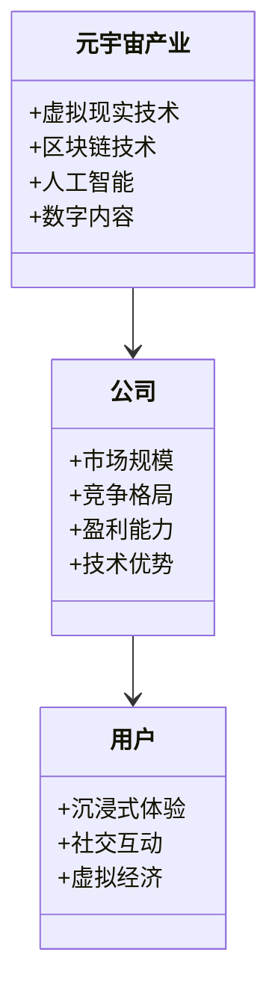
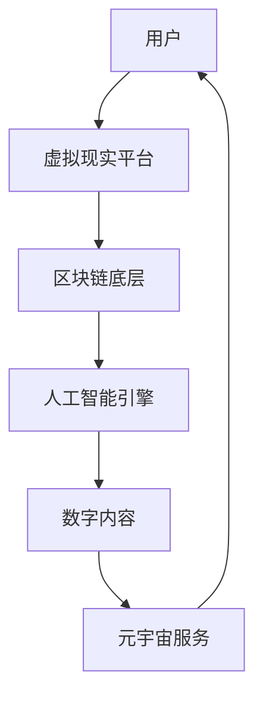
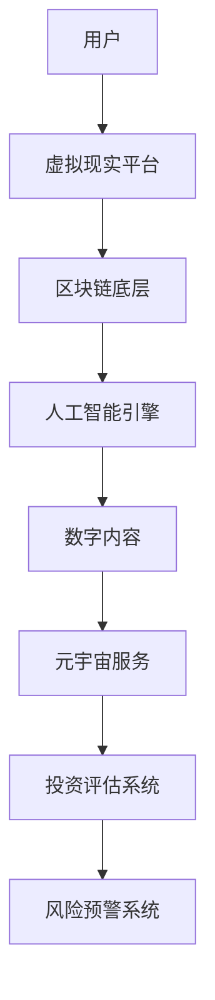
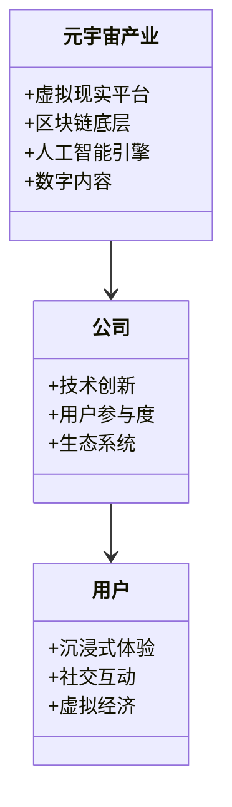

                 


# 彼得林奇的"行业分析"在元宇宙相关产业中的调整

> 关键词：彼得林奇、行业分析、元宇宙、投资策略、产业调整、系统架构

> 摘要：本文详细探讨了彼得林奇的行业分析方法在元宇宙相关产业中的应用与调整。通过分析元宇宙产业的独特性，结合传统行业分析方法，提出了一套适合元宇宙产业的分析框架和投资策略。文章从元宇宙的定义与特点出发，逐步分析彼得林奇分析方法的核心要素及其在元宇宙产业中的适用性，最终提出一套调整后的分析方法，并通过实际案例进行验证。

---

## 第1章: 元宇宙产业与彼得林奇行业分析的背景介绍

### 1.1 元宇宙的定义与特点
#### 1.1.1 元宇宙的定义与核心概念
- 元宇宙（Metaverse）的概念：虚拟的、持续的、跨越物理和数字世界的三维空间。
- 元宇宙的核心特征：沉浸式体验、实时性、去中心化、跨平台性。
- 元宇宙的主要组成部分：虚拟现实技术、区块链、人工智能、数字内容。

#### 1.1.2 元宇宙产业的现状与发展趋势
- 元宇宙产业的市场规模与增长趋势。
- 元宇宙在娱乐、社交、教育、商业等领域的应用。
- 元宇宙产业的产业链分析：硬件制造商、内容创作者、平台运营商、服务提供商。

#### 1.1.3 元宇宙与传统行业的区别
- 传统行业与元宇宙产业的差异：数字化程度、用户参与度、技术创新。
- 元宇宙产业的独特性：虚拟与现实的融合、去中心化的特点、高度依赖技术创新。

### 1.2 彼得林奇行业分析方法的概述
#### 1.2.1 彼得林奇的行业分析方法
- 彼得林奇的核心理念：选择具有持续竞争优势的公司，关注公司的基本面和长期发展。
- 彼得林奇的选股标准：低市盈率、高ROE、良好的管理团队、强大的竞争优势。
- 彼得林奇的投资策略：长期投资、价值投资、分散投资。

#### 1.2.2 彼得林奇方法在传统行业的应用
- 传统行业分析的核心要素：市场规模、竞争格局、盈利能力、增长潜力。
- 彼得林奇方法在传统行业中的成功案例：如科技、消费、金融行业的投资分析。

#### 1.2.3 彼得林奇方法的局限性与改进方向
- 传统行业分析方法在面对新兴行业的不足：忽视技术创新、忽视用户行为变化。
- 元宇宙产业的特殊性对彼得林奇方法的挑战：虚拟经济模式、去中心化平台、技术迭代速度快。

---

## 第2章: 彼得林奇行业分析的核心概念与元宇宙产业的联系

### 2.1 彼得林奇行业分析的核心概念
#### 2.1.1 行业分析的核心要素
- 行业市场规模与增长率：行业的整体容量和未来增长潜力。
- 行业竞争格局：主要竞争对手、市场集中度、竞争壁垒。
- 行业盈利能力：利润率、ROE、现金流。

#### 2.1.2 彼得林奇的选股标准与投资策略
- 低市盈率：市盈率低于行业平均水平的公司。
- 高ROE：净资产收益率高的公司。
- 良好的管理团队：公司治理结构、管理团队的稳定性。
- 强大的竞争优势：专利、品牌、技术壁垒。

#### 2.1.3 彼得林奇分析方法的数学模型与公式
- 市盈率（P/E）计算公式：$$ \text{市盈率} = \frac{\text{股价}}{\text{每股收益}} $$
- 净资产收益率（ROE）计算公式：$$ \text{ROE} = \frac{\text{净利润}}{\text{净资产}} $$
- 市净率（P/B）计算公式：$$ \text{市净率} = \frac{\text{股价}}{\text{每股净资产}} $$

### 2.2 元宇宙产业的核心要素与分析框架
#### 2.2.1 元宇宙产业的领域模型与Mermaid类图


#### 2.2.2 元宇宙产业的Mermaid架构图


#### 2.2.3 元宇宙产业的系统接口与交互流程
- 用户与虚拟现实平台的交互：用户登录、虚拟身份创建、数字内容消费。
- 区块链底层的交互：交易确认、智能合约执行、数据存储。
- 人工智能引擎的交互：用户行为分析、个性化推荐、数据处理。

---

## 第3章: 元宇宙产业中的彼得林奇行业分析调整方法

### 3.1 元宇宙产业的特殊性与调整必要性
#### 3.1.1 元宇宙产业的独特挑战
- 虚拟经济模式：虚拟货币、数字资产的估值问题。
- 技术创新速度快：元宇宙技术的迭代周期短。
- 用户行为变化大：用户的沉浸式体验需求与传统消费行为的差异。

#### 3.1.2 彼得林奇方法在元宇宙产业中的适用性
- 元宇宙产业的核心竞争力：技术创新、用户粘性、生态系统的完整性。
- 元宇宙产业的估值挑战：传统估值指标（如市盈率）的局限性。

#### 3.1.3 元宇宙产业的分析维度与指标
- 技术创新能力：研发投入、专利数量、技术团队实力。
- 用户参与度：活跃用户数、用户留存率、用户付费率。
- 生态系统完整性：合作伙伴数量、内容丰富度、平台可扩展性。

### 3.2 调整后的行业分析方法
#### 3.2.1 调整后的选股标准与策略
- 优先考虑技术创新：公司在元宇宙相关技术上的研发投入和成果。
- 用户参与度：活跃用户数、用户增长率、用户留存率。
- 生态系统完整性：合作伙伴数量、内容丰富度、平台可扩展性。

#### 3.2.2 元宇宙产业的估值模型与方法
- 基于收入的估值：使用市销率（P/S）进行估值。
- 基于技术创新的估值：考虑技术壁垒和未来收益。
- 基于用户价值的估值：使用用户生命周期价值（CLV）进行评估。

#### 3.2.3 元宇宙产业的竞争优势分析框架
- 技术优势：公司在虚拟现实、区块链、人工智能等领域的技术积累。
- 用户优势：用户基数、用户粘性、用户付费能力。
- 生态系统优势：合作伙伴数量、内容丰富度、平台的可扩展性。

---

## 第4章: 元宇宙产业的系统分析与架构设计方案

### 4.1 系统分析与架构设计
#### 4.1.1 元宇宙产业的系统分析框架
- 系统目标：构建一个支持元宇宙产业的分析框架，整合虚拟现实、区块链、人工智能等技术。
- 系统范围：涵盖元宇宙产业的主要参与者，包括用户、平台运营商、内容创作者、技术供应商。
- 系统功能：数据采集、数据分析、投资评估、风险预警。

#### 4.1.2 元宇宙产业的Mermaid系统架构图


#### 4.1.3 元宇宙产业的系统接口与交互流程
- 用户与系统的交互：用户数据采集、用户行为分析、投资建议生成。
- 系统内部接口：虚拟现实平台与区块链底层的数据交互、区块链底层与人工智能引擎的协同工作。

### 4.2 系统功能设计与实现
#### 4.2.1 元宇宙产业的领域模型与Mermaid类图


#### 4.2.2 元宇宙产业的系统功能实现
- 数据采集模块：实时采集用户行为数据、公司财务数据、市场数据。
- 数据分析模块：利用机器学习算法对数据进行深度分析，生成投资建议。
- 投资评估模块：基于调整后的分析框架，评估公司的投资价值。

#### 4.2.3 元宇宙产业的系统功能测试与优化
- 测试方法：单元测试、集成测试、用户测试。
- 优化方向：提升系统的数据分析能力、优化用户体验、增强系统的可扩展性。

---

## 第5章: 元宇宙产业的项目实战与案例分析

### 5.1 项目实战
#### 5.1.1 元宇宙产业的环境安装与配置
- 开发环境：Python、Jupyter Notebook、数据库。
- 工具安装：机器学习库（如scikit-learn、TensorFlow）、数据可视化工具（如Matplotlib、Seaborn）。

#### 5.1.2 元宇宙产业的核心实现
- 数据采集：使用网络爬虫获取公司财务数据、用户行为数据。
- 数据分析：利用机器学习算法对数据进行建模和分析，生成投资建议。
- 系统实现：开发一个基于元宇宙产业分析框架的 web 应用。

#### 5.1.3 项目实现代码
```python
import pandas as pd
import numpy as np
from sklearn.linear_model import LinearRegression

# 数据加载
data = pd.read_csv('metaverse_data.csv')

# 数据预处理
data = data.dropna()
X = data[['技术创新', '用户参与度', '生态系统']]
y = data['投资价值']

# 模型训练
model = LinearRegression()
model.fit(X, y)

# 模型预测
new_company = [[0.8, 0.7, 0.9]]
prediction = model.predict(new_company)
print(prediction)
```

### 5.2 案例分析
#### 5.2.1 元宇宙产业的实际案例
- 元宇宙产业的环境安装与配置：以Meta为例，分析其在虚拟现实领域的投资策略。
- 元宇宙产业的核心实现：通过数据分析，评估Meta的投资价值。
- 项目实现代码：使用机器学习模型对Meta的投资价值进行预测。

#### 5.2.2 项目实战中的问题与解决方案
- 数据获取的问题：如何获取元宇宙产业的实时数据。
- 模型优化的问题：如何提升模型的准确性和可解释性。

### 5.3 项目小结
- 项目总结：通过实际案例分析，验证了调整后的彼得林奇行业分析方法在元宇宙产业中的有效性。
- 经验总结：元宇宙产业的分析需要结合技术创新、用户行为和生态系统等多个维度。
- 未来展望：随着元宇宙技术的不断发展，行业分析方法也需要不断创新和调整。

---

## 第6章: 总结与展望

### 6.1 总结
- 本文详细探讨了彼得林奇的行业分析方法在元宇宙产业中的应用与调整。
- 提出了适合元宇宙产业的分析框架和投资策略，结合实际案例进行了验证。
- 通过系统分析和项目实战，展示了调整后的分析方法的有效性和实用性。

### 6.2 展望
- 元宇宙产业的未来发展：技术创新的加速、虚拟经济的崛起、用户行为的变化。
- 行业分析方法的优化：结合新技术和新趋势，不断调整和优化分析框架。
- 投资策略的创新：开发更多的数据分析工具和模型，提升投资决策的科学性和准确性。

---

通过以上章节的详细分析，本文为投资者和研究者提供了元宇宙产业中的行业分析方法和投资策略，帮助他们在快速变化的市场中做出明智的决策。

