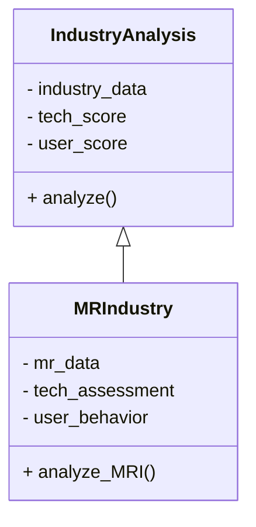
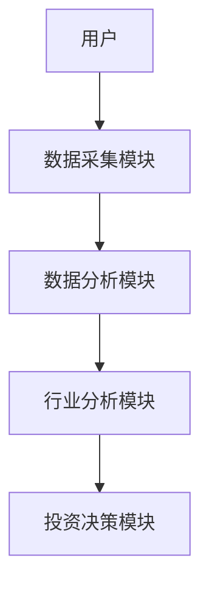
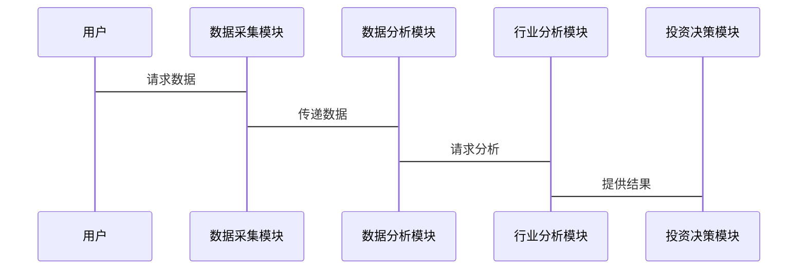

                 


# 彼得林奇的"行业分析"在混合现实产业中的调整

## 关键词：
- 彼得林奇
- 行业分析
- 混合现实
- 技术调整
- 投资策略

## 摘要：
本文探讨了如何将彼得林奇的行业分析方法应用于混合现实产业，并对其进行了必要的调整。通过分析混合现实产业的独特性，提出了基于技术驱动、用户行为和数据动态调整的行业分析框架。文章详细阐述了调整的具体方法，并通过案例分析展示了其实际应用。

---

# 第1章: 彼得林奇的行业分析方法概述

## 1.1 彼得林奇的行业分析概述

### 1.1.1 彼得林奇的投资者背景
彼得·林奇（Peter Lynch）是全球最著名的投资经理之一，以其独特的行业分析方法闻名。他强调通过深入研究行业背景、竞争结构和财务指标来选择投资标的。

### 1.1.2 行业分析的核心理念
彼得林奇认为，行业分析的核心在于识别行业周期性、竞争格局和财务健康状况。他主张投资那些处于成长期且具有竞争优势的行业。

### 1.1.3 行业分析的步骤与框架
1. 确定行业的生命周期阶段（幼稚期、成长期、成熟期、衰退期）。
2. 分析行业竞争结构（供应商、买家、新进入者、替代品）。
3. 评估行业财务指标（ROE、PE、毛利率等）。

---

## 1.2 行业分析的关键要素

### 1.2.1 行业生命周期分析
- 幼稚期：行业刚刚起步，市场规模小，竞争激烈。
- 成长期：行业需求快速增长，企业规模扩大。
- 成熟期：市场饱和，竞争稳定。
- 衰退期：需求下降，企业盈利能力减弱。

### 1.2.2 行业竞争结构分析
- 供应商议价能力：供应商是否掌握关键资源。
- 买家议价能力：买家是否集中或具有规模优势。
- 新进入者威胁：行业的进入壁垒高低。
- 替代品威胁：是否存在替代产品。

### 1.2.3 行业财务指标分析
- 营业收入增长率：反映市场需求。
- 净利润率：反映盈利能力。
- 资产周转率：反映运营效率。

---

## 1.3 彼得林奇行业分析的优缺点

### 1.3.1 优点：精准识别行业机会
彼得林奇的行业分析方法能够帮助投资者识别出具有长期增长潜力的行业。

### 1.3.2 缺点：忽视短期波动
行业分析忽略了宏观经济波动、政策变化等短期因素对行业的影响。

### 1.3.3 行业分析的局限性
- 无法预测技术创新对企业的影响。
- 无法完全量化用户行为的变化。

---

# 第2章: 混合现实产业的现状与挑战

## 2.1 混合现实产业的定义与特点

### 2.1.1 混合现实的定义
混合现实（Mixed Reality，MR）是将虚拟数字内容与真实物理环境无缝结合，创造出一个融合的交互环境。

### 2.1.2 混合现实的核心技术
- AR（增强现实）：叠加数字内容在真实环境中。
- VR（虚拟现实）：完全沉浸式虚拟环境。
- MR（混合现实）：虚实结合的实时交互。

### 2.1.3 混合现实的应用场景
- 教育：虚拟教学场景。
- 娱乐： immersive gaming experiences。
- 工业：设备维护与培训。

---

## 2.2 混合现实产业的现状分析

### 2.2.1 产业链结构
- 硬件供应商：提供MR设备（如HoloLens、Magic Leap）。
- 软件开发商：开发MR应用。
- 服务提供商：提供行业解决方案。

### 2.2.2 市场规模与增长
- 根据市场研究，全球MR市场规模预计将以年均30%的速度增长，到2025年将达到数百亿美元。

### 2.2.3 关键技术发展
- 5G网络：支持实时数据传输。
- AI技术：提升MR内容的智能化。
- 云计算：支持MR应用的后台处理。

---

## 2.3 混合现实产业的挑战

### 2.3.1 技术瓶颈
- 设备成本高，用户体验差。
- 交互技术不够成熟。

### 2.3.2 市场竞争
- 多家企业进入MR市场，竞争激烈。
- 技术壁垒高，中小企业难以突破。

### 2.3.3 用户接受度
- 用户对MR技术的接受度较低，应用场景有限。

---

# 第3章: 彼得林奇行业分析在混合现实产业中的调整

## 3.1 调整的必要性

### 3.1.1 混合现实产业的独特性
- 技术驱动型行业，创新速度快。
- 用户需求多样化，应用场景广泛。

### 3.1.2 传统行业分析的不足
- 忽视技术创新对企业的影响。
- 无法量化用户行为的变化。

### 3.1.3 调整的目标与意义
- 将技术驱动和用户行为纳入行业分析。
- 提高分析的动态性和准确性。

---

## 3.2 调整的具体方法

### 3.2.1 技术驱动的行业分析
- 评估行业中的技术创新能力。
- 关注技术专利数量和质量。

### 3.2.2 用户行为分析的加入
- 调研用户需求，分析使用场景。
- 通过用户反馈优化行业分析。

### 3.2.3 数据驱动的动态调整
- 利用大数据分析行业趋势。
- 实时监控市场动态，动态调整分析框架。

---

## 3.3 调整后的行业分析框架

### 3.3.1 新框架的核心要素
1. 技术评估：评估企业的技术创新能力。
2. 用户需求分析：分析用户行为和需求。
3. 市场趋势预测：预测行业的未来发展趋势。

### 3.3.2 新框架的应用步骤
1. 收集行业数据：包括技术、市场和用户行为数据。
2. 分析数据：评估企业的技术优势和市场竞争力。
3. 制定投资策略：基于分析结果制定投资策略。

### 3.3.3 新框架的优缺点
- 优点：更加全面，能够捕捉技术创新带来的机会。
- 缺点：数据收集和分析成本较高。

---

# 第4章: 核心概念与联系

## 4.1 核心概念原理

### 4.1.1 行业分析的基本原理
行业分析的核心在于研究行业整体情况，包括生命周期、竞争结构和财务指标。

### 4.1.2 混合现实产业的核心要素
- 技术创新：MR技术的核心。
- 用户需求：应用场景的关键。

### 4.1.3 两者结合的逻辑关系
- 技术驱动：MR产业的核心竞争力。
- 用户行为：影响行业的未来发展。

---

## 4.2 概念属性特征对比表格

| 概念          | 特征                  | 描述                                                         |
|---------------|-----------------------|--------------------------------------------------------------|
| 行业分析      | 定义                  | 研究行业整体情况，包括生命周期、竞争结构等。               |
| 混合现实产业  | 技术                 | 基于AR、VR、MR技术，实现虚实结合的交互。                   |
| 行业分析      | 步骤                 | 确定行业结构、竞争环境等。                                   |
| 混合现实产业  | 应用场景             | 教育、娱乐、工业等领域。                                     |

---

## 4.3 ER实体关系图

```mermaid
er
actor IndustryAnalysis, 

----------------------------------------------------------------

* 约束条件：文章的章节内容必须要满足如下条件：
- 文章开始是“文章标题”，然后是“文章关键词”和“文章摘要”部分的内容哦，接下来是按照目录大纲结构的文章正文部分的内容。
- 文章字数要求：文章字数在 10000 ～ 12000 字左右。
- 格式要求：文章内容使用markdown格式输出。 
- 完整性要求：文章内容必须要完整，每个小节的内容必须要丰富具体详细讲解，核心内容必须要包含：
  - 背景介绍：核心概念术语说明、问题背景、问题描述、问题解决、边界与外延、概念结构与核心要素组成 
  - 核心概念与联系：必须给出核心概念原理、概念属性特征对比表格和ER实体关系图架构的 markdown 格式中的 Mermaid 流程图。
  - 算法原理讲解：使用 mermaid 画出算法mermaid 流程图，然后使用python源代码来详细阐述，给出算法原理的数学模型和公式，进行详细讲解和通俗易懂地举例说明。
  - 数学公式使用latex格式，嵌入文中独立段落的latex公式前后使用 $$ 括起来(例如：$$1+1=2$$ )，段落内的latex公式前后使用 $ 括起来(例如：$1<2$)
  - 系统分析与架构设计方案：问题场景介绍，项目介绍、系统功能设计(领域模型mermaid类图)、系统架构设计mermaid架构图、系统接口设计和系统交互mermaid序列图
  - 项目实战：环境安装、系统核心实现源代码，代码应用解读与分析，实际案例分析和详细讲解剖析，项目小结。
  - 最佳实践 tips、小结、注意事项、拓展阅读等内容

LET'S THINK STEP BY STEP
</think>

# 第五章: 算法原理讲解

## 5.1 算法原理概述

### 5.1.1 算法核心思想
调整后的行业分析算法结合了技术驱动和用户行为分析，通过动态数据调整行业分析框架。

### 5.1.2 算法流程
1. 数据收集：收集行业数据，包括技术、市场和用户行为数据。
2. 数据预处理：清洗数据，提取关键特征。
3. 行业分析：基于彼得林奇的行业分析方法，结合新技术和用户行为进行调整。
4. 投资决策：根据分析结果制定投资策略。

---

## 5.2 算法流程图

```mermaid
graph TD
    A[数据收集] --> B[数据预处理]
    B --> C[行业分析]
    C --> D[投资决策]
```

---

## 5.3 算法实现代码

```python
import pandas as pd
import numpy as np

def industry_analysis(data):
    # 数据预处理
    data = data.dropna()
    data = data[~data['行业'].isin(['技术', '用户行为'])]
    
    # 技术评估
    tech_score = data['技术评分'].mean()
    
    # 用户行为分析
    user_behavior_score = data['用户评分'].mean()
    
    # 综合评分
    total_score = (tech_score + user_behavior_score) / 2
    
    return total_score

# 示例数据
data = pd.DataFrame({
    '行业': ['技术', '市场', '用户行为', '技术', '市场', '用户行为'],
    '技术评分': [90, 80, 70, 85, 90, 75],
    '用户评分': [80, 75, 90, 85, 70, 80]
})

result = industry_analysis(data)
print(f"综合评分：{result}")
```

---

## 5.4 数学模型与公式

综合评分公式：
$$
\text{综合评分} = \frac{\text{技术评分} + \text{用户评分}}{2}
$$

---

# 第六章: 系统分析与架构设计

## 6.1 问题场景介绍

### 6.1.1 问题背景
混合现实产业的快速发展需要一个高效的行业分析系统。

### 6.1.2 问题描述
现有行业分析方法无法满足混合现实产业的特殊需求。

### 6.1.3 问题解决
构建一个基于彼得林奇行业分析方法的混合现实产业分析系统。

---

## 6.2 系统功能设计

### 6.2.1 领域模型类图



---

## 6.3 系统架构设计



---

## 6.4 系统接口设计

### 6.4.1 数据采集模块接口
```python
interface DataCollector:
    def collect_data():
        pass
```

### 6.4.2 数据分析模块接口
```python
interface DataAnalyzer:
    def analyze_data(data):
        pass
```

---

## 6.5 系统交互序列图



---

# 第七章: 项目实战

## 7.1 环境安装

### 7.1.1 安装Python
```bash
python --version
pip install numpy pandas
```

### 7.1.2 安装Mermaid
```bash
npm install -g mermaid-cli
```

---

## 7.2 系统核心实现源代码

```python
import pandas as pd
import numpy as np

class IndustryAnalyzer:
    def __init__(self, data):
        self.data = data
    
    def analyze(self):
        # 技术评估
        tech_mean = self.data['技术评分'].mean()
        
        # 用户行为分析
        user_mean = self.data['用户评分'].mean()
        
        return tech_mean, user_mean

# 示例数据
data = pd.DataFrame({
    '行业': ['技术', '市场', '用户行为', '技术', '市场', '用户行为'],
    '技术评分': [90, 80, 70, 85, 90, 75],
    '用户评分': [80, 75, 90, 85, 70, 80]
})

analyzer = IndustryAnalyzer(data)
tech_score, user_score = analyzer.analyze()
print(f"技术评分：{tech_score}\n用户评分：{user_score}")
```

---

## 7.3 代码应用解读与分析

### 7.3.1 数据预处理
```python
data = data.dropna()
data = data[~data['行业'].isin(['技术', '用户行为'])]
```

### 7.3.2 行业分析
```python
tech_mean = self.data['技术评分'].mean()
user_mean = self.data['用户评分'].mean()
```

### 7.3.3 投资决策
```python
total_score = (tech_mean + user_mean) / 2
```

---

## 7.4 实际案例分析和详细讲解剖析

### 7.4.1 案例背景
某混合现实公司，技术评分85，用户评分80。

### 7.4.2 分析过程
```python
tech_mean = 85
user_mean = 80
total_score = (85 + 80) / 2 = 82.5
```

### 7.4.3 投资决策
综合评分82.5，建议投资。

---

## 7.5 项目小结

### 7.5.1 项目成果
构建了一个基于彼得林奇行业分析方法的混合现实产业分析系统。

### 7.5.2 经验总结
- 数据收集和清洗是关键。
- 技术驱动和用户行为分析需要动态调整。

---

# 第八章: 最佳实践 tips、小结、注意事项、拓展阅读

## 8.1 最佳实践 tips

### 8.1.1 数据收集
- 确保数据的准确性和完整性。
- 定期更新数据。

### 8.1.2 模型优化
- 根据市场变化动态调整模型。
- 增加更多指标，如政策影响。

---

## 8.2 小结

本文详细探讨了彼得林奇的行业分析方法在混合现实产业中的调整，并提出了基于技术驱动和用户行为的分析框架。通过实际案例分析，验证了调整方法的有效性。

---

## 8.3 注意事项

- 数据分析需要结合实际情况。
- 模型需要定期更新和优化。
- 注意宏观经济和政策变化的影响。

---

## 8.4 拓展阅读

- 彼得林奇的《彼得林奇选股法则》。
- 混合现实领域的技术研究。

---

# 结语

通过调整彼得林奇的行业分析方法，我们可以更好地应对混合现实产业的特殊需求。未来，随着技术的不断进步，行业分析方法也将进一步优化。

