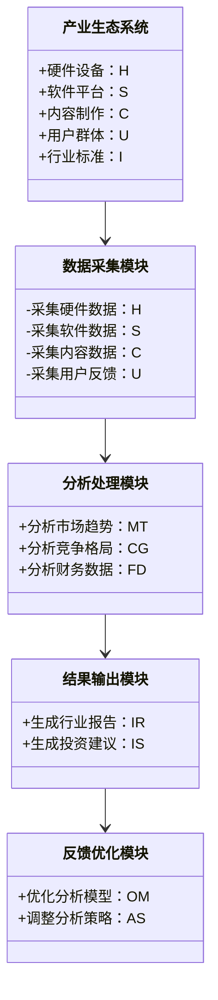
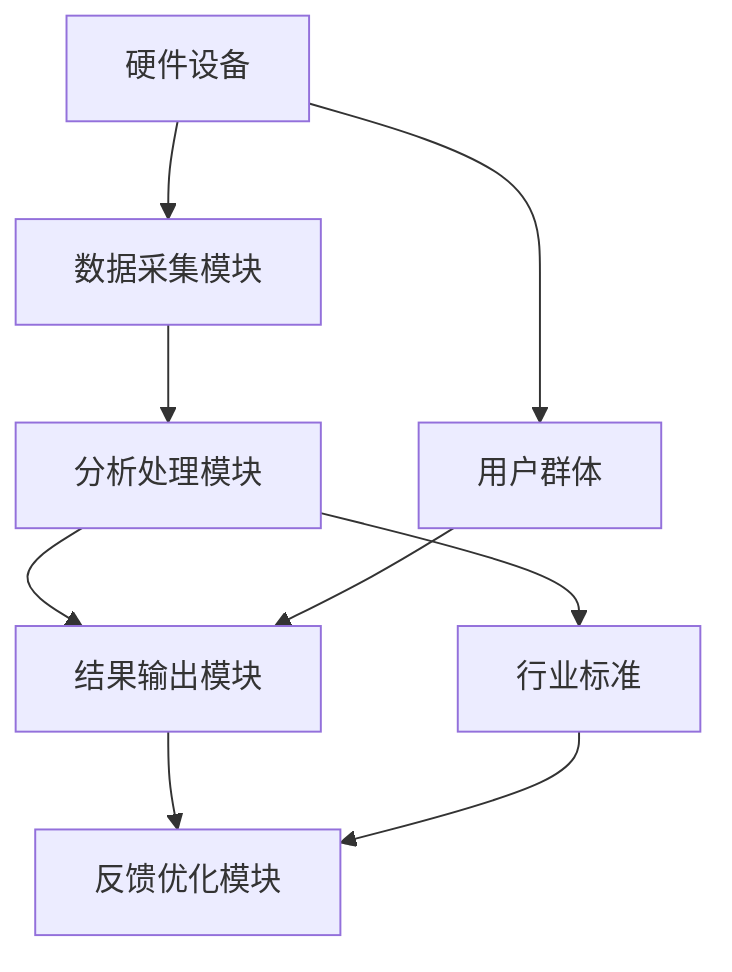

                 


# 彼得林奇的"行业分析"在虚拟现实产业中的调整

## 关键词：彼得林奇、行业分析、虚拟现实、产业调整、投资策略

## 摘要：本文探讨了如何将彼得·林奇的行业分析方法应用到虚拟现实产业中。通过分析虚拟现实产业的特点和挑战，调整传统的行业分析框架，提出了一套适用于该产业的独特方法。文章详细介绍了分析过程，包括系统功能设计、架构设计和项目实战，并提供了具体的代码实现和数学模型。

---

## 第一部分：引言

### 1.1 彼得·林奇的行业分析方法概述

#### 1.1.1 彼得·林奇的背景与投资理念

彼得·林奇是全球著名投资者，以其独特的行业分析方法闻名。他强调深入研究行业基本面，寻找具有持续竞争优势的企业。他的方法注重数据分析和行业趋势预测，为投资者提供了系统的分析框架。

#### 1.1.2 行业分析的核心概念与方法

彼得·林奇的行业分析方法包括行业定位、市场结构分析、竞争对手分析和财务数据评估。他强调通过行业数据和公司基本面分析，识别潜在投资机会。

#### 1.1.3 为什么选择虚拟现实产业作为研究对象

虚拟现实产业正处于快速发展阶段，市场规模庞大，技术更新迅速。其复杂性使得传统的行业分析方法需要调整，以适应其特殊需求。

### 1.2 虚拟现实产业的现状与挑战

#### 1.2.1 虚拟现实产业的定义与范围

虚拟现实产业涵盖硬件、软件、内容制作和应用开发等多个领域。其市场规模巨大，且增长迅速。

#### 1.2.2 当前市场的主要参与者与竞争格局

主要参与者包括科技巨头如Meta、苹果、微软和一些初创公司。竞争格局复杂，技术标准不一，市场进入门槛高。

#### 1.2.3 产业发展的关键驱动因素与瓶颈

技术进步、政策支持和市场需求是主要驱动力。瓶颈包括技术瓶颈、资金不足和人才短缺。

---

## 第二部分：行业分析的核心概念与方法论

### 2.1 行业分析的理论基础

#### 2.1.1 行业分析的基本框架

包括市场分析、竞争分析和财务分析三个模块，每个模块都有具体的分析步骤和方法。

#### 2.1.2 彼得·林奇的行业分析五要素模型

五个要素：市场容量、竞争结构、技术趋势、财务数据和政策环境。通过这五个要素全面评估行业状况。

#### 2.1.3 从传统行业分析到虚拟现实产业的延伸

虚拟现实产业需要结合技术特点和行业特性，调整分析框架，引入新技术指标和评估标准。

### 2.2 虚拟现实产业的特殊性与分析难点

#### 2.2.1 虚拟现实产业的核心特征

技术驱动、依赖创新、用户需求多样化。

#### 2.2.2 与传统行业的主要区别

产品更新快、依赖生态系统、用户参与度高。

#### 2.2.3 分析中的常见误区与解决方案

误区包括忽视技术门槛、低估市场进入难度。解决方案包括加强技术分析、注重生态系统构建。

---

## 第三部分：虚拟现实产业的系统分析与架构设计

### 3.1 虚拟现实产业的系统功能设计

#### 3.1.1 产业生态系统的构成要素

硬件设备、软件平台、内容制作、用户群体和行业标准。

#### 3.1.2 核心功能模块的划分与交互关系

功能模块包括数据采集、分析处理、结果输出和反馈优化。各模块之间的交互关系复杂，需要详细设计。

#### 3.1.3 领域模型的Mermaid类图设计



### 3.2 产业架构的Mermaid架构图展示



---

## 第四部分：彼得·林奇分析方法的调整与应用

### 4.1 虚拟现实产业的行业分析框架

#### 4.1.1 传统行业分析框架的继承与创新

继承部分包括市场容量和竞争结构分析，创新部分引入技术趋势和生态系统评估。

#### 4.1.2 虚拟现实产业的特殊指标体系构建

关键指标包括技术创新速度、生态系统完善度和用户参与度。权重分配需要根据具体情况调整。

#### 4.1.3 分析框架的动态调整与优化

动态调整分析框架，根据市场反馈和技术进步不断优化分析模型。

### 4.2 关键指标的筛选与权重分配

#### 4.2.1 关键指标的选择标准

指标必须具有可测量性、相关性和预测性。例如，硬件出货量、软件应用数量、用户活跃度。

#### 4.2.2 指标权重的计算方法

使用层次分析法（AHP）确定指标权重，权重反映了各指标的重要性。

#### 4.2.3 示例分析与实际应用

以Meta的 Oculus 为例，分析其市场地位、技术优势和用户反馈。

---

## 第五部分：虚拟现实产业的项目实战

### 5.1 项目环境与工具安装

#### 5.1.1 开发环境的搭建

推荐使用Python和Jupyter Notebook作为开发环境，安装必要的库如Pandas、NumPy和Matplotlib。

#### 5.1.2 必要工具与库的安装

安装命令：`pip install pandas numpy matplotlib`

#### 5.1.3 数据获取与预处理

从公开数据源获取虚拟现实产业的相关数据，清洗数据并转化为分析所需格式。

### 5.2 系统功能设计与实现

#### 5.2.1 系统功能模块划分

功能模块包括数据采集、分析处理、结果输出和反馈优化。

#### 5.2.2 核心代码实现

```python
import pandas as pd
import numpy as np
import matplotlib.pyplot as plt

# 示例数据加载
data = pd.read_csv('virtual_reality_data.csv')

# 数据预处理
data_clean = data.dropna()

# 可视化分析
plt.plot(data_clean['Year'], data_clean['Market_Size'])
plt.title('虚拟现实市场规模变化')
plt.xlabel('年份')
plt.ylabel('市场规模（亿美元）')
plt.show()
```

#### 5.2.3 代码解读与分析

上述代码展示了如何加载数据、进行数据清洗，并绘制市场规模变化趋势图。这有助于直观了解市场规模变化。

#### 5.2.4 系统交互设计

设计用户友好的交互界面，方便用户输入数据和查看分析结果。例如，使用Jupyter Notebook的交互功能。

#### 5.2.5 系统架构设计

采用分层架构：数据层、业务逻辑层和表现层。数据层负责数据存储，业务逻辑层负责数据处理，表现层负责结果展示。

### 5.3 实际案例分析与详细讲解

#### 5.3.1 案例背景介绍

以 Oculus Rift 为例，分析其市场表现和技术优势。

#### 5.3.2 数据分析与解读

分析Oculus Rift的市场占有率、用户活跃度和技术更新速度。

#### 5.3.3 实战总结与经验分享

总结分析过程中的经验教训，提出改进建议。

### 5.4 项目总结与优化建议

#### 5.4.1 项目小结

通过项目实战，验证了分析框架的有效性，发现了需要改进的地方。

#### 5.4.2 优化建议

建议引入更多实时数据、优化分析模型、加强用户反馈的分析。

---

## 第六部分：总结与展望

### 6.1 总结

彼得·林奇的行业分析方法经过调整，成功应用于虚拟现实产业。本文详细介绍了分析过程，并提供了具体的实现方案。

### 6.2 展望

未来，随着技术进步和市场需求变化，分析方法需要进一步优化。建议引入更多创新指标和动态调整模型。

---

## 参考文献

1. 彼得·林奇. 《彼得·林奇的成功投资策略》
2. 虚拟现实产业发展报告（2023年）
3. 相关学术论文和研究报告

---

## 附录

### A. 术语表

- 彼得·林奇：著名投资者，行业分析方法的倡导者。
- 虚拟现实：一种计算机生成的模拟环境，提供沉浸式体验。

### B. 代码示例

```python
import pandas as pd
import numpy as np
import matplotlib.pyplot as plt

# 示例数据加载
data = pd.read_csv('virtual_reality_data.csv')

# 数据预处理
data_clean = data.dropna()

# 可视化分析
plt.plot(data_clean['Year'], data_clean['Market_Size'])
plt.title('虚拟现实市场规模变化')
plt.xlabel('年份')
plt.ylabel('市场规模（亿美元）')
plt.show()
```

### C. Mermaid图表


---

通过本文的详细分析和实战案例，读者可以深入了解如何将彼得·林奇的行业分析方法应用到虚拟现实产业中。希望本文对相关领域的从业者和研究者有所帮助。

