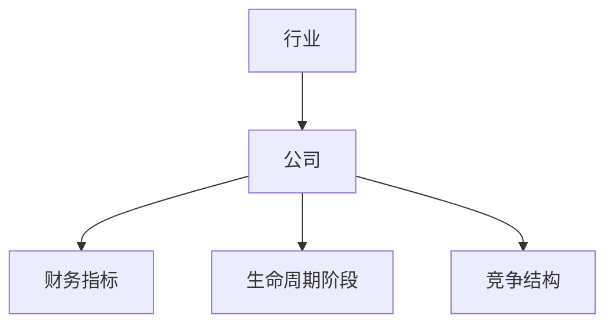
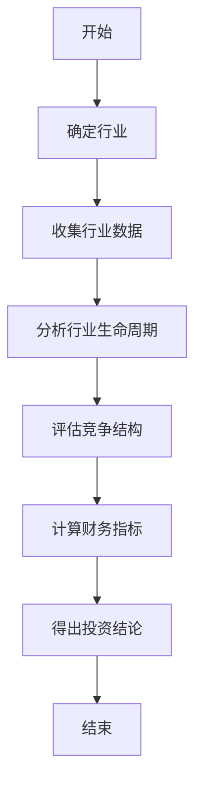
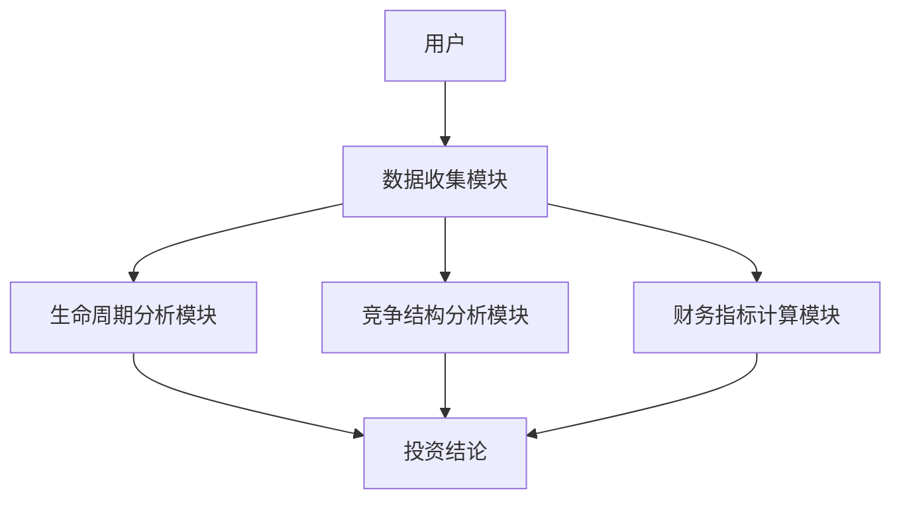

                 


# 彼得林奇的"行业分析"方法论

## 关键词：彼得林奇、行业分析、投资策略、企业分析、财务指标

## 摘要：彼得林奇是全球著名投资专家，他提出的行业分析方法在投资领域具有深远影响。本文系统地阐述了彼得林奇的行业分析方法，从行业生命周期、竞争结构、财务指标等核心要素出发，结合实际案例，详细讲解了如何运用这些方法进行投资决策。通过本文，读者可以掌握彼得林奇的核心思想，并将其应用于实际投资分析中。

---

# 第一部分: 彼得林奇的行业分析方法论基础

## 第1章: 行业分析的核心概念与背景

### 1.1 行业分析的定义与重要性

#### 1.1.1 行业分析的定义
行业分析是指对特定行业内的市场结构、竞争状况、发展趋势等进行系统性研究的过程。它帮助投资者了解行业的整体状况，评估投资机会和风险。

#### 1.1.2 行业分析在投资中的重要性
行业分析是投资决策的基础。一个行业的整体表现直接影响其内企业的盈利能力，进而影响投资者的收益。彼得林奇强调，选择一个优质的行业比选择一家优秀的公司更为重要。

#### 1.1.3 彼得林奇行业分析的独特视角
彼得林奇的行业分析方法注重行业生命周期和竞争结构的分析，强调从长期趋势中寻找投资机会。他认为，投资者应该选择那些处于增长阶段且具有强大竞争优势的行业。

### 1.2 彼得林奇的行业分析方法

#### 1.2.1 彼得林奇的行业分析框架
彼得林奇的行业分析框架包括以下几个步骤：
1. **确定行业的生命周期阶段**：判断行业是处于初创期、成长期、成熟期还是衰退期。
2. **评估行业的竞争结构**：分析行业内主要竞争对手的数量、市场份额分布、进入壁垒等。
3. **分析行业的财务表现**：通过行业整体的财务指标（如利润率、增长率等）评估行业的盈利能力。

#### 1.2.2 行业分析的核心要素
- **行业生命周期**：行业的发展阶段直接影响企业的成长空间和投资价值。
- **行业竞争结构**：行业的竞争程度和进入壁垒决定了企业的竞争优势。
- **行业财务指标**：行业的整体财务表现是评估投资价值的重要依据。

#### 1.2.3 行业分析的边界与外延
行业分析的边界包括行业内的企业数量、市场容量、技术门槛等因素。其外延则涉及宏观经济环境、政策法规、消费者需求等外部因素。

## 第2章: 行业分析的核心要素与联系

### 2.1 行业分析的核心要素

#### 2.1.1 行业生命周期
行业的生命周期分为四个阶段：
- **初创阶段**：市场需求不明确，竞争者少。
- **增长阶段**：市场需求快速增长，竞争加剧。
- **成熟阶段**：市场需求稳定，竞争饱和。
- **衰退阶段**：市场需求下降，竞争减少。

#### 2.1.2 行业竞争结构
行业竞争结构可以通过迈克尔·波特的五力分析模型来评估：
1. 新进入者威胁
2. 替代品威胁
3. 供应商议价能力
4. 买家议价能力
5. 行业内竞争程度

#### 2.1.3 行业财务指标
关键的行业财务指标包括：
- 行业平均利润率
- 行业增长率
- 行业资产周转率

### 2.2 核心概念的原理与联系

#### 2.2.1 行业生命周期与投资策略的关系
- 处于初创阶段的行业具有较高的增长潜力，但风险也较大。
- 成熟阶段的行业适合稳健型投资者，风险较低，回报稳定。
- 衰退阶段的行业投资风险较高，但可能有一些个股表现优异。

#### 2.2.2 行业竞争结构的分析方法
通过分析行业内的竞争结构，可以判断行业的盈利能力是否稳定，是否存在竞争优势明显的公司。

#### 2.2.3 行业财务指标的综合运用
将行业财务指标与公司财务指标结合，可以更好地评估企业的投资价值。

### 2.3 行业分析的ER实体关系图



---

## 第3章: 行业分析的算法原理

### 3.1 行业分析的算法流程



### 3.2 算法实现的Python代码

```python
def industry_analysis(industry):
    data = collect_data(industry)
    lifecycle = analyzeLifecycle(data)
    competition = analyzeCompetition(data)
    financials = calculateFinancials(data)
    return investment_recommendation(lifecycle, competition, financials)
```

### 3.3 数学模型与公式

#### 3.3.1 行业生命周期模型
$$
\text{生命周期阶段} = 
\begin{cases}
\text{初创阶段} & \text{if } \text{增长率} > 20\% \\
\text{增长阶段} & \text{if } 5\% < \text{增长率} \leq 20\% \\
\text{成熟阶段} & \text{if } 0\% < \text{增长率} \leq 5\% \\
\text{衰退阶段} & \text{if } \text{增长率} \leq 0\% \\
\end{cases}
$$

#### 3.3.2 行业竞争结构模型
$$
\text{竞争强度} = \text{新进入者威胁} + \text{替代品威胁} + \text{供应商议价能力} + \text{买家议价能力} + \text{行业内竞争程度}
$$

---

## 第4章: 行业分析的系统架构与实现

### 4.1 系统分析与架构设计

#### 4.1.1 系统功能设计
- 数据收集模块：收集行业相关的市场数据。
- 生命周期分析模块：判断行业的生命周期阶段。
- 竞争结构分析模块：评估行业的竞争结构。
- 财务指标计算模块：计算行业的关键财务指标。

#### 4.1.2 系统架构设计



### 4.2 项目实战

#### 4.2.1 实战环境安装
```bash
pip install pandas numpy matplotlib
```

#### 4.2.2 核心实现代码

```python
import pandas as pd
import numpy as np

def collect_data(industry):
    # 数据收集逻辑
    return pd.DataFrame()

def analyzeLifecycle(data):
    # 生命周期分析逻辑
    return '成熟阶段'

def analyzeCompetition(data):
    # 竞争结构分析逻辑
    return '高竞争'

def calculateFinancials(data):
    # 财务指标计算逻辑
    return {'平均利润率': 10%, '增长率': 5%}

def investment_recommendation(lifecycle, competition, financials):
    # 投资建议逻辑
    if financials['平均利润率'] > 15% and lifecycle == '增长阶段':
        return '买入'
    else:
        return '观望'
```

---

## 第5章: 实战案例分析

### 5.1 案例背景
以 technology 行业为例，分析其生命周期、竞争结构和财务表现。

### 5.2 数据收集与分析
收集 technology 行业的市场数据，分析其生命周期阶段为“增长阶段”，竞争结构为“高竞争”，财务指标显示平均利润率为12%，增长率为8%。

### 5.3 投资策略
基于分析结果，投资策略为“观望”，因为尽管行业处于增长阶段，但平均利润率未达到预期。

---

## 第6章: 最佳实践与小结

### 6.1 最佳实践 tips
- 定期更新行业分析数据。
- 结合宏观经济环境进行综合判断。
- 选择具有强大竞争优势的行业。

### 6.2 小结
彼得林奇的行业分析方法为投资者提供了科学的分析框架，帮助投资者在复杂多变的市场中找到优质的投资机会。

### 6.3 注意事项
- 行业分析需要结合具体企业的分析。
- 数据来源的可靠性至关重要。
- 投资决策应结合个人风险承受能力。

### 6.4 拓展阅读
- 《彼得林奇的投资哲学》
- 《行业分析的实用技巧》
- 《财务指标的深度分析》

---

通过以上系统化的分析，我们可以看到彼得林奇的行业分析方法论在投资决策中的重要性。希望本文能为投资者提供有价值的参考和指导。

