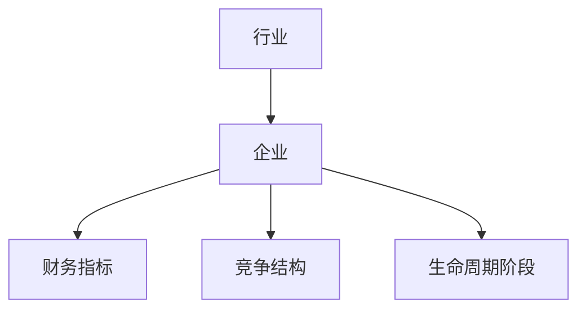
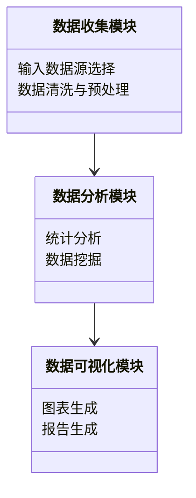
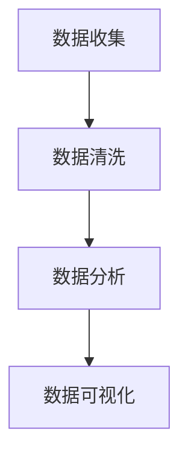
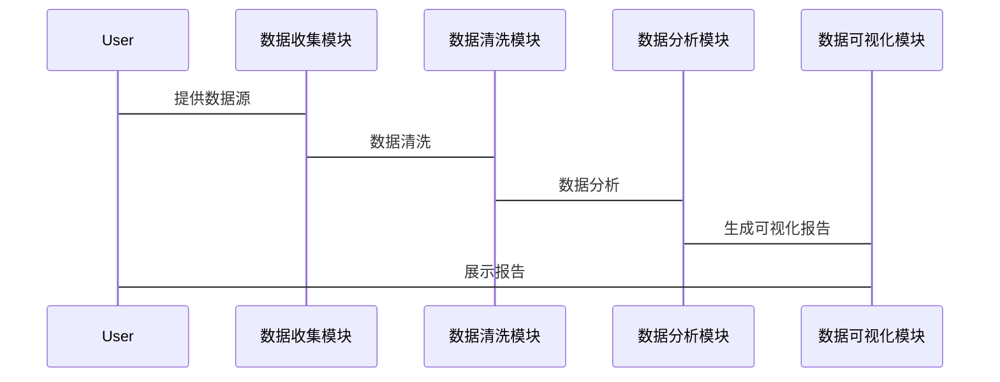

                 


# 彼得林奇的"行业分析"深度研究方法

> 关键词：彼得·林奇，行业分析，投资策略，数据驱动，技术应用，实践案例，系统架构

> 摘要：本文深入探讨了彼得·林奇的行业分析方法，结合技术分析和投资策略，详细阐述了如何通过系统化的行业分析框架和数据驱动的方法进行投资决策。通过实际案例分析和系统架构设计，本文为读者提供了从理论到实践的完整指南。

---

## 第一部分: 彼得·林奇的行业分析概述

### 第1章: 彼得·林奇与行业分析概述

#### 1.1 彼得·林奇及其投资理念

##### 1.1.1 彼得·林奇的生平简介
彼得·林奇（Peter Lynch）是美国著名的共同基金经理，以其在富达麦哲伦基金（Fidelity Magellan Fund）的卓越表现而闻名。他从1977年到2000年管理该基金，期间取得了年均21.9%的回报率，远超市场平均水平。林奇的投资哲学强调长期视角和对公司基本面的深入分析。

##### 1.1.2 林奇的投资哲学与方法
林奇的投资策略强调长期持有优质股票，关注公司的基本面，尤其是行业的长期趋势和公司的竞争优势。他认为，成功的投资不仅仅是选择好的股票，更是选择好的行业。

##### 1.1.3 林奇行业分析的核心思想
林奇认为，行业分析是投资决策中的关键步骤。通过对行业生命周期、竞争结构和财务指标的分析，投资者可以识别出具有长期增长潜力的行业和公司。

#### 1.2 行业分析的基本概念

##### 1.2.1 行业分析的定义与作用
行业分析是指对特定行业进行深入研究，评估其市场结构、竞争态势、增长潜力和财务健康状况的过程。它帮助投资者识别行业中的优势企业，并做出更明智的投资决策。

##### 1.2.2 行业分析的核心要素
- **行业生命周期**：行业从导入期、成长期、成熟期到衰退期的变化过程。
- **行业竞争结构**：行业内主要竞争对手的数量、市场份额分布、进入壁垒等。
- **行业财务指标**：行业平均利润率、增长速度、资产负债情况等。

##### 1.2.3 行业分析的边界与外延
行业分析不仅关注行业内部因素，还包括宏观经济环境、政策法规、技术进步和消费者行为等外部因素。

#### 1.3 行业分析的重要性

##### 1.3.1 行业分析在投资中的地位
行业分析是投资决策的基础，帮助投资者识别出具有长期增长潜力的行业和公司。

##### 1.3.2 林奇行业分析的独特性
林奇的行业分析方法注重长期趋势和竞争优势，而非短期市场波动。

##### 1.3.3 行业分析对投资决策的影响
通过行业分析，投资者可以更好地识别行业风险和机会，制定更有效的投资策略。

---

### 第2章: 行业分析的核心概念与联系

#### 2.1 行业分析的核心要素

##### 2.1.1 行业生命周期
行业生命周期分为四个阶段：导入期、成长期、成熟期和衰退期。不同阶段的行业具有不同的增长潜力和投资价值。

##### 2.1.2 行业竞争结构
行业竞争结构包括行业内主要竞争对手的数量、市场份额分布、进入壁垒等。竞争优势分析帮助投资者识别行业内的龙头公司。

##### 2.1.3 行业财务指标
行业财务指标包括平均利润率、增长速度、资产负债情况等，这些指标帮助投资者评估行业的整体财务健康状况。

#### 2.2 核心概念的属性对比

##### 2.2.1 行业生命周期与行业增长的关系
行业的生命周期直接影响其增长潜力。成长期的行业通常具有较高的增长速度，而成熟期的行业增长趋于稳定。

##### 2.2.2 行业竞争结构与企业盈利能力的关联
行业竞争结构影响企业的盈利能力。垄断或寡头垄断的行业通常具有较高的利润率，而竞争激烈的行业则可能面临较低的利润率。

##### 2.2.3 行业财务指标与投资决策的联系
行业财务指标是评估行业投资价值的重要依据。例如，高利润率和稳定增长的行业通常更具投资吸引力。

#### 2.3 ER实体关系图


---

### 第3章: 行业分析的算法原理

#### 3.1 行业分析的算法流程

##### 3.1.1 数据收集
收集行业相关的数据，包括财务数据、市场数据、竞争数据等。

##### 3.1.2 数据清洗
对收集到的数据进行清洗，去除噪声和异常值，确保数据的准确性和完整性。

##### 3.1.3 数据分析
通过对清洗后的数据进行统计分析和趋势分析，识别行业的主要特征和趋势。

##### 3.1.4 数据可视化
使用图表和可视化工具，将分析结果直观地展示出来，帮助投资者更好地理解和决策。

##### 3.1.5 投资决策
根据分析结果，制定投资策略，选择具有长期增长潜力的行业和公司。

#### 3.2 数据驱动的行业分析方法

##### 3.2.1 数据挖掘与机器学习
利用数据挖掘和机器学习技术，从大量数据中提取行业特征和趋势。

##### 3.2.2 财务指标分析
通过财务指标分析，评估行业的财务健康状况和投资价值。

##### 3.2.3 行业趋势预测
基于历史数据和模型预测，预测行业未来的增长趋势和风险。

#### 3.3 数学模型与公式

##### 3.3.1 行业增长模型
$$\text{行业增长率} = \frac{\text{行业收入增长率}}{\text{行业平均成本}}$$

##### 3.3.2 竞争优势分析
$$\text{竞争优势} = \text{市场份额} \times \text{利润率}$$

##### 3.3.3 财务健康指数
$$\text{财务健康指数} = \frac{\text{净利润率} + \text{资产负债率}}{2}$$

---

### 第4章: 数据驱动的行业分析方法

#### 4.1 数据驱动的行业分析框架

##### 4.1.1 数据收集与处理
- 数据源：公司财务报表、行业报告、市场数据等。
- 数据清洗：去除缺失值、异常值，标准化数据。

##### 4.1.2 数据分析与建模
- 统计分析：计算均值、方差、相关系数等。
- 数据挖掘：使用聚类分析、回归分析等方法，发现行业特征。

##### 4.1.3 数据可视化
- 使用工具如Tableau、Power BI等，将分析结果可视化。

#### 4.2 技术实现

##### 4.2.1 系统功能设计


##### 4.2.2 系统架构设计


#### 4.3 项目实战

##### 4.3.1 环境安装
安装必要的软件和工具，如Python、Pandas、Matplotlib等。

##### 4.3.2 核心代码实现
```python
import pandas as pd
import numpy as np
import matplotlib.pyplot as plt

# 数据收集与处理
data = pd.read_csv('industry_data.csv')
data.dropna(inplace=True)
data['增长率'] = (data['收入'] - data['收入'].shift(1)) / data['收入'].shift(1)

# 数据分析
correlation = data.corr()
growth_trend = data['增长率'].rolling(5).mean()

# 数据可视化
plt.plot(growth_trend)
plt.title('行业增长率趋势')
plt.xlabel('时间')
plt.ylabel('增长率')
plt.show()
```

##### 4.3.3 实际案例分析
通过具体案例分析，展示如何利用数据驱动的方法进行行业分析，并制定投资策略。

---

### 第5章: 系统架构与项目实战

#### 5.1 系统架构设计

##### 5.1.1 问题场景介绍
描述一个具体的行业分析场景，如分析科技行业的增长趋势。

##### 5.1.2 系统功能设计


##### 5.1.3 系统架构设计


#### 5.2 系统交互设计

##### 5.2.1 交互流程图


---

### 第6章: 项目实战与案例分析

#### 6.1 环境安装与配置

##### 6.1.1 安装必要的工具
安装Python、Pandas、Matplotlib等工具。

##### 6.1.2 数据源准备
准备行业相关的数据，如财务数据、市场数据等。

#### 6.2 核心代码实现

##### 6.2.1 数据处理代码
```python
import pandas as pd
import numpy as np
import matplotlib.pyplot as plt

# 数据加载
data = pd.read_csv('industry_data.csv')

# 数据清洗
data.dropna(inplace=True)
data['增长率'] = (data['收入'] - data['收入'].shift(1)) / data['收入'].shift(1)

# 数据分析
correlation = data.corr()
growth_trend = data['增长率'].rolling(5).mean()

# 数据可视化
plt.figure(figsize=(10, 6))
plt.plot(growth_trend, label='行业增长率')
plt.title('行业增长率趋势')
plt.xlabel('时间')
plt.ylabel('增长率')
plt.legend()
plt.show()
```

##### 6.2.2 分析与解读
通过对数据的处理和分析，识别行业的主要趋势和特征，并制定相应的投资策略。

#### 6.3 实际案例分析

##### 6.3.1 案例背景
选择一个具体的行业，如科技行业，进行深入分析。

##### 6.3.2 数据分析与解读
分析科技行业的增长率、竞争结构和财务指标，识别出具有长期增长潜力的公司。

##### 6.3.3 投资策略制定
基于分析结果，制定相应的投资策略，如增持或减持某些行业。

---

### 第7章: 总结与展望

#### 7.1 小结
本文深入探讨了彼得·林奇的行业分析方法，结合技术分析和投资策略，提供了从理论到实践的完整指南。

#### 7.2 注意事项
- 数据的准确性和完整性是行业分析的关键。
- 行业分析需要结合宏观经济环境和政策法规。
- 投资决策需要综合考虑多种因素。

#### 7.3 拓展阅读
建议读者阅读彼得·林奇的《彼得·林奇的成功投资》等书籍，以进一步理解其投资哲学和行业分析方法。

---

通过本文的系统分析和实战案例，读者可以更好地理解彼得·林奇的行业分析方法，并在实际投资中应用这些方法和工具。

