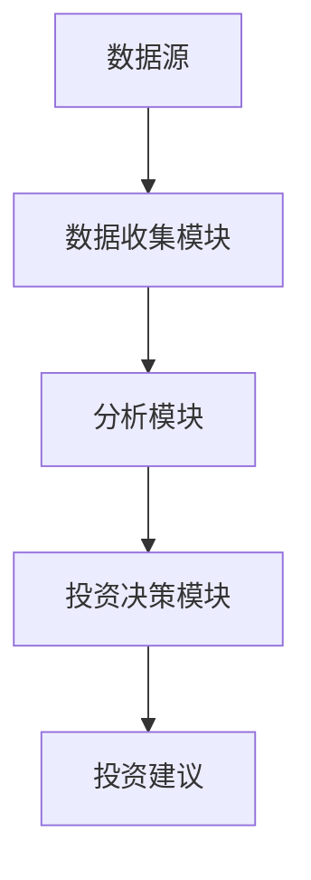
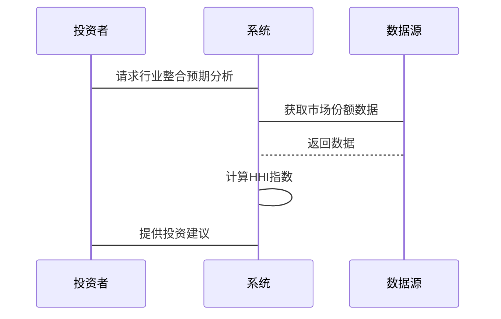

                 


# 彼得林奇的"行业整合预期"投资策略

## 关键词：
- 彼得林奇
- 行业整合预期
- 投资策略
- 数学模型
- 系统架构
- 项目实战

## 摘要：
本文详细探讨了彼得林奇的“行业整合预期”投资策略，从其背景、核心概念、数学模型构建到实际应用案例，系统性地分析了该策略的理论基础和实践方法。通过构建数学模型和设计系统架构，本文为投资者提供了科学的分析工具，帮助他们在实际投资中更好地应用这一策略。文章最后通过案例分析，展示了该策略在不同行业中的应用效果，并总结了投资中的注意事项和未来发展趋势。

---

## 第一部分：引言

## 第2章：行业整合预期的核心概念与理论基础

### 2.1 行业整合预期的定义与特征

#### 2.1.1 行业整合的定义与特征
行业整合是指同一行业中多个企业通过合并、收购或重组等方式，减少行业内的企业数量，提高市场集中度的过程。行业整合预期则是指投资者对行业整合趋势的预测和分析，以寻找投资机会。

#### 行业整合预期的特征
- **集中度提升**：行业整合通常会导致市场集中度的提高，少数几家大型企业占据更大的市场份额。
- **竞争格局变化**：整合后的企业可能改变行业的竞争格局，例如通过技术创新或成本控制获得竞争优势。
- **周期性变化**：行业整合预期可能受到宏观经济周期、政策变化和技术进步的影响。

#### 行业整合预期与其他投资策略的对比
| 投资策略 | 核心关注点 | 适用场景 |
|----------|------------|----------|
| 价值投资 | 低估值股票 | 市场低迷时 |
| 成长投资 | 高增长企业 | 高速发展阶段 |
| 行业整合预期 | 整合潜力企业 | 行业整合预期强烈时 |

### 2.2 行业整合预期的核心要素

#### 2.2.1 市场集中度分析
- **定义**：市场集中度是衡量行业内企业数量和市场份额分布的指标。
- **分析方法**：使用CR4（前四家企业市场份额之和）或HHI指数（赫芬达尔-赫希曼指数）来评估市场集中度。

#### 2.2.2 企业规模与竞争格局
- **企业规模**：大型企业通常更具整合能力，而小企业可能成为整合的目标。
- **竞争格局**：行业内是否存在过度分散或恶性竞争的情况，是判断整合预期的重要依据。

#### 2.2.3 行业整合的驱动因素
- **经济因素**：经济低迷可能导致企业合并以降低成本。
- **政策因素**：政府政策鼓励或限制行业整合。
- **技术因素**：技术进步可能促使企业整合以实现技术共享。

### 2.3 行业整合预期与其他投资策略的对比

#### 2.3.1 价值投资与成长投资的区别
- **价值投资**：关注低估值股票，寻找市场先生的错误定价。
- **成长投资**：关注高增长企业，即使当前估值较高。
- **行业整合预期**：关注行业整合潜力大的企业，尤其是那些可能在整合中受益的企业。

---

## 第三部分：行业整合预期的数学模型

## 第3章：行业整合预期的数学模型

### 3.1 数学模型的构建

#### 3.1.1 模型假设
- 假设行业内有N家企业，市场份额分别为$S_1, S_2, ..., S_N$。
- 整合预期通过市场集中度指数（如CR4）来衡量。

#### 3.1.2 模型公式
- 市场集中度指数CR4计算公式：
  $$ CR4 = \sum_{i=1}^4 S_i $$
- 赫芬达尔-赫希曼指数HHI计算公式：
  $$ HHI = \sum_{i=1}^N S_i^2 $$

#### 3.1.3 模型应用
- **案例分析**：假设某行业有4家企业，市场份额分别为20%、25%、15%和18%，则CR4为78%。
- **整合预期判断**：CR4较高表明市场集中度较高，整合预期较低；反之，CR4较低表明整合预期较高。

### 3.2 行业整合预期的预测模型

#### 3.2.1 预测模型的构建
- 使用时间序列分析（如ARIMA模型）预测未来市场集中度变化。
- 模型公式：
  $$ \hat{y}_t = \alpha + \beta y_{t-1} + \epsilon_t $$

#### 3.2.2 模型实现
- **数据收集**：收集过去5年的行业市场份额数据。
- **模型训练**：使用历史数据训练预测模型。
- **结果分析**：预测未来3年的市场集中度变化，判断整合预期。

---

## 第四部分：系统架构与项目实战

## 第4章：系统架构设计

### 4.1 系统功能设计

#### 4.1.1 功能模块
- 数据收集模块：收集行业市场份额、财务数据等。
- 分析模块：计算市场集中度指数，预测整合预期。
- 投资决策模块：基于整合预期生成投资建议。

#### 4.1.2 系统架构图


### 4.2 项目实战

#### 4.2.1 环境安装
- 安装Python、Pandas、Scikit-learn等工具。

#### 4.2.2 核心代码实现

```python
import pandas as pd
import numpy as np

# 数据收集模块
def collect_data(years):
    data = []
    for year in years:
        # 假设data为各年的市场份额数据
        data.append([20, 25, 15, 18])
    return data

# 分析模块
def calculate_hhi(data):
    hhi = []
    for d in data:
        hhi.append(sum([s**2 for s in d]))
    return hhi

# 投资决策模块
def investment_recommendation(hhi_values):
    recommendations = []
    for hhi in hhi_values:
        if hhi > 0.3:
            recommendations.append("高整合预期，建议投资")
        else:
            recommendations.append("低整合预期，谨慎投资")
    return recommendations

# 主程序
years = [2018, 2019, 2020, 2021, 2022]
data = collect_data(years)
hhi = calculate_hhi(data)
recommendations = investment_recommendation(hhi)

print("HHI指数:", hhi)
print("投资建议:", recommendations)
```

#### 4.2.3 实际案例分析



---

## 第五部分：总结与展望

## 第5章：总结与展望

### 5.1 总结

- 彼得林奇的行业整合预期投资策略为投资者提供了一种基于行业趋势的分析方法。
- 通过构建数学模型和设计系统架构，投资者可以更科学地进行投资决策。

### 5.2 投资技巧与注意事项

- **长期视角**：行业整合通常是一个长期过程，投资者需保持耐心。
- **风险管理**：分散投资，避免过度集中在单一行业或企业。
- **持续学习**：行业趋势和政策变化会影响整合预期，投资者需保持对行业动态的关注。

### 5.3 未来展望

- **技术进步**：人工智能和大数据分析将为行业整合预期的预测提供更强大的工具。
- **全球化趋势**：跨国整合可能成为未来投资的重要方向。

---

通过本文的详细分析，读者可以全面理解彼得林奇的行业整合预期投资策略，并将其应用于实际投资中。

