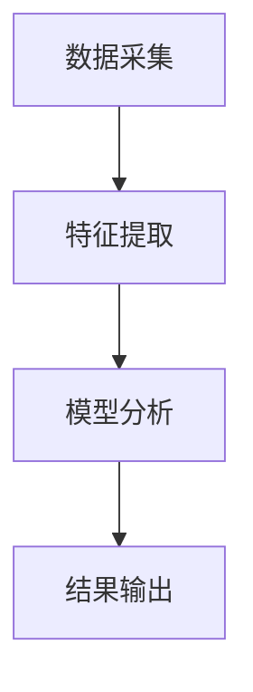

                 


# 彼得林奇的"行业生命周期"分析框架

> 关键词：彼得林奇，行业生命周期，投资策略，技术分析，系统架构，数据建模

> 摘要：本文以彼得林奇的行业生命周期理论为核心，结合技术分析方法，详细阐述了如何利用行业生命周期的四个阶段（幼稚期、成长期、成熟期、衰退期）进行投资分析和决策。通过构建行业生命周期分析框架，提出了一套基于技术指标的行业生命周期判定方法，并通过实际案例分析展示了该框架的应用价值。文章还结合系统架构设计，提出了行业生命周期分析的系统实现方案，为投资者提供了可操作的技术指导。

---

## 第一部分：行业生命周期的核心概念

### 1.1 行业生命周期的定义与背景

行业生命周期是指一个行业从诞生到衰退的全过程。彼得林奇在其投资理论中，将行业生命周期划分为四个阶段：**幼稚期、成长期、成熟期和衰退期**。每个阶段都有其独特的特征和投资机会。

#### 行业生命周期的背景
- 行业生命周期理论是投资学中的经典理论，帮助投资者识别行业的成长性和投资价值。
- 通过分析行业生命周期，投资者可以更好地理解行业发展趋势，制定相应的投资策略。

#### 行业生命周期的核心问题
- 如何识别行业的当前所处阶段？
- 如何利用行业生命周期阶段进行投资决策？
- 行业生命周期与其他经济指标之间的关系是什么？

### 1.2 行业生命周期的核心要素

行业生命周期的核心要素包括以下几个方面：

| 核心要素 | 特征描述 | 投资策略 |
|----------|----------|----------|
| 行业增长率 | 行业规模的扩张速度 | 高增长率行业可能处于成长期或幼稚期 |
| 行业利润率 | 行业的盈利能力 | 高利润率行业可能处于成熟期 |
| 市场容量 | 行业的市场规模 | 市场容量趋于饱和的行业可能处于衰退期 |
| 竞争结构 | 行业内的竞争状况 | 高度竞争的行业可能处于成长期或成熟期 |

---

## 第二部分：行业生命周期的阶段分析

### 2.1 幼稚期阶段

#### 幼稚期的特征与表现
- **市场容量小**：行业刚刚起步，市场规模有限。
- **增长率高**：行业的年增长率通常超过20%。
- **利润率低**：由于市场竞争尚未充分展开，企业利润较低。

#### 幼稚期的投资机会与风险
- **机会**：潜在的高增长机会，适合长期投资者。
- **风险**：市场不确定性大，企业盈利能力有限。

#### 彼得林奇对幼稚期行业的投资策略
- **选择性强**：优先选择市场需求明确、技术领先的企业。
- **长期持有**：等待行业进入成长期。

### 2.2 成长期阶段

#### 成长期的特征与表现
- **市场容量扩大**：行业规模快速增长。
- **增长率下降**：行业的年增长率逐渐放缓，但仍保持较高水平。
- **利润率上升**：行业内的企业开始盈利。

#### 成长期的投资机会与风险
- **机会**：行业龙头企业的股票可能有较高的回报率。
- **风险**：市场竞争加剧，企业利润可能受到挤压。

#### 彼得林奇对成长期行业的投资策略
- **关注龙头企业**：选择市场份额领先的公司。
- **分散投资**：避免过度集中于单一行业。

### 2.3 成熟期阶段

#### 成熟期的特征与表现
- **市场容量稳定**：行业规模趋于饱和。
- **增长率放缓**：行业的年增长率下降至较低水平。
- **利润率稳定**：行业内企业利润较为稳定。

#### 成熟期的投资机会与风险
- **机会**：行业龙头企业可能有稳定的股息收益。
- **风险**：行业增长潜力有限，投资回报率可能下降。

#### 彼得林奇对成熟期行业的投资策略
- **关注分红股**：选择股息收益率高的企业。
- **长期持有**：等待行业周期性波动带来的投资机会。

### 2.4 衰退期阶段

#### 衰退期的特征与表现
- **市场容量萎缩**：行业规模持续缩小。
- **增长率下降**：行业的年增长率可能为负。
- **利润率下降**：行业内企业的盈利能力显著下降。

#### 衰退期的投资机会与风险
- **机会**：低价买入潜在复苏企业的股票。
- **风险**：行业衰退趋势难以逆转。

#### 彼得林奇对衰退期行业的投资策略
- **谨慎投资**：避免投资于衰退期行业。
- **等待行业整合**：关注行业整合带来的投资机会。

---

## 第三部分：行业生命周期分析框架的构建

### 3.1 行业生命周期分析的核心指标

行业生命周期分析的核心指标包括以下几点：

- **行业增长率**：行业的年增长率（Growth Rate）。
- **行业利润率**：行业的平均利润率（Profit Margin）。
- **市场容量**：行业的市场规模（Market Size）。
- **竞争结构**：行业内企业的数量和市场份额分布。

#### 行业增长率的计算
行业增长率的计算公式为：

$$
\text{行业增长率} = \frac{\text{当年行业规模} - \text{上一年行业规模}}{\text{上一年行业规模}} \times 100\%
$$

#### 行业利润率的计算
行业利润率的计算公式为：

$$
\text{行业利润率} = \frac{\text{行业利润}}{\text{行业收入}} \times 100\%
$$

---

## 第四部分：行业生命周期分析的系统性框架

### 4.1 行业生命周期分析的系统模型

行业生命周期分析的系统模型包括以下步骤：

1. **数据采集**：收集行业规模、企业利润、市场份额等数据。
2. **特征提取**：提取行业增长率、利润率、市场容量等核心指标。
3. **模型分析**：基于核心指标判断行业所处的生命周期阶段。
4. **结果输出**：输出行业生命周期阶段的分析结果。

#### 行业生命周期分析的系统架构



### 4.2 行业生命周期分析的算法实现

行业生命周期分析的算法实现步骤如下：

1. **数据预处理**：清洗和归一化数据。
2. **特征提取**：提取行业生命周期的核心指标。
3. **模型训练**：使用机器学习算法（如决策树、随机森林）训练行业生命周期分类模型。
4. **结果预测**：基于模型预测行业所处的生命周期阶段。

#### 行业生命周期分析的Python实现

```python
# 数据预处理
import pandas as pd
import numpy as np

data = pd.read_csv('industry_data.csv')
data.dropna(inplace=True)

# 特征提取
features = ['industry_growth_rate', 'industry_profit_margin', 'market_size']
target = 'life_cycle_stage'

# 模型训练
from sklearn.ensemble import RandomForestClassifier
from sklearn.model_selection import train_test_split

X = data[features]
y = data[target]

X_train, X_test, y_train, y_test = train_test_split(X, y, test_size=0.2)

model = RandomForestClassifier()
model.fit(X_train, y_train)

# 模型预测
y_pred = model.predict(X_test)
print("预测结果:", y_pred)
```

---

## 第五部分：行业生命周期分析的实际应用

### 5.1 具体行业的生命周期分析

#### 高科技行业分析
- **现状**：高科技行业目前处于成长期，行业规模迅速扩大，但竞争日益激烈。
- **投资策略**：优先选择技术领先、市场份额高的企业。

#### 制造业行业分析
- **现状**：制造业行业目前处于成熟期，行业规模稳定，利润率稳定。
- **投资策略**：关注高股息收益率的龙头企业。

### 5.2 彼得林奇投资策略的实际案例

#### 成功投资案例
- **案例**：投资某高科技企业，行业处于成长期，企业市场份额逐步扩大，股价上涨。

#### 失败投资案例
- **案例**：投资某制造业企业，行业处于衰退期，企业利润持续下降，股价下跌。

---

## 第六部分：总结与展望

### 6.1 总结

本文通过结合彼得林奇的行业生命周期理论和现代技术分析方法，构建了一个完整的行业生命周期分析框架。通过系统的数据建模和算法实现，投资者可以更精准地判断行业所处的生命周期阶段，并制定相应的投资策略。

### 6.2 展望

未来，随着人工智能和大数据技术的不断发展，行业生命周期分析将更加精准和高效。投资者可以利用更先进的技术手段，如深度学习和自然语言处理，进一步提升行业分析的准确性和实时性。

---

## 参考文献

1. 彼得·林奇. 《彼得林奇的成功投资》
2. 技术分析经典教材. 《技术分析实战指南》
3. 数据建模与算法实现. 《机器学习实战》

---

通过本文的分析，投资者可以更好地理解行业生命周期的内在规律，并利用技术手段提升投资决策的科学性和准确性。

