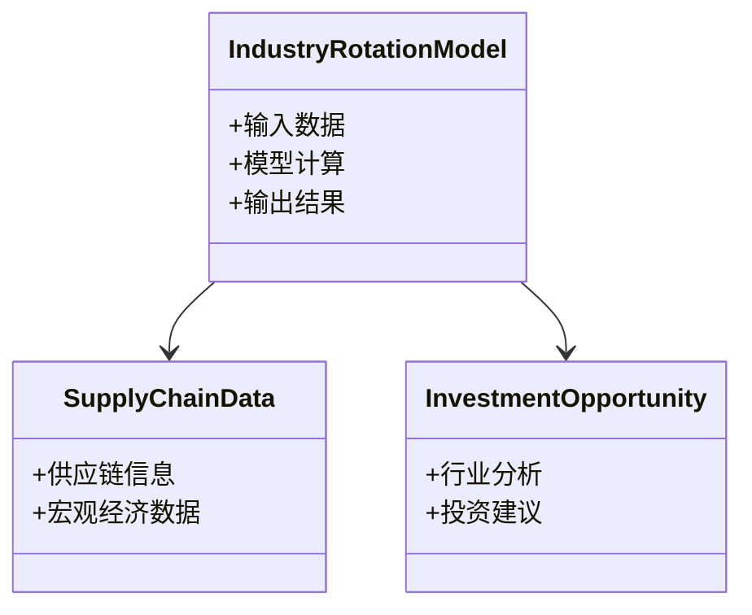

                 


# 彼得林奇的"行业轮动"在全球供应链重构中的投资机会识别

> 关键词：行业轮动，供应链重构，彼得林奇，投资机会，数学模型

> 摘要：本文探讨了彼得林奇的行业轮动策略在全球供应链重构背景下的应用，分析了供应链重构对行业轮动的影响，并构建了一个基于行业轮动的数学模型，用于识别投资机会。通过详细分析供应链重构的趋势、模型构建和系统设计，本文为投资者提供了理论和实践指导。

---

## 第一部分：彼得林奇的"行业轮动"投资策略

### 第1章：行业轮动概述

#### 1.1 行业轮动的定义与机制

- **行业轮动的定义**：行业轮动是一种投资策略，指根据经济周期和行业发展趋势，动态调整投资组合中各行业的权重，以捕捉不同行业之间的轮动机会。

- **行业轮动的机制**：行业轮动的核心在于识别行业周期的变化，通过分析宏观经济指标、行业基本面和市场情绪，预测哪些行业即将进入上升周期，从而提前布局。

- **行业轮动的影响因素**：包括经济周期、政策变化、技术创新、行业竞争格局等。

#### 1.2 彼得林奇的投资理念

- **彼得林奇的投资风格**：彼得林奇以价值投资和长期持有著称，他注重基本面分析，寻找那些具有持续增长潜力的公司。

- **彼得林奇的选股标准**：他倾向于投资那些具有强大竞争优势、稳定的管理层和良好财务状况的公司。

- **彼得林奇的长期投资策略**：彼得林奇强调长期投资，避免短期市场波动的干扰，注重公司长期的增长潜力。

#### 1.3 供应链重构的全球趋势

- **供应链重构的定义**：供应链重构是指在全球化背景下，企业重新优化供应链布局，以应对地缘政治风险、疫情冲击和成本压力。

- **供应链重构的驱动因素**：包括全球化逆转、地缘政治冲突、疫情对全球供应链的冲击、企业降低成本的需求等。

- **供应链重构对行业轮动的影响**：供应链重构可能导致某些行业的需求激增，而其他行业的需求下降，从而引发行业轮动。

---

### 第2章：供应链重构与行业轮动的关系

#### 2.1 供应链重构的核心特征

- **供应链区域化趋势**：企业倾向于在靠近主要市场的地区建立供应链，以减少运输成本和风险。

- **供应链本地化发展**：企业将供应链布局在本地，以应对地缘政治风险和贸易壁垒。

- **供应链多元化布局**：企业分散供应链，避免过度依赖单一地区，降低风险。

#### 2.2 供应链重构对行业轮动的影响

- **供应链重构引发的行业波动**：供应链重构可能导致某些行业的供需失衡，引发行业波动。

- **供应链重构带来的投资机会**：区域化供应链可能导致某些地区的相关行业需求增加，带来投资机会。

- **供应链重构对行业周期的影响**：供应链重构可能改变行业的生命周期，加速某些行业的衰退或崛起。

---

### 第3章：彼得林奇行业轮动模型

#### 3.1 行业轮动模型的构建

- **模型的基本框架**：模型基于宏观经济指标、行业基本面和市场情绪，预测行业的轮动趋势。

- **模型的核心假设**：行业轮动与宏观经济周期密切相关，供应链重构会影响行业的供需关系。

- **模型的输入变量**：包括GDP增长率、行业利润率、市场情绪指数等。

#### 3.2 供应链重构对模型的影响

- **供应链重构对模型输入变量的调整**：模型需要考虑供应链重构对行业成本、供应能力和市场需求的影响。

- **供应链重构对模型输出结果的影响**：供应链重构可能导致某些行业的景气度上升，从而影响模型的预测结果。

- **供应链重构对模型优化的方向**：模型需要不断更新，以反映供应链重构的最新趋势。

---

### 第4章：行业轮动模型的数学基础

#### 4.1 时间序列分析

- **时间序列的基本概念**：时间序列是指按时间顺序排列的数据，常用于预测未来趋势。

- **时间序列的分解方法**：包括趋势分解、周期分解和噪声分解。

- **时间序列预测模型**：常用ARIMA模型和GARCH模型。

#### 4.2 供应链重构的数学建模

- **供应链重构的网络流模型**：通过图论方法，分析供应链中的节点和边，优化物流路径。

- **供应链重构的成本优化模型**：建立成本函数，寻找最小成本的供应链布局。

- **供应链重构的风险评估模型**：通过蒙特卡洛模拟，评估供应链重构中的风险。

---

### 第5章：供应链重构下的投资机会识别

#### 5.1 投资机会识别的流程

- **数据收集与处理**：收集宏观经济数据、行业数据和供应链相关信息，进行清洗和预处理。

- **行业趋势分析**：分析行业周期和供应链重构对行业的潜在影响。

- **投资机会评估**：根据模型预测结果，评估投资机会的可行性。

#### 5.2 供应链重构下的行业选择

- **区域化供应链的优势**：靠近主要市场，降低物流成本，减少地缘政治风险。

- **本地化供应链的投资机会**：本地化供应链可能导致本地相关行业的增长。

- **多元化供应链的风险与收益**：多元化供应链可以分散风险，但也可能导致成本增加。

---

### 第6章：系统架构与实现

#### 6.1 系统设计

- **系统功能设计**：包括数据采集、模型计算、结果展示和投资建议。

- **领域模型（Mermaid类图）**



- **系统架构设计（Mermaid架构图）**


---

### 第7章：项目实战

#### 7.1 环境安装

- **安装Python和相关库**：安装Python 3.x，安装pandas、numpy、scikit-learn等库。

#### 7.2 核心实现代码

```python
import pandas as pd
from sklearn.linear_model import LinearRegression

# 数据加载
data = pd.read_csv('industry_data.csv')

# 模型训练
model = LinearRegression()
model.fit(data[['GDP增长率', '行业利润率']], data['行业景气度'])

# 预测结果
predicted = model.predict(data[['GDP增长率', '行业利润率']])
```

#### 7.3 案例分析

- **案例背景**：假设某区域供应链重构导致本地制造业需求增加。

- **分析过程**：通过模型预测，本地制造业行业的景气度可能上升，投资机会增加。

- **结果解读**：模型预测本地制造业行业的景气度将上升，建议投资者关注该行业。

#### 7.4 项目小结

- 本项目通过构建行业轮动模型，识别了供应链重构背景下的投资机会。

---

### 第8章：最佳实践

#### 8.1 小结

- 彼得林奇的行业轮动策略在全球供应链重构中具有重要的应用价值。

#### 8.2 注意事项

- 投资者应密切关注供应链重构的最新趋势，及时调整投资策略。

#### 8.3 拓展阅读

- 推荐阅读《彼得林奇的成功投资》和《供应链管理：战略与实践》。

---

通过以上分析，我们构建了一个基于彼得林奇行业轮动策略的数学模型，用于识别供应链重构背景下的投资机会。该模型结合了宏观经济指标和行业基本面数据，能够有效捕捉行业轮动的趋势。

