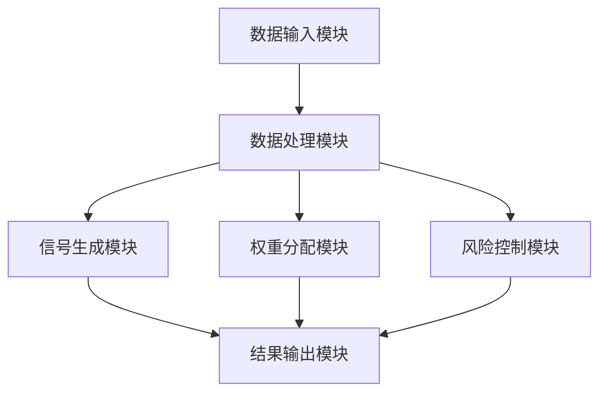
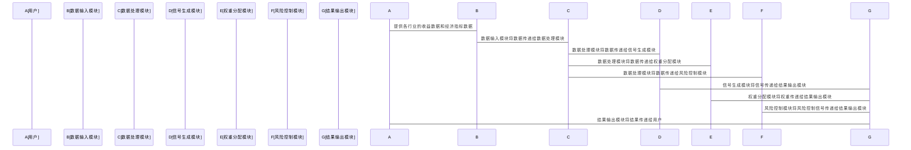

                 


# 彼得林奇的"行业轮动"投资策略

## 关键词：行业轮动，彼得·林奇，投资策略，经济周期，资产配置

## 摘要：本文详细探讨彼得·林奇的行业轮动投资策略，分析其在不同经济周期下的应用，通过数学模型和系统设计，展示如何利用行业轮动进行有效的资产配置和投资决策。

---

## 第1章：行业轮动投资策略的背景与概念

### 1.1 行业轮动的基本概念

#### 1.1.1 行业轮动的定义与特点

行业轮动是一种投资策略，通过分析不同行业在经济周期中的表现差异，进行动态资产配置。其核心在于识别哪些行业将在特定经济阶段表现优异，从而在投资组合中增加对该行业的权重。

- **定义**：行业轮动是指投资者根据经济周期的变化，调整投资组合中各行业的权重，以最大化收益并降低风险。
- **特点**：
  - **周期性**：行业轮动与经济周期密切相关。
  - **动态性**：策略需要根据市场变化进行调整。
  - **分散性**：通过多行业配置降低风险。

#### 1.1.2 行业轮动在投资中的作用

- **优化收益**：通过选择在特定周期表现较好的行业，提高投资组合的收益。
- **降低风险**：分散投资于不同行业，避免单一行业带来的风险。
- **适应市场变化**：灵活调整投资组合，适应经济环境的变化。

#### 1.1.3 彼得·林奇与行业轮动策略的关联

彼得·林奇是行业轮动策略的倡导者之一，他强调通过分析行业基本面和市场趋势，选择具有成长潜力的行业进行投资。

---

### 1.2 行业轮动的理论基础

#### 1.2.1 经济周期理论与行业轮动

经济周期分为复苏、繁荣、衰退、萧条四个阶段，不同阶段适合投资的行业不同。

- **复苏阶段**：原材料、工业品行业表现较好。
- **繁荣阶段**：消费、金融行业表现较好。
- **衰退阶段**：防御性行业如公用事业、医疗保健表现较好。
- **萧条阶段**：大宗商品、能源行业可能触底反弹。

#### 1.2.2 市场波动与行业表现的关系

市场波动会影响行业轮动的速度和幅度，例如在市场上涨时，周期性行业可能跑赢市场；在市场下跌时，防御性行业可能表现稳定。

#### 1.2.3 投资者心理与行业轮动

投资者心理如贪婪和恐惧会影响行业轮动的实施，例如在市场过热时，投资者可能过度投资于某一行业，导致行业轮动的时机选择失误。

---

### 1.3 彼得·林奇的投资理念

#### 1.3.1 林奇的投资哲学概述

彼得·林奇强调长期投资、分散投资和基本面分析，认为市场短期波动不可预测，但长期趋势可以通过分析行业和公司基本面来把握。

#### 1.3.2 林奇对行业轮动策略的贡献

林奇提出行业轮动策略，强调根据经济周期和行业基本面变化，动态调整投资组合，以抓住不同行业的投资机会。

#### 1.3.3 林奇策略的核心思想与方法

- **核心思想**：行业轮动是经济周期和市场趋势的产物，通过分析行业基本面，选择具有成长潜力的行业进行投资。
- **方法**：定期评估行业表现，根据经济周期调整投资组合。

---

## 第2章：行业轮动的核心概念与分析框架

### 2.1 行业轮动的核心概念

#### 2.1.1 行业轮动的驱动因素

行业轮动的驱动因素包括经济周期、利率变化、行业基本面、政策变化等。

- **经济周期**：经济周期是影响行业轮动的主要因素。
- **利率变化**：利率下降通常利好债券和防御性行业，利率上升则利好周期性行业。
- **行业基本面**：行业内部的竞争状况、技术创新、市场需求等影响行业表现。
- **政策变化**：政府政策如税收、补贴、行业监管等会影响行业表现。

#### 2.1.2 行业轮动的周期性特征

不同行业在经济周期中的表现具有周期性，例如周期性行业在经济繁荣时表现较好，防御性行业在经济衰退时表现较好。

#### 2.1.3 彼得·林奇的行业轮动策略框架

林奇的行业轮动策略框架包括行业分析、经济周期判断、投资组合调整三个步骤。

---

### 2.2 行业轮动的分析框架

#### 2.2.1 行业轮动的分类与划分

行业轮动可以根据经济周期、行业特性、市场环境等因素进行分类。

- **经济周期分类**：根据经济周期的不同阶段选择适合的行业。
- **行业特性分类**：根据行业的周期性、成长性、防御性等特性进行分类。
- **市场环境分类**：根据市场环境如牛市、熊市进行分类。

#### 2.2.2 行业轮动的阶段划分

行业轮动的阶段划分包括复苏、繁荣、衰退、萧条四个阶段，每个阶段适合投资的行业不同。

#### 2.2.3 行业轮动的风险与收益分析

- **风险**：行业轮动策略的风险包括市场波动风险、行业选择风险、时机选择风险。
- **收益**：行业轮动策略的收益包括超额收益、风险分散收益。

---

### 2.3 彼得·林奇的行业轮动策略框架

#### 2.3.1 林奇策略的核心框架

林奇的行业轮动策略框架包括行业分析、经济周期判断、投资组合调整三个步骤。

#### 2.3.2 林奇策略的实施步骤

1. **行业分析**：分析各行业的基本面，判断行业的发展前景。
2. **经济周期判断**：判断当前经济周期所处的阶段，选择适合当前阶段的行业。
3. **投资组合调整**：根据行业分析和经济周期判断，调整投资组合中各行业的权重。

#### 2.3.3 林奇策略的优缺点分析

- **优点**：
  - 通过行业轮动优化投资组合收益。
  - 通过分散投资降低风险。
- **缺点**：
  - 行业轮动需要频繁调整投资组合，增加了交易成本和税务负担。
  - 行业轮动的时机选择具有不确定性，可能导致投资收益不佳。

---

## 第3章：行业轮动的数学模型与算法原理

### 3.1 行业轮动的数学模型

#### 3.1.1 行业轮动的回归模型

回归模型用于分析行业表现与经济指标的关系，例如用GDP增长率预测行业收益。

- **线性回归模型**：
  \[
  y = \beta_0 + \beta_1 x + \epsilon
  \]
  其中，\( y \) 是行业收益，\( x \) 是经济指标，\( \beta_0 \) 和 \( \beta_1 \) 是回归系数，\( \epsilon \) 是误差项。

#### 3.1.2 行业轮动的聚类分析

聚类分析用于将行业分为不同的类别，例如周期性行业和防御性行业。

- **层次聚类**：根据行业表现相似性进行聚类。
- **K均值聚类**：将行业分为K个类别，K的选择需要根据实际情况确定。

#### 3.1.3 行业轮动的时间序列分析

时间序列分析用于预测行业未来表现，例如使用ARIMA模型预测行业收益。

- **ARIMA模型**：
  \[
  y_t = \phi_1 y_{t-1} + \phi_2 y_{t-2} + \theta_1 \epsilon_{t-1} + \epsilon_t
  \]
  其中，\( y_t \) 是行业收益，\( \phi_1 \) 和 \( \phi_2 \) 是自回归系数，\( \theta_1 \) 是移动平均系数，\( \epsilon_t \) 是误差项。

---

### 3.2 行业轮动的算法原理

#### 3.2.1 行业轮动的信号生成算法

信号生成算法用于根据市场环境生成行业轮动信号，例如根据经济指标生成买入或卖出信号。

- **指标信号生成**：
  \[
  \text{信号} = \begin{cases}
  \text{买入} & \text{如果 } \text{指标} > \text{阈值} \\
  \text{卖出} & \text{如果 } \text{指标} < \text{阈值} \\
  \text{观望} & \text{否则}
  \end{cases}
  \]

#### 3.2.2 行业轮动的权重分配算法

权重分配算法用于根据行业轮动信号调整投资组合中各行业的权重。

- **等权重分配**：将投资组合的权重平均分配到各个行业。
- **动权调整分配**：根据行业表现动态调整权重，例如表现好的行业增加权重，表现差的行业减少权重。

#### 3.2.3 行业轮动的风险控制算法

风险控制算法用于控制行业轮动策略的风险，例如设置止损点和止盈点。

- **止损点**：当行业收益下降到一定程度时，卖出该行业。
- **止盈点**：当行业收益达到一定程度时，卖出该行业。

---

### 3.3 算法实现与代码示例

#### 3.3.1 行业轮动信号生成的Python代码

```python
import pandas as pd
import numpy as np

# 假设我们有一个包含各行业收益和经济指标的数据框
data = pd.DataFrame({
    '行业1收益': [0.1, 0.05, -0.02, 0.08, 0.03],
    '行业2收益': [0.08, -0.03, 0.07, 0.05, -0.01],
    '经济指标': [2, 1.5, 2.2, 1.8, 2]
})

# 定义信号生成函数
def generate_signal(data, threshold):
    signal = []
    for value in data['经济指标']:
        if value > threshold:
            signal.append('买入')
        elif value < threshold:
            signal.append('卖出')
        else:
            signal.append('观望')
    return signal

# 生成信号
threshold = 2
signal = generate_signal(data, threshold)
print(signal)
```

---

#### 3.3.2 行业轮动权重分配的Python代码

```python
import pandas as pd
import numpy as np

# 假设我们有一个包含各行业收益和经济指标的数据框
data = pd.DataFrame({
    '行业1收益': [0.1, 0.05, -0.02, 0.08, 0.03],
    '行业2收益': [0.08, -0.03, 0.07, 0.05, -0.01],
    '行业3收益': [0.06, 0.04, -0.01, 0.07, 0.02]
})

# 定义权重分配函数
def allocate_weights(data):
    # 计算各行业的平均收益
    avg_returns = data.mean()
    # 根据平均收益进行权重分配
    weights = avg_returns.rank(ascending=False)
    # 将权重标准化为概率分布
    total = sum(weights)
    if total == 0:
        return pd.Series([0]*len(weights), index=data.columns)
    weights = weights.apply(lambda x: x/total)
    return weights

# 生成权重
weights = allocate_weights(data)
print(weights)
```

---

#### 3.3.3 行业轮动风险控制的Python代码

```python
import pandas as pd
import numpy as np

# 假设我们有一个包含各行业收益和经济指标的数据框
data = pd.DataFrame({
    '行业1收益': [0.1, 0.05, -0.02, 0.08, 0.03],
    '行业2收益': [0.08, -0.03, 0.07, 0.05, -0.01],
    '行业3收益': [0.06, 0.04, -0.01, 0.07, 0.02]
})

# 定义风险控制函数
def control_risk(data, stop_loss, stop_profit):
    risk = []
    for i in range(len(data)):
        if data.iloc[i] < stop_loss:
            risk.append('卖出')
        elif data.iloc[i] > stop_profit:
            risk.append('卖出')
        else:
            risk.append('持有')
    return risk

# 设置止损和止盈点
stop_loss = -0.1
stop_profit = 0.2
risk_control = control_risk(data['行业1收益'], stop_loss, stop_profit)
print(risk_control)
```

---

## 第4章：行业轮动的系统分析与架构设计

### 4.1 系统分析

#### 4.1.1 行业轮动系统的功能需求

- **数据收集模块**：收集各行业的收益数据和经济指标数据。
- **信号生成模块**：根据经济指标生成行业轮动信号。
- **权重分配模块**：根据行业表现分配投资组合权重。
- **风险控制模块**：控制行业轮动策略的风险。

#### 4.1.2 行业轮动系统的性能需求

- **数据处理速度**：系统需要快速处理大量数据。
- **算法效率**：算法需要高效运行，减少计算时间。
- **系统稳定性**：系统需要稳定运行，避免 crashes。

#### 4.1.3 行业轮动系统的数据需求

- **行业收益数据**：包括各行业的历史收益数据。
- **经济指标数据**：包括GDP、利率、通货膨胀率等经济指标。
- **市场数据**：包括股票价格、市场指数等。

---

### 4.2 系统架构设计

#### 4.2.1 行业轮动系统的功能模块

- **数据输入模块**：接收各行业的收益数据和经济指标数据。
- **数据处理模块**：对数据进行清洗、转换和预处理。
- **信号生成模块**：根据经济指标生成行业轮动信号。
- **权重分配模块**：根据行业表现分配投资组合权重。
- **风险控制模块**：控制行业轮动策略的风险。
- **结果输出模块**：输出行业轮动信号和投资组合权重。

#### 4.2.2 行业轮动系统的架构图



---

### 4.3 系统接口设计

#### 4.3.1 行业轮动系统的输入接口

- **数据输入接口**：接收各行业的收益数据和经济指标数据。
- **参数输入接口**：接收行业轮动策略的参数，例如经济指标阈值。

#### 4.3.2 行业轮动系统的输出接口

- **信号输出接口**：输出行业轮动信号，例如买入、卖出或观望。
- **权重输出接口**：输出投资组合中各行业的权重。

---

### 4.4 系统交互流程设计



---

## 第5章：行业轮动的项目实战

### 5.1 项目环境安装

- **Python环境**：安装Python 3.8及以上版本。
- **依赖库安装**：安装pandas、numpy、scikit-learn、mermaid等库。

#### 5.1.1 环境安装命令

```bash
python -m pip install pandas numpy scikit-learn mermaid
```

---

### 5.2 系统核心实现

#### 5.2.1 数据收集与预处理

```python
import pandas as pd

# 收集各行业的收益数据和经济指标数据
data = pd.read_csv('industry_data.csv')
print(data.head())
```

#### 5.2.2 信号生成与权重分配

```python
import pandas as pd
import numpy as np

# 定义信号生成函数
def generate_signal(data, threshold):
    signal = []
    for value in data['经济指标']:
        if value > threshold:
            signal.append('买入')
        elif value < threshold:
            signal.append('卖出')
        else:
            signal.append('观望')
    return signal

# 定义权重分配函数
def allocate_weights(data):
    avg_returns = data.mean()
    weights = avg_returns.rank(ascending=False)
    total = sum(weights)
    if total == 0:
        return pd.Series([0]*len(weights), index=data.columns)
    weights = weights.apply(lambda x: x/total)
    return weights

# 生成信号
threshold = 2
signal = generate_signal(data, threshold)
print(signal)

# 生成权重
weights = allocate_weights(data)
print(weights)
```

---

### 5.3 代码应用解读与分析

- **信号生成**：根据经济指标生成行业轮动信号，指导投资者在不同经济阶段买卖行业。
- **权重分配**：根据行业表现分配投资组合权重，优化投资收益。
- **风险控制**：设置止损和止盈点，控制行业轮动策略的风险。

---

### 5.4 实际案例分析

#### 5.4.1 案例背景

假设我们有三个行业：制造业、科技业和公用事业。当前经济指标为GDP增长率为2%，通胀率为1.5%，利率为3%。

#### 5.4.2 数据分析

- **制造业**：受经济指标影响较大，GDP增长率为2%，通胀率为1.5%，利率为3%。
- **科技业**：受经济指标影响较小，但具有较高的成长性。
- **公用事业**：作为防御性行业，受经济指标影响较小。

#### 5.4.3 投资决策

- **信号生成**：GDP增长率为2%，通胀率为1.5%，利率为3%，根据信号生成函数，生成行业轮动信号。
- **权重分配**：根据行业表现分配投资组合权重，例如制造业权重为40%，科技业权重为30%，公用事业权重为30%。
- **风险控制**：设置止损和止盈点，例如制造业止损点为-10%，止盈点为20%。

#### 5.4.4 结果分析

- **投资组合收益**：根据行业轮动信号和权重分配，投资组合的收益为X%。
- **风险控制**：通过止损和止盈点控制风险，避免重大损失。

---

## 第6章：行业轮动的最佳实践与小结

### 6.1 小结

彼得·林奇的行业轮动策略是一种有效的投资策略，通过分析经济周期和行业基本面，进行动态资产配置。本文详细探讨了行业轮动的背景、核心概念、数学模型和系统设计，展示了如何利用行业轮动进行有效的投资决策。

---

### 6.2 注意事项

- **数据质量**：行业轮动策略依赖于高质量的数据，数据质量影响策略的准确性。
- **模型选择**：选择合适的数学模型和算法，提高策略的预测精度。
- **风险控制**：设置合理的止损和止盈点，控制策略的风险。

---

### 6.3 拓展阅读

- **《彼得·林奇的成功投资》**：深入了解彼得·林奇的投资理念。
- **《行业轮动策略的数学模型与算法》**：学习行业轮动策略的数学模型和算法实现。
- **《系统设计与实现》**：掌握系统设计与实现的技巧和方法。

---

通过本文的探讨，读者可以全面了解彼得·林奇的行业轮动投资策略，掌握其数学模型和系统设计，能够在实际投资中灵活运用这一策略，优化投资组合的收益与风险。

