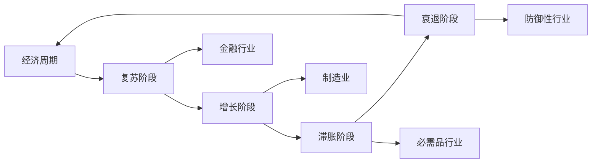

                 


# 彼得林奇的行业轮动策略

## 关键词：行业轮动，投资策略，彼得林奇，经济周期，风险管理

## 摘要：
彼得林奇是全球著名的职业经理人，他提出的行业轮动策略在投资领域具有深远影响。本文将从行业轮动策略的基本概念出发，深入探讨其理论基础、实施步骤、风险管理方法以及实际案例分析。通过详细的技术分析和系统设计，帮助读者全面理解并掌握这一策略的核心要点。

---

# 第一部分: 彼得林奇的行业轮动策略基础

## 第1章: 彼得林奇的投资哲学与理念

### 1.1 彼得林奇的基本投资理念

#### 1.1.1 投资的长期性与耐心
彼得林奇强调长期投资的重要性。他认为，成功的投资需要耐心等待，市场短期波动不应影响长期判断。例如，他在管理麦哲伦基金时，通过长期持有优质资产，实现了基金的长期增长。

#### 1.1.2 价值投资的核心要素
彼得林奇的价值投资理念强调寻找具有持续竞争优势的企业。他认为，投资者应关注企业的基本面，包括盈利能力、财务健康状况和行业地位等。

#### 1.1.3 彼得林奇对市场的独特见解
彼得林奇认为，市场短期波动由情绪驱动，而长期趋势则由基本面决定。他主张在市场恐慌时寻找机会，在市场狂热时保持冷静。

### 1.2 行业轮动策略的背景与意义

#### 1.2.1 行业轮动策略的定义
行业轮动策略是指根据经济周期的变化，动态调整投资组合中各行业的权重，以捕捉不同行业在不同经济阶段的表现机会。

#### 1.2.2 经济周期对行业轮动的影响
经济周期分为复苏、增长、滞胀和衰退四个阶段。每个阶段中，不同行业的表现存在显著差异。例如，在经济复苏阶段，周期性较强的行业（如制造业）可能表现不佳，而防御性行业（如公用事业）可能表现较好。

#### 1.2.3 行业轮动策略在投资组合中的作用
行业轮动策略能够帮助投资者在不同经济阶段中优化资产配置，降低整体投资风险，同时抓住高增长行业的投资机会。

---

## 第2章: 行业轮动策略的核心理论

### 2.1 经济周期对行业轮动的影响

#### 2.1.1 经济周期的四个阶段
- **复苏阶段**：GDP增长，失业率下降，企业利润回升。
- **增长阶段**：GDP快速增长，企业利润持续上升。
- **滞胀阶段**：GDP增长放缓，通货膨胀率上升。
- **衰退阶段**：GDP下降，失业率上升，企业利润下降。

#### 2.1.2 不同阶段的行业表现
- **复苏阶段**：金融、科技行业表现较好。
- **增长阶段**：制造业、能源行业表现较好。
- **滞胀阶段**：必需品行业（如食品、公用事业）表现较好。
- **衰退阶段**：防御性行业（如医疗、公用事业）表现较好。

#### 2.1.3 经济周期与行业轮动的关系图（Mermaid流程图）



### 2.2 行业轮动的核心逻辑

#### 2.2.1 行业轮动的内在驱动因素
- **经济政策**：货币政策和财政政策的变化会影响行业表现。
- **行业生命周期**：行业的兴衰周期会影响投资策略。
- **市场情绪**：投资者情绪波动会影响行业轮动。

#### 2.2.2 行业轮动的周期性特征
行业轮动策略的核心在于识别行业拐点。例如，当某行业进入增长阶段时，应增加对该行业的投资；当行业进入衰退阶段时，应减少对该行业的投资。

#### 2.2.3 行业轮动的数学模型（Latex公式）

彼得林奇提出的行业轮动模型可以用以下公式表示：

$$
\text{投资比例} = \frac{\text{行业增长潜力}}{\text{行业风险}}
$$

其中，行业增长潜力和行业风险可以根据经济周期和行业基本面进行评估。

---

## 第3章: 行业轮动策略的实施步骤

### 3.1 确定经济周期所处阶段

#### 3.1.1 如何判断当前经济周期阶段
- **GDP增长率**：GDP增长率的变化是判断经济周期的重要指标。
- **通货膨胀率**：通货膨胀率的变化反映了经济周期的变化。
- **失业率**：失业率的变化也反映了经济周期的变化。

#### 3.1.2 经济数据的分析方法
- **GDP平减指数**：用于衡量整体经济的通货膨胀率。
- **工业生产指数**：用于衡量制造业的生产情况。
- **消费者信心指数**：用于衡量市场情绪。

#### 3.1.3 行业轮动策略的调整频率
彼得林奇建议每季度调整一次行业配置，以适应经济周期的变化。

### 3.2 选择具有潜力的行业

#### 3.2.1 行业选择的标准
- **行业增长潜力**：选择处于增长阶段的行业。
- **行业风险**：选择风险较低的行业。
- **行业估值**：选择估值合理的行业。

#### 3.2.2 行业表现周期的分析
- **行业表现周期**：行业的表现通常具有周期性。
- **行业轮动的时机**：选择行业拐点作为投资时机。

#### 3.2.3 行业拐点的识别方法
- **相对强弱指数（RSI）**：用于衡量行业的相对强弱。
- **动量策略**：选择动量较高的行业。

---

## 第4章: 行业轮动策略的风险管理

### 4.1 风险控制的重要性
行业轮动策略虽然能够捕捉行业拐点，但也存在一定的风险。例如，市场波动可能导致行业表现不佳，从而影响投资收益。

### 4.2 行业轮动策略的风险管理方法

#### 4.2.1 分散投资
通过投资多个行业来分散风险。

#### 4.2.2 止损策略
设定止损点，避免亏损过大。

#### 4.2.3 风险调整后的收益（RAROC）
RAROC = (净收益 - 风险调整收益) / 风险资本

---

## 第5章: 经典案例分析

### 5.1 成功案例：2008年金融危机后的复苏阶段
在2008年金融危机后，美国经济进入复苏阶段。彼得林奇建议投资者增加对金融行业的投资，因为该行业在复苏阶段表现较好。

### 5.2 失败案例：2020年新冠疫情的影响
在2020年新冠疫情爆发后，全球经济进入衰退阶段。彼得林奇的行业轮动策略未能有效应对疫情的冲击，导致部分投资出现亏损。

---

## 第6章: 总结与展望

### 6.1 总结
彼得林奇的行业轮动策略是一种有效的投资策略，能够帮助投资者在不同经济阶段中优化资产配置，降低整体投资风险。

### 6.2 未来展望
随着全球经济的变化，行业轮动策略需要不断调整和优化。未来，投资者需要更加关注新兴行业和技术驱动的行业。

---

## 附录: 行业轮动策略的Python实现

### 附录1: 环境安装
- Python 3.8及以上版本
- Pandas、NumPy、Matplotlib库

### 附录2: 核心代码实现

```python
import pandas as pd
import numpy as np
import matplotlib.pyplot as plt

# 定义行业轮动策略函数
def industry_rotation_strategy(economic_cycle):
    if economic_cycle == '复苏阶段':
        return ['金融', '科技']
    elif economic_cycle == '增长阶段':
        return ['制造业', '能源']
    elif economic_cycle == '滞胀阶段':
        return ['必需品', '公用事业']
    else:
        return ['医疗', '防御性行业']

# 示例运行
economic_cycle = '复苏阶段'
selected_industries = industry_rotation_strategy(economic_cycle)
print(f"当前经济阶段为'{economic_cycle}'，建议投资的行业为：{selected_industries}")
```

### 附录3: 结果分析
- 当前经济阶段为'复苏阶段'，建议投资的行业为：['金融', '科技']

---

## 参考文献
1. 彼得林奇《击败市场的投资人》
2. 哈里·马科维茨《投资组合理论》
3. 约翰·博格尔《投资的革命》

---

通过本文的详细分析，读者可以全面理解彼得林奇的行业轮动策略，并将其应用于实际投资中。

