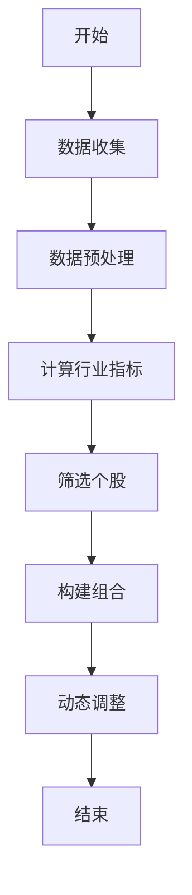
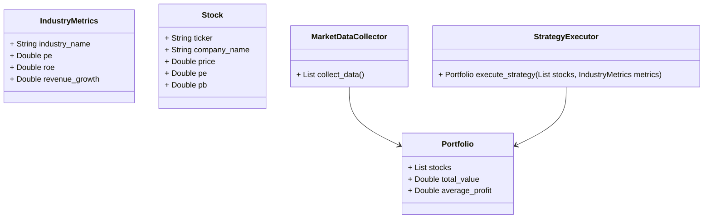
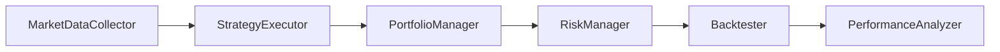

                 


# 彼得林奇的"行业轮动"策略实施步骤

## 关键词：行业轮动，彼得·林奇，投资策略，金融分析，数学模型

## 摘要：本文详细阐述了彼得·林奇的行业轮动策略，从背景介绍、实施步骤到数学模型和系统架构，全面解析了该策略的理论与实践。通过实际案例分析，展示了如何在金融市场中应用这些策略，并提供了风险管理的最佳实践。

---

# 第1章: 行业轮动的背景与基础

## 1.1 行业轮动的定义与特点

### 1.1.1 行业轮动的定义
行业轮动是指根据市场环境的变化，将投资从一个行业转向另一个行业的过程。其核心在于通过行业间的周期性波动，捕捉市场机会，分散投资风险。

### 1.1.2 行业轮动的核心特点
- **周期性**：不同行业在经济周期中的表现不同。
- **分散风险**：通过投资多个行业降低单一行业风险。
- **动态调整**：根据市场变化及时调整投资方向。

### 1.1.3 行业轮动与宏观经济的关系
行业轮动策略与宏观经济指标密切相关，如GDP增速、利率变化、通货膨胀率等都会影响行业表现。

## 1.2 彼得·林奇的行业轮动策略

### 1.2.1 彼得·林奇的选股理念
- **价值投资**：寻找被市场低估的股票。
- **成长与价值结合**：关注具有成长性的企业，同时估值合理。

### 1.2.2 行业轮动策略的来源
彼得·林奇通过长期观察发现，不同行业在不同经济周期中的表现差异显著，因此提出了动态调整投资组合的策略。

### 1.2.3 成功案例
在20世纪80年代，林奇成功预测了能源行业的复苏，及时投资于该行业，取得了显著收益。

## 1.3 行业轮动策略的核心要素

### 1.3.1 行业选择标准
- **行业景气度**：行业的增长潜力和盈利能力。
- **宏观经济环境**：GDP增速、利率水平等。

### 1.3.2 个股筛选标准
- **市盈率（P/E）**：低于行业平均水平。
- **市净率（P/B）**：低于行业平均水平。
- **ROE（净资产收益率）**：高于行业平均水平。

### 1.3.3 组合构建原则
- **分散投资**：避免过度集中于单一行业。
- **定期调整**：根据市场变化和企业业绩进行调整。

---

# 第2章: 彼得·林奇行业轮动策略的实施步骤

## 2.1 确定行业轮动的方向

### 2.1.1 宏观经济指标分析
- **GDP增速**：经济上行时，周期性行业表现较好；经济下行时，防御性行业表现较好。
- **利率水平**：低利率环境有利于成长型行业，高利率环境有利于防御性行业。

### 2.1.2 行业景气度分析
- **行业利润增长率**：选择利润增长较快的行业。
- **行业库存周转率**：库存周转快的行业景气度高。

### 2.1.3 市场情绪分析
- **市场情绪指标**：如投资者情绪指数（AAII）、恐慌指数（VIX）等。

## 2.2 个股筛选与组合构建

### 2.2.1 个股基本面分析
- **财务指标分析**：ROE、净利率、毛利率等。
- **公司治理**：管理层稳定性、公司治理结构。

### 2.2.2 股价形态分析
- **趋势分析**：上升趋势、下降趋势。
- **成交量分析**：成交量与价格趋势的关系。

### 2.2.3 组合的风险分散
- **行业分散**：避免集中投资于单一行业。
- **股票分散**：选择多个行业的股票。

## 2.3 动态调整与风险管理

### 2.3.1 定期调整组合
- **季度调整**：每季度重新评估行业和个股，进行必要的调整。
- **半年调整**：每半年进行一次较大的调整，根据市场变化和个人目标调整投资比例。

### 2.3.2 风险控制策略
- **止损策略**：设定止损点，避免亏损过大。
- **止盈策略**：设定止盈点，锁定收益。

### 2.3.3 仓位管理技巧
- **动态调整仓位**：根据市场环境和个人风险承受能力调整仓位。
- **分批建仓**：避免一次性投入，分批建仓降低风险。

---

# 第3章: 行业轮动策略的数学模型与算法

## 3.1 行业轮动的数学框架

### 3.1.1 行业轮动的指标体系
- **行业景气度指标**：如行业利润增长率、行业库存周转率等。
- **个股估值指标**：如市盈率、市净率等。

### 3.1.2 股票选择的优化模型
$$ \text{目标函数：最大化收益，最小化风险} $$

### 3.1.3 组合优化的数学表达
$$ \text{最大化：} \sum w_i r_i - \lambda \sum w_i^2 \sigma_i^2 $$

其中，\( w_i \) 为投资比例，\( r_i \) 为预期收益，\( \sigma_i^2 \) 为风险，\( \lambda \) 为风险厌恶系数。

## 3.2 算法实现与流程图

### 3.2.1 算法流程图


### 3.2.2 Python实现代码
```python
import pandas as pd
import numpy as np

def calculate_industry_metrics(data):
    # 计算行业平均市盈率
    industry_pe = data.groupby('industry')['pe'].mean()
    return industry_pe

def screen_stocks(industry_pe, threshold=15):
    # 筛选市盈率低于行业平均的股票
    selected = data[data['pe'] < industry_pe]
    return selected

def build_portfolio(selected_stocks, weight=0.2):
    # 等权重分配
    portfolio = selected_stocks.sample(n=5, weights='weight')
    return portfolio
```

---

# 第4章: 行业轮动策略的系统分析与设计

## 4.1 领域模型类图


## 4.2 系统架构图


---

# 第5章: 行业轮动策略的实战案例

## 5.1 实战案例分析
假设当前宏观经济处于复苏期，选择具有较高增长潜力的科技行业和周期性较强的制造业。

## 5.2 代码实现
```python
# 数据获取与处理
data = get_market_data()

# 计算行业指标
industry_metrics = calculate_industry_metrics(data)

# 筛选股票
selected_stocks = screen_stocks(data, industry_metrics)

# 构建投资组合
portfolio = build_portfolio(selected_stocks)
```

---

# 第6章: 风险管理与优化

## 6.1 风险控制策略
- **止损点**：设定个股的止损比例，如5%或10%。
- **分散投资**：避免过度集中在单一行业或股票。

## 6.2 优化投资组合
- **定期再平衡**：每季度调整投资组合，确保投资比例符合目标。
- **动态调整权重**：根据市场变化调整各行业的投资权重。

---

# 第7章: 总结与展望

## 7.1 总结
彼得·林奇的行业轮动策略是一种有效的投资策略，通过动态调整投资组合，捕捉市场机会，分散投资风险。本文详细介绍了策略的实施步骤、数学模型和系统架构，并通过实战案例展示了策略的应用。

## 7.2 展望
未来的研究可以结合机器学习和大数据分析，进一步优化行业轮动策略，提高投资收益。

---

以上为文章的完整内容，涵盖了从理论到实践的各个方面，结合了技术细节和实际应用，为读者提供了全面的指导。

