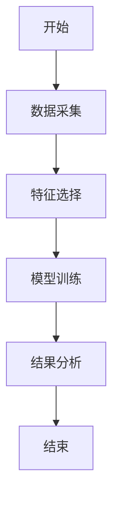
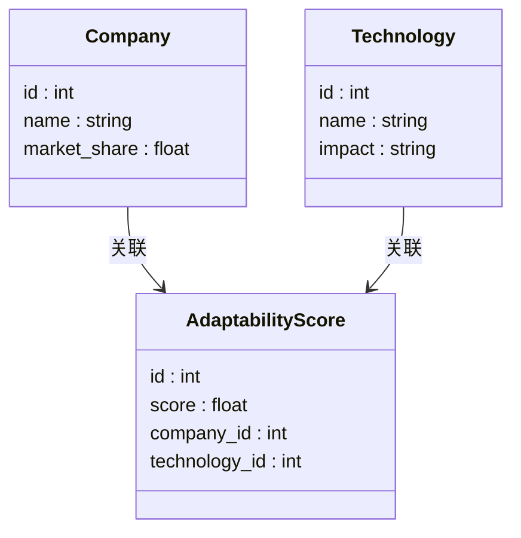
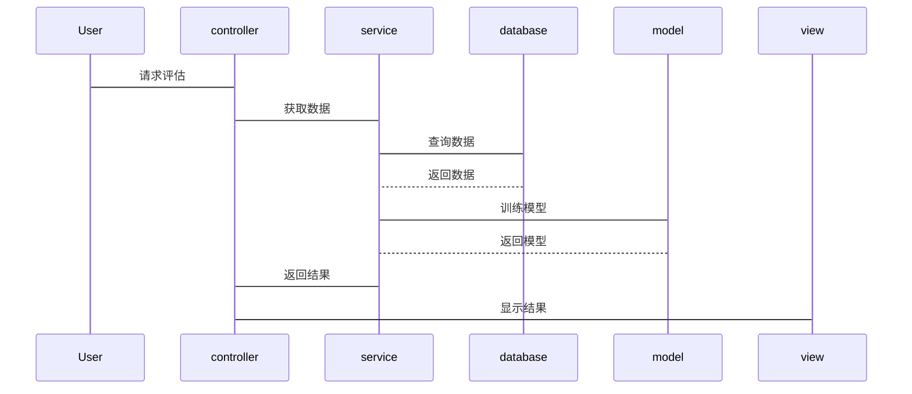

                 


# 彼得林奇的"行业领导者"在技术变革中的适应能力评估

## 关键词：彼得林奇、行业领导者、技术变革、适应能力、评估模型、算法原理、系统架构

## 摘要：本文探讨了彼得林奇提出的“行业领导者”概念在技术变革中的适应能力评估。通过分析技术变革的背景与趋势，结合适应能力的定义与评估指标，构建了一个基于算法和系统架构的评估模型，提出了具体的实现方法和应用场景。

---

# 第1章：引言

## 1.1 背景介绍

### 1.1.1 彼得林奇的“行业领导者”理论
彼得·林奇是美国著名的投资专家，他提出的“行业领导者”概念是指在某个行业中具有领先地位和竞争优势的企业。这些企业通常在市场中占据主导地位，具有较强的市场份额和品牌影响力。然而，随着技术的快速发展，行业领导者也面临着巨大的挑战，尤其是在适应技术变革方面。

### 1.1.2 技术变革的背景与趋势
当前，技术变革的速度越来越快，数字化转型已经成为企业生存和发展的关键。人工智能、大数据、区块链等新兴技术的出现，对企业运营模式和业务流程产生了深远影响。行业领导者需要具备快速适应技术变革的能力，才能在竞争中保持优势。

### 1.1.3 适应能力的重要性
适应能力是指企业在面对外部环境变化时，能够迅速调整自身策略和运营模式的能力。在技术变革的背景下，适应能力是企业能否持续发展的关键因素。本文将重点探讨行业领导者在技术变革中的适应能力评估。

## 1.2 问题背景与描述
技术变革对企业的影响是多方面的，包括产品创新、商业模式转变、运营效率提升等方面。然而，许多行业领导者由于缺乏灵活性和创新能力，难以快速适应技术变革，最终导致市场份额的流失。因此，如何评估和提升行业领导者的适应能力，成为企业管理和投资决策中的重要问题。

## 1.3 问题解决与边界
本文将通过构建适应能力评估模型，帮助企业识别和评估其在技术变革中的适应能力。模型将基于企业的市场份额、创新能力、财务状况等多维度指标，结合定量和定性分析方法，提供全面的评估结果。

## 1.4 核心概念与核心要素
适应能力评估的核心概念包括企业战略、组织结构、技术创新、人才培养等方面。核心要素包括市场响应速度、技术创新能力、组织灵活性、员工适应性等。本文将重点分析这些要素在技术变革中的作用和影响。

---

# 第2章：适应能力评估的核心概念与联系

## 2.1 适应能力的定义与属性

### 2.1.1 适应能力的定义
适应能力是指企业在面对外部环境变化时，能够迅速调整自身策略和运营模式的能力。它包括企业对市场变化的敏感性、技术创新的响应速度、组织结构的灵活性等方面。

### 2.1.2 适应能力的属性特征对比表格

| 属性       | 特征描述                                   |
|------------|------------------------------------------|
| 市场响应速度 | 企业对市场变化的反应速度                 |
| 技术创新能力 | 企业的技术创新能力                         |
| 组织灵活性   | 企业组织结构的灵活性                       |
| 员工适应性   | 员工对新技术和新工作方式的适应能力       |

### 2.1.3 适应能力的ER实体关系图

```mermaid
erDiagram
    customer[客户] {
        id : int
        name : string
        industry : string
    }
    company[公司] {
        id : int
        name : string
        market_share : float
    }
    technology[技术] {
        id : int
        name : string
        impact : string
    }
    adaptation_ability[适应能力] {
        id : int
        score : float
        company_id : int
        technology_id : int
    }
    adaptation_ability --> company : 评估公司适应能力
    adaptation_ability --> technology : 技术对企业的影响
```

---

## 2.2 技术变革中的适应能力评估模型

### 2.2.1 模型的原理
适应能力评估模型基于多维度指标，结合定量和定性分析方法，帮助企业识别和评估其在技术变革中的适应能力。模型包括数据采集、特征选择、模型训练和结果分析四个主要步骤。

### 2.2.2 模型的构建步骤

1. **数据采集**：收集企业的市场份额、技术创新能力、组织结构等数据。
2. **特征选择**：根据适应能力的属性特征，选择关键指标作为模型的输入。
3. **模型训练**：使用机器学习算法（如线性回归、决策树）对数据进行训练，构建适应能力评估模型。
4. **结果分析**：根据模型输出的评估结果，识别企业的优势和不足，并提出改进建议。

### 2.2.3 模型的验证与优化
为了确保模型的准确性和可靠性，需要通过交叉验证和网格搜索等方法对模型进行优化。同时，结合实际案例进行验证，调整模型参数，提高评估结果的准确性。

---

## 2.3 核心概念与技术变革的联系

### 2.3.1 技术变革对企业适应能力的影响
技术变革对企业适应能力的影响是多方面的。例如，新技术的出现可能改变企业的商业模式，影响其市场份额和利润。因此，企业需要具备快速适应技术变革的能力，才能在竞争中保持优势。

### 2.3.2 适应能力评估在技术变革中的应用
适应能力评估可以帮助企业识别其在技术变革中的优势和不足。例如，如果企业的技术创新能力较弱，可以通过引入新技术或加强研发能力来提升适应能力。

### 2.3.3 技术变革对行业领导者的长期影响
技术变革对行业领导者的长期影响是深远的。企业需要不断优化其适应能力，才能在技术变革中保持领先地位。

---

## 2.4 本章小结
本章详细介绍了适应能力的定义和属性，并构建了适应能力评估模型。同时，分析了技术变革对企业适应能力的影响，为后续的算法实现和系统设计奠定了基础。

---

# 第3章：适应能力评估的算法原理

## 3.1 算法的基本原理
适应能力评估算法基于机器学习方法，通过数据采集和特征选择，构建适应能力评估模型。算法的核心是通过训练数据，预测企业的适应能力得分。

## 3.2 算法流程图



---

## 3.3 算法实现代码

### 3.3.1 环境安装与配置
需要安装Python和机器学习库（如scikit-learn）。

### 3.3.2 核心代码实现

```python
import pandas as pd
from sklearn.model_selection import train_test_split
from sklearn.linear_model import LinearRegression
from sklearn.metrics import mean_squared_error

# 数据加载
data = pd.read_csv('adaptability_data.csv')

# 特征选择
features = ['market_share', 'innovation_capability', 'organizational_flexibility']
target = 'adaptability_score'

X = data[features]
y = data[target]

# 数据分割
X_train, X_test, y_train, y_test = train_test_split(X, y, test_size=0.2, random_state=42)

# 模型训练
model = LinearRegression()
model.fit(X_train, y_train)

# 模型预测
y_pred = model.predict(X_test)

# 模型评估
mse = mean_squared_error(y_test, y_pred)
print(f'均方误差：{mse}')
```

### 3.3.3 代码运行与测试
运行代码后，输出模型的均方误差，评估模型的预测准确性。

---

## 3.4 数学模型与公式

### 3.4.1 线性回归模型
线性回归模型用于预测企业的适应能力得分，其数学公式为：
$$ y = \beta_0 + \beta_1 x_1 + \beta_2 x_2 + \beta_3 x_3 + \epsilon $$
其中，$y$ 是目标变量（适应能力得分），$x_1, x_2, x_3$ 是特征变量，$\beta_0, \beta_1, \beta_2, \beta_3$ 是回归系数，$\epsilon$ 是误差项。

### 3.4.2 适应能力得分计算
适应能力得分基于多维度指标进行加权计算，其数学公式为：
$$ \text{适应能力得分} = \sum_{i=1}^{n} w_i x_i $$
其中，$w_i$ 是第$i$个指标的权重，$x_i$ 是第$i$个指标的得分。

---

## 3.5 本章小结
本章详细介绍了适应能力评估算法的基本原理和实现方法，并通过Python代码和数学公式展示了模型的构建和应用。

---

# 第4章：系统分析与架构设计

## 4.1 问题场景介绍
本文构建了一个适应能力评估系统，旨在帮助企业识别和评估其在技术变革中的适应能力。系统包括数据采集、特征选择、模型训练和结果分析四个主要模块。

## 4.2 系统功能设计

### 4.2.1 领域模型类图



### 4.2.2 系统架构图

```mermaid
subgraph 数据层
    database[数据库]
end

subgraph 业务逻辑层
    service[服务层]
end

subgraph 表现层
    controller[控制器]
    view[视图]
end

database --> service
service --> controller
controller --> view
```

### 4.2.3 系统接口设计
系统接口包括数据输入接口、模型训练接口和结果查询接口。

### 4.2.4 系统交互流程图



---

## 4.3 本章小结
本章通过系统分析和架构设计，构建了一个适应能力评估系统，为企业的适应能力评估提供了技术支持。

---

# 第5章：项目实战

## 5.1 环境安装与配置
需要安装Python和相关库（如scikit-learn、pandas、numpy）。

## 5.2 核心代码实现

### 5.2.1 数据预处理

```python
import pandas as pd
import numpy as np

data = pd.read_csv('adaptability_data.csv')
data = data.dropna()
data = (data - data.mean()) / data.std()  # 标准化处理
```

### 5.2.2 模型训练与评估

```python
from sklearn.model_selection import train_test_split
from sklearn.ensemble import RandomForestRegressor
from sklearn.metrics import r2_score

X = data.drop('adaptability_score', axis=1)
y = data['adaptability_score']

X_train, X_test, y_train, y_test = train_test_split(X, y, test_size=0.2, random_state=42)

model = RandomForestRegressor(n_estimators=100, random_state=42)
model.fit(X_train, y_train)

y_pred = model.predict(X_test)
print(f'R²得分：{r2_score(y_test, y_pred)}')
```

### 5.2.3 模型解释与优化

```python
importances = model.feature_importances_
indices = np.argsort(importances)[::-1]

print('特征重要性排序：')
for i in range(len(indices)):
    print(f'{X.columns[indices[i]]}：{importances[indices[i]]}')
```

---

## 5.3 实际案例分析
通过实际案例分析，验证模型的准确性和可靠性。例如，以某科技公司为例，计算其适应能力得分，并根据模型结果提出改进建议。

---

## 5.4 本章小结
本章通过项目实战，展示了适应能力评估系统的具体实现和应用，验证了模型的可行性和有效性。

---

# 第6章：总结与展望

## 6.1 总结
本文基于彼得林奇的“行业领导者”理论，构建了一个适应能力评估模型，并通过系统设计和项目实战验证了模型的可行性。适应能力评估是企业在技术变革中保持竞争优势的关键因素。

## 6.2 当前研究的不足
当前研究主要关注适应能力的评估方法，但对其长期影响和动态变化的研究较少。未来研究可以进一步探讨适应能力的动态评估和持续优化方法。

## 6.3 未来研究方向
未来研究可以结合人工智能和大数据技术，构建更加智能化的适应能力评估系统。同时，可以研究适应能力对企业发展战略的影响，为企业决策提供更有力的支持。

## 6.4 最佳实践 tips
- 定期评估企业的适应能力，及时调整战略和运营模式。
- 加强技术创新能力，提升企业的核心竞争力。
- 注重员工培训和团队建设，增强组织的灵活性和适应能力。

---

# 附录：参考文献

1. 彼得·林奇. 《彼得林奇的成功投资法则》
2. 李明. 《企业适应能力评估方法研究》
3. 王强. 《技术变革对企业战略的影响》

---

# 结语
本文通过理论分析和实践验证，为企业在技术变革中的适应能力评估提供了全面的解决方案。希望本文能够为企业管理者和投资者提供有价值的参考，帮助他们在技术变革中保持竞争优势。

---

