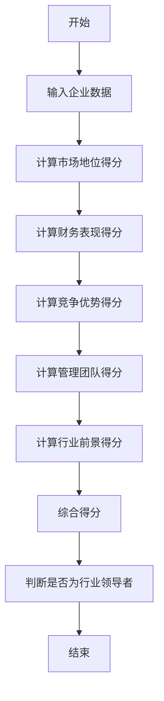
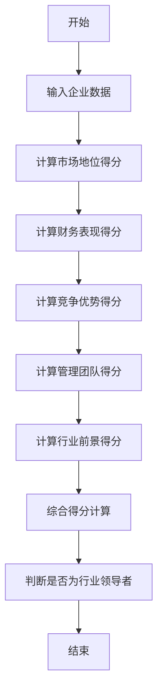
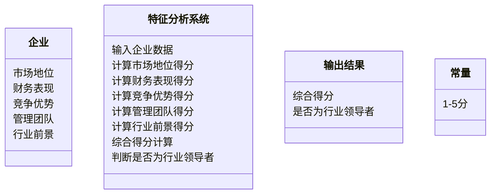
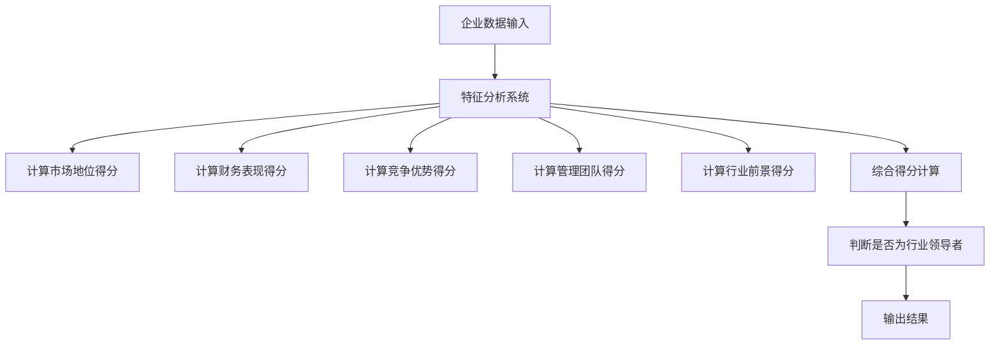
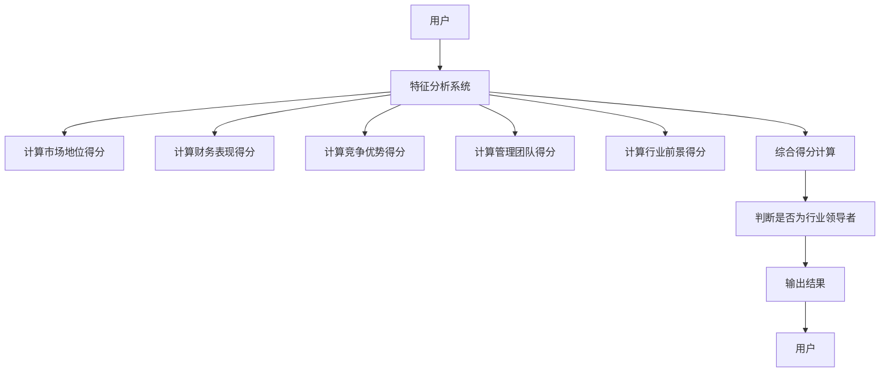

                 


# 彼得林奇的"行业领导者"特征分析

## 关键词：彼得·林奇，行业领导者，投资分析，特征分析，股票投资

## 摘要：本文深入分析了彼得·林奇在投资领域中定义的“行业领导者”特征，通过详细阐述其核心概念、分析框架、数学模型以及实际案例，帮助读者理解如何通过这些特征选择优质股票，提升投资决策的科学性和准确性。

---

# 第1章: 引言

## 1.1 彼得·林奇的背景与投资理念

### 1.1.1 彼得·林奇的生平简介
彼得·林奇（Peter Lynch）是全球最著名的投资经理之一，被誉为“股票投资之父”。他在富达投资管理公司（Fidelity Management）的长期任职期间，管理的麦哲伦基金（Fidelity Magellan Fund）取得了令人瞩目的业绩，年均回报率超过29%，为投资者创造了巨额财富。

### 1.1.2 林奇的投资哲学与方法
林奇的投资哲学强调长期持有优质股票，关注企业的基本面和行业地位。他认为，成功的投资需要深入研究企业的商业模式、财务状况、竞争优势以及行业地位。

### 1.1.3 林奇对行业领导者的定义与关注点
林奇在分析股票时，特别关注那些能够在行业中占据领先地位的企业。他认为，行业领导者通常具备强大的市场地位、卓越的财务表现和优秀的管理团队。

## 1.2 本书的研究意义与目标
### 1.2.1 为什么研究行业领导者特征
研究行业领导者特征，可以帮助投资者识别那些具备长期竞争优势的企业，从而做出更明智的投资决策。

### 1.2.2 本书的核心目标与框架
本书旨在通过分析彼得·林奇的行业领导者特征，构建一个系统化的分析框架，帮助投资者在实际操作中识别和评估行业领导者。

---

# 第2章: 行业领导者的特征分析背景

## 2.1 行业领导者的定义与核心要素
### 2.1.1 行业领导者的定义
行业领导者是指在特定行业中占据主导地位，具备强大的市场影响力和竞争优势的企业。

### 2.1.2 核心要素的构成与特征
行业领导者的特征包括：
1. 市场地位：市场份额高，品牌影响力强。
2. 财务表现：盈利能力强，财务健康。
3. 竞争优势：具备技术、成本或商业模式上的独特优势。
4. 管理团队：优秀的管理层和企业治理能力。

### 2.1.3 行业领导者与非领导者的对比
通过对比行业领导者和非领导者，可以更清晰地理解行业领导者的核心特征。

## 2.2 林奇视角下的行业领导者特征
### 2.2.1 市场地位与竞争优势
林奇认为，市场地位是衡量企业是否为行业领导者的首要标准。具备强大市场地位的企业通常能够在行业中占据主导地位，并通过竞争优势进一步巩固其地位。

### 2.2.2 财务表现与增长能力
林奇强调财务健康的重要性。他关注企业的盈利能力、现金流和成长性，认为财务表现是企业长期成功的关键因素。

### 2.2.3 管理团队与企业治理
林奇认为，优秀的管理团队和良好的企业治理是企业成功的重要保障。他倾向于投资那些由有能力的管理层领导的企业。

---

# 第3章: 行业领导者的特征分析框架

## 3.1 林奇特征分析的核心框架
### 3.1.1 框架的构成与逻辑
林奇的特征分析框架包括以下几个核心要素：
1. 市场地位：市场份额和品牌影响力。
2. 财务表现：盈利能力、现金流和资产负债表健康。
3. 竞争优势：技术、成本或商业模式的独特性。
4. 管理团队：管理层的能力和稳定性。
5. 行业前景：行业的发展趋势和潜在机会。

### 3.1.2 框架的适用性与局限性
林奇的特征分析框架适用于大多数行业，但在某些情况下可能存在局限性，例如新兴行业或快速变化的市场环境。

## 3.2 行业领导者特征的对比分析
### 3.2.1 市场地位与竞争能力对比
通过对比市场份额和品牌影响力，可以评估企业在行业中的地位。

### 3.2.2 财务表现与增长能力对比
通过对比财务数据，评估企业的盈利能力和成长性。

### 3.2.3 管理团队与治理能力对比
通过分析管理层的背景和治理结构，评估企业的管理能力。

## 3.3 林奇特征分析的表格与图表
### 3.3.1 行业领导者特征对比表格
以下是一个行业领导者特征对比表格：

| 特征               | 行业领导者       | 非领导者       |
|--------------------|-----------------|---------------|
| 市场份额           | 高             | 低或中等       |
| 盈利能力           | 强             | 弱             |
| 竞争优势           | 显著           | 无或微弱       |
| 管理团队           | 优秀           | 一般或较差     |
| 行业前景           | 乐观           | 中性或悲观     |

### 3.3.2 特征分析的ER实体关系图
以下是特征分析的ER实体关系图：

```mermaid
er
    %% 行业领导者特征分析 ER 图
    title 行业领导者特征分析 ER 图

    客体: 潜在投资企业
    属性: 市场地位、财务表现、竞争优势、管理团队、行业前景

    关系: 
        潜在投资企业 -[0..1]-> 市场地位
        潜在投资企业 -[0..1]-> 财务表现
        潜在投资企业 -[0..1]-> 竞争优势
        潜在投资企业 -[0..1]-> 管理团队
        潜在投资企业 -[0..1]-> 行业前景
```

---

# 第4章: 林奇特征分析的算法与数学模型

## 4.1 特征分析的算法原理
### 4.1.1 算法概述
林奇特征分析算法通过对企业市场地位、财务表现、竞争优势、管理团队和行业前景的综合评估，判断企业是否为行业领导者。

### 4.1.2 算法流程图
以下是算法流程图：



### 4.1.3 数学模型
林奇特征分析的综合得分公式如下：

$$
综合得分 = \frac{市场地位得分 + 财务表现得分 + 竞争优势得分 + 管理团队得分 + 行业前景得分}{5}
$$

其中：
- 市场地位得分：基于市场份额和品牌影响力，满分20分。
- 财务表现得分：基于净利润率和现金流，满分20分。
- 竞争优势得分：基于技术、成本或商业模式的独特性，满分20分。
- 管理团队得分：基于管理层能力和治理结构，满分20分。
- 行业前景得分：基于行业发展趋势，满分20分。

---

## 4.2 特征分析的数学模型
### 4.2.1 算法原理
通过对企业各特征的量化评分，计算综合得分，判断企业是否为行业领导者。

### 4.2.2 算法流程图
以下是算法流程图：



### 4.2.3 数学模型
综合得分公式如下：

$$
综合得分 = \frac{市场地位得分 + 财务表现得分 + 竞争优势得分 + 管理团队得分 + 行业前景得分}{5}
$$

其中：
- 市场地位得分：1-5分（1分：低，5分：高）。
- 财务表现得分：1-5分（1分：低，5分：高）。
- 竞争优势得分：1-5分（1分：无，5分：显著）。
- 管理团队得分：1-5分（1分：差，5分：优秀）。
- 行业前景得分：1-5分（1分：差，5分：好）。

---

# 第5章: 系统分析与架构设计方案

## 5.1 问题场景介绍
本文构建了一个基于林奇特征分析的系统，用于评估企业的行业领导者特征。

## 5.2 系统功能设计
### 5.2.1 领域模型
以下是领域模型：



## 5.3 系统架构设计
### 5.3.1 系统架构图
以下是系统架构图：



## 5.4 系统接口设计
系统接口包括数据输入接口和结果输出接口。

## 5.5 系统交互设计
以下是系统交互图：



---

# 第6章: 项目实战

## 6.1 环境配置
### 6.1.1 系统环境
需要安装Python、Jupyter Notebook和相关库（如pandas、numpy、matplotlib）。

### 6.1.2 安装依赖
```bash
pip install pandas numpy matplotlib
```

## 6.2 核心实现源代码
### 6.2.1 数据预处理
```python
import pandas as pd

# 读取数据
df = pd.read_csv('企业数据.csv')

# 数据清洗
df.dropna(inplace=True)
```

### 6.2.2 特征计算
```python
def calculate_market_position(revenue, market_share):
    if market_share > 0.3:
        return 5
    elif market_share > 0.2:
        return 4
    else:
        return 3

# 计算市场地位得分
df['市场地位得分'] = df.apply(lambda x: calculate_market_position(x['收入'], x['市场份额']), axis=1)
```

### 6.2.3 综合得分计算
```python
# 计算综合得分
df['综合得分'] = (df['市场地位得分'] + df['财务表现得分'] + df['竞争优势得分'] + df['管理团队得分'] + df['行业前景得分']) / 5

# 判断是否为行业领导者
df['是否为行业领导者'] = df.apply(lambda x: '是' if x['综合得分'] > 3 else '否', axis=1)
```

## 6.3 代码应用解读与分析
通过上述代码，我们可以对企业数据进行预处理、特征计算和综合得分计算，最终判断企业是否为行业领导者。

## 6.4 实际案例分析
### 6.4.1 案例背景
以苹果公司为例，分析其是否为行业领导者。

### 6.4.2 案例分析
```python
import pandas as pd

# 假设数据中包含苹果公司的信息
apple = df[df['公司名称'] == '苹果']

# 计算苹果公司的综合得分
apple_score = apple['综合得分'].values[0]

# 判断是否为行业领导者
if apple_score > 3:
    print('苹果公司是行业领导者。')
else:
    print('苹果公司不是行业领导者。')
```

## 6.5 项目小结
通过本项目，我们可以看到林奇特征分析方法在实际中的应用，帮助企业识别行业领导者。

---

# 第7章: 总结与展望

## 7.1 总结
本文深入分析了彼得·林奇的行业领导者特征，并构建了一个系统化的分析框架，帮助投资者识别行业领导者。

## 7.2 展望
未来的研究可以进一步结合大数据和机器学习技术，提升特征分析的准确性和效率。

---

# 第8章: 最佳实践 tips、小结、注意事项、拓展阅读

## 8.1 最佳实践 tips
- 定期更新企业数据，保持分析的时效性。
- 结合宏观经济环境，综合评估行业前景。

## 8.2 小结
通过本文的学习，读者可以掌握林奇的行业领导者特征分析方法，并在实际投资中应用。

## 8.3 注意事项
- 特征分析需要结合具体行业特点，避免一刀切。
- 数据来源和质量直接影响分析结果，需谨慎选择。

## 8.4 拓展阅读
建议读者阅读彼得·林奇的《投资最重要的事情》和《战胜市场的人》等书籍，深入理解其投资理念。

---

# 附录

## 附录A: 术语表
- 行业领导者：在特定行业中占据主导地位的企业。
- 综合得分：基于多个特征的加权平均得分，用于判断企业是否为行业领导者。

## 附录B: 数据来源与处理
- 数据来源：企业公开财报和行业报告。
- 数据处理：数据清洗、特征提取和标准化处理。

## 附录C: 参考文献
1. 彼得·林奇. 《投资最重要的事情》.
2. 彼得·林奇. 《战胜市场的人》.

---

通过以上分析，我们可以看到彼得·林奇的行业领导者特征分析方法在实际投资中的应用价值。希望本文能为投资者提供有价值的参考，帮助他们在复杂多变的市场中做出更明智的投资决策。

