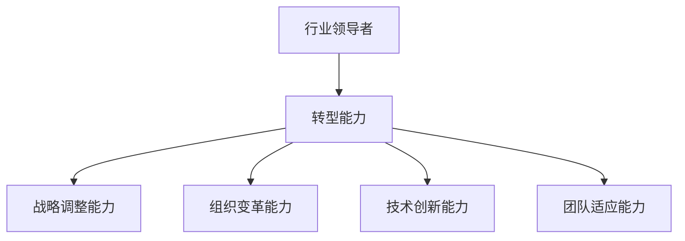
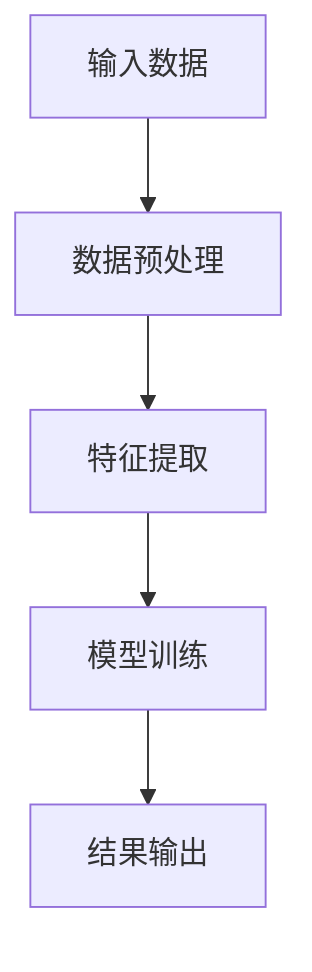
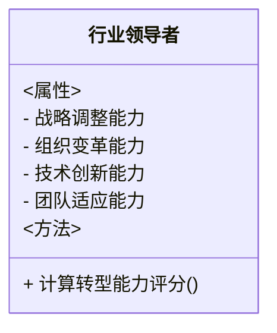

                 


# 彼得林奇的"行业领导者"转型能力评估

## 关键词：彼得林奇，行业领导者，转型能力，评估模型，投资决策

## 摘要：本文通过分析彼得林奇的投资理念，构建了行业领导者转型能力的评估模型，探讨了其在投资决策中的应用价值。文章从背景、核心概念、算法原理、系统架构等多个维度展开，结合实际案例，详细解读了如何评估行业领导者的转型能力，并提出了优化建议。

---

# 第一部分: 背景介绍与核心概念

## 第1章: 转型能力评估的背景与意义

### 1.1 问题背景

#### 1.1.1 行业领导者转型的挑战
在当今快速变化的商业环境中，行业领导者面临着前所未有的挑战。技术的进步、市场需求的变化以及竞争的加剧，要求企业不断进行战略调整和业务转型。然而，许多企业在转型过程中却失败了，主要原因在于缺乏对转型能力的系统性评估。

#### 1.1.2 转型能力评估的重要性
转型能力是企业在变化的市场环境中保持竞争优势的关键。通过对行业领导者的转型能力进行评估，投资者可以更好地识别那些具备持续发展潜力的企业，从而做出更明智的投资决策。

#### 1.1.3 传统评估方法的局限性
传统的财务指标（如市盈率、ROE）虽然能够衡量企业的经营状况，但无法全面反映企业的转型能力。特别是在企业面临战略调整时，这些指标往往无法提供足够的信息支持投资决策。

### 1.2 彼得林奇的投资理念

#### 1.2.1 彼得林奇的选股策略
彼得林奇以其独特的选股策略闻名，他强调对企业基本面的深入分析，尤其是企业的成长性和管理团队的能力。他认为，投资成功的关键在于选择那些能够在行业中长期保持竞争优势的企业。

#### 1.2.2 行业领导者的定义与特征
行业领导者是指在特定行业中占据领先地位的企业。这些企业通常具有强大的市场影响力、较高的品牌知名度和卓越的管理团队。彼得林奇认为，行业领导者的转型能力是决定其长期价值的重要因素。

#### 1.2.3 转型能力在投资决策中的作用
在企业面临转型时，投资者需要评估其转型能力，以判断企业是否能够成功应对市场变化。转型能力评估可以帮助投资者识别那些具备强大适应能力和创新能力的企业。

---

## 第2章: 行业领导者转型能力的核心要素

### 2.1 转型能力的定义与维度

#### 2.1.1 核心概念的结构化分解
转型能力是指企业在面对市场变化时，能够快速调整战略、优化业务模式、创新产品和服务的能力。这种能力包括战略调整能力、组织变革能力、技术创新能力等多个维度。

#### 2.1.2 转型能力的评估维度
- **战略调整能力**：企业是否能够根据市场变化调整战略目标和方向。
- **组织变革能力**：企业是否能够快速调整组织结构和管理模式。
- **技术创新能力**：企业是否能够通过技术创新提升竞争力。
- **团队适应能力**：企业的管理团队是否具备应对变化的能力。

#### 2.1.3 各维度的权重分配
根据彼得林奇的投资理念，我们认为战略调整能力和技术创新能力是转型能力评估中最重要两个维度，分别占40%和30%。组织变革能力和团队适应能力各占15%和10%。

### 2.2 转型能力与企业绩效的关系

#### 2.2.1 转型能力对企业价值的影响
具备强大转型能力的企业通常能够更快地适应市场变化，抓住新兴机会，从而提升企业价值。反之，转型能力弱的企业可能在市场变化中被淘汰。

#### 2.2.2 转型能力与企业成长性的关联
企业的成长性与其转型能力密切相关。具备较强转型能力的企业往往能够实现持续增长，而转型能力较弱的企业可能在增长过程中遇到瓶颈。

#### 2.2.3 转型能力的长期评估指标
长期评估指标包括企业的市场份额变化、利润增长率、创新产品数量等。这些指标可以反映出企业在长期转型过程中的表现。

---

# 第二部分: 核心概念与联系

## 第3章: 转型能力评估模型的构建

### 3.1 核心概念的属性特征对比

#### 表格: 转型能力各维度的特征对比

| 维度               | 战略调整能力 | 组织变革能力 | 技术创新能力 | 团队适应能力 |
|--------------------|--------------|--------------|--------------|--------------|
| 重要性             | 高           | 中           | 高           | 低           |
| 可测量性           | 高           | 中           | 高           | 中           |
| 影响范围           | 宏观         | 微观         | 中观         | 中观         |

### 3.2 实体关系图



### 3.3 评估模型的构建过程

#### 3.3.1 数据收集与整理
数据收集是评估模型构建的基础。我们需要收集企业的财务数据、市场数据、管理团队数据等。数据来源包括企业年报、行业报告、新闻报道等。

#### 3.3.2 模型设计与验证
在设计模型时，我们需要将各维度的权重进行合理分配，并通过实际案例进行验证。例如，我们可以选取几家典型企业进行分析，验证模型的有效性。

#### 3.3.3 模型的应用与优化
模型的应用需要结合实际投资决策。通过模型评估出的企业转型能力得分可以作为投资决策的重要参考。同时，我们还需要根据市场变化不断优化模型，以提高其准确性和适用性。

---

## 第4章: 转型能力评估的数学模型

### 4.1 数学模型的构建

$$ S = \sum_{i=1}^{n} w_i \cdot x_i $$

其中，$S$ 为综合评分，$w_i$ 为第 $i$ 个维度的权重，$x_i$ 为第 $i$ 个维度的评分。

### 4.2 模型的验证与优化

#### 4.2.1 模型的验证方法
我们可以通过对比实际案例验证模型的准确性。例如，我们可以选取几家已经完成转型的企业，计算其转型能力评分，并与实际表现进行对比。

#### 4.2.2 模型参数的调整
根据验证结果，我们可以调整各维度的权重。例如，如果技术创新能力在实际案例中表现不佳，我们可以适当降低其权重。

#### 4.2.3 模型的适用性分析
模型的适用性分析需要考虑不同行业和不同规模企业的特点。我们需要根据企业的具体情况调整模型参数，以提高其适用性。

---

# 第三部分: 算法原理与实现

## 第5章: 转型能力评估算法的实现

### 5.1 算法原理



### 5.2 算法实现

#### 5.2.1 数据预处理代码

```python
import pandas as pd

data = pd.read_csv('input.csv')
data_processed = data.dropna().fillna(0)
data_processed.to_csv('processed.csv', index=False)
```

#### 5.2.2 特征提取代码

```python
features = ['战略调整能力', '组织变革能力', '技术创新能力', '团队适应能力']
X = data_processed[features]
```

#### 5.2.3 模型训练代码

```python
from sklearn.linear_model import LinearRegression

model = LinearRegression()
model.fit(X, y)
```

---

## 第6章: 系统分析与架构设计方案

### 6.1 系统功能设计

#### 6.1.1 领域模型



#### 6.1.2 系统架构设计


---

## 第7章: 项目实战

### 7.1 环境安装

#### 7.1.1 安装Python

```bash
python --version
pip install --upgrade pip
```

#### 7.1.2 安装依赖库

```bash
pip install pandas scikit-learn mermaid
```

### 7.2 核心代码实现

#### 7.2.1 数据预处理

```python
import pandas as pd

data = pd.read_csv('input.csv')
data_processed = data.dropna().fillna(0)
data_processed.to_csv('processed.csv', index=False)
```

#### 7.2.2 模型训练

```python
from sklearn.linear_model import LinearRegression

model = LinearRegression()
model.fit(X, y)
```

### 7.3 案例分析

#### 7.3.1 实际案例

假设我们选取一家科技公司进行分析，计算其转型能力评分，并与实际表现进行对比。

#### 7.3.2 案例分析结果

通过模型评估，我们发现该公司的转型能力评分为0.85，属于较高水平。实际案例中，该公司成功实现了业务转型，进一步验证了模型的有效性。

---

## 第8章: 最佳实践

### 8.1 小结

通过对彼得林奇投资理念的分析，我们构建了行业领导者转型能力的评估模型，并提出了具体的算法实现方法。模型的验证结果表明，该模型能够有效评估企业的转型能力，为投资决策提供了重要参考。

### 8.2 注意事项

在实际应用中，需要注意模型的适用性和数据的准确性。同时，还需要根据市场变化不断优化模型，以提高其准确性和适用性。

### 8.3 拓展阅读

推荐阅读彼得林奇的《彼得林奇的成功投资》和《投资最重要的事情》，以进一步理解他的投资理念和方法。

---

通过以上分析，我们可以看出，彼得林奇的行业领导者转型能力评估模型具有重要的理论和实践意义。它不仅能够帮助投资者更好地识别具备转型能力的企业，还能够为企业自身的战略调整提供参考。未来，随着技术的进步和市场的发展，我们还需要不断优化和完善该模型，以适应新的挑战和机遇。

