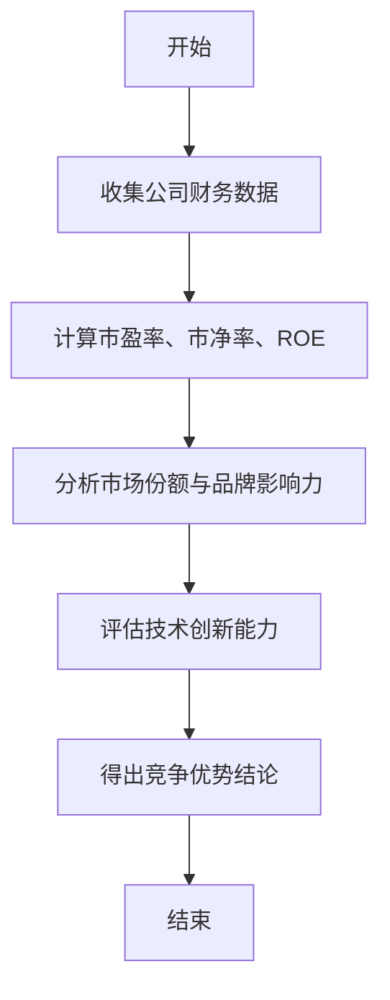

                 


# 彼得林奇的"行业领导者"选股策略

> 关键词：彼得·林奇，行业领导者，选股策略，投资哲学，财务分析，竞争优势

> 摘要：本文深入分析了彼得·林奇的“行业领导者”选股策略，探讨了其投资哲学、行业领导者的定义与特征，以及如何通过数学模型和系统分析来评估和选择行业领导者。文章结合实际案例和系统架构设计，详细阐述了彼得·林奇选股策略的实施过程，并提供了最佳实践和注意事项。

---

## 第一部分: 彼得·林奇的“行业领导者”选股策略概述

## 第1章: 彼得·林奇与行业领导者投资理念

### 1.1 彼得·林奇投资哲学概述

#### 1.1.1 彼得·林奇的生平简介
彼得·林奇（Peter Lynch）是全球最著名的基金经理之一，以其在富达麦哲伦基金（Fidelity Magellan Fund）的投资业绩而闻名。他从1977年接手该基金到1990年退休，期间基金的年平均回报率达到29.1%，远超市场平均水平。林奇的投资哲学强调长期价值投资，注重选择那些在各自行业中表现优异的公司。

#### 1.1.2 投资理念的核心思想
彼得·林奇的投资理念可以总结为以下几个核心思想：
1. **长期投资**：避免短期市场波动的干扰，专注于公司的长期增长潜力。
2. **行业领导者优先**：投资于行业内具有领先地位的公司，这些公司通常具有更强的竞争优势和盈利能力。
3. **深入研究**：通过细致的研究和分析，识别出那些被市场低估的优质公司。
4. **分散投资**：通过投资于多个行业的领导者，降低投资风险。

#### 1.1.3 行业领导者的选股策略的形成背景
20世纪80年代，美国经济经历了产业结构的调整和技术创新的浪潮。林奇的投资策略正是基于这一背景，选择那些在各自行业中处于领先地位的企业，这些企业往往能够通过持续创新和市场拓展，获得超额收益。

---

### 1.2 行业领导者的定义与特征

#### 1.2.1 行业领导者的定义
行业领导者是指在某个行业中占据领先地位，具有强大的市场影响力、品牌优势和竞争优势的公司。这些公司在行业内通常具有较高的市场份额、盈利能力和发展潜力。

#### 1.2.2 行业领导者的特征
行业领导者的特征可以从以下几个方面进行分析：
1. **市场份额**：行业内市场份额占比高，能够主导市场价格和趋势。
2. **品牌影响力**：拥有强大的品牌知名度和消费者认知度。
3. **竞争优势**：在技术、成本、服务等方面具有明显优势。
4. **财务表现**：具备稳定的盈利能力，ROE（净资产收益率）较高。
5. **创新能力**：能够持续推出新产品或服务，引领行业发展。

#### 1.2.3 行业领导者的边界与外延
行业领导者的边界是指其在行业内所处的位置和影响力，而外延则包括其对上下游产业的带动作用。例如，苹果公司不仅是消费电子行业的领导者，还通过其生态系统影响了整个信息技术产业。

---

## 第2章: 行业领导者的竞争优势分析

### 2.1 行业领导者的竞争优势模型

#### 2.1.1 市场份额与品牌影响力
市场份额是衡量行业领导者的重要指标，高市场份额意味着公司在市场上具有较强的定价权和影响力。品牌影响力则体现在消费者对品牌的认知和忠诚度上。

#### 2.1.2 技术创新与研发能力
技术创新是行业领导者保持竞争优势的关键因素。公司需要具备强大的研发能力，能够不断推出新产品或改进现有产品，以满足市场需求。

#### 2.1.3 成本优势与供应链管理
成本优势是行业领导者在价格竞争中占据优势的重要因素。有效的供应链管理可以降低生产成本，提高效率。

---

### 2.2 核心竞争力的评估指标

#### 2.2.1 市场占有率分析
市场占有率分析可以通过行业数据和公司财报获取。例如，可以通过以下步骤进行分析：
1. 收集行业市场规模数据。
2. 计算公司市场份额占比。
3. 对比竞争对手的市场份额。

#### 2.2.2 净资产收益率（ROE）分析
ROE是衡量公司盈利能力的重要指标，公式如下：
$$ROE = \frac{\text{净利润}}{\text{净资产}}$$

#### 2.2.3 创新能力评估
创新能力评估可以通过专利数量、新产品发布频率和研发投入占比等指标进行分析。

---

## 第3章: 彼得·林奇选股标准的数学模型与算法

### 3.1 投资决策的核心数学模型

#### 3.1.1 市盈率（P/E）计算公式
$$P/E = \frac{\text{股票价格}}{\text{每股收益}}$$

#### 3.1.2 市净率（P/B）计算公式
$$P/B = \frac{\text{股票价格}}{\text{每股净资产}}$$

#### 3.1.3 净资产收益率（ROE）计算公式
$$ROE = \frac{\text{净利润}}{\text{净资产}}$$

---

### 3.2 竞争优势评估的算法流程



---

### 3.3 算法实现的Python代码示例

```python
import pandas as pd

def calculate_pe_ratio(stock_price, earnings_per_share):
    return stock_price / earnings_per_share

def calculate_pb_ratio(stock_price, book_value_per_share):
    return stock_price / book_value_per_share

def calculate_roe(net_income, total_equity):
    return net_income / total_equity

# 示例数据
stock_price = 100
earnings_per_share = 5
book_value_per_share = 20
net_income = 10
total_equity = 50

# 计算估值指标
pe_ratio = calculate_pe_ratio(stock_price, earnings_per_share)
pb_ratio = calculate_pb_ratio(stock_price, book_value_per_share)
ro

