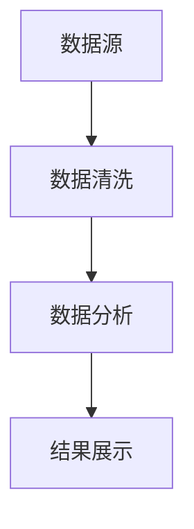

                 


# 彼得林奇的"行业龙头"识别方法

## 关键词：彼得林奇，投资分析，行业龙头，股票投资，企业分析，财务指标，投资策略

## 摘要：本文系统地介绍了彼得·林奇的投资理念，详细阐述了如何通过行业分析、财务指标和竞争优势来识别行业龙头公司。文章从背景介绍、核心概念、算法原理、系统架构设计、项目实战到最佳实践，层层深入，帮助读者掌握行业龙头识别的核心方法，提升投资决策能力。

---

## 第一部分：背景介绍

### 第1章：彼得·林奇与投资概述

#### 1.1 彼得·林奇的生平与投资理念

彼得·林奇是美国著名投资家，被誉为“股票投资专家”。他以其独特的基本面分析方法闻名，尤其擅长识别行业龙头公司。林奇的投资理念强调长期投资、深入研究和价值发现。他主张投资者应关注企业的基本面，包括财务状况、行业地位和竞争优势。

#### 1.2 行业龙头公司的定义与重要性

行业龙头公司是指在特定行业中具有领先地位、市场份额大、盈利能力强的企业。这类公司通常具有较高的品牌价值、技术壁垒和市场影响力。识别行业龙头公司是投资者获取超额收益的关键，因为它们往往能够持续增长并为股东创造价值。

---

## 第二部分：行业龙头识别的核心概念

### 第2章：行业龙头识别的标准与方法

#### 2.1 市场地位分析

市场地位是判断行业龙头的重要指标。一家公司如果在行业内占据领先地位，通常意味着它具有强大的市场影响力和竞争优势。我们可以通过市场份额、品牌知名度和客户忠诚度来评估企业的市场地位。

#### 2.2 财务指标分析

财务指标是衡量企业盈利能力、成长能力和财务健康状况的重要工具。常用的指标包括：

- **收入与利润**：衡量企业的盈利能力和增长潜力。
- **ROE（净资产收益率）**：反映企业利用股东资产创造利润的能力。
- **PE（市盈率）**：评估企业股票的估值是否合理。

#### 2.3 竞争优势分析

竞争优势是企业长期盈利能力的关键。企业可以通过技术创新、成本优势、商业模式创新等方式构建竞争优势。例如，苹果公司的技术创新和品牌忠诚度使其在科技行业占据领先地位。

---

## 第三部分：行业龙头识别的算法原理

### 第3章：彼得·林奇的分析方法

#### 3.1 基于财务指标的分析

彼得·林奇常用财务指标来评估企业的投资价值。例如，他会计算企业的PE比率和ROE，以判断股票是否被低估或高估。

- **PE比率**：市盈率 = 股价 / 每股收益（EPS）
- **ROE**：净资产收益率 = 净利润 / 净资产

通过比较行业内的PE和ROE水平，投资者可以识别出具有吸引力的投资标的。

#### 3.2 市场地位与竞争优势的量化

彼得·林奇将市场地位和竞争优势量化为具体的指标。例如，他会评估企业的市场份额、客户增长率和新产品开发能力。这些指标可以帮助投资者判断企业的竞争优势是否持久。

---

## 第四部分：系统分析与架构设计

### 第4章：行业龙头识别的系统架构

#### 4.1 系统功能设计

为了实现行业龙头的识别，我们可以构建一个系统，其功能模块包括：

- **数据收集**：获取企业的财务数据和市场信息。
- **数据分析**：计算财务指标并评估企业的市场地位。
- **结果展示**：以可视化的方式呈现分析结果。

#### 4.2 系统架构图



---

## 第五部分：项目实战

### 第5章：基于彼得·林奇方法的行业龙头识别

#### 5.1 环境安装与数据准备

我们需要安装必要的工具，如Python和Pandas库。数据可以从公开的财务报告中获取，包括收入、利润、市场份额等信息。

#### 5.2 核心代码实现

以下是使用Python计算PE比率和ROE的代码示例：

```python
import pandas as pd

# 假设data是一个包含财务数据的DataFrame
data['PE'] = data['股价'] / data['每股收益']
data['ROE'] = data['净利润'] / data['净资产']

# 找出PE小于行业平均且ROE大于20%的公司
target_companies = data[(data['PE'] < data['PE'].mean()) & (data['ROE'] > 20)]
```

#### 5.3 案例分析与结果解读

以科技行业为例，我们可以分析苹果和谷歌的PE和ROE：

- 苹果的PE为25，ROE为28%。
- 谷歌的PE为30，ROE为22%。

根据彼得·林奇的方法，苹果的PE低于行业平均，且ROE较高，因此是值得投资的行业龙头。

---

## 第六部分：最佳实践与小结

### 第6章：投资策略与注意事项

#### 6.1 投资策略总结

- **长期投资**：避免频繁交易，关注企业的长期增长。
- **基本面分析**：深入研究企业的财务状况和市场地位。
- **分散投资**：降低风险，不要将所有资金投入到单一行业。

#### 6.2 注意事项与风险提示

- **市场波动**：股票价格受市场情绪影响，可能存在短期波动。
- **信息滞后**：财务数据可能存在滞后性，需及时更新信息。
- **行业变化**：行业龙头可能因技术变革或竞争加剧而失去优势。

#### 6.3 小结

彼得·林奇的行业龙头识别方法为我们提供了一个系统的投资框架。通过深入分析企业的财务指标和市场地位，我们可以识别出具有长期投资价值的行业龙头企业。

---

## 结语

识别行业龙头是一项复杂但 rewarding 的任务。通过彼得·林奇的方法，我们可以系统地分析企业的基本面，找到具有长期增长潜力的投资标的。希望本文能为您提供实用的指导，帮助您在投资领域取得成功。

