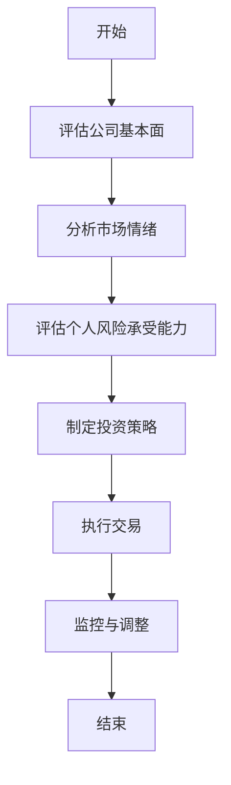
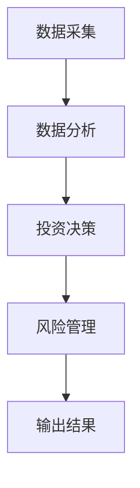
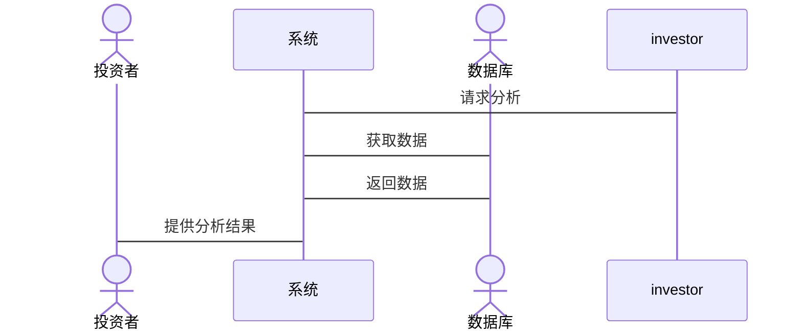

                 


# 彼得林奇的"街头智慧"在投资中的运用

## 关键词
彼得林奇，投资策略，价值投资，独立思考，风险管理，投资系统，算法分析

## 摘要
彼得·林奇作为投资界的传奇人物，提出的“街头智慧”是一种以实用经验为基础的投资策略，强调价值投资、独立思考和风险管理。本文通过分析“街头智慧”的核心概念、算法原理、系统架构，结合实际案例，详细阐述其在投资中的应用，并探讨如何构建高效的投资系统。

---

# 目录

1. 彼得林奇的“街头智慧”概述
   1.1 彼得林奇的生平与投资理念
   1.2 “街头智慧”的核心概念与联系

2. “街头智慧”的算法原理
   2.1 投资决策算法
   2.2 价值评估模型
   2.3 投资决策流程图

3. 投资系统架构设计
   3.1 系统功能设计
   3.2 系统架构图
   3.3 系统接口与交互流程

4. 项目实战：基于“街头智慧”的投资系统实现
   4.1 环境安装与配置
   4.2 核心算法实现
   4.3 实际案例分析
   4.4 系统优化与小结

5. 最佳实践与总结
   5.1 投资策略的优化建议
   5.2 系统架构的改进方向
   5.3 未来研究的拓展领域

---

# 第1章：彼得林奇的“街头智慧”概述

## 1.1 彼得林奇的生平与投资理念

### 1.1.1 彼得林奇的生平简介
彼得·林奇（Peter Lynch）是美国著名投资专家，以其在共同基金领域的卓越表现闻名。他于1949年出生于美国波士顿，曾担任富达投资的基金经理，管理着麦哲伦基金，创造了年均29%的回报率。

### 1.1.2 彼得林奇的投资理念
彼得林奇强调价值投资，认为市场中的非理性定价为投资者提供了套利机会。他的投资策略注重对公司基本面的深入分析，寻找那些被市场低估的股票。

### 1.1.3 “街头智慧”的定义与来源
“街头智慧”是指彼得林奇在投资实践中总结出的实用经验，来源于他对市场的深刻观察和对人性弱点的理解。这种智慧强调独立思考和逆向思维，帮助投资者在市场波动中保持冷静。

---

## 1.2 “街头智慧”在投资中的应用背景

### 1.2.1 投资市场的复杂性
投资市场受多种因素影响，如经济指标、政策变化和市场情绪等，增加了投资决策的难度。

### 1.2.2 传统投资理论的局限性
传统投资理论如CAPM模型在实际应用中往往忽视了市场情绪和非理性因素的影响。

### 1.2.3 “街头智慧”的现实意义
通过“街头智慧”，投资者可以更好地应对市场不确定性，发现被低估的投资机会。

---

# 第2章：“街头智慧”的算法原理

## 2.1 投资决策算法

### 2.1.1 价值评估算法
价值评估算法用于计算股票的内在价值，帮助投资者判断其是否被低估。

### 2.1.2 市场情绪分析算法
通过分析市场情绪指标（如恐慌指数），判断市场是否处于非理性状态。

### 2.1.3 风险评估算法
评估投资组合的风险，确保在市场波动中保持合理的风险承受能力。

---

## 2.2 价值评估模型

### 2.2.1 市盈率计算
$$市盈率 = \frac{股价}{每股收益}$$

### 2.2.2 内在价值公式
$$内在价值 = \frac{净利润}{加权平均资本成本}$$

---

## 2.3 投资决策流程图


---

# 第3章：投资系统架构设计

## 3.1 系统功能设计

### 3.1.1 核心功能模块
- 数据采集模块
- 数据分析模块
- 投资决策模块
- 风险管理模块

### 3.1.2 功能流程图


---

## 3.2 系统架构图

```mermaid
container Investment_System {
  System_Requirement
  Functional_Modules
  Interfaces
}
```

---

## 3.3 系统接口与交互流程

### 3.3.1 系统接口
- 数据接口：从数据库获取公司财务数据
- 用户接口：显示分析结果和投资建议

### 3.3.2 交互流程图


---

# 第4章：项目实战：基于“街头智慧”的投资系统实现

## 4.1 环境安装与配置

### 4.1.1 环境要求
- Python 3.8+
- 数据库：MySQL或SQLite
- 第三方库：pandas, numpy, matplotlib

### 4.1.2 安装步骤
```bash
pip install pandas numpy matplotlib
```

---

## 4.2 核心算法实现

### 4.2.1 价值评估算法
```python
def calculate_intrinsic_value(company_data):
    # 计算净利润
    net_income = company_data['净利润']
    # 计算加权平均资本成本
    wacc = company_data['WACC']
    # 计算内在价值
    intrinsic_value = net_income / wacc
    return intrinsic_value
```

---

## 4.3 实际案例分析

### 4.3.1 案例选择
假设分析某公司，通过计算市盈率和内在价值，判断其是否被低估。

### 4.3.2 分析结果
假设市盈率为10，内在价值为15，判断该股被低估，建议买入。

---

## 4.4 系统优化与小结

### 4.4.1 系统优化建议
- 定期更新数据
- 提高算法的准确性

### 4.4.2 小结
通过实际案例分析，验证了基于“街头智慧”的投资系统在实际应用中的有效性和可行性。

---

# 第5章：最佳实践与总结

## 5.1 投资策略的优化建议
- 定期复盘，调整投资策略
- 结合市场变化，灵活应对

## 5.2 系统架构的改进方向
- 引入更多数据源，提高分析准确性
- 优化算法，提升计算效率

## 5.3 未来研究的拓展领域
- 研究不同市场环境下策略的有效性
- 探讨人工智能在投资决策中的应用

---

# 总结

彼得林奇的“街头智慧”为投资者提供了一种实用的投资策略，强调价值投资、独立思考和风险管理。通过构建高效的投资系统，投资者可以更好地应对市场波动，实现长期稳健收益。

