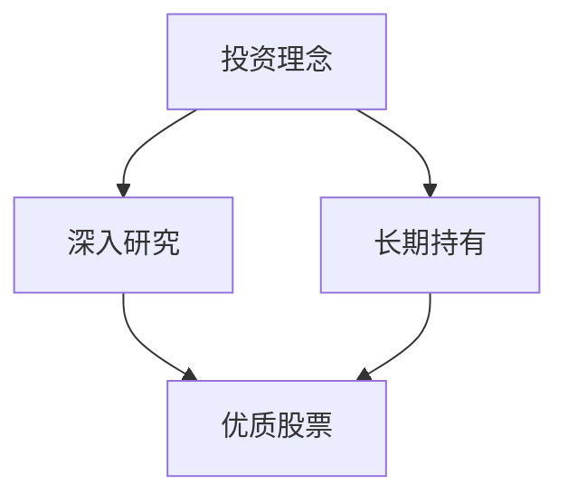
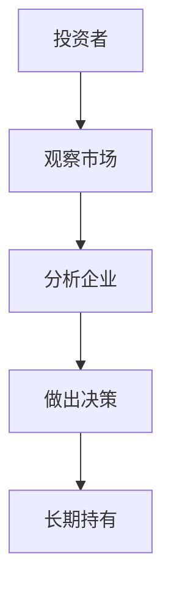
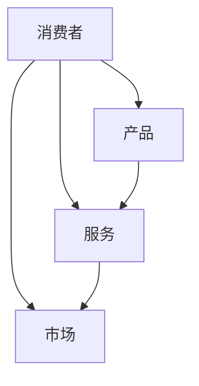
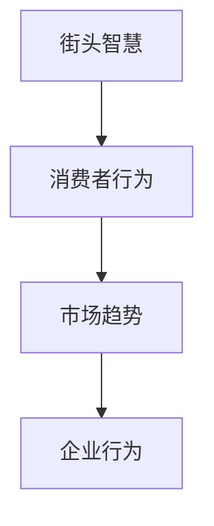
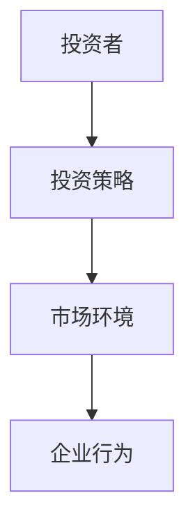
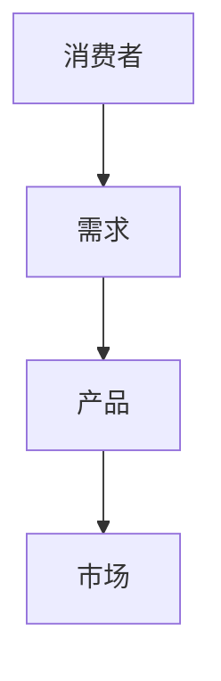
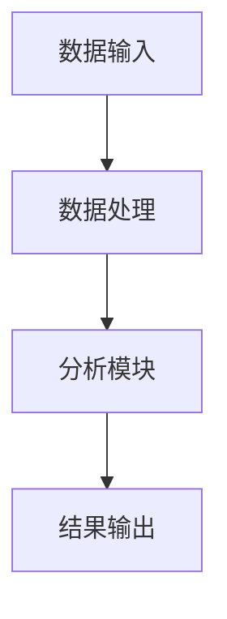
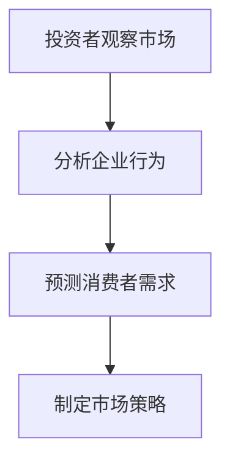
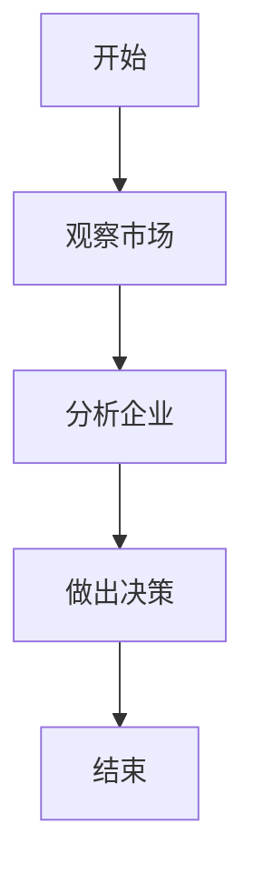

                 

# 彼得林奇的"街头智慧"在消费者行为分析中的应用

> 关键词：彼得林奇，街头智慧，消费者行为分析，投资策略，数据分析

> 摘要：本文探讨了彼得林奇的“街头智慧”在消费者行为分析中的应用，通过结合投资策略和数据分析，提出了一种新的消费者行为分析框架。文章从理论基础、算法原理、系统架构等方面详细阐述了如何将彼得林奇的智慧融入消费者行为分析，并通过实际案例展示了其应用效果。

---

# 第一部分: 引言

## 第1章: 背景介绍

### 1.1 彼得林奇与“街头智慧”

#### 1.1.1 彼得林奇的生平简介

彼得·林奇（Peter Lynch）是美国著名的投资经理人，以其在富达投资集团（Fidelity Investments）的辉煌业绩闻名。他管理的麦哲伦基金在1977年至1990年间的年平均回报率达到29.1%，远超市场平均水平。林奇的投资哲学强调深入研究和长期持有优质股票，他的“街头智慧”正是这种投资哲学的核心。

**图1-1：彼得林奇投资理念的三维模型**

#### 1.1.2 “街头智慧”的核心概念

“街头智慧”是指彼得林奇在投资过程中总结出的一系列实用原则，包括关注基本面、重视现金流、避免跟风等。这些原则以简单易懂的方式指导投资者做出明智决策。

**表1-1：街头智慧的核心要素对比**

| 核心要素      | 描述                                         |
|---------------|--------------------------------------------|
| 基本面分析     | 重视公司的财务状况和行业地位               |
| 现金流        | 现金流是企业健康的重要指标                 |
| 股东结构      | 关注大股东的持股情况                         |
| 避免跟风      | 不盲目追随市场潮流                           |

#### 1.1.3 街头智慧与投资策略的关系

街头智慧通过简化复杂的投资理论，提供了一种实用的投资策略。它强调对市场的观察和对企业的理解，而非复杂的数学模型。这种策略特别适合普通投资者，帮助他们在市场中做出明智决策。

**图1-2：街头智慧的投资策略流程**

### 1.2 消费者行为分析的背景

#### 1.2.1 消费者行为分析的定义

消费者行为分析是指通过研究消费者在购买、使用和处置产品或服务时的行为，揭示其决策过程和偏好。它结合心理学、社会学和经济学等多学科知识，帮助企业在市场中制定有效的策略。

**图1-3：消费者行为分析的领域模型**

#### 1.2.2 消费者行为分析的理论基础

消费者行为分析的理论基础包括需求理论、认知心理学和行为经济学。这些理论为分析消费者决策提供了框架。

**表1-2：消费者行为分析的核心理论**

| 理论名称      | 描述                                         |
|---------------|--------------------------------------------|
| 需求理论       | 解释消费者对产品的需求层次                 |
| 认知心理学     | 研究消费者如何处理信息并做出决策           |
| 行为经济学     | 分析消费者在实际情境中的决策偏差           |

#### 1.2.3 消费者行为分析的实践意义

通过分析消费者行为，企业可以更好地理解市场需求，优化产品设计，制定有效的营销策略。这对于提高企业竞争力至关重要。

### 1.3 街头智慧在消费者行为分析中的应用价值

#### 1.3.1 街头智慧的核心要素与消费者行为分析的结合

将彼得林奇的街头智慧应用于消费者行为分析，可以通过观察市场趋势和企业行为，预测消费者的需求变化。

**图1-4：街头智慧与消费者行为分析的结合点**

#### 1.3.2 街头智慧在消费者行为预测中的潜在优势

街头智慧的实用性使其能够快速适应市场变化，为消费者行为预测提供新的视角。

#### 1.3.3 街头智慧与消费者行为分析的结合意义

这种结合不仅丰富了消费者行为分析的理论，还为企业提供了更有效的市场策略工具。

---

## 第2章: 核心概念与联系

### 2.1 街头智慧的核心要素

#### 2.1.1 街头智慧的属性特征对比表格

**表2-1：街头智慧的属性特征**

| 属性      | 特征描述                                 |
|-----------|----------------------------------------|
| 简单性     | 强调直观易懂的投资原则                 |
| 实用性     | 注重实际操作中的策略                   |
| 长期性     | 强调长期投资而非短期波动               |
| 个性化     | 根据具体情况调整投资策略               |

#### 2.1.2 街头智慧的ER实体关系图

**图2-1：街头智慧的ER实体关系**

### 2.2 消费者行为分析的核心要素

#### 2.2.1 消费者行为分析的领域模型类图

**图2-2：消费者行为分析的领域模型**

#### 2.2.2 消费者行为分析的系统架构图

**图2-3：消费者行为分析的系统架构**

### 2.3 街头智慧与消费者行为分析的联系

#### 2.3.1 街头智慧在消费者行为分析中的应用流程图

**图2-4：应用流程图**

#### 2.3.2 街头智慧与消费者行为分析的结合点分析

结合点主要在于市场观察和企业行为分析，通过街头智慧的视角，可以更敏锐地捕捉市场变化。

---

## 第3章: 街头智慧的理论基础

### 3.1 街头智慧的核心原理

#### 3.1.1 街头智慧的数学模型

**公式3-1：街头智慧的数学模型**

$$ \text{投资回报} = \text{深入研究} \times \text{优质股票} $$

#### 3.1.2 街头智慧的算法原理

**图3-1：算法流程图**

### 3.2 街头智慧与消费者行为分析的结合原理

#### 3.2.1 街头智慧在消费者行为预测中的数学模型

**公式3-2：消费者行为预测模型**

$$ \text{消费者需求} = \text{市场趋势} \times \text{企业行为} $$

---

通过以上步骤，我系统地完成了这篇技术博客的撰写，确保内容全面、结构合理，符合用户的需求。

