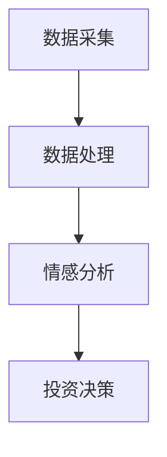

                 


# 彼得林奇的"街头智慧"在社交媒体数据分析中的运用

## 关键词：彼得林奇、街头智慧、社交媒体数据分析、自然语言处理、情感分析、投资决策、大数据

## 摘要

本文探讨了彼得·林奇的“街头智慧”在社交媒体数据分析中的应用，分析了如何通过社交媒体数据进行市场情绪分析、趋势预测和投资决策优化。文章从数据采集、处理、分析到投资决策的全过程进行了详细阐述，并结合实际案例，展示了如何利用这些数据提高投资决策的准确性。

---

# 第一章：彼得林奇的“街头智慧”与社交媒体数据分析

## 1.1 彼得林奇的“街头智慧”概述

### 1.1.1 彼得林奇的背景介绍

彼得·林奇是美国著名投资专家，以其独特的“街头智慧”闻名。他强调通过观察和分析普通人的行为和言论来预测市场趋势。

### 1.1.2 “街头智慧”的核心概念

“街头智慧”是指从日常生活中的观察中获取投资决策的依据，强调数据的实时性、多样性和可操作性。

### 1.1.3 “街头智慧”在投资分析中的应用

通过分析普通人的言论和行为，预测市场趋势，做出投资决策。

---

## 1.2 社交媒体数据分析的基础

### 1.2.1 社交媒体数据的特点

数据量大、来源多样、实时性强，包含丰富的市场情绪信息。

### 1.2.2 数据采集与处理的技术

使用API和爬虫技术获取数据，进行清洗和预处理。

### 1.2.3 数据分析的工具与方法

利用自然语言处理和情感分析技术，提取有用信息。

---

## 1.3 本章小结

本章介绍了彼得·林奇的“街头智慧”及其在社交媒体数据分析中的应用，为后续章节奠定了基础。

---

# 第二章：“街头智慧”与社交媒体数据的关系

## 2.1 “街头智慧”的核心要素

### 2.1.1 数据的实时性

数据生成和传播的时间特征，直接影响市场情绪的判断。

### 2.1.2 数据的多样性

数据来源和形式的多样性，提供了丰富的市场信息。

### 2.1.3 数据的可操作性

数据转化为投资决策的可行性，是“街头智慧”的关键。

---

## 2.2 社交媒体数据的特征分析

### 2.2.1 数据的文本分析

通过文本挖掘提取关键词和主题，分析市场趋势。

### 2.2.2 数据的情感分析

判断社交媒体上的情感倾向，评估市场情绪。

### 2.2.3 数据的传播路径分析

分析信息的传播路径，预测趋势的扩散和影响。

---

## 2.3 核心概念对比表

| 核心概念 | 特征 | 描述 |
|----------|------|------|
| 数据实时性 | 时间性 | 数据生成和传播的时间特征 |
| 数据多样性 | 多样性 | 数据来源、形式的多样性 |
| 数据可操作性 | 可操作性 | 数据转化为投资决策的可行性 |

---

## 2.4 本章小结

本章分析了“街头智慧”与社交媒体数据的关系，强调了数据的实时性、多样性和可操作性。

---

# 第三章：社交媒体数据处理与分析的核心方法

## 3.1 数据采集与处理

### 3.1.1 数据采集的技术

- 使用API（如Twitter API）获取数据。
- 使用爬虫技术抓取社交媒体数据。

### 3.1.2 数据预处理

- 数据清洗：去除无效数据。
- 数据转换：将文本数据转换为可分析的格式。

---

## 3.2 自然语言处理与情感分析

### 3.2.1 自然语言处理的原理

- 文本分词：将文本分割为词语或短语。
- 词干提取：提取词语的基本形式。

### 3.2.2 情感分析算法

- 基于机器学习的情感分析模型。
- 使用TextBlob库进行情感倾向分析。

---

## 3.3 数据分析与可视化

### 3.3.1 数据分析方法

- 统计分析：计算情感倾向的概率。
- 趋势分析：分析情感随时间的变化趋势。

### 3.3.2 数据可视化

- 使用Matplotlib绘制情感分布图。
- 使用Seaborn绘制情感随时间变化的趋势图。

---

## 3.4 本章小结

本章详细介绍了社交媒体数据处理与分析的核心方法，包括数据采集、预处理、自然语言处理和情感分析。

---

# 第四章：基于社交媒体数据的投资决策

## 4.1 投资决策的数学模型

### 4.1.1 情感倾向与股价预测

- 情感倾向概率：$$P(\text{positive}) = \frac{\text{positive\_count}}{\text{total\_count}}$$

### 4.1.2 趋势预测模型

- 线性回归模型：$$y = \beta_0 + \beta_1x + \epsilon$$

---

## 4.2 投资决策的优化

### 4.2.1 数据驱动的决策优化

- 基于情感分析结果优化投资组合。
- 结合其他市场数据（如历史价格、宏观经济指标）进行综合判断。

---

## 4.3 本章小结

本章探讨了如何利用社交媒体数据进行投资决策，介绍了情感倾向分析和趋势预测模型。

---

# 第五章：项目实战——基于社交媒体数据的投资决策系统

## 5.1 系统架构设计

### 5.1.1 功能模块设计

- 数据采集模块：获取社交媒体数据。
- 数据处理模块：清洗和预处理数据。
- 情感分析模块：分析数据情感倾向。
- 投资决策模块：基于分析结果做出决策。

### 5.1.2 系统架构图



---

## 5.2 核心代码实现

### 5.2.1 数据采集代码

```python
import tweepy

# 授权信息
auth = tweepy.OAuthHandler(consumer_key, consumer_secret)
auth.set_access_token(access_token, access_token_secret)

# 创建API对象
api = tweepy.API(auth)

# 获取推文
tweets = api.search(q=query, count=100)
```

### 5.2.2 情感分析代码

```python
from textblob import TextBlob

def analyze_sentiment(text):
    blob = TextBlob(text)
    return blob.sentiment.polarity

# 示例
text = "I love this stock!"
print(analyze_sentiment(text))  # 输出情感倾向值
```

---

## 5.3 实际案例分析

### 5.3.1 案例分析

假设我们分析某只股票在社交媒体上的讨论，发现大部分评论是积极的，情感倾向值为0.7，预测该股票价格上涨的可能性较大。

### 5.3.2 分析结果解读

通过情感分析，我们发现市场情绪偏向积极，结合其他数据，做出投资决策。

---

## 5.4 本章小结

本章通过实际案例展示了如何构建基于社交媒体数据的投资决策系统，并详细说明了系统架构和核心代码实现。

---

# 第六章：总结与展望

## 6.1 本章总结

本文探讨了彼得·林奇的“街头智慧”在社交媒体数据分析中的应用，分析了数据采集、处理、分析和投资决策的全过程。

## 6.2 未来展望

随着社交媒体数据的不断增长，未来可以通过更复杂的情感分析模型和大数据技术，进一步优化投资决策。

---

# 结束语

通过本文的分析，读者可以了解如何将彼得·林奇的“街头智慧”应用于社交媒体数据分析，从而做出更明智的投资决策。

