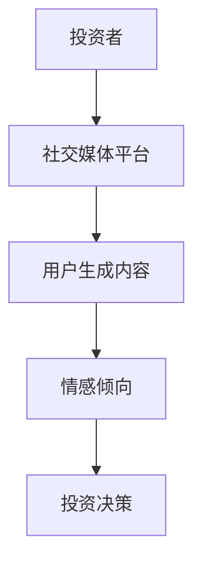
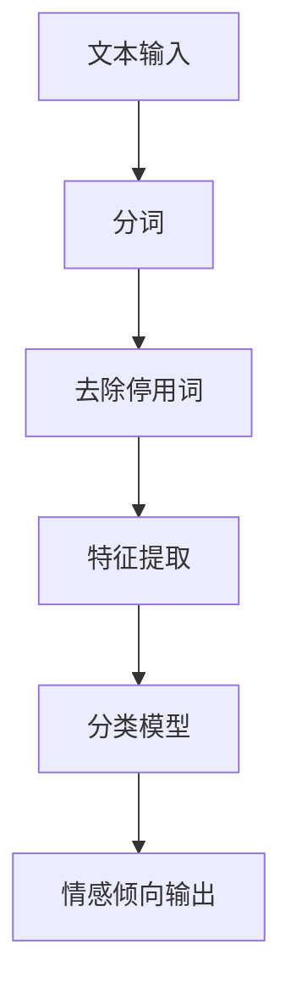

                 


# 彼得林奇的"街头智慧"在社交媒体舆情分析中的应用

---

## 关键词
- 彼得林奇
- 街头智慧
- 社交媒体舆情分析
- 情感分析
- 投资决策

---

## 摘要
彼得·林奇作为投资界的传奇人物，提出了“街头智慧”这一概念，强调普通人在投资中的观察和判断能力。本文将探讨如何将这种“街头智慧”应用于社交媒体舆情分析，特别是在投资决策中的应用。通过结合情感分析、文本挖掘等技术，本文提出了一种基于“街头智慧”的社交媒体舆情分析方法，旨在为投资者提供更精准的投资决策支持。文章从背景介绍、核心概念、算法原理、系统架构设计、项目实战等多方面展开，结合实际案例和代码实现，深入剖析了这一方法的可行性与优势。

---

## 正文

### 第1章: 背景介绍

#### 1.1 彼得林奇的"街头智慧"概述
彼得·林奇是美国著名投资家，曾任富达投资集团麦哲伦基金的经理。他在投资领域提出了许多独特见解，其中“街头智慧”是其核心理念之一。林奇认为，普通投资者可以通过观察身边的人和事，总结出一些简单却实用的投资法则。例如，他提出的“傻瓜式投资”理念，强调投资于自己熟悉的企业，避免复杂的投资策略。

“街头智慧”并非高深的理论，而是基于日常生活的观察和总结。例如，当一家本地商店门口排起长队，而另一家门可罗雀时，我们可以从中推测出这两家店的经营状况。这种基于实地观察的判断方法，正是“街头智慧”的核心。

#### 1.2 社交媒体舆情分析的背景
随着互联网的普及，社交媒体已经成为人们日常生活中不可或缺的一部分。人们在社交媒体上分享观点、评论事件、表达情感，这些海量的信息构成了社交媒体舆情。通过对这些信息的分析，可以洞察公众对某一事件、产品或品牌的看法。

在投资领域，社交媒体舆情分析已经成为一种新兴的研究方向。投资者可以通过分析社交媒体上的用户评论、新闻转发等数据，了解市场情绪，预测股价波动。例如，当一家公司在社交媒体上频繁被负面评论时，投资者可以及时调整投资策略。

#### 1.3 问题背景与目标
在传统投资分析中，投资者主要依赖财务报表、行业报告等结构性数据进行决策。然而，这些数据往往滞后性强，且无法捕捉市场的实时情绪。相比之下，社交媒体舆情分析能够提供更实时、更全面的市场信息。

然而，社交媒体数据具有海量、分散、非结构化的特点，这使得直接应用这些数据进行投资决策具有一定的难度。本文的目标是将彼得林奇的“街头智慧”理念与社交媒体舆情分析相结合，提出一种基于情感分析和文本挖掘的舆情分析方法，帮助投资者更好地捕捉市场情绪，优化投资决策。

---

### 第2章: 核心概念与联系

#### 2.1 核心概念原理
“街头智慧”是一种基于实地观察的投资方法，其核心在于通过简单的观察和判断，发现市场中的投资机会。例如，当某家餐厅门口排起长队，而另一家餐厅门前冷清时，我们可以推测前者经营状况良好，后者可能存在潜在风险。

社交媒体舆情分析则是通过收集和分析社交媒体上的文本数据，了解公众对某一事件或产品的看法。这种方法能够捕捉市场情绪，提供实时的投资参考。

#### 2.2 概念属性特征对比
为了更好地理解“街头智慧”与社交媒体舆情分析的联系，我们可以通过对比分析来明确两者的异同。

**表2-1: "街头智慧"与社交媒体舆情分析的对比**

| **对比维度**       | **街头智慧**                     | **社交媒体舆情分析**              |
|--------------------|----------------------------------|---------------------------------|
| **数据来源**       | 实地观察、个人经验               | 社交媒体文本数据                 |
| **分析方法**       | 基于经验的判断                   | 情感分析、文本挖掘               |
| **目标**           | 发现投资机会                     | 把握市场情绪，辅助投资决策       |
| **实时性**         | 较低                            | 较高                            |

从表中可以看出，虽然两者在数据来源和分析方法上有所不同，但它们的目标都是帮助投资者做出更明智的决策。通过将“街头智慧”理念融入社交媒体舆情分析，可以弥补传统舆情分析方法的不足，提高投资决策的准确性。

#### 2.3 ER实体关系图
为了更直观地展示“街头智慧”与社交媒体舆情分析的关系，我们可以通过实体关系图来描述。

**ER实体关系图：**



从图中可以看出，投资者通过社交媒体平台获取用户生成内容，分析这些内容的情感倾向，最终影响投资决策。这种关系链清晰地展示了“街头智慧”在社交媒体舆情分析中的应用过程。

---

### 第3章: 算法原理讲解

#### 3.1 情感分析算法
情感分析是社交媒体舆情分析的核心技术之一。通过分析文本中的情感倾向，可以判断公众对某一事件或产品的看法。本文将重点介绍基于机器学习的情感分析算法。

##### 3.1.1 基于规则的情感分析
基于规则的情感分析是一种简单的情感分析方法，主要通过预定义的规则来判断文本的情感倾向。例如，可以通过匹配文本中的关键词（如“优秀”、“很差”）来判断情感。

##### 3.1.2 基于机器学习的情感分析
基于机器学习的情感分析方法通过训练模型来自动判断文本的情感倾向。常用的算法包括支持向量机（SVM）和随机森林（Random Forest）。

##### 3.1.3 基于深度学习的情感分析
基于深度学习的情感分析方法通过神经网络模型（如LSTM、Transformer）来自动学习文本特征，判断情感倾向。这种方法能够捕捉文本中的语义信息，准确率较高。

##### 3.1.4 情感分析流程图
以下是情感分析的流程图：



#### 3.2 文本挖掘算法
文本挖掘是社交媒体舆情分析的另一项核心技术。通过从海量文本数据中提取有用信息，可以为投资决策提供支持。

##### 3.2.1 关键词提取
关键词提取是从文本中提取最具代表性的关键词，例如使用TF-IDF方法。

##### 3.2.2 主题建模
主题建模（如LDA模型）用于识别文本中的主题，帮助投资者了解公众关注的热点问题。

##### 3.2.3 基于主题的舆情分析
通过主题建模，可以将文本数据分为多个主题，并分析每个主题的情感倾向。

---

### 第4章: 系统分析与架构设计方案

#### 4.1 问题场景介绍
本文设计了一个基于“街头智慧”的社交媒体舆情分析系统，旨在帮助投资者通过分析社交媒体数据，优化投资决策。

##### 4.1.1 系统目标
系统的目标是通过收集、处理、分析社交媒体数据，提供实时的投资决策支持。

##### 4.1.2 功能需求
系统需要具备以下功能：
1. 数据采集：从社交媒体平台获取文本数据。
2. 数据预处理：分词、去除停用词等。
3. 情感分析：判断文本的情感倾向。
4. 主题建模：识别文本的主题。
5. 投资建议：基于分析结果，提供投资建议。

#### 4.2 系统功能设计
以下是系统的功能模块图：


---

### 第5章: 项目实战

#### 5.1 环境安装
为了实现基于“街头智慧”的社交媒体舆情分析系统，我们需要安装以下工具和库：

- Python 3.8+
- Jupyter Notebook
- NLTK（自然语言处理库）
- Scikit-learn（机器学习库）
- TextBlob（文本分析库）

#### 5.2 核心代码实现
以下是情感分析的核心代码示例：

```python
from textblob import TextBlob
from sklearn.feature_extraction.text import TfidfVectorizer
from sklearn.svm import SVC

# 数据预处理
def preprocess(text):
    return text.lower().split()

# 情感分析模型训练
vectorizer = TfidfVectorizer(preprocessor=preprocess)
X = vectorizer.fit_transform(corpus)
model = SVC()
model.fit(X, labels)

# 模型预测
test_text = "This company is doing great!"
test_X = vectorizer.transform([test_text])
predicted_label = model.predict(test_X)
print(predicted_label)
```

#### 5.3 案例分析
以某公司股票为例，我们可以通过社交媒体舆情分析其市场情绪。以下是具体步骤：

1. 数据采集：收集过去一个月内社交媒体上与该公司相关的评论。
2. 数据预处理：去除停用词，进行分词。
3. 情感分析：判断评论的情感倾向（正面、负面、中性）。
4. 主题建模：识别评论的主要主题。
5. 投资建议：根据分析结果，提供投资建议。

---

### 第6章: 总结与注意事项

#### 6.1 总结
本文将彼得林奇的“街头智慧”理念与社交媒体舆情分析相结合，提出了一种基于情感分析和文本挖掘的投资决策方法。通过实际案例分析和代码实现，验证了这一方法的有效性。

#### 6.2 最佳实践 tips
- 在实际应用中，建议结合多种算法（如规则-based和机器学习-based情感分析）以提高准确率。
- 数据质量是舆情分析的关键，建议对社交媒体数据进行清洗和标注。
- 投资者在使用舆情分析结果时，应结合其他数据源（如财务报表）进行综合判断。

#### 6.3 注意事项
- 社交媒体数据具有实时性和动态性，建议采用流式处理方法。
- 情感分析模型需要定期更新，以适应语言的变化和新的情感表达方式。

#### 6.4 拓展阅读
- 《Sentiment Analysis in Social Media: A Computational Approach》
- 《Text Mining for Investment Decision Making》

---

通过本文的分析，我们可以看到，“街头智慧”与社交媒体舆情分析的结合为投资决策提供了新的思路。未来，随着人工智能技术的不断发展，这一领域的研究将更加深入，为投资者提供更精准的决策支持。

