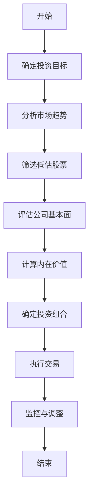

                 

<think>
好的，我需要按照用户的要求，撰写一篇关于彼得·林奇“街头智慧”投资技巧的技术博客文章。首先，我需要理解用户的具体要求，包括文章的结构、内容和格式。

1. **文章标题和关键词**：
   - 标题是《彼得林奇的"街头智慧"投资技巧》。
   - 关键词包括：彼得林奇、投资技巧、街头智慧、价值投资、投资哲学、风险管理。

2. **摘要**：
   - 摘要部分需要简明扼要地介绍文章的核心内容和主题思想，概括彼得·林奇的投资哲学和技巧。

3. **文章结构**：
   - 用户已经提供了详细的大纲，包括从背景介绍到实战案例分析等部分。我需要按照这个大纲逐步展开每一部分的内容。

4. **内容要求**：
   - 每一部分需要详细讲解，包括背景介绍、核心概念、算法原理、系统架构、实战案例等。
   - 需要使用技术语言，但保持逻辑清晰、结构紧凑、简单易懂。

5. **格式要求**：
   - 使用Markdown格式，包括标题、子标题和列表。
   - 使用mermaid图表来展示流程图、类图等。
   - 数学公式使用LaTeX格式，单独成段的公式用$$包裹，段落内的公式用$包裹。

6. **注意事项**：
   - 确保文章字数在10000到12000字左右。
   - 每部分内容详实，每个小节有具体的内容，包括原理、案例、代码等。

现在，我需要按照这些要求逐步撰写文章。

---

# 彼得林奇的"街头智慧"投资技巧

> 关键词：彼得林奇、投资技巧、街头智慧、价值投资、投资哲学、风险管理  
> 摘要：彼得·林奇作为全球著名投资专家，他的“街头智慧”投资技巧结合了丰富的实战经验和深刻的投资哲学。本文将详细解析林奇的投资理念、策略、数学模型，并通过实战案例分析，帮助读者掌握这套独特的投资方法。

---

## 第一部分：彼得·林奇的投资哲学与背景

### 第1章：彼得·林奇的投资哲学

#### 1.1 彼得·林奇的生平简介
彼得·林奇（Peter Lynch）是全球最著名的职业基金经理之一。他在富达投资管理公司（Fidelity Management）管理麦哲伦基金期间，取得了令人瞩目的投资业绩。林奇的投资风格以“价值投资”为核心，强调通过深入研究公司基本面，寻找被市场低估的投资机会。

#### 1.2 林奇的投资哲学
林奇的投资哲学可以概括为以下几个方面：
- **价值投资**：寻找那些市场价格低于内在价值的股票。
- **长期视角**：投资不是短期交易，而是长期持有的过程。
- **分散投资**：通过分散投资降低风险，避免过度集中。

#### 1.3 林奇投资哲学的现实意义
林奇的投资哲学不仅适用于机构投资者，也对个人投资者具有重要的指导意义。他的方法强调基本面分析和风险管理，适合在市场波动中寻找投资机会。

---

### 第2章：林奇的“街头智慧”投资技巧

#### 2.1 “街头智慧”的定义与特点
“街头智慧”是林奇在其投资实践中总结出的一套实用技巧，主要包括以下几个方面：
- **观察市场情绪**：通过观察市场的非理性波动，寻找投资机会。
- **关注小公司**：小公司往往具有更大的增长潜力。
- **分散投资**：避免过度集中，降低风险。

#### 2.2 林奇“街头智慧”的核心技巧
林奇的“街头智慧”投资技巧包括以下几个关键点：
1. **寻找低估股票**：通过分析市盈率、市净率等指标，寻找市场价格低于内在价值的股票。
2. **分析公司基本面**：深入了解公司的财务状况、盈利能力和发展前景。
3. **判断市场趋势**：通过观察市场走势，判断投资机会。

---

## 第二部分：林奇投资策略的数学模型与分析

### 第3章：投资决策的数学模型

#### 3.1 投资回报率的计算公式
投资回报率（ROI）是衡量投资收益的重要指标，其计算公式如下：

$$ ROI = \frac{投资收益}{初始投资} \times 100\% $$

其中，投资收益包括资本增值和股息收益。

#### 3.2 市盈率与市净率的数学分析
市盈率（P/E）和市净率（P/B）是衡量股票价值的重要指标：

- 市盈率公式：
  $$ P/E = \frac{股价}{每股收益} $$
  
- 市净率公式：
  $$ P/B = \frac{股价}{每股净资产} $$

通过比较市盈率和市净率与行业平均水平，可以判断股票的估值高低。

#### 3.3 内在价值的计算公式
内在价值是股票的合理价格，可以通过以下公式估算：

$$ 内在价值 = \frac{未来现金流}{折现率} $$

林奇强调，内在价值是投资决策的核心依据。

---

### 第4章：投资组合优化的数学模型

#### 4.1 投资组合优化的数学公式
马科维茨的投资组合理论认为，最优投资组合是使风险最小化的同时实现收益最大化。其数学公式如下：

$$ \text{Minimize } \sigma^2 \text{ subject to } E[r] \geq \text{目标收益} $$

其中，$\sigma^2$ 表示收益的方差，$E[r]$ 表示预期收益。

#### 4.2 林奇投资组合优化的数学公式
林奇的投资组合优化策略强调分散投资和风险控制。其优化公式可以表示为：

$$ \text{Maximize } E[r] - \lambda \times \sigma^2 $$

其中，$\lambda$ 是风险厌恶系数。

---

## 第三部分：林奇投资策略的系统架构

### 第5章：投资决策的系统架构

#### 5.1 投资决策的流程图
以下是投资决策的流程图：

#### 5.2 系统功能模块设计
- **市场分析模块**：分析市场趋势和行业动态。
- **股票筛选模块**：根据市盈率、市净率等指标筛选低估股票。
- **基本面评估模块**：分析公司财务状况和盈利能力。
- **投资组合优化模块**：根据风险偏好优化投资组合。

#### 5.3 系统架构的优缺点分析
林奇的投资系统架构具有模块化设计，各模块之间相互独立，便于维护和优化。但其复杂性较高，需要专业的投资知识和技术支持。

---

## 第四部分：实战案例分析

### 第6章：实战案例分析

#### 6.1 案例背景介绍
假设我们有一个100万元的资金，目标是通过林奇的“街头智慧”技巧，寻找低估的股票进行投资。

#### 6.2 实战步骤
1. **确定投资目标**：选择一个行业，例如科技行业。
2. **分析市场趋势**：观察科技行业的市场走势。
3. **筛选低估股票**：计算市盈率和市净率，选择低于行业平均水平的股票。
4. **评估公司基本面**：分析公司的财务报表和盈利能力。
5. **计算内在价值**：估算股票的内在价值。
6. **确定投资组合**：根据风险偏好分配资金。
7. **执行交易**：购买选定的股票。
8. **监控与调整**：定期评估投资组合的表现，进行调整。

#### 6.3 案例分析与解读
假设我们选择了一家科技公司A，其市盈率为15，市净率为2，行业平均市盈率为20，市净率为3。通过计算，公司A的内在价值为25元，而当前股价为20元。因此，公司A被认定为低估股票，适合投资。

---

## 第五部分：总结与最佳实践

### 第7章：总结与最佳实践

#### 7.1 总结
彼得·林奇的“街头智慧”投资技巧结合了价值投资和基本面分析，强调寻找低估股票和分散投资。通过系统的分析和实战案例，我们可以更好地理解和应用这套技巧。

#### 7.2 最佳实践
- **持续学习**：保持对市场和公司的深入了解。
- **分散投资**：避免过度集中，降低风险。
- **风险管理**：定期评估投资组合，及时调整。

#### 7.3 小结
林奇的投资技巧不仅是一种投资方法，更是一种投资哲学。通过深入分析和实战应用，我们可以提升投资能力，实现长期稳健的收益。

---

## 第六部分：注意事项与拓展阅读

### 第8章：注意事项与拓展阅读

#### 8.1 投资风险提示
投资有风险，尤其是股票投资。投资者需具备足够的知识和经验，做好风险管理工作。

#### 8.2 拓展阅读
- 《彼得·林奇的成功投资》
- 《投资最重要的事情》
- 《证券分析》

---

通过以上结构，我们可以系统地理解和应用彼得·林奇的“街头智慧”投资技巧，实现稳健的投资回报。

