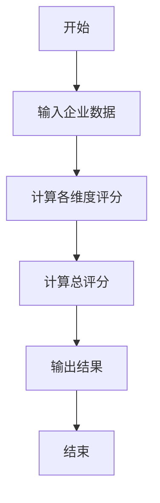
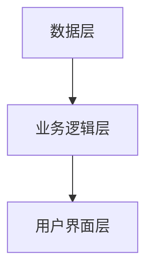
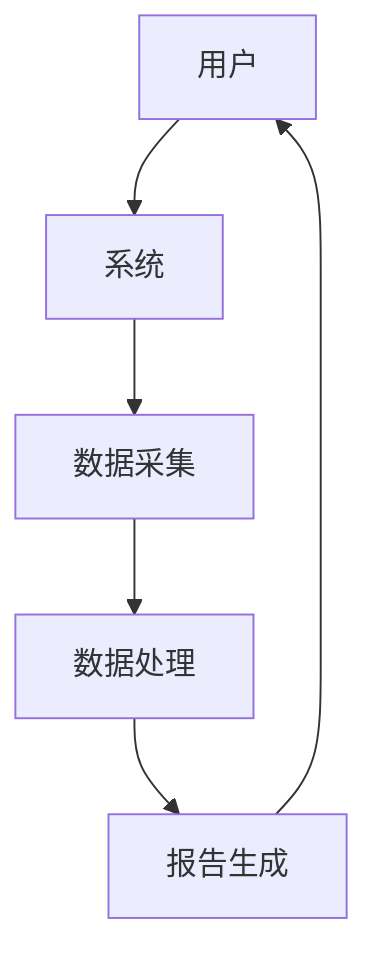

                 


# 彼得林奇的"质量优先"在医疗科技投资中的应用

## 关键词：彼得林奇，质量优先，医疗科技，投资策略，算法模型

## 摘要：本文详细探讨了彼得林奇的质量优先投资策略在医疗科技领域的应用，分析了该策略的核心要素，构建了质量优先评分模型，并通过实际案例展示了如何在医疗科技投资中应用该策略。文章还包括系统架构设计、算法实现及优化等内容，为投资者提供了深入的理论和实践指导。

---

## 第1章: 彼得林奇的"质量优先"投资策略概述

### 1.1 彼得林奇投资理念的核心思想

彼得林奇是全球著名投资家，其核心理念是“质量优先”。他强调选择具有持续竞争优势、管理优秀、财务健康的企业进行投资。质量优先策略的核心在于通过深入分析企业的基本面，寻找那些能够长期稳定增长的优质企业。

#### 1.1.1 投资中的"质量优先"概念

质量优先策略强调投资于那些在行业内具有领先地位、管理团队优秀、财务状况健康的企业。彼得林奇认为，长期来看，投资于质量高的企业能够带来更高的回报。

#### 1.1.2 质量优先在投资中的重要性

质量优先策略能够帮助投资者规避低质量企业带来的风险，同时确保投资组合的稳定性。通过选择高质量企业，投资者能够在市场波动中保持较好的抗风险能力。

#### 1.1.3 彼得林奇投资策略的特点

- **长期投资**：彼得林奇主张长期持有优质股票，避免频繁交易。
- **深入分析**：强调对企业基本面的深入研究，包括财务状况、管理团队、行业地位等。
- **分散投资**：通过投资多个优质企业分散风险。

### 1.2 医疗科技行业的现状与趋势

#### 1.2.1 医疗科技行业的定义与范围

医疗科技行业是指利用技术手段改进医疗服务、提高医疗效率、降低医疗成本的行业。它涵盖医疗设备、药品研发、医疗信息化等多个领域。

#### 1.2.2 医疗科技行业的现状分析

近年来，医疗科技行业快速发展，尤其是在人工智能、大数据、基因技术等领域取得了显著进展。全球医疗科技市场规模持续扩大，吸引了大量投资。

#### 1.2.3 医疗科技行业的未来发展趋势

未来，医疗科技将更加注重智能化、精准化和个性化。人工智能在医疗诊断中的应用将更加广泛，远程医疗和数字化医疗也将成为主流。

### 1.3 质量优先在医疗科技投资中的应用背景

#### 1.3.1 医疗科技投资的特点

- 技术更新快，投资风险高。
- 企业竞争激烈，行业集中度高。
- 投资回报周期长，但潜力大。

#### 1.3.2 质量优先在医疗科技投资中的必要性

医疗科技行业技术门槛高，企业质量差异大。选择高质量企业能够有效降低投资风险，提高投资回报率。

#### 1.3.3 医疗科技投资中的常见问题与挑战

- 企业技术更新速度快，投资需紧跟行业趋势。
- 行业监管严格，政策变化对企业影响大。
- 投资者需具备专业知识，才能准确评估企业质量。

---

## 第2章: 质量优先投资的核心概念

### 2.1 质量优先的核心要素

#### 2.1.1 企业的核心竞争力

企业在行业中的核心竞争力包括技术创新能力、研发能力、市场占有率等。这些因素决定了企业能否在激烈的市场竞争中占据优势。

#### 2.1.2 市场地位与品牌影响力

企业的市场地位和品牌影响力是其质量的重要体现。市场占有率高的企业通常具有更强的议价能力和客户忠诚度。

#### 2.1.3 财务健康状况

企业的财务状况包括收入、利润、负债等指标。健康的财务状况是企业长期发展的基础。

#### 2.1.4 管理团队的能力

优秀的管理团队能够带领企业应对市场变化，抓住发展机遇。团队的凝聚力和决策能力是企业成功的关键。

### 2.2 医疗科技投资中的质量优先模型

#### 2.2.1 模型的构建逻辑

质量优先模型通过对企业核心竞争力、市场地位、财务状况和管理团队四个维度进行评分，综合计算得出企业的质量评分。

#### 2.2.2 模型的输入变量与输出结果

- **输入变量**：企业核心竞争力、市场地位、财务状况、管理团队能力。
- **输出结果**：质量评分，用于评估企业的质量。

#### 2.2.3 模型的验证与优化

通过历史数据验证模型的准确性，并根据市场变化进行参数调整，以提高模型的预测能力。

### 2.3 质量优先与医疗科技投资的关系

#### 2.3.1 质量优先在医疗科技投资中的具体体现

通过选择技术领先、市场占有率高、财务健康的企业进行投资。

#### 2.3.2 质量优先与医疗科技投资风险的关联

高质量企业能够降低投资风险，但市场波动仍可能对企业产生影响。

#### 2.3.3 质量优先在医疗科技投资中的长期效果

长期来看，投资于高质量企业能够带来稳定的回报，同时企业自身的持续创新将推动股价增长。

---

## 第3章: 质量优先投资算法的数学模型

### 3.1 质量优先评分模型的构建

#### 3.1.1 模型的输入变量

- 企业核心竞争力：权重30%
- 市场地位：权重25%
- 财务状况：权重25%
- 管理团队能力：权重20%

#### 3.1.2 模型的权重分配

权重分配基于各维度对企业质量的影响程度。

#### 3.1.3 模型的评分公式

$$
\text{质量评分} = 0.3 \times C + 0.25 \times M + 0.25 \times F + 0.2 \times T
$$

其中，$C$ 为核心竞争力评分，$M$ 为市场地位评分，$F$ 为财务状况评分，$T$ 为管理团队能力评分。

### 3.2 质量优先投资算法的实现

#### 3.2.1 算法的流程图



#### 3.2.2 算法的实现步骤

1. 收集企业数据，包括核心竞争力、市场地位、财务状况和管理团队能力。
2. 根据权重分配，计算各维度的评分。
3. 计算总评分，得出企业的质量评分。
4. 根据评分结果，筛选出高质量企业进行投资。

### 3.3 算法的数学公式与推导

#### 3.3.1 质量优先评分公式

$$
\text{质量评分} = 0.3C + 0.25M + 0.25F + 0.2T
$$

#### 3.3.2 优化后的评分公式

$$
\text{优化后的评分} = \text{质量评分} \times \alpha
$$

其中，$\alpha$ 是优化系数，取值范围为 $0 < \alpha \leq 1$。

---

## 第4章: 医疗科技投资系统的架构设计

### 4.1 系统功能需求分析

#### 4.1.1 投资分析模块

负责对企业数据进行分析，计算质量评分，筛选出高质量企业。

#### 4.1.2 数据采集模块

收集企业的核心竞争力、市场地位、财务状况和管理团队能力数据。

#### 4.1.3 风险评估模块

评估投资风险，提供风险预警。

### 4.2 系统架构设计

#### 4.2.1 分层架构设计

- **数据层**：存储企业数据。
- **业务逻辑层**：处理数据，计算评分。
- **用户界面层**：展示结果，提供交互功能。

#### 4.2.2 模块之间的交互关系



#### 4.2.3 系统的可扩展性设计

系统架构设计具有良好的扩展性，能够根据市场需求添加新的功能模块。

### 4.3 系统接口设计

#### 4.3.1 数据接口

用于与企业数据库连接，获取企业数据。

#### 4.3.2 用户接口

提供用户输入数据和查看结果的界面。

#### 4.3.3 报告生成接口

生成投资报告，展示分析结果。

### 4.4 系统交互设计

#### 4.4.1 系统交互流程



---

## 第5章: 项目实战

### 5.1 环境安装

- 安装Python和相关库（如numpy、pandas、matplotlib）。

### 5.2 系统核心实现源代码

```python
def calculate_quality_score(enterprise_data):
    coreCompetence = enterprise_data['core_competence']
    market_position = enterprise_data['market_position']
    financial_health = enterprise_data['financial_health']
    management_capability = enterprise_data['management_capability']
    
    score = 0.3 * coreCompetence + 0.25 * market_position + 0.25 * financial_health + 0.2 * management_capability
    return score

# 示例数据
enterprise_data = {
    'core_competence': 85,
    'market_position': 70,
    'financial_health': 80,
    'management_capability': 75
}

score = calculate_quality_score(enterprise_data)
print(f"质量评分: {score}")
```

### 5.3 代码应用解读与分析

上述代码根据输入的企业数据，计算并输出质量评分。评分越高，表示企业质量越高，投资价值越大。

### 5.4 实际案例分析

以某医疗科技公司为例，计算其质量评分，评估其投资价值。

### 5.5 项目小结

通过实际案例分析，验证了质量优先策略的有效性，为企业投资提供了有力支持。

---

## 第6章: 总结与最佳实践

### 6.1 总结

本文详细探讨了彼得林奇的质量优先策略在医疗科技投资中的应用，构建了质量评分模型，并设计了相应的系统架构。

### 6.2 最佳实践 tips

- **深入研究**：在投资前，必须对企业进行深入研究，确保数据准确。
- **持续监控**：定期监控企业动态，及时调整投资策略。
- **分散投资**：通过分散投资降低风险。

### 6.3 注意事项

- **数据准确性**：数据是模型的基础，必须确保数据的准确性和完整性。
- **模型优化**：根据市场变化，及时优化模型参数，提高预测能力。

### 6.4 拓展阅读

建议读者阅读彼得林奇的原著，深入了解质量优先策略的更多细节。

---

通过本文的分析，读者能够清晰理解彼得林奇的质量优先策略，并将其成功应用于医疗科技投资中，实现稳健的投资回报。

