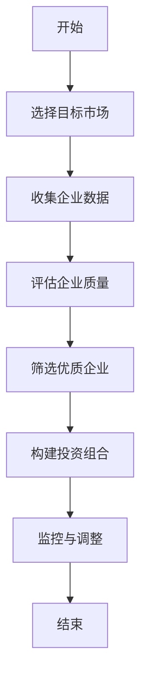

                 


# 彼得林奇的"质量优先"在新兴市场的实践挑战

## 关键词：彼得林奇、质量优先、新兴市场、投资策略、风险管理、市场分析

## 摘要：  
本文深入探讨了彼得林奇提出的“质量优先”投资策略在新兴市场中的实际应用挑战。通过分析新兴市场的特点、质量优先策略的核心原理及其在新兴市场的适应性，本文揭示了该策略在新兴市场中的独特优势与局限性。同时，结合实际案例和系统架构设计，本文提出了在新兴市场中优化质量优先策略的具体方法和建议，为投资者提供了实用的指导。

---

## 第一部分: 背景介绍与核心概念

### 第1章: 质量优先策略的定义与背景

#### 1.1 质量优先策略的核心概念

- **1.1.1 什么是质量优先策略**
  质量优先策略是一种以企业质量为核心的投资策略，强调通过对企业基本面的深入分析，选择具有持续增长潜力和竞争优势的企业进行投资。彼得林奇在其投资实践中，将质量优先策略作为核心理念，认为优质企业是长期投资收益的基石。

- **1.1.2 质量优先策略的核心要素**
  质量优先策略的核心要素包括：企业的盈利能力、管理团队的稳定性、行业地位、财务健康状况、市场竞争力以及企业治理结构。这些要素共同构成了评估企业质量的关键指标。

- **1.1.3 质量优先策略的边界与外延**
  质量优先策略的边界在于其适用范围和限制。例如，在成熟市场中，该策略可能较为稳健，但在新兴市场中，由于市场波动性大、信息不透明，其适用性需要重新评估。外延方面，质量优先策略可以与其他投资策略（如价值投资、成长投资）相结合，形成更灵活的投资组合。

#### 1.2 彼得林奇的质量优先投资理念

- **1.2.1 彼得林奇的投资哲学**
  彼得林奇主张通过深入研究企业基本面，寻找那些具有持续增长潜力且被市场低估的企业。他认为，优质企业的长期表现往往优于市场平均水平。

- **1.2.2 质量优先策略在彼得林奇投资中的应用**
  彼得林奇在其投资组合中，倾向于选择那些具有强大竞争优势、稳定盈利能力和良好管理团队的企业。例如，他在管理富达麦哲伦基金期间，通过质量优先策略实现了长期的超额收益。

- **1.2.3 彼得林奇质量优先策略的案例分析**
  以彼得林奇投资的某家新兴市场企业为例，分析其如何通过质量优先策略选择出具有持续增长潜力的企业，并实现投资收益。

### 第2章: 新兴市场的特点与挑战

#### 2.1 新兴市场的定义与特点

- **2.1.1 新兴市场的定义**
  新兴市场是指那些经济快速增长但尚未完全工业化的国家，如中国、印度、巴西等。这些市场的特点是经济结构转型、产业升级和市场潜力巨大。

- **2.1.2 新兴市场的经济特征**
  新兴市场通常具有较高的经济增长率、较低的人均收入、较大的人口基数和快速城市化的特点。这些特征为投资提供了广阔的市场空间，但也伴随着较高的风险。

- **2.1.3 新兴市场的投资机会与风险**
  新兴市场的机会包括快速增长的消费需求、产业升级和技术创新等领域。然而，这些市场也存在政策风险、市场波动性和信息不透明等挑战。

#### 2.2 新兴市场中的质量优先策略

- **2.2.1 新兴市场与质量优先策略的结合**
  在新兴市场中，质量优先策略需要考虑市场的特殊性。例如，企业可能面临更高的竞争压力、政策变化和市场波动。

- **2.2.2 新兴市场中质量优先策略的适用性**
  尽管新兴市场具有较高的增长潜力，但质量优先策略在这些市场中的应用需要进行适当的调整。例如，投资者需要更加注重企业的财务健康状况和管理团队的稳定性。

- **2.2.3 新兴市场中质量优先策略的挑战**
  新兴市场中的质量优先策略面临的主要挑战包括：市场波动性大、企业质量评估难度高、政策风险和信息不对称等问题。

---

## 第二部分: 核心概念与联系

### 第3章: 质量优先策略的核心原理

#### 3.1 质量优先策略的原理分析

- **3.1.1 质量优先策略的基本原理**
  质量优先策略的基本原理是通过对企业质量的全面评估，选择具有持续增长潜力和竞争优势的企业进行投资。这种策略强调长期投资，而非短期波动。

- **3.1.2 质量优先策略的内在逻辑**
  质量优先策略的内在逻辑是基于企业的基本面分析。优质企业通常具有稳定的盈利能力和良好的管理团队，能够在市场波动中保持竞争优势。

- **3.1.3 质量优先策略与投资回报的关系**
  研究表明，质量优先策略能够为投资者带来稳定的长期回报。优质企业的持续增长能力是投资收益的重要来源。

#### 3.2 质量优先策略与新兴市场的结合

- **3.2.1 新兴市场中质量优先策略的特殊性**
  在新兴市场中，质量优先策略需要考虑市场的特殊性。例如，企业可能面临更高的竞争压力和政策风险。

- **3.2.2 新兴市场中质量优先策略的实现路径**
  新兴市场中质量优先策略的实现路径包括：选择具有强大竞争优势和良好管理团队的企业，关注企业的财务健康状况，以及分散投资以降低风险。

- **3.2.3 新兴市场中质量优先策略的优化与调整**
  针对新兴市场的特点，质量优先策略需要进行适当的优化与调整。例如，投资者需要更加注重企业的行业地位和政策敏感性。

### 第4章: 核心概念对比与ER实体关系图

#### 4.1 质量优先策略与传统投资策略的对比

- **4.1.1 投资理念的对比**
  质量优先策略注重企业质量，而传统投资策略可能更关注市场趋势和短期收益。

- **4.1.2 投资方法的对比**
  质量优先策略采用基本面分析，而传统策略可能采用技术分析或其他方法。

- **4.1.3 投资效果的对比**
  质量优先策略通常能够实现稳定的长期收益，而传统策略可能在短期波动中表现更好。

#### 4.2 质量优先策略的ER实体关系图

```mermaid
erDiagram
    actor 投资者 {
        <属性> 企业质量
        <属性> 市场风险
        <属性> 投资收益
    }
    entity 企业 {
        <属性> 盈利能力
        <属性> 管理团队
        <属性> 行业地位
    }
    entity 市场环境 {
        <属性> 经济政策
        <属性> 市场波动
        <策略> 质量优先策略
    }
    投资者 --> 企业 : 选择
    投资者 --> 市场环境 : 分析
    企业 --> 市场环境 : 受影响
```

---

## 第三部分: 算法原理与数学模型

### 第4章: 质量优先策略的算法实现

#### 4.1 质量优先策略的算法流程



#### 4.2 质量评估指标的数学模型

- 盈利能力评估公式：
  $$ \text{ROE} = \frac{\text{净利润}}{\text{股东权益}} $$
  
- 成长性评估公式：
  $$ \text{年复合增长率} = \left( \frac{\text{收入今年} - \text{收入去年}}{\text{收入去年}} \right) \times 100\% $$

#### 4.3 算法实现代码示例

```python
def assess_quality(company_data):
    # 输入：company_data 包含企业财务数据和市场信息
    # 输出：质量评估分数（0-100）
    roe = company_data['net_profit'] / company_data['equity']
    growth_rate = ((company_data['revenue_current'] - company_data['revenue_previous']) / company_data['revenue_previous']) * 100
    management_score = company_data['management_stability'] * 5
    quality_score = (roe * 30) + (growth_rate * 40) + (management_score * 30)
    return quality_score
```

---

## 第四部分: 系统分析与架构设计

### 第5章: 系统架构与功能设计

#### 5.1 系统功能设计

- 数据收集模块：收集企业的财务数据和市场信息。
- 质量评估模块：根据质量优先策略对企业进行评估。
- 投资组合管理模块：根据评估结果构建投资组合。
- 风险管理模块：监控投资组合的风险并进行调整。

#### 5.2 系统架构图


---

## 第五部分: 项目实战与案例分析

### 第6章: 项目实战

#### 6.1 环境安装

- 安装必要的工具和库，例如Python、Pandas、NumPy等。

#### 6.2 核心代码实现

```python
import pandas as pd

def main():
    # 加载数据
    data = pd.read_csv('company_data.csv')
    # 计算ROE
    data['ROE'] = data['net_profit'] / data['equity']
    # 计算年复合增长率
    data['growth_rate'] = ((data['revenue_current'] - data['revenue_previous']) / data['revenue_previous']) * 100
    # 评估质量
    data['quality_score'] = data['ROE'] * 30 + data['growth_rate'] * 40 + data['management_stability'] * 30
    # 筛选优质企业
   优质企业 = data[data['quality_score'] > 70]
    return 优质企业

if __name__ == "__main__":
    main()
```

#### 6.3 案例分析

- 分析某新兴市场中的优质企业，展示如何通过质量优先策略选择出具有持续增长潜力的企业。

---

## 第六部分: 最佳实践与小结

### 第7章: 最佳实践

#### 7.1 小结

- 总结本文的主要内容和结论。

#### 7.2 注意事项

- 提醒投资者在应用质量优先策略时需要注意的事项，例如市场风险、信息不对称等。

#### 7.3 拓展阅读

- 推荐进一步阅读的书籍和资源，帮助读者深入了解质量优先策略在新兴市场的应用。

---

## 结语

本文通过深入分析彼得林奇的“质量优先”策略在新兴市场的实践挑战，为投资者提供了理论支持和实践指导。尽管新兴市场存在诸多不确定性，但通过优化和调整质量优先策略，投资者可以在这些市场中实现长期稳定的收益。未来的研究可以进一步探讨新兴市场中质量优先策略与其他策略的结合，以应对更加复杂的投资环境。

