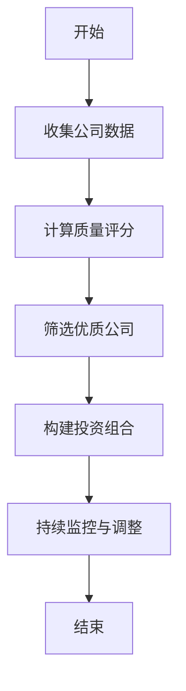
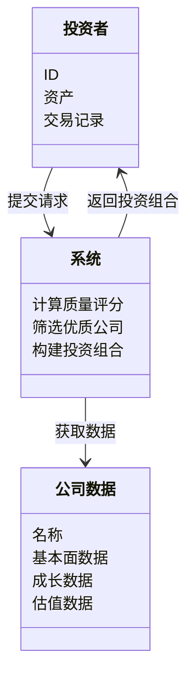
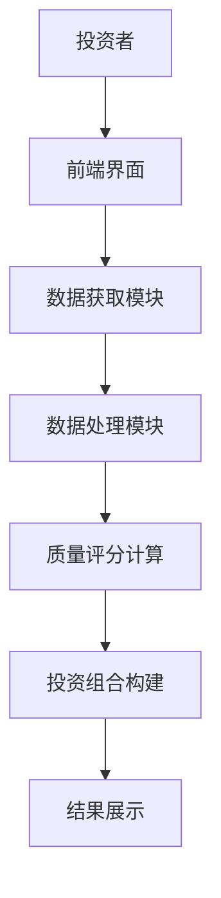

                 


# 彼得林奇的"质量优先"在新兴市场的实践挑战

## 关键词：质量优先，彼得林奇，新兴市场，投资策略，风险管理，大数据分析

## 摘要：  
本文深入探讨了彼得林奇的“质量优先”投资策略在新兴市场的实践挑战。首先，我们介绍了质量优先策略的核心概念，分析了其在新兴市场的背景和特点。接着，我们从理论和实际应用的角度，探讨了在新兴市场中实施质量优先策略所面临的独特挑战，如信息不对称和市场波动性。然后，我们提出了优化策略实施的解决方案，包括优化投资流程、风险管理策略和利用大数据分析等技术手段。最后，我们通过具体案例分析和系统架构设计，展示了质量优先策略在新兴市场的实际应用，并对未来的发展趋势进行了展望。

---

## 第一部分：质量优先策略的核心概念

### 第1章：质量优先策略的定义与核心要素

#### 1.1 质量优先的定义与核心要素
- **质量优先的定义**：质量优先策略强调投资于具有强大基本面、长期增长潜力和竞争优势的公司，而非短期市场波动。
- **核心要素**：
  - **基本面分析**：关注公司的财务状况、盈利能力、成长能力和分红能力。
  - **长期价值**：注重公司的内在价值，而非短期市场表现。
  - **竞争优势**：寻找具有独特竞争优势的公司，如专利、品牌、成本优势等。

#### 1.2 新兴市场的特点与挑战
- **新兴市场的特点**：
  - 高增长潜力：新兴市场通常具有较高的经济增长率。
  - 高波动性：市场波动剧烈，容易受到外部因素影响。
  - 不完善的监管环境：新兴市场的监管体系可能不够成熟，存在较高的政策风险。
- **挑战**：
  - 信息不对称：新兴市场中信息透明度较低，投资者难以获取全面准确的信息。
  - 市场波动性：高波动性可能导致投资策略频繁调整，增加了执行难度。
  - 文化差异：新兴市场的文化和商业实践可能与成熟市场不同，影响策略实施。

---

## 第二部分：质量优先策略的理论基础

### 第2章：质量优先策略的数学模型

#### 2.1 质量评分模型
- **质量评分公式**：
  $$
  Q = \frac{E \times R \times C}{V}
  $$
  其中：
  - $E$：公司的盈利能力，用ROE（净资产收益率）表示。
  - $R$：公司的成长能力，用营收增长率表示。
  - $C$：公司的竞争优势，用专利数量或市场占有率表示。
  - $V$：公司的估值，用市盈率或市净率表示。
- **解释**：该公式通过盈利能力、成长能力和竞争优势的乘积，除以估值，计算公司的质量评分。评分越高，公司质量越好。

#### 2.2 质量优先的数学模型
- **质量与收益的关系模型**：
  $$
  R_{i} = \alpha Q_{i} + \beta \epsilon_{i}
  $$
  其中：
  - $R_{i}$：公司i的收益。
  - $Q_{i}$：公司i的质量评分。
  - $\alpha$：系数，表示质量对收益的影响程度。
  - $\epsilon_{i}$：误差项，表示其他影响收益的因素。

---

### 第3章：质量优先策略的算法原理

#### 3.1 质量优先算法的流程图


#### 3.2 算法实现的Python代码
```python
def calculate_quality_score(fundamentals, growth, moat, valuation):
    # 基本面得分：盈利能力（ROE）和财务状况（债务/资本比率）
    e = fundamentals['roe'] * (1 - fundamentals['debt_to_capital'])
    
    # 成长能力得分：营收增长率和净利润增长率
    r = (growth['revenue_growth'] + growth['net_profit_growth']) / 2
    
    # 竞争优势得分：市场占有率和专利数量
    c = moat['market_share'] * moat['patents_count']
    
    # 估值得分：市盈率和市净率
    v = valuation['pe'] * valuation['pb']
    
    # 质量评分 = (e * r * c) / v
    quality_score = (e * r * c) / v
    return quality_score

# 示例数据
fundamentals = {'roe': 0.15, 'debt_to_capital': 0.3}
growth = {'revenue_growth': 0.2, 'net_profit_growth': 0.15}
moat = {'market_share': 0.25, 'patents_count': 5}
valuation = {'pe': 15, 'pb': 2}

# 计算质量评分
score = calculate_quality_score(fundamentals, growth, moat, valuation)
print("质量评分:", score)
```

---

## 第三部分：质量优先策略在新兴市场的挑战

### 第4章：新兴市场中的信息不对称

#### 4.1 信息不对称的定义
- 信息不对称是指市场参与者之间信息掌握的不平等，导致优质公司难以被识别。

#### 4.2 新兴市场中的信息不对称问题
- **数据不透明**：新兴市场中的公司财务数据和信息披露可能不够完整。
- **语言障碍**：非英语国家的公司报告可能难以被国际投资者理解。
- **渠道限制**：新兴市场中获取高质量信息的渠道有限。

---

### 第5章：新兴市场的波动性与风险

#### 5.1 新兴市场的波动性
- 市场波动剧烈，容易受到外部经济波动和政策变化的影响。

#### 5.2 波动性对质量优先策略的影响
- 高波动性可能导致优质公司被低估，但也增加了投资组合的风险。

---

## 第四部分：克服挑战的解决方案

### 第6章：优化质量优先策略的实施

#### 6.1 优化投资流程
- **多层次筛选**：通过多维度的筛选，识别具有持续竞争优势的公司。
- **动态调整**：根据市场变化和公司发展动态调整投资组合。

#### 6.2 风险管理策略
- **分散投资**：通过投资于不同行业和地区的公司，降低风险。
- **止损机制**：设定止损点，防止重大损失。

#### 6.3 技术辅助：大数据分析
- **大数据分析的应用**：
  - 利用自然语言处理技术分析公司报告。
  - 通过机器学习预测公司未来的表现。

---

### 第7章：系统架构与接口设计

#### 7.1 系统功能设计


#### 7.2 系统架构设计


---

## 第五部分：案例分析与未来展望

### 第8章：实际案例分析

#### 8.1 成功案例
- **案例**：投资于一家新兴市场的科技公司，该公司具有强大的研发能力和市场占有率。
- **分析**：通过质量优先策略，投资者在公司快速增长阶段获得了高额回报。

#### 8.2 失败案例
- **案例**：投资于一家表面上财务状况良好的公司，但忽视了其竞争优势不足的问题。
- **分析**：公司由于缺乏核心竞争力，导致投资失败。

---

### 第9章：未来展望

#### 9.1 新兴市场的发展趋势
- 新兴市场的增长潜力巨大，但风险和挑战并存。

#### 9.2 质量优先策略的未来演变
- 随着技术的进步，质量优先策略将更加依赖于大数据分析和人工智能技术。

---

## 结语

彼得林奇的“质量优先”策略在新兴市场中面临诸多挑战，但通过优化投资流程、加强风险管理以及利用技术手段，投资者可以克服这些挑战，实现长期稳定的收益。未来，随着技术的进步和市场的发展，质量优先策略将在新兴市场中发挥更大的作用。

--- 

**感谢您的耐心阅读，希望本文对您在新兴市场中实施质量优先策略有所帮助！**

