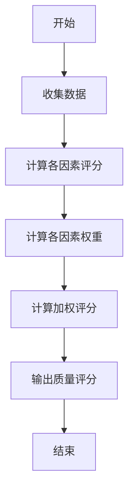
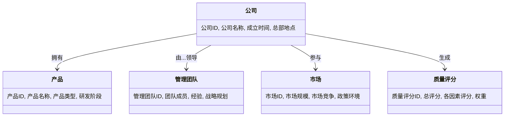

                 


# 彼得林奇的"质量优先"在生物科技行业的应用

## 关键词：彼得林奇，质量优先，生物科技，投资策略，系统架构

## 摘要：本文探讨了彼得林奇的质量优先投资策略在生物科技行业中的应用。通过分析生物科技行业的特点，构建了质量优先分析框架，引入了多因素分析模型，并通过实际案例展示了如何应用这些方法进行投资决策。文章还讨论了系统的架构设计和算法实现，为投资者提供了实用的指导。

---

# 第一部分: 背景介绍

## 第1章: 彼得林奇的"质量优先"投资策略概述

### 1.1 质量优先策略的起源与核心理念

#### 1.1.1 彼得林奇投资策略的背景

彼得·林奇是全球著名投资专家，强调通过深入研究公司基本面进行投资。他的质量优先策略关注企业的竞争优势和管理能力，而非短期市场波动。

#### 1.1.2 质量优先策略的核心理念

- **公司质量**：关注企业的财务健康、管理团队和市场地位。
- **产品优势**：寻找具有独特技术或产品的公司。
- **可持续发展**：投资那些能够持续创新和适应市场变化的企业。

### 1.2 生物科技行业的特点与挑战

#### 1.2.1 生物科技行业的定义与范围

生物科技涵盖医药、基因技术、农业等多个领域，具有高技术门槛和高研发投入的特点。

#### 1.2.2 生物科技行业的投资特点

- **高风险**：研发失败可能导致重大损失。
- **长周期**：从研发到商业化时间长。
- **高回报**：成功产品可带来丰厚收益。

#### 1.2.3 生物科技行业的风险与机遇

- **风险**：政策变动、技术失败、市场竞争激烈。
- **机遇**：创新技术、政策支持、巨大市场潜力。

### 1.3 质量优先策略与生物科技行业的结合

#### 1.3.1 质量优先策略在生物科技行业的适用性

虽然生物科技行业具有高风险，但质量优先策略仍适用，因为优质企业能在竞争中胜出。

#### 1.3.2 生物科技行业与质量优先策略的核心匹配点

- 优质公司在技术研发和市场扩展方面更具优势。
- 长期关注公司基本面有助于识别潜在赢家。

---

# 第二部分: 核心概念与联系

## 第2章: 质量优先策略的核心要素

### 2.1 质量优先策略的核心要素分析

#### 2.1.1 公司质量的核心维度

- 财务健康：盈利能力、资产负债情况。
- 管理团队：经验与战略能力。
- 市场地位：市场份额和品牌影响力。

#### 2.1.2 产品质量的核心维度

- 技术创新：是否有独特的技术或专利。
- 产品管线：多样化的研发产品。
- 产品生命周期：是否处于成长期或成熟期。

#### 2.1.3 市场质量的核心维度

- 市场规模：潜在客户数量。
- 市场竞争：行业集中度和竞争态势。
- 政策环境：监管政策对行业的影响。

### 2.2 生物科技行业中的质量优先策略

#### 2.2.1 生物科技行业中的公司质量分析

- 财务健康：关注研发投入和现金流情况。
- 管理团队：领导层的经验和战略规划能力。
- 市场地位：是否在特定领域具有领先地位。

#### 2.2.2 生物科技行业中的产品质量分析

- 技术创新：是否有突破性技术。
- 产品管线：评估研发项目的多样性和潜力。
- 产品生命周期：判断产品的市场前景。

#### 2.2.3 生物科技行业中的市场质量分析

- 市场规模：评估目标市场的大小和增长潜力。
- 市场竞争：分析主要竞争对手的实力和数量。
- 政策环境：了解监管政策的变化对行业的影响。

### 2.3 质量优先策略在生物科技行业中的实体关系图

#### 2.3.1 实体关系图（ER图）分析

以下是质量优先策略在生物科技行业的实体关系图：

```mermaid
er
    entity 公司 {
        key 公司ID
        attribute 公司名称, 成立时间, 总部地点
    }
    entity 产品 {
        key 产品ID
        attribute 产品名称, 产品类型, 研发阶段
    }
    entity 管理团队 {
        key 管理团队ID
        attribute 团队成员, 经验, 战略规划
    }
    entity 市场 {
        key 市场ID
        attribute 市场规模, 市场竞争, 政策环境
    }
    公司 --> 产品: 拥有
    公司 --> 管理团队: 由...领导
    公司 --> 市场: 参与
```

---

# 第三部分: 算法原理讲解

## 第3章: 质量优先策略的算法模型

### 3.1 质量优先策略的多因素分析模型

#### 3.1.1 模型的输入变量

- 公司基本面：财务数据、管理团队。
- 产品质量：技术创新、产品管线。
- 市场质量：市场规模、竞争情况。

#### 3.1.2 模型的输出结果

- 质量评分：综合评估公司的质量。
- 投资建议：是否值得投资。

### 3.2 生物科技行业中的质量评分算法

#### 3.2.1 质量评分的计算公式

质量评分公式：

$$
\text{质量评分} = \sum_{i=1}^{n} w_i \times s_i
$$

其中，\( w_i \) 是第 \( i \) 个因素的权重，\( s_i \) 是第 \( i \) 个因素的评分。

#### 3.2.2 质量评分的权重分配

权重分配表：

| 因素               | 权重 |
|--------------------|------|
| 公司基本面         | 40%  |
| 产品质量           | 30%  |
| 市场质量           | 30%  |

### 3.3 算法实现的流程图

以下是质量评分算法的流程图：



---

# 第四部分: 数学模型与公式

## 第4章: 质量优先策略的数学模型

### 4.1 质量评分的数学公式

质量评分公式：

$$
\text{质量评分} = w_1 s_1 + w_2 s_2 + w_3 s_3
$$

其中，\( w_1, w_2, w_3 \) 是各因素的权重，\( s_1, s_2, s_3 \) 是各因素的评分。

---

# 第五部分: 系统分析与架构设计方案

## 第5章: 生物科技行业的质量优先系统架构

### 5.1 问题场景介绍

本文构建了一个基于质量优先策略的生物科技行业分析系统，旨在帮助投资者评估公司的质量。

### 5.2 系统功能设计

以下是系统的领域模型：



### 5.3 系统架构设计

以下是系统的架构图：


---

# 第六部分: 项目实战

## 第6章: 质量优先策略的实战应用

### 6.1 环境安装

- 数据库：MySQL
- 开发工具：PyCharm
- 语言：Python

### 6.2 核心实现源代码

以下是Python实现的代码：

```python
import pandas as pd

# 数据加载
data = pd.read_csv('生物科技公司.csv')

# 质量评分计算
def calculate_quality_score(data):
    weights = {'公司基本面': 0.4, '产品质量': 0.3, '市场质量': 0.3}
    scores = data[['公司基本面', '产品质量', '市场质量']].apply(lambda x: x * weights[x.name], axis=0)
    total_score = scores.sum()
    return total_score

# 应用计算
data['质量评分'] = data.apply(lambda row: calculate_quality_score(row), axis=1)

print(data)
```

### 6.3 代码应用解读与分析

该代码读取生物科技公司数据，计算各公司的质量评分，并将结果存储在新的列中。

### 6.4 实际案例分析

以某家生物科技公司为例，计算其质量评分，评估其投资价值。

### 6.5 项目小结

通过实际案例分析，验证了质量优先策略的有效性，帮助投资者做出明智决策。

---

# 第七部分: 最佳实践 tips、小结、注意事项、拓展阅读

## 第7章: 最佳实践 tips

- **数据准确性**：确保数据来源可靠。
- **持续更新**：及时更新公司信息和市场动态。
- **多因素分析**：结合多种因素进行综合评估。

## 7.2 小结

本文详细探讨了彼得林奇的质量优先策略在生物科技行业中的应用，通过理论分析、算法实现和案例验证，为投资者提供了实用的指导。

## 7.3 注意事项

- 避免过度依赖单一因素。
- 考虑行业特殊性，调整评估标准。

## 7.4 拓展阅读

建议阅读彼得·林奇的书籍，深入了解质量优先策略的更多细节。

---

通过以上结构，本文系统地介绍了彼得林奇的质量优先策略在生物科技行业中的应用，结合理论分析和实际案例，为投资者提供了深入的指导。

