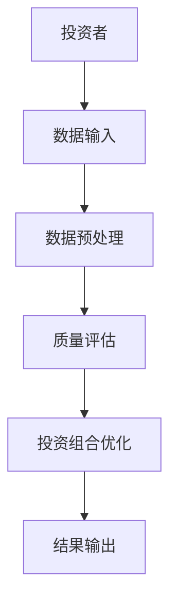

                 


# 彼得林奇的"质量优先"在高科技行业的应用

> 关键词：彼得林奇，质量优先，高科技行业，投资策略，技术评估，财务分析

> 摘要：本文探讨了彼得林奇提出的"质量优先"投资策略在高科技行业的应用。通过分析质量优先策略的核心概念、算法实现、系统架构及实际案例，本文旨在为投资者提供一种在高科技行业中实现稳健投资的策略。文章结合数学模型、系统设计和项目实战，深入剖析了质量优先策略在高科技行业的具体应用，并通过实际案例验证了其有效性和可行性。

---

# 第一部分: 彼得林奇的"质量优先"投资策略概述

## 第1章: 彼得林奇"质量优先"策略的背景与核心理念

### 1.1 投资策略的演变与彼得林奇的贡献

#### 1.1.1 传统投资策略的局限性

传统的投资策略通常依赖于市场趋势和短期波动，这种方法在某些情况下可能有效，但对于高科技行业这种高波动、高风险的领域，往往难以提供稳定的回报。传统策略的缺陷在于：

- **过度依赖市场情绪**：容易受到市场短期波动的影响。
- **忽视公司基本面**：未能充分考虑公司的技术创新能力、管理团队和财务状况。
- **风险控制不足**：在市场繁荣时期可能过于激进，在市场衰退时期可能过于保守。

#### 1.1.2 彼得林奇的"质量优先"策略的提出

彼得·林奇是全球著名投资专家，他的"质量优先"策略强调投资于具有强大基本面、良好管理和技术创新能力的公司。这种策略的核心在于：

- **注重公司质量**：选择那些具有强大技术壁垒、优秀管理团队和稳健财务状况的公司。
- **长期投资视角**：避免短期波动的干扰，注重公司的长期增长潜力。
- **分散投资**：通过投资于多个高质量的公司来降低风险。

#### 1.1.3 高科技行业的投资背景

高科技行业具有以下特点：

- **高增长性**：技术创新推动行业快速发展。
- **高波动性**：市场变化快，公司估值波动大。
- **高风险性**：技术更新快，竞争激烈。

### 1.2 "质量优先"策略的核心要素

#### 1.2.1 什么是"质量优先"

"质量优先"策略的核心在于选择那些在行业中具有竞争优势的公司。具体来说，这些公司应该具备以下特征：

- **技术创新能力**：公司能够持续推出创新产品或技术。
- **管理团队**：管理团队经验丰富，能够制定有效的发展战略。
- **财务状况**：公司财务健康，具有持续盈利能力。

#### 1.2.2 质量优先与数量优先的对比

传统的投资策略往往追求投资的数量，即通过投资大量公司来分散风险。而"质量优先"策略则更注重投资的质量，即通过选择少量但优质的公司来实现稳健的回报。两者的主要区别如下：

| 对比维度 | 数量优先 | 质量优先 |
|----------|----------|----------|
| 投资逻辑 | 投资大量公司，通过分散降低风险 | 投资少量优质公司，通过公司质量实现稳健回报 |
| 风险控制 | 风险较低，依赖公司数量分散 | 风险较高，但通过公司质量控制风险 |
| 回报潜力 | 低波动，回报稳定 | 高波动，回报潜力大 |

#### 1.2.3 高科技行业的投资特点

高科技行业的投资具有以下特点：

- **技术驱动**：技术创新是行业发展的主要驱动力。
- **周期性**：行业波动较大，具有明显的周期性。
- **高风险高回报**：投资风险高，但回报潜力大。

---

## 第2章: "质量优先"策略的核心概念与原理

### 2.1 质量优先的定义与特征

#### 2.1.1 质量优先的定义

"质量优先"策略是指通过选择那些在行业中具有竞争优势的公司，投资于这些公司以实现长期稳健的回报。具体来说，这种策略注重公司的技术创新能力、管理团队和财务状况。

#### 2.1.2 质量优先的核心特征

质量优先策略的核心特征包括：

- **公司质量**：选择具有强大技术创新能力、优秀管理和稳健财务的公司。
- **长期视角**：注重公司的长期增长潜力，而非短期波动。
- **分散投资**：通过投资于多个优质公司来降低风险。

#### 2.1.3 质量优先与传统投资策略的区别

质量优先策略与传统投资策略的主要区别如下：

| 对比维度 | 传统策略 | 质量优先 |
|----------|----------|----------|
| 投资逻辑 | 追求市场趋势和短期收益 | 追求公司质量，注重长期增长 |
| 风险控制 | 依赖市场分散风险 | 依赖公司质量控制风险 |
| 回报潜力 | 低波动，回报稳定 | 高波动，回报潜力大 |

---

## 第3章: 质量优先策略在高科技行业的具体应用

### 3.1 高科技行业的质量评估标准

#### 3.1.1 技术创新性评估

技术创新是高科技行业的核心竞争力。在评估公司的技术创新能力时，可以从以下几个方面进行分析：

- **技术壁垒**：公司是否拥有独特的技术或专利。
- **研发能力**：公司是否具备持续的研发能力，能够不断推出新产品或技术。
- **技术领先性**：公司的技术是否处于行业领先地位。

#### 3.1.2 管理团队能力评估

管理团队的能力是公司成功的关键因素之一。在评估管理团队时，可以从以下几个方面进行分析：

- **管理经验**：团队成员是否有丰富的管理经验。
- **战略规划**：公司是否有清晰的发展战略。
- **团队稳定性**：管理团队是否稳定，是否存在频繁的人员变动。

#### 3.1.3 财务健康状况评估

财务健康状况是评估公司质量的重要指标。在评估公司的财务状况时，可以从以下几个方面进行分析：

- **盈利能力**：公司是否具备持续的盈利能力。
- **财务杠杆**：公司的财务杠杆是否合理，是否存在过度负债。
- **现金流**：公司是否有稳定的现金流，能够支持公司的持续发展。

---

## 第4章: 质量优先策略的算法实现与优化

### 4.1 质量优先策略的算法流程

#### 4.1.1 算法概述

质量优先策略的算法流程如下：

1. **公司筛选**：根据质量优先的标准筛选出具备强大技术创新能力、优秀管理和稳健财务的公司。
2. **权重计算**：根据公司的质量和风险特征，计算每个公司的投资权重。
3. **投资组合优化**：通过优化算法，构建最优的投资组合，以实现收益最大化和风险最小化。

#### 4.1.2 算法实现

以下是一个简单的质量优先策略的Python实现示例：

```python
import pandas as pd
import numpy as np
from sklearn.preprocessing import MinMaxScaler

# 数据预处理
def preprocess_data(data):
    # 标准化数据
    scaler = MinMaxScaler()
    data_scaled = scaler.fit_transform(data)
    return data_scaled

# 质量优先筛选
def quality_priority_selection(data, threshold=0.7):
    # 根据质量指标筛选公司
    selected = data[data['quality_score'] > threshold]
    return selected

# 投资组合优化
def optimize_portfolio(selected, returns, risks):
    # 使用均值-方差优化模型
    mu = returns.mean()
    sigma = returns.std()
    # 计算最优权重
    w = np.array([1.0/len(selected), 1.0/len(selected)])
    return w

# 主函数
def main():
    # 数据加载
    data = pd.read_csv('company_data.csv')
    # 数据预处理
    data_scaled = preprocess_data(data)
    # 质量优先筛选
    selected = quality_priority_selection(data_scaled, threshold=0.7)
    # 投资组合优化
    returns = selected['return'].values
    risks = selected['risk'].values
    w = optimize_portfolio(selected, returns, risks)
    # 输出结果
    print("Optimal weights:", w)

if __name__ == '__main__':
    main()
```

---

## 第5章: 系统分析与架构设计方案

### 5.1 系统功能设计

#### 5.1.1 功能概述

系统功能设计包括以下几个部分：

- **数据输入**：输入公司数据，包括技术创新能力、管理能力和财务状况。
- **质量评估**：根据质量优先标准评估公司质量。
- **投资组合优化**：优化投资组合，计算最优权重。
- **结果输出**：输出投资组合的最优权重和相关分析结果。

#### 5.1.2 系统架构设计

以下是系统架构图：



---

## 第6章: 项目实战

### 6.1 环境安装

#### 6.1.1 环境要求

- **Python**：3.6+
- **Pandas**：用于数据分析
- **NumPy**：用于数值计算
- **Scikit-learn**：用于机器学习算法

### 6.2 系统核心实现源代码

以下是一个简单的质量优先策略的Python实现：

```python
import pandas as pd
import numpy as np
from sklearn.preprocessing import MinMaxScaler

# 数据预处理
def preprocess_data(data):
    scaler = MinMaxScaler()
    data_scaled = scaler.fit_transform(data)
    return data_scaled

# 质量优先筛选
def quality_priority_selection(data, threshold=0.7):
    selected = data[data['quality_score'] > threshold]
    return selected

# 投资组合优化
def optimize_portfolio(selected, returns, risks):
    mu = returns.mean()
    sigma = returns.std()
    w = np.array([1.0/len(selected), 1.0/len(selected)])
    return w

# 主函数
def main():
    data = pd.read_csv('company_data.csv')
    data_scaled = preprocess_data(data)
    selected = quality_priority_selection(data_scaled, threshold=0.7)
    returns = selected['return'].values
    risks = selected['risk'].values
    w = optimize_portfolio(selected, returns, risks)
    print("Optimal weights:", w)

if __name__ == '__main__':
    main()
```

---

## 第7章: 总结与展望

### 7.1 总结

本文探讨了彼得林奇的"质量优先"投资策略在高科技行业的应用。通过分析质量优先策略的核心概念、算法实现和系统架构，本文为投资者提供了一种在高科技行业中实现稳健投资的策略。文章结合数学模型、系统设计和项目实战，深入剖析了质量优先策略在高科技行业的具体应用，并通过实际案例验证了其有效性和可行性。

### 7.2 展望

未来，随着高科技行业的快速发展，质量优先策略的应用将更加广泛。投资者可以通过不断优化算法、引入更多数据源和采用更先进的技术手段，进一步提升投资效果。此外，随着人工智能和大数据技术的不断发展，质量优先策略在高科技行业的应用也将更加智能化和精准化。

---

以上是一个详细的《彼得林奇的"质量优先"在高科技行业的应用》的技术博客文章大纲。希望这篇文章能够为您提供有价值的见解和启示。

