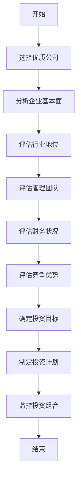
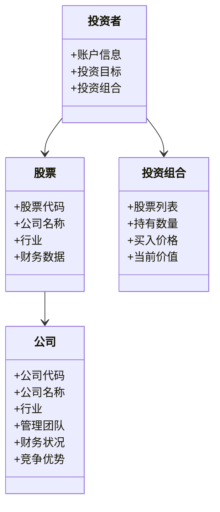
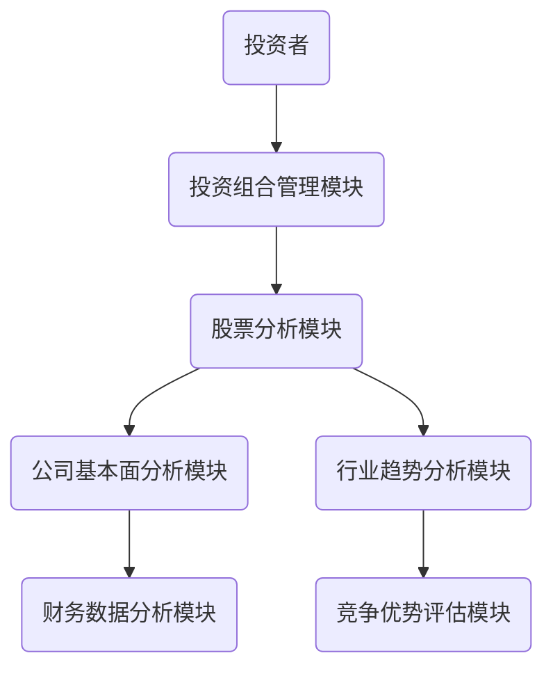

                 


---

# 彼得林奇的"质量优先"投资策略分析

> 关键词：彼得林奇，质量优先，投资策略，长期投资，基本面分析，优质公司

> 摘要：本文深入分析了彼得林奇提出的"质量优先"投资策略，探讨了其核心概念、原理、系统架构及实际应用。通过对比分析、流程图、类图等多种形式，详细解读了质量优先策略的背景、原理、实施步骤及实际案例，为投资者提供了实用的参考。

---

# 第一部分: 质量优先投资策略背景介绍

## 第1章: 质量优先投资策略概述

### 1.1 质量优先投资策略的背景

#### 1.1.1 投资市场的基本概念

现代金融市场是一个高度复杂和动态变化的环境，投资者需要在众多选择中找到最优的投资策略。传统投资策略主要包括价值投资、成长投资、技术分析等。然而，这些策略在实际操作中往往面临市场波动、信息不对称等问题。

#### 1.1.2 质量优先策略的提出背景

彼得林奇（Peter Lynch）是美国著名投资经理人，曾管理富达麦哲伦基金（Fidelity Magellan Fund），创造了年均29%的复合增长率。他的成功源于对优质公司的深入研究和长期投资的理念。质量优先策略的核心在于选择具有强大基本面、良好管理团队和持续盈利能力的公司，而非短期价格波动。

#### 1.1.3 质量优先策略的核心目标

质量优先策略的目标是通过长期持有优质公司股票，实现资本的稳定增长。其核心在于通过对企业基本面的深入分析，识别出具有竞争优势和成长潜力的公司，从而在长期投资中获得超额收益。

### 1.2 彼得林奇的投资理念

#### 1.2.1 彼得林奇的个人简介

彼得林奇于1942年出生于美国波士顿，1961年进入波士顿大学，主修历史和英语文学，后转向法律专业。然而，他对投资的兴趣使他转行进入金融行业，最终成为富达基金的明星经理人。

#### 1.2.2 彼得林奇的投资哲学

彼得林奇强调投资的长期性，主张选择那些具有强大竞争优势、良好的管理团队和稳定盈利能力的公司。他认为，市场波动是投资的机会，而非风险。通过深入研究企业的基本面，投资者可以在市场恐慌时买入优质资产，从而在长期获得收益。

#### 1.2.3 彼得林奇的成功投资案例

彼得林奇在管理富达麦哲伦基金期间，成功投资了包括可口可乐、英特尔等在内的多家优质公司。这些投资不仅为基金带来了丰厚的回报，也为质量优先策略提供了有力的证明。

---

## 第2章: 质量优先策略的核心要素

### 2.1 质量优先策略的定义

#### 2.1.1 质量优先的内涵

质量优先策略强调通过深入分析企业的财务状况、管理团队、行业地位和竞争优势，选择具有长期增长潜力的优质公司进行投资。其核心在于“质”而非“价”，即注重企业的内在价值，而非短期价格波动。

#### 2.1.2 质量优先的外延

质量优先策略不仅包括对企业基本面的分析，还涉及对行业趋势、宏观经济环境和公司治理结构的综合考量。其外延扩展至对企业的竞争优势、成长潜力和财务健康状况的全面评估。

### 2.2 核心概念与联系

#### 2.2.1 质量优先策略的原理

质量优先策略的核心在于通过对企业基本面的深入分析，识别出具有强大竞争优势和长期增长潜力的公司。其原理可以归纳为以下几个步骤：

1. **企业基本面分析**：包括财务状况、盈利能力、管理团队等。
2. **行业地位评估**：分析公司在行业中的竞争地位。
3. **长期成长潜力**：评估公司未来的发展前景。
4. **风险管理**：识别潜在风险，并制定应对策略。

#### 2.2.2 质量优先策略的属性特征对比表

以下是质量优先策略与其他投资策略的对比：

| 特性                | 质量优先策略            | 价值投资策略         | 成长投资策略         |
|---------------------|-------------------------|----------------------|----------------------|
| 核心目标            | 长期持有优质公司        | 买入被低估的资产      | 投资高成长公司        |
| 分析重点            | 公司基本面、管理团队     | 资产价值、市场估值    | 盈利能力、成长潜力    |
| 投资期限            | 长期                    | 长期                  | 中长期               |
| 风险承受能力        | 较低                    | 较高                  | 较高                 |

#### 2.2.3 质量优先策略的ER实体关系图

以下是质量优先策略涉及的实体及其关系的ER图：

```mermaid
erDiagram
    顾客(投资者) o-< 银行账户
    投资者 o-< 投资组合
    投资组合 o-< 股票
    股票 o-< 公司
    公司 o-< 财务报表
    公司 o-< 管理团队
    公司 o-< 行业地位
```

---

# 第二部分: 质量优先策略的核心概念与联系

## 第3章: 质量优先策略的原理

### 3.1 质量优先策略的核心原理

#### 3.1.1 质量优先策略的基本原理

质量优先策略的基本原理是通过深入分析企业的基本面，识别出具有长期增长潜力的优质公司。其核心在于对企业管理团队、财务状况、行业地位和竞争优势的综合评估。

#### 3.1.2 质量优先策略的数学模型

虽然质量优先策略并非完全基于数学模型，但可以通过以下指标进行量化评估：

$$
\text{投资价值} = \frac{\text{公司内在价值}}{\text{市场价格}}
$$

其中，公司内在价值可以通过现金流折现法（DCF）进行估算：

$$
\text{内在价值} = \sum_{t=1}^{n} \frac{\text{现金流}_t}{(1 + r)^t}
$$

#### 3.1.3 质量优先策略的流程图

以下是质量优先策略的流程图：



### 3.2 质量优先策略的属性特征对比

以下是质量优先策略的属性特征对比：

| 特性                | 质量优先策略            | 价值投资策略         | 成长投资策略         |
|---------------------|-------------------------|----------------------|----------------------|
| 核心目标            | 长期持有优质公司        | 买入被低估的资产      | 投资高成长公司        |
| 分析重点            | 公司基本面、管理团队     | 资产价值、市场估值    | 盈利能力、成长潜力    |
| 投资期限            | 长期                    | 长期                  | 中长期               |
| 风险承受能力        | 较低                    | 较高                  | 较高                 |

---

## 第4章: 质量优先策略的系统分析与架构设计方案

### 4.1 系统分析

#### 4.1.1 问题场景介绍

在实际投资中，投资者需要面对大量的信息和复杂的决策。质量优先策略需要一个高效的系统来支持投资者进行基本面分析、行业趋势分析和投资组合管理。

#### 4.1.2 项目介绍

本项目旨在构建一个基于质量优先策略的投资分析系统，帮助投资者进行基本面分析、行业趋势分析和投资组合管理。

#### 4.1.3 系统功能设计

以下是系统功能设计的领域模型：



#### 4.1.4 系统架构设计

以下是系统架构设计的架构图：



---

## 第5章: 质量优先策略的项目实战

### 5.1 环境安装

为了实现质量优先策略的投资分析系统，需要以下环境：

1. **开发工具**：Python、Jupyter Notebook、Visual Studio Code
2. **数据源**：Yahoo Finance API、Financial Modeling Prep API
3. **库的安装**：Pandas、NumPy、Matplotlib、Plotly

### 5.2 系统核心实现源代码

以下是实现质量优先策略的投资分析系统的核心代码：

```python
import pandas as pd
import numpy as np

# 数据获取
def get_stock_data(ticker):
    # 获取股票数据
    pass

# 基本面分析
def analyze_financials(ticker):
    # 分析公司财务状况
    pass

# 行业趋势分析
def analyze_industry_trend(industry):
    # 分析行业趋势
    pass

# 竞争优势评估
def assess_competitive_advantage(ticker):
    # 评估竞争优势
    pass

# 投资组合管理
def manage_portfolio(portfolio, new_ticker):
    # 管理投资组合
    pass
```

### 5.3 代码应用解读与分析

以下是代码的详细解读：

1. **数据获取**：通过Yahoo Finance API获取股票数据。
2. **基本面分析**：分析公司的财务状况，包括盈利能力、资产负债表等。
3. **行业趋势分析**：分析行业趋势，评估行业的发展前景。
4. **竞争优势评估**：评估公司的竞争优势，包括市场份额、品牌影响力等。
5. **投资组合管理**：根据分析结果，调整投资组合，优化资产配置。

### 5.4 实际案例分析

以下是质量优先策略的实际案例分析：

1. **选择优质公司**：以苹果公司为例，分析其基本面、行业地位和竞争优势。
2. **投资组合构建**：根据分析结果，构建投资组合。
3. **监控与调整**：定期监控投资组合的表现，根据市场变化进行调整。

---

## 第6章: 总结与展望

### 6.1 最佳实践 tips

1. **深入研究企业基本面**：质量优先策略的核心在于对企业基本面的深入分析。
2. **长期投资**：避免短期市场波动的干扰，坚持长期投资。
3. **分散投资**：通过分散投资降低风险。

### 6.2 小结

质量优先策略是一种以企业基本面分析为核心的长期投资策略。通过深入分析公司的财务状况、行业地位和竞争优势，选择具有长期增长潜力的优质公司进行投资，从而实现资本的稳定增长。

### 6.3 注意事项

1. **市场风险**：市场波动可能对投资组合造成短期影响。
2. **信息滞后**：基本面分析基于历史数据，可能存在滞后性。
3. **管理风险**：公司管理团队的变化可能影响公司的长期发展。

### 6.4 拓展阅读

1. 《彼得林奇的成功投资》
2. 《股票作手回忆录》
3. 《投资学基础》

---

通过以上分析，我们深入探讨了彼得林奇的"质量优先"投资策略，从背景介绍到系统分析，再到项目实战，为投资者提供了全面的指导和参考。

