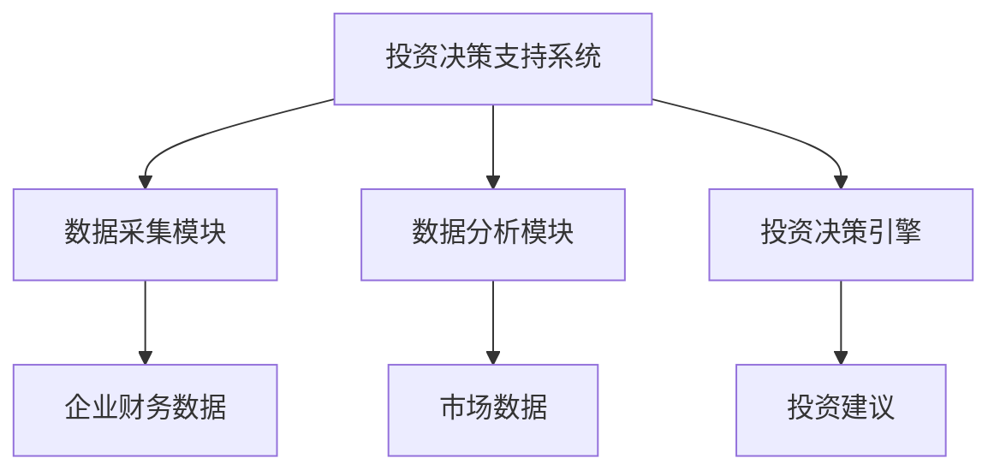

                 


# 彼得林奇的"质量成长"vs"价值重估"

> **关键词**：彼得·林奇，投资策略，质量成长，价值重估，投资分析  
> **摘要**：本文通过对彼得·林奇提出的“质量成长”与“价值重估”两种投资策略的深入分析，探讨其核心概念、算法原理、系统架构以及实际应用中的优缺点，帮助投资者更好地理解这两种策略的区别与应用场景。

---

## # 第1章：投资的基本概念与彼得·林奇的背景介绍

### 1.1 投资的基本概念

#### 1.1.1 什么是投资

投资是将资金投入到某一领域或资产中，以期获得未来收益的行为。投资的核心目标是通过资产增值或收入增加来实现财富的增长。投资的对象可以是股票、债券、房地产、基金等多种形式。

#### 1.1.2 投资的基本原则

投资的基本原则包括分散投资、长期持有、价值评估和风险管理。投资者需要通过基本面分析和市场趋势分析来做出决策，同时关注宏观经济环境和行业周期。

#### 1.1.3 彼得·林奇的背景与成就

彼得·林奇是美国著名的职业基金经理人，曾担任富达投资的基金经理，管理着超过1000亿美元的资产。他以卓越的投资业绩和独特的投资策略闻名，尤其擅长成长股投资。他的投资理念影响了无数投资者。

### 1.2 彼得·林奇的投资策略概述

#### 1.2.1 质量成长投资的定义

质量成长投资是一种注重企业内在质量和成长潜力的投资策略。彼得·林奇认为，质量成长企业具有稳定的财务表现、良好的管理团队和持续的创新能力。投资者应选择那些能够在市场中长期增长的企业进行投资。

#### 1.2.2 价值重估投资的定义

价值重估投资是一种通过寻找市场价格低于内在价值的股票进行投资的策略。这种策略的核心是寻找被市场低估的企业，等待其价值回归时获得收益。彼得·林奇指出，价值重估策略适用于市场周期性低谷时的投资。

#### 1.2.3 两种策略的核心区别

质量成长策略关注企业的长期成长潜力，而价值重估策略关注企业的短期价值低估。两者在投资目标、评估指标和持有周期上存在显著差异。

---

## # 第2章：质量成长与价值重估的核心概念对比

### 2.1 质量成长投资的核心要素

#### 2.1.1 公司质量的评估标准

质量成长企业需要具备以下特征：稳定的盈利增长、健康的财务状况、强大的竞争优势和积极的管理团队。彼得·林奇强调，投资者应关注企业的ROE（净资产收益率）和毛利率等指标。

#### 2.1.2 成长型企业的识别特征

成长型企业通常处于高增长行业，具有较高的市场份额增长潜力。彼得·林奇认为，投资者应关注企业的收入增长率和净利润增长率，同时考察行业前景。

#### 2.1.3 质量成长投资的风险与收益分析

质量成长投资的风险主要来自于市场波动和企业成长不及预期。然而，其潜在收益较高，尤其在企业持续成长的情况下。

### 2.2 价值重估投资的核心要素

#### 2.2.1 价值重估的定义与特点

价值重估策略的核心是寻找市场价格低于内在价值的企业。彼得·林奇指出，这种策略适用于市场低迷或企业暂时遭遇困境的情况。

#### 2.2.2 识别价值低估企业的关键指标

投资者应关注市盈率（P/E）、市净率（P/B）等估值指标。当这些指标显著低于行业平均水平时，企业可能具有投资价值。

#### 2.2.3 价值重估投资的风险与收益分析

价值重估投资的风险主要来自于企业价值回归的时间不确定性和市场波动。然而，其潜在收益较高，尤其在市场反弹时。

### 2.3 质量成长与价值重估的对比分析

#### 2.3.1 投资目标的差异

质量成长投资关注企业的成长潜力，而价值重估投资关注企业的估值水平。

#### 2.3.2 投资策略的差异

质量成长策略需要长期持有，而价值重估策略可能需要短期持有以捕捉价值回归的机会。

#### 2.3.3 风险与收益的对比

质量成长投资的风险较高，但潜在收益也较高；价值重估投资的风险较低，但收益相对稳定。

---

## # 第3章：彼得·林奇投资模型的算法原理

### 3.1 质量成长投资的数学模型

#### 3.1.1 质量成长股的筛选标准

彼得·林奇的质量成长模型可以通过以下公式进行评估：

$$ \text{质量成长得分} = \text{ROE} \times 20\% + \text{毛利率} \times 30\% + \text{收入增长率} \times 30\% + \text{净利润增长率} \times 20\% $$

#### 3.1.2 示例计算与分析

假设某企业的ROE为15%，毛利率为35%，收入增长率为25%，净利润增长率为20%，则其质量成长得分为：

$$ 15\% \times 0.2 + 35\% \times 0.3 + 25\% \times 0.3 + 20\% \times 0.2 = 3\% + 10.5\% + 7.5\% + 4\% = 25\% $$

### 3.2 价值重估投资的数学模型

#### 3.2.1 价值重估模型的公式推导

价值重估模型可以通过以下公式计算：

$$ \text{潜在价值} = \text{行业平均市盈率} \times \text{企业净利润} $$

#### 3.2.2 示例计算与分析

假设某行业的平均市盈率为15倍，某企业的净利润为1000万美元，则其潜在价值为：

$$ 15 \times 1000 = 1.5亿美元 $$

---

## # 第4章：系统分析与架构设计方案

### 4.1 投资决策支持系统的功能模块

#### 4.1.1 数据采集模块

数据采集模块负责获取企业的财务数据、市场数据等。

#### 4.1.2 数据分析模块

数据分析模块对数据进行清洗、处理和分析，计算各项指标。

#### 4.1.3 投资决策引擎

投资决策引擎根据分析结果生成投资建议。

### 4.2 系统架构设计

#### 4.2.1 系统架构图



---

## # 第5章：项目实战

### 5.1 环境安装与配置

#### 5.1.1 安装Python

安装Python 3.8及以上版本。

#### 5.1.2 安装依赖库

安装pandas、numpy、scikit-learn等库。

### 5.2 核心代码实现

#### 5.2.1 质量成长模型的实现

```python
import pandas as pd

def quality_growth_score(roe, gross_profit_margin, revenue_growth, net_profit_growth):
    return roe * 0.2 + gross_profit_margin * 0.3 + revenue_growth * 0.3 + net_profit_growth * 0.2

data = pd.read_csv('stock_data.csv')
data['质量成长得分'] = data.apply(lambda x: quality_growth_score(x['ROE'], x['毛利率'], x['收入增长率'], x['净利润增长率']), axis=1)
```

#### 5.2.2 价值重估模型的实现

```python
import pandas as pd

def potential_value(ticker, industry_avg_pe, net_profit):
    return industry_avg_pe * net_profit

industry_avg_pe = 15
net_profit = 10000000
potential_value = potential_value('AAPL', industry_avg_pe, net_profit)
```

### 5.3 案例分析

#### 5.3.1 质量成长策略案例

分析某成长型企业，计算其质量成长得分，判断是否符合投资标准。

#### 5.3.2 价值重估策略案例

分析某低估企业，计算其潜在价值，判断是否符合投资条件。

---

## # 第6章：最佳实践与小结

### 6.1 小结

质量成长与价值重估各有优缺点，投资者应根据市场环境和个人风险偏好选择合适的策略。

### 6.2 注意事项

投资需谨慎，建议投资者在实际操作前进行深入研究和风险评估。

### 6.3 拓展阅读

推荐阅读彼得·林奇的相关书籍，深入理解其投资理念。

---

## # 第7章：总结与展望

### 7.1 总结

本文通过对彼得·林奇的质量成长与价值重估策略的分析，探讨了其核心概念、算法原理和实际应用。

### 7.2 展望

未来，随着市场环境的变化，投资者需要灵活调整策略，结合多种因素做出决策。

---

通过以上内容，我们全面分析了彼得·林奇的两种投资策略，帮助投资者更好地理解其原理和应用场景。

