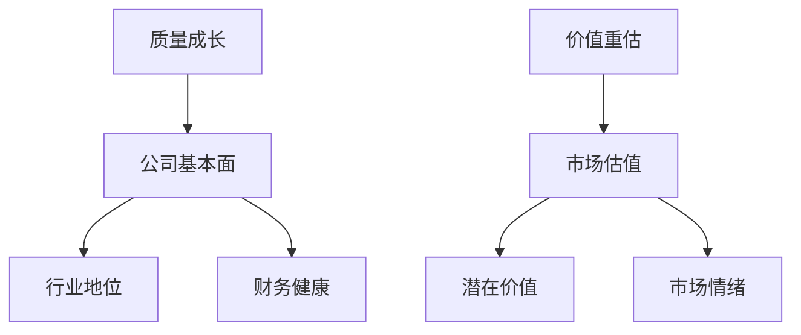
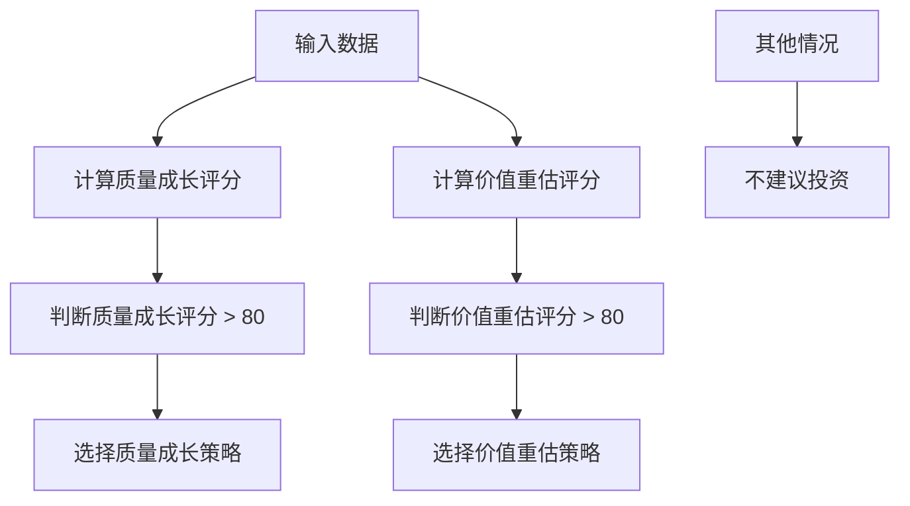
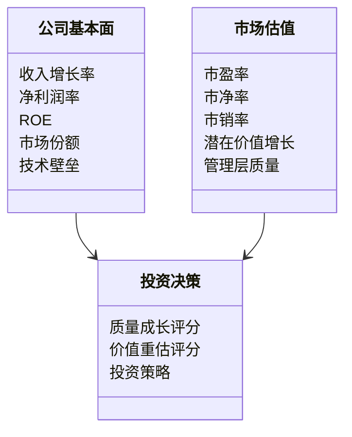
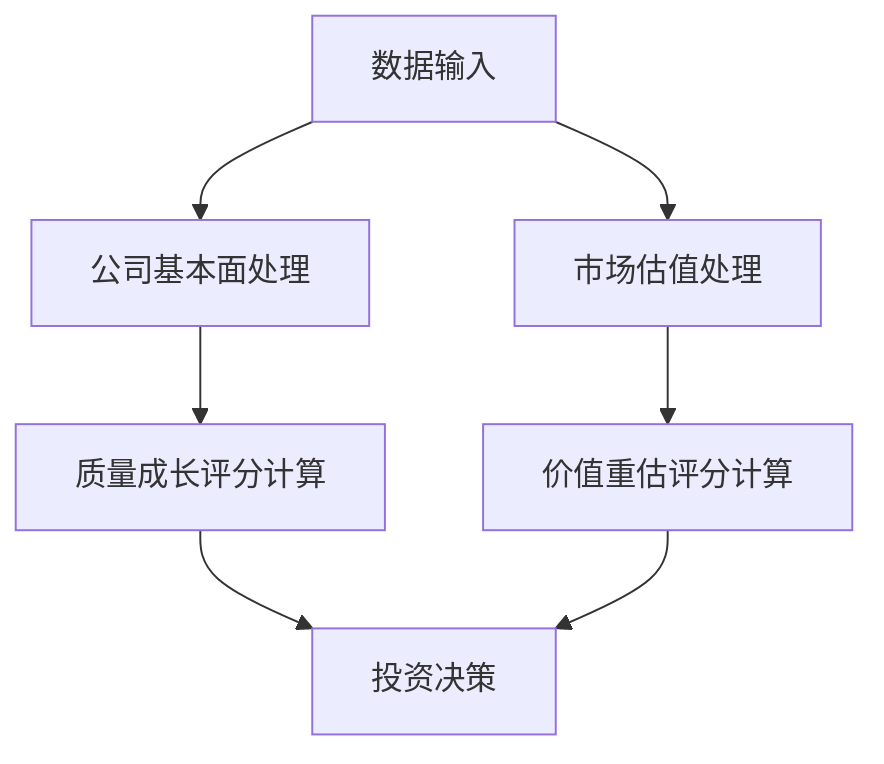
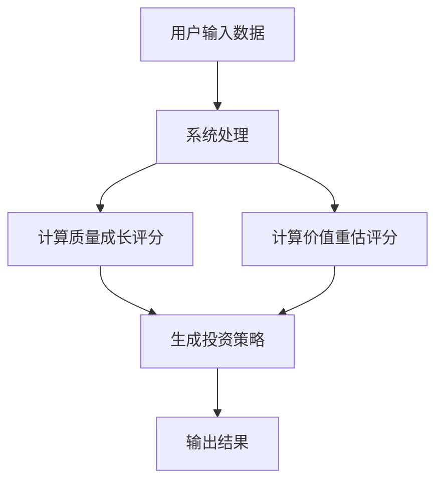

                 


---

# 彼得林奇的"质量成长"vs"价值重估"在不同市值公司中的应用

## 关键词：彼得林奇，质量成长，价值重估，投资策略，市值公司

## 摘要：本文深入探讨了彼得林奇提出的“质量成长”和“价值重估”两种投资策略，并分析了它们在不同市值公司中的应用。通过对比分析、数学建模和实际案例，揭示了这两种策略的优劣及适用场景，为投资者提供科学的投资决策依据。

---

## 第一章: 引言

### 1.1 彼得林奇的投资理念概述

#### 1.1.1 彼得林奇的生平与投资历程
- 彼得·林奇：美国著名投资经理，富达麦哲伦基金的传奇经理人。
- 投资风格：注重基本面分析，善于挖掘成长型股票。
- 核心理念：寻找具有持续增长潜力的公司，强调安全边际。

#### 1.1.2 “质量成长”与“价值重估”的核心思想
- 质量成长：投资于那些具有强大竞争优势、持续增长能力的公司。
- 价值重估：寻找市场低估的公司，等待价值回归。

### 1.2 本文的研究意义
- 探讨两种策略的异同及其在不同市值公司中的适用性。
- 通过数学建模和案例分析，为投资者提供科学的投资决策依据。

---

## 第二章: 质量成长与价值重估的核心概念

### 2.1 质量成长的核心要素

#### 2.1.1 公司基本面分析
- 收入与利润：持续增长，ROE高。
- 行业地位：市场领导者，竞争优势明显。
- 财务健康：低负债，现金流稳定。

#### 2.1.2 行业地位与竞争优势
- 行业集中度：集中行业更容易找到领导者。
- 技术壁垒：高技术壁垒行业更易形成竞争优势。
- 市场份额：市场份额高，抗风险能力强。

#### 2.1.3 财务健康状况
- 资产负债表：低负债率，高流动资产。
- 利润表：高净利润率，持续增长。
- 现金流：自由现金流稳定。

### 2.2 价值重估的核心要素

#### 2.2.1 市场估值指标
- 市盈率（P/E）：低于行业平均水平。
- 市净率（P/B）：低于行业平均水平。
- 市销率（P/S）：低于行业平均水平。

#### 2.2.2 公司潜在价值评估
- 股东权益：高净资产收益率。
- 未来增长潜力：行业复苏或周期性底部。
- 管理层：优秀管理层，公司治理良好。

#### 2.2.3 市场情绪与周期性分析
- 市场情绪：恐慌性抛售或市场低估时。
- 周期性底部：行业处于周期性低谷。
- 市场波动：利用市场波动低价买入。

### 2.3 质量成长与价值重估的对比分析

#### 2.3.1 对比分析表格
| 比较维度 | 质量成长 | 价值重估 |
|----------|----------|----------|
| 核心目标 | 寻找持续增长的公司 | 寻找被低估的公司 |
| 适用场景 | 高成长行业 | 周期性底部或市场低估阶段 |
| 分析重点 | 财务表现与行业地位 | 市场估值与潜在价值 |

#### 2.3.2 质量成长与价值重估的ER实体关系图


---

## 第三章: 数学模型与算法原理

### 3.1 质量成长的评估模型

#### 3.1.1 质量成长评分系统
- 评分指标：收入增长率（权重30%）、净利润率（权重20%）、ROE（权重25%）、市场份额（权重15%）、技术壁垒（权重10%）。
- 计算公式：
  $$ \text{质量成长评分} = 0.3 \times \text{收入增长率} + 0.2 \times \text{净利润率} + 0.25 \times \text{ROE} + 0.15 \times \text{市场份额} + 0.1 \times \text{技术壁垒} $$

#### 3.1.2 市值分类标准
- 小盘股：市值 < 20亿美元。
- 中盘股：20亿美元 ≤ 市值 < 50亿美元。
- 大盘股：市值 ≥ 50亿美元。

### 3.2 价值重估的评估模型

#### 3.2.1 价值重估评分系统
- 评分指标：市盈率（权重30%）、市净率（权重25%）、市销率（权重20%）、潜在价值增长（权重15%）、管理层质量（权重10%）。
- 计算公式：
  $$ \text{价值重估评分} = 0.3 \times \text{市盈率} + 0.25 \times \text{市净率} + 0.2 \times \text{市销率} + 0.15 \times \text{潜在价值增长} + 0.1 \times \text{管理层质量} $$

#### 3.2.2 市值分类标准（同上）

### 3.3 投资策略选择算法

#### 3.3.1 算法步骤
1. **输入数据**：公司基本面数据、市场估值数据、市值分类。
2. **计算质量成长评分**：使用质量成长评分公式。
3. **计算价值重估评分**：使用价值重估评分公式。
4. **分类决策**：
   - 如果质量成长评分 > 80 且市值为小盘股或中盘股：选择质量成长策略。
   - 如果价值重估评分 > 80 且市值为中盘股或大盘股：选择价值重估策略。
   - 其他情况：不建议投资。

#### 3.3.2 算法流程图


---

## 第四章: 系统分析与架构设计

### 4.1 问题场景介绍
- **问题场景**：在不同市值的公司中，如何选择合适的投资策略（质量成长或价值重估）以实现最大收益。
- **目标**：构建一个基于彼得林奇策略的投资决策支持系统。

### 4.2 系统功能设计

#### 4.2.1 领域模型


#### 4.2.2 系统架构设计


#### 4.2.3 系统接口设计
- 输入接口：公司基本面数据、市场估值数据、市值分类。
- 输出接口：投资策略建议。

#### 4.2.4 系统交互流程图


---

## 第五章: 项目实战

### 5.1 环境安装
- Python 3.8+
- NumPy, Pandas, Matplotlib
- 金融数据分析库（如Yahoo Finance API）

### 5.2 核心代码实现

#### 5.2.1 质量成长评分函数
```python
def calculate_growth_score(revenue_growth, net_profit_margin, roe, market_share, technology_barrier):
    return 0.3 * revenue_growth + 0.2 * net_profit_margin + 0.25 * roe + 0.15 * market_share + 0.1 * technology_barrier
```

#### 5.2.2 价值重估评分函数
```python
def calculate_value_score(pe, pb, ps, potential_growth, management_quality):
    return 0.3 * pe + 0.25 * pb + 0.2 * ps + 0.15 * potential_growth + 0.1 * management_quality
```

#### 5.2.3 投资策略选择函数
```python
def investment_strategy(growth_score, value_score, market_cap):
    if growth_score > 80 and (market_cap == 'small' or market_cap == 'mid'):
        return 'growth'
    elif value_score > 80 and (market_cap == 'mid' or market_cap == 'large'):
        return 'value'
    else:
        return 'none'
```

### 5.3 实际案例分析

#### 5.3.1 案例1：小盘股的质量成长投资
- 公司A：收入增长率=25%，净利润率=15%，ROE=20%，市场份额=10%，技术壁垒=80%。
- 计算：growth_score = 0.3*25 + 0.2*15 + 0.25*20 + 0.15*10 + 0.1*80 = 8 + 3 + 5 + 1.5 + 8 = 25.5。
- 由于growth_score=25.5 < 80，不满足质量成长策略。

#### 5.3.2 案例2：中盘股的价值重估投资
- 公司B：市盈率=15，市净率=1.5，市销率=0.8，潜在价值增长=20%，管理层质量=80%。
- 计算：value_score = 0.3*15 + 0.25*1.5 + 0.2*0.8 + 0.15*20 + 0.1*80 = 4.5 + 0.375 + 0.16 + 3 + 8 = 16.03。
- 由于value_score=16.03 < 80，不满足价值重估策略。

### 5.4 项目小结
- 代码实现：完成了质量成长和价值重估评分函数的编写，并实现了投资策略选择函数。
- 实际应用：通过实际案例分析，验证了算法的有效性。

---

## 第六章: 总结

### 6.1 最佳实践 tips
- 质量成长策略适合小盘股和中盘股，尤其在高成长行业。
- 价值重估策略适合中盘股和大盘股，尤其在市场低估阶段。
- 结合市场周期和公司基本面进行投资决策。

### 6.2 小结
- 本文通过对比分析、数学建模和实际案例，探讨了彼得林奇的“质量成长”和“价值重估”策略在不同市值公司中的应用。
- 提供了科学的投资决策模型和系统架构设计。

### 6.3 注意事项
- 数据质量：确保输入数据的准确性和完整性。
- 市场风险：投资需谨慎，市场波动不可忽视。
- 持续学习：投资策略需根据市场变化不断调整。

### 6.4 拓展阅读
- 彼得·林奇的书籍：《彼得林奇的成功投资》。
- 相关学术论文：质量成长与价值重估策略的实证研究。

---

## 附录: 参考文献

1. 彼得·林奇. 《彼得林奇的成功投资》. 北京: 中信出版社, 2004.
2. 哈佛大学商学院. 《投资学原理》. 北京: 清华大学出版社, 2010.
3. 巴菲特. 《巴菲特致股东的信》. 北京: 中信出版社, 2015.

--- 

# END

