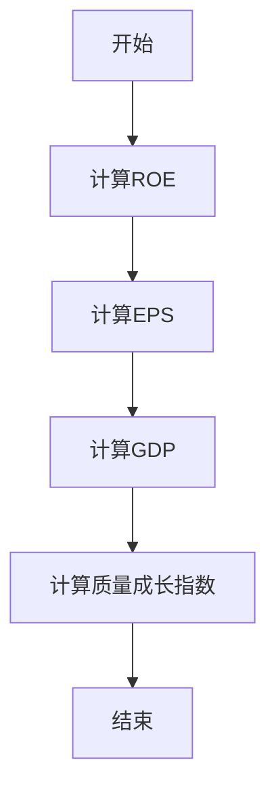

                 


# 彼得林奇的"质量成长"vs"价值重估"在新经济股中的权衡

## 关键词：
- 彼得林奇
- 质量成长
- 价值重估
- 新经济股
- 投资策略

## 摘要：
本文深入探讨了彼得林奇提出的“质量成长”与“价值重估”两种投资策略在新经济股票中的应用和权衡。通过分析这两种策略的核心要素、数学模型、实际案例和投资环境，本文为投资者提供了在新经济背景下如何选择合适的投资策略的详细指导。文章结合理论与实践，帮助读者理解如何在不同市场环境下灵活运用这两种策略，以实现投资收益最大化。

---

# 第一部分: 背景介绍

## 第1章: 彼得林奇的"质量成长"与"价值重估"概述

### 1.1 投资策略的核心概念

#### 1.1.1 什么是质量成长

质量成长（Growth at Reasonable Price, GRA）是一种投资策略，强调以合理的价格投资于具有持续增长潜力的公司。其核心在于寻找那些能够保持稳定增长，且估值合理的股票。彼得林奇认为，质量成长型股票的定义是那些具有竞争优势、管理团队优秀、财务健康且行业地位稳固的公司。

#### 1.1.2 什么是价值重估

价值重估（Value Investing）是一种投资策略，强调以低于内在价值的价格买入股票。这种策略的核心在于寻找那些被市场低估的股票，通过长期持有，等待其价值回归。彼得林奇的价值重估策略注重分析公司的基本面，寻找那些市盈率、市净率等估值指标低于行业平均水平的股票。

#### 1.1.3 两者的区别与联系

- **区别**：
  - 质量成长注重公司的成长性和合理性价格，而价值重估注重公司估值的低估性。
  - 质量成长更关注公司的长期增长潜力，而价值重估更关注市场的短期低估。
- **联系**：
  - 两者都强调公司基本面的分析，且都注重估值的合理性。
  - 在新经济环境下，两种策略可以互补，投资者可以根据市场环境选择合适的方法。

### 1.2 新经济股的特点

#### 1.2.1 新经济股的定义

新经济股通常指那些在新兴行业中具有创新性和增长潜力的股票，如科技、互联网、人工智能、生物技术等领域。这些行业通常具有较高的增长率和较大的市场空间，但也伴随着较高的波动性和不确定性。

#### 1.2.2 新经济股的投资机会

- 高增长潜力：新经济行业通常具有较高的增长率，能够为投资者带来超额收益。
- 创新驱动：新经济公司往往通过技术创新或商业模式创新获得竞争优势。
- 市场空间大：新经济行业覆盖的领域广泛，市场潜力巨大。

#### 1.2.3 新经济股的风险与挑战

- 市场波动大：新经济股通常具有较高的波动性，容易受到市场情绪的影响。
- 竞争激烈：新经济行业往往竞争激烈，企业存活率较低。
- 估值过高：部分新经济股可能被市场过度炒作，导致估值过高。

---

## 第2章: 质量成长与价值重估在新经济中的意义

### 2.1 质量成长在新经济中的重要性

- 新经济行业通常具有较高的增长潜力，质量成长策略能够帮助投资者筛选出那些具有持续增长能力的公司。
- 在新经济中，技术创新和竞争优势是公司长期增长的核心驱动力，质量成长策略能够有效识别这些公司。

### 2.2 价值重估在新经济中的应用

- 新经济行业中的许多公司由于市场波动或市场情绪的影响，可能会出现估值低于内在价值的情况。价值重估策略可以帮助投资者发现这些被低估的股票。
- 在新经济中，许多新兴行业可能尚未被市场充分认知，价值重估策略可以帮助投资者挖掘这些潜在的价值洼地。

### 2.3 两者在新经济中的权衡

- 在新经济中，投资者需要根据市场环境和公司特点选择合适的投资策略。例如，在市场上涨周期，质量成长策略可能表现更好；而在市场下跌周期，价值重估策略可能更具优势。
- 通过结合质量成长和价值重估策略，投资者可以在不同市场环境下实现风险可控的投资收益。

---

# 第二部分: 核心概念与联系

## 第3章: 质量成长与价值重估的核心要素

### 3.1 质量成长的核心要素

#### 3.1.1 公司基本面分析

- **收入与利润增长**：公司收入和利润是否保持稳定增长。
- **财务健康状况**：公司是否有健康的资产负债表和现金流。
- **行业地位**：公司在行业中的竞争地位如何。

#### 3.1.2 行业地位分析

- **行业增长潜力**：行业是否具有较大的增长空间。
- **竞争格局**：行业内的竞争是否激烈，公司是否具有竞争优势。
- **政策影响**：行业是否受到政策的大力支持或限制。

#### 3.1.3 财务状况分析

- **盈利能力**：公司的ROE（净资产收益率）、净利率等指标是否处于合理水平。
- **财务杠杆**：公司的负债率是否合理，是否存在过度杠杆的风险。
- **现金流**：公司是否具有稳定的现金流来源。

### 3.2 价值重估的核心要素

#### 3.2.1 市场估值分析

- **市盈率（P/E）**：公司的市盈率是否低于行业平均水平。
- **市净率（P/B）**：公司的市净率是否低于行业平均水平。
- **股息率**：公司是否具有较高的股息收益率。

#### 3.2.2 行业趋势分析

- **行业周期**：行业是否处于上升周期或下降周期。
- **行业景气度**：行业是否具有较高的景气度。
- **行业政策**：行业是否受到政策的鼓励或限制。

#### 3.2.3 公司潜力分析

- **管理团队**：公司管理层是否具有较高的能力和良好的声誉。
- **技术创新**：公司是否具有技术创新能力。
- **市场拓展**：公司是否具有较强的市场拓展能力。

## 第4章: 质量成长与价值重估的对比分析

### 4.1 核心概念对比表格

| 对比维度 | 质量成长 | 价值重估 |
|----------|----------|----------|
| 核心目标 | 长期增长 | 短期价值 |
| 投资策略 | 买入并持有 | 低价买入 |
| 适用场景 | 高质量公司 | 低估公司 |
| 风险特征 | 较低 | 较高 |
| 投资期限 | 长期 | 中短期 |

### 4.2 ER实体关系图


---

# 第三部分: 算法原理讲解

## 第5章: 质量成长与价值重估的数学模型

### 5.1 质量成长的数学模型

#### 5.1.1 质量成长指数公式

$$ QG = \frac{ROE \times 3 + EPS \times 2 + GDP \times 1}{6} $$

其中：
- ROE：净资产收益率
- EPS：每股收益
- GDP：行业增长率

#### 5.1.2 质量成长指数的计算步骤

1. 计算ROE、EPS和GDP指标。
2. 将ROE、EPS和GDP分别乘以权重（3、2、1）。
3. 将结果相加并除以6，得到质量成长指数。
4. 根据质量成长指数筛选出质量成长型股票。

### 5.2 价值重估的数学模型

#### 5.2.1 价值重估指数公式

$$ RV = \frac{P/E \times 3 + P/B \times 2 + DCF \times 1}{6} $$

其中：
- P/E：市盈率
- P/B：市净率
- DCF：现金流折现模型

#### 5.2.2 价值重估指数的计算步骤

1. 计算P/E、P/B和DCF指标。
2. 将P/E、P/B和DCF分别乘以权重（3、2、1）。
3. 将结果相加并除以6，得到价值重估指数。
4. 根据价值重估指数筛选出价值重估型股票。

## 第6章: 算法原理的详细讲解

### 6.1 质量成长算法的详细步骤



---

# 第四部分: 项目实战

## 第7章: 新经济股投资策略的实战分析

### 7.1 环境安装

- **工具选择**：使用Python和相关数据分析库（如Pandas、NumPy、Matplotlib）进行数据处理和可视化。
- **数据来源**：从股票数据库（如Yahoo Finance、Bloomberg）获取相关数据。

### 7.2 核心实现

#### 7.2.1 质量成长指数的Python实现

```python
import pandas as pd
import numpy as np

# 假设df是包含股票数据的DataFrame，包含ROE、EPS、GDP等指标
df['QG'] = (df['ROE'] * 3 + df['EPS'] * 2 + df['GDP'] * 1) / 6
```

#### 7.2.2 价值重估指数的Python实现

```python
# 假设df是包含股票数据的DataFrame，包含P/E、P/B、DCF等指标
df['RV'] = (df['P/E'] * 3 + df['P/B'] * 2 + df['DCF'] * 1) / 6
```

### 7.3 案例分析

#### 7.3.1 科技行业的质量成长与价值重估策略

- **质量成长策略**：选择那些ROE和EPS较高的科技公司，如苹果、微软等。
- **价值重估策略**：选择那些市盈率和市净率较低的科技公司，如某些周期性科技公司。

#### 7.3.2 互联网行业的策略选择

- **质量成长策略**：选择那些用户增长和收入增长稳定的互联网公司。
- **价值重估策略**：选择那些估值较低但具有潜在增长能力的互联网公司。

### 7.4 投资策略总结

- **短期投资**：优先选择价值重估策略，寻找被低估的股票。
- **长期投资**：优先选择质量成长策略，投资于具有持续增长能力的公司。
- **组合投资**：将质量成长和价值重估策略结合，构建多元化投资组合，降低风险。

---

## 第8章: 总结与展望

### 8.1 总结

- 彼得林奇的“质量成长”和“价值重估”两种策略在新经济股中各有优劣，投资者需要根据市场环境和公司特点选择合适的投资策略。
- 通过结合这两种策略，投资者可以在不同市场环境下实现风险可控的投资收益。

### 8.2 展望

- 随着新经济的快速发展，投资者需要不断更新和优化自己的投资策略，以应对市场环境的变化。
- 未来，随着人工智能和大数据技术的发展，投资策略的分析和执行将更加精准和高效。

---

## 最佳实践 Tips

- **长期投资**：新经济股的投资需要耐心和长期视角，避免频繁交易。
- **风险管理**：合理控制仓位，避免过度集中投资。
- **持续学习**：关注行业动态和公司基本面，及时调整投资策略。

通过本文的分析，投资者可以更好地理解彼得林奇的“质量成长”与“价值重估”策略在新经济股中的应用，并在实际投资中灵活运用这些策略，以实现长期稳定的收益。

