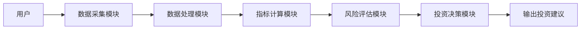

                 


# 彼得林奇的"质量成长"vs"价值陷阱"

## 关键词：彼得林奇、质量成长、价值陷阱、投资策略、风险管理、价值评估

## 摘要：本文详细探讨了彼得·林奇提出的"质量成长"与"价值陷阱"两个核心投资概念。通过分析这两个概念的定义、特征及区别，结合实际案例和数学模型，本文揭示了如何识别和避免价值陷阱，同时抓住质量成长型企业的投资机会。文章还提供了基于这些概念的系统架构设计方案和Python代码实现，帮助读者更好地理解和应用这些投资策略。

---

## 第一部分：背景介绍

### 第1章：彼得·林奇的投资哲学

#### 1.1 彼得·林奇的生平与成就
彼得·林奇（Peter Lynch）是美国著名的职业棒球运动员和投资家。他在投资领域的主要成就是在富达投资管理公司（Fidelity Investments）担任基金经理期间，管理的麦哲伦基金（Magellan Fund）取得了卓越的业绩，年均回报率超过29%，为投资者创造了巨大价值。

#### 1.2 质量成长的定义
质量成长是指投资于那些具备强劲基本面、良好管理团队、持续增长潜力且估值合理的公司。这种投资策略注重公司的长期盈利能力，而非短期市场波动。

#### 1.3 价值陷阱的概念
价值陷阱是指那些看似估值低廉，但实际上存在严重问题（如财务状况恶化、行业竞争激烈、管理层不力等）的公司。投资者如果误将价值陷阱与真正的价值型股票混淆，可能会导致重大损失。

#### 1.4 质量成长与价值陷阱的对比
| **特征**       | **质量成长**                     | **价值陷阱**                     |
|----------------|----------------------------------|----------------------------------|
| 公司基本面     | 强劲且持续增长                   | 虚弱或持续恶化                   |
| 管理层能力     | 高效且稳定                     | 低效或频繁变动                   |
| 市场地位       | 领先或竞争优势明显               | 竞争激烈或市场份额下降           |
| 估值           | 合理或有上涨空间                 | 过低，但缺乏改善的可能性           |
| 风险           | 较低                          | 较高                          |

#### 1.5 区分质量成长与价值陷阱的步骤
1. **分析财务报表**：重点关注收入、利润、现金流和负债等指标。
2. **评估行业地位**：公司是否在行业中占据领先地位。
3. **考察管理层**：管理层是否稳定且有能力。
4. **计算关键比率**：如市盈率（P/E）、市净率（P/B）等。

---

## 第二部分：质量成长与价值陷阱的核心概念

### 第2章：质量成长的核心要素

#### 2.1 公司财务状况分析
- **收入增长**：连续多年保持稳定的收入增长。
- **盈利能力**：净利润率持续向好。
- **现金流**：健康的现金流是公司持续发展的保障。

#### 2.2 行业地位与竞争优势
- **市场占有率**：是否在行业中占据领先地位。
- **竞争优势**：是否存在独特的竞争优势，如专利、品牌或成本优势。

#### 2.3 管理层质量
- **稳定性**：管理层是否稳定，是否有长期的愿景。
- **历史表现**：管理层过去的决策是否明智。

### 第3章：价值陷阱的识别与分析

#### 3.1 低市盈率陷阱
- **表现**：市盈率过低，但公司基本面不佳。
- **案例分析**：假设某公司市盈率为5，但收入持续下降，这可能是价值陷阱。

#### 3.2 高市净率陷阱
- **表现**：市净率过高，但公司盈利能力下降。
- **案例分析**：某银行股市净率远高于行业平均水平，但贷款质量恶化。

#### 3.3 企业盈利陷阱
- **表现**：公司表面上盈利，但利润主要来自非经常性收入。
- **案例分析**：某公司通过出售资产获得一次性盈利，但主营业务亏损。

---

## 第三部分：算法原理与数学模型

### 第3章：质量成长与价值陷阱的数学模型

#### 3.1 质量成长公司的筛选算法
```mermaid
graph TD
    A[开始] --> B[收集公司数据]
    B --> C[计算市盈率、市净率]
    C --> D[分析财务报表]
    D --> E[评估行业地位]
    E --> F[判断管理层能力]
    F --> G[符合质量成长标准？]
    G --> H[投资] 或 G --> I[不投资]
```

#### 3.2 价值陷阱识别的数学模型
使用以下公式计算：

$$
\text{价值陷阱识别指数} = \frac{\text{市盈率} \times \text{市净率}}{\text{收入增长率} + \text{净利润增长率}}
$$

如果该指数 > 3，则可能是价值陷阱。

#### 3.3 实际案例分析
假设某公司：
- 市盈率（P/E）= 30
- 市净率（P/B）= 5
- 收入增长率 = 10%
- 净利润增长率 = 5%

计算：
$$
\text{价值陷阱识别指数} = \frac{30 \times 5}{10 + 5} = \frac{150}{15} = 10 > 3
$$

结论：该公司可能是价值陷阱。

---

## 第四部分：系统分析与架构设计

### 第4章：基于质量成长与价值陷阱的投资系统

#### 4.1 系统功能设计
- **数据采集**：收集目标公司的财务数据。
- **指标计算**：计算市盈率、市净率等关键指标。
- **风险评估**：判断是否为价值陷阱。
- **投资决策**：基于评估结果做出投资决策。

#### 4.2 系统架构设计


#### 4.3 系统接口设计
- **输入接口**：接收公司财务数据。
- **输出接口**：提供投资建议。

#### 4.4 系统交互流程图
```mermaid
graph LR
    User->DataCollector: 提供公司名称
    DataCollector->DataManager: 获取数据
    DataManager->IndicatorCalculator: 计算指标
    IndicatorCalculator->RiskAssessor: 评估风险
    RiskAssessor->InvestmentDecision: 制定决策
    InvestmentDecision->User: 提供建议
```

---

## 第五部分：项目实战

### 第5章：基于质量成长与价值陷阱的Python投资系统实现

#### 5.1 环境安装
安装必要的Python库：
```bash
pip install pandas numpy matplotlib
```

#### 5.2 核心代码实现
```python
import pandas as pd
import numpy as np

def calculate_pe(pe):
    return pe

def calculate_pb(pb):
    return pb

def is_value_trap(pe, pb, revenue_growth, net_profit_growth):
    value_trap_index = (pe * pb) / (revenue_growth + net_profit_growth)
    return value_trap_index > 3

# 示例数据
data = {
    '公司': ['A', 'B', 'C'],
    'PE': [30, 15, 20],
    'PB': [5, 2, 3],
    '收入增长率': [10, 5, 8],
    '净利润增长率': [5, 3, 4]
}

df = pd.DataFrame(data)

# 计算结果
results = []
for index, row in df.iterrows():
    pe = row['PE']
    pb = row['PB']
    rg = row['收入增长率']
    npg = row['净利润增长率']
    if is_value_trap(pe, pb, rg, npg):
        results.append('价值陷阱')
    else:
        results.append('质量成长')

df['评估结果'] = results
print(df)
```

#### 5.3 案例分析
假设数据中的公司B：
- PE = 15
- PB = 2
- 收入增长率 = 5%
- 净利润增长率 = 3%

计算：
$$
\text{价值陷阱识别指数} = \frac{15 \times 2}{5 + 3} = \frac{30}{8} = 3.75 > 3
$$

结论：公司B是价值陷阱。

---

## 第六部分：最佳实践与总结

### 第6章：总结与注意事项

#### 6.1 最佳实践
- **持续学习**：市场变化快，需不断更新知识。
- **分散投资**：避免过度集中。
- **定期评估**：定期重新评估持仓。

#### 6.2 小结
彼得·林奇的"质量成长"与"价值陷阱"提供了有效的投资框架，但需要结合实际市场情况灵活运用。

#### 6.3 注意事项
- **避免情绪化决策**：市场波动时要保持冷静。
- **关注长期趋势**：短期波动不影响长期价值判断。

#### 6.4 拓展阅读
推荐书籍：
- 《彼得·林奇的成功投资》
- 《价值投资：从格雷厄姆到巴菲特》

---

通过以上内容，我们可以清晰地看到如何识别质量成长公司和价值陷阱，以及如何构建一个基于这些概念的投资系统。希望这篇文章能为读者在投资领域提供有价值的指导。

