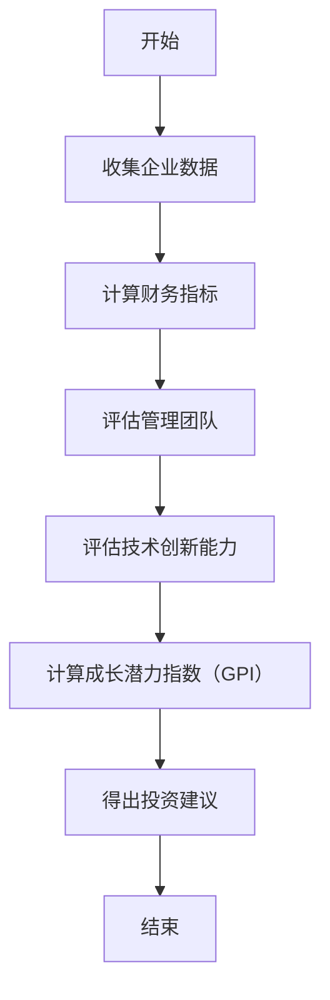
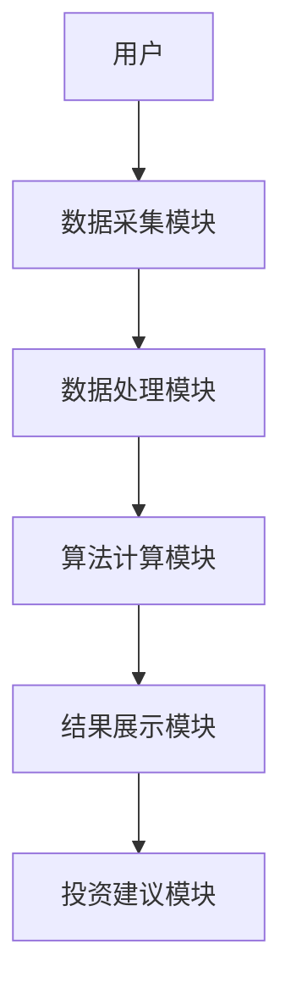

                 


# 彼得林奇的"质量成长"在循环经济企业中的应用

## 关键词：彼得林奇，质量成长，循环经济，企业投资，可持续发展

## 摘要：  
本文探讨了彼得林奇的质量成长投资策略在循环经济企业中的应用。通过分析循环经济企业的特点和彼得林奇投资理念的核心要素，揭示了如何将质量成长的长期价值投资方法与循环经济的可持续发展目标相结合。文章从背景介绍、核心概念、算法原理、系统架构设计、项目实战等多个方面展开，深入剖析了质量成长在循环经济中的应用价值，为投资者和企业管理者提供了新的视角和实践指导。

---

## 第一部分: 引言与背景

### 第1章: 质量成长投资与循环经济概述

#### 1.1 彼得林奇的质量成长投资概述  
彼得林奇是全球著名投资经理，其质量成长投资策略的核心在于寻找具有持续增长潜力的企业。这种投资理念强调企业的基本面、管理团队和行业地位，注重企业的长期盈利能力。  

#### 1.2 循环经济的基本概念  
循环经济是一种以资源高效利用和循环再生为核心的发展模式，旨在减少资源消耗和环境污染。循环经济企业的特点是通过技术创新实现资源的闭环利用，例如废品回收、再生资源利用等。  

#### 1.3 质量成长与循环经济的结合意义  
将质量成长投资理念应用于循环经济企业，不仅能够帮助投资者识别具有可持续发展潜力的企业，还能推动企业在技术创新、资源效率和环保方面取得更大突破。

---

### 第2章: 质量成长投资在循环经济中的背景分析

#### 2.1 循环经济企业的现状与挑战  
循环经济企业面临市场竞争激烈、技术门槛高、资金需求大等问题。此外，政策支持和技术进步是推动循环经济发展的关键因素。  

#### 2.2 质量成长投资的背景与趋势  
随着环保意识的增强，投资者越来越关注企业的可持续发展能力。质量成长投资因其长期价值创造的特点，逐渐成为投资市场的主流策略。  

#### 2.3 两者结合的背景与必要性  
循环经济的可持续发展需要长期的资金支持和技术投入，而质量成长投资恰恰注重企业的长期价值和成长潜力，两者结合能够实现经济效益与环境效益的双赢。

---

## 第二部分: 核心概念与联系

### 第3章: 质量成长与循环经济的核心概念

#### 3.1 质量成长的核心概念  
质量成长投资关注企业的核心竞争力、管理团队和行业地位。以下是质量成长的核心要素：  
- **核心竞争力**：企业在行业中的技术优势和市场地位。  
- **管理团队**：团队的能力和稳定性。  
- **财务健康**：企业的盈利能力、现金流和资产负债情况。  

#### 3.2 循环经济的核心概念  
循环经济的核心在于资源的高效利用和闭环管理。以下是循环经济的关键要素：  
- **资源效率**：通过技术创新减少资源消耗。  
- **再生能力**：对废弃物进行回收利用，创造新的经济价值。  
- **环保合规**：符合国家环保政策和行业标准。  

#### 3.3 质量成长与循环经济的对比分析  
以下是质量成长与循环经济的核心属性对比：

| **属性**       | **质量成长**                     | **循环经济**                     |
|----------------|----------------------------------|----------------------------------|
| 核心目标       | 实现企业长期价值增长             | 促进资源高效利用和环保           |
| 关键因素       | 财务健康、管理团队、行业地位     | 技术创新、资源效率、环保合规     |
| 长期性         | 强调企业的持续盈利能力           | 强调资源的长期循环利用           |

---

## 第三部分: 算法原理与数学模型

### 第4章: 质量成长在循环经济中的算法实现

#### 4.1 算法原理概述  
质量成长算法用于评估循环经济企业的投资价值。该算法基于企业的财务数据、管理能力和技术创新能力，计算企业的成长潜力指数（GPI）。  

#### 4.2 算法流程  
以下是质量成长算法的流程图：



#### 4.3 数学模型  
成长潜力指数（GPI）公式如下：  

$$ GPI = \alpha \times F + \beta \times M + \gamma \times T $$  

其中，  
- $\alpha$、$\beta$、$\gamma$ 为权重系数（$\alpha + \beta + \gamma = 1$）  
- $F$ 表示财务指标（如净利润增长率）  
- $M$ 表示管理团队能力（如团队稳定性评分）  
- $T$ 表示技术创新能力（如专利数量）  

---

### 第5章: 系统分析与架构设计

#### 5.1 系统分析  
为了实现质量成长在循环经济中的应用，我们设计了一个基于企业数据的分析系统。该系统的目标是通过数据挖掘和机器学习算法，评估企业的成长潜力。  

#### 5.2 系统架构设计  
以下是系统架构图：



#### 5.3 接口与交互设计  
系统的主要接口包括：  
- 数据输入接口：接收企业财务数据、管理团队信息和技术创新数据。  
- 算法调用接口：调用质量成长算法进行计算。  
- 结果展示接口：显示企业的成长潜力指数和投资建议。  

---

## 第四部分: 项目实战

### 第6章: 环境安装与核心代码实现

#### 6.1 环境安装  
需要安装以下工具：  
- Python 3.8 或更高版本  
- Jupyter Notebook  
- Mermaid 插件  

#### 6.2 核心代码实现  
以下是质量成长算法的Python实现：

```python
import pandas as pd

def calculate_gpi(finance_score, management_score, technology_score):
    alpha = 0.5
    beta = 0.3
    gamma = 0.2
    gpi = alpha * finance_score + beta * management_score + gamma * technology_score
    return gpi

# 示例数据
finance_data = [85, 70, 90]
management_data = [90, 80, 85]
technology_data = [75, 90, 80]

gpi_scores = []
for i in range(len(finance_data)):
    gpi = calculate_gpi(finance_data[i], management_data[i], technology_data[i])
    gpi_scores.append(gpi)

print(gpi_scores)
```

#### 6.3 案例分析  
以某循环经济企业为例，计算其成长潜力指数：  
- 财务指标：85  
- 管理团队：90  
- 技术创新：75  

计算结果：  
$$ GPI = 0.5 \times 85 + 0.3 \times 90 + 0.2 \times 75 = 84.5 $$  

---

## 第五部分: 最佳实践与总结

### 第7章: 总结与展望

#### 7.1 总结  
本文探讨了彼得林奇的质量成长投资策略在循环经济企业中的应用，通过理论分析、算法实现和案例研究，揭示了质量成长在循环经济中的巨大潜力。  

#### 7.2 小结  
- 质量成长投资注重企业的长期价值和核心竞争力。  
- 循环经济强调资源的高效利用和环保合规。  
- 两者的结合能够实现经济效益与环境效益的双赢。  

#### 7.3 注意事项  
- 投资者应关注企业的可持续发展能力和技术创新能力。  
- 企业在追求质量成长的同时，需注重环保和社会责任。  

#### 7.4 拓展阅读  
- 彼得林奇的《选股的艺术》  
- 循环经济相关的学术研究  

---

## 结语  
通过本文的分析，我们看到质量成长投资在循环经济企业中的应用具有广阔前景。未来，随着技术进步和政策支持，循环经济企业将吸引更多关注，成为投资市场的热点领域。

